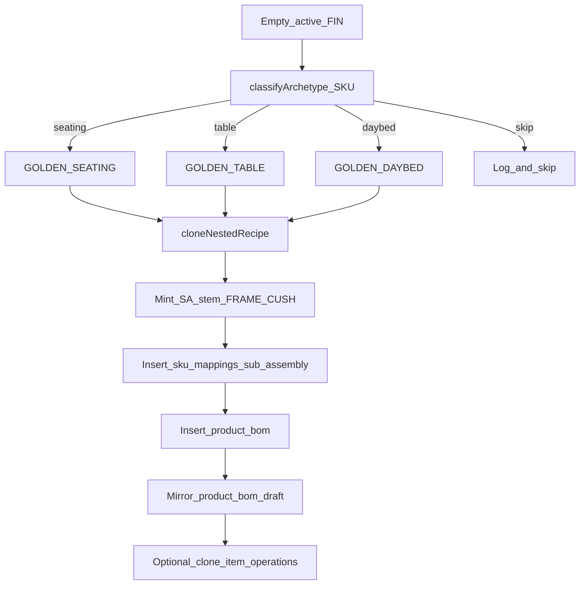

# Archetype Cloning — ERP Build Plan

## Recommendation (strategic)

**Archetype Cloning is the right next ERP move** after finish enrichment: the blank-page cost for 485 empty FGs dwarfs the cost of later LF tweaks. Clone **nested** trees (never flatten RMs onto the FG), always mirror **live + draft**, and keep MTO placeholders (`RM-FAB-GENERIC`, `RM-DKT-GENERIC-SLAB`) intact.

**Drop “Golden Steel” as an active archetype.** FIN-* grammar does not encode steel vs aluminum ([`src/lib/sku-engine.ts`](src/lib/sku-engine.ts), Capital Stack). Steel only appears as purchasing `MET-*` names, not as a recipe class. After enrichment, complete frames are aluminum tubing + `PWD-BLACK` + `PWD-GRAY-ZINC-EPOXY-PRIMER`. Replace steel with a **Daybed/Lounger** archetype (DYB/CHS/Cabana) that still needs FRAME (+ often CUSH).

Default archetype set:

| Constant | Role | Completeness gate |
|----------|------|-------------------|
| `GOLDEN_SEATING` | Sofa/loveseat/chair/ottoman/bench/barstool | FG→FRAME+CUSH; FRAME has MET tubing + `PWD-BLACK` + primer; CUSH has `RM-FAB-GENERIC` (+ foam if present) |
| `GOLDEN_TABLE` | Tables / fire pits | FG→FRAME only; FRAME has tubing + powder + primer; preferably also `RM-DKT-GENERIC-SLAB` when source has it |
| `GOLDEN_DAYBED` | Daybed / chaise / cabana | Same nesting as seating (FRAME+CUSH when source has CUSH) |

Hardcode SKUs at top of script; **validate gates at startup** and abort if a golden fails (do not invent substitutes).

Suggested starters to verify in dry-run (replace if validation fails):

- Seating: a Bravada/Brooklyn/Ocean sofa with live FRAME+CUSH after enrichment (e.g. search dry-run “golden score” for `*-SOF-*` with `has_pwd/has_prm/has_fab`)
- Table: a Dekton coffee/dining frame (e.g. Ocean `*-COF-TAB-*` or Waterfall `*-DIN-TAB-*` with `RM-DKT-GENERIC-SLAB` on FRAME)
- Daybed: a `*-DYB-*` or chaise with FRAME+CUSH



---

## Schema / nesting rules the script must obey

From [`src/server/db/schema.ts`](src/server/db/schema.ts):

- `product_bom.parent_sku` / `child_sku` FK → `sku_mappings` (**must mint SA rows before BOM edges**)
- Unique `(parent_sku, child_sku)` on live and draft
- Child delete is `RESTRICT` — never invent SKUs that are not in Hub

Canonical nest (do **not** copy archetype’s legacy `SA-BRO-S-96-FRAME` name onto the target):

1. Target FG ← copy only **top-level edge roles** from golden (FRAME link, optional CUSH link, any direct FG RMs)
2. Mint **new** SAs via existing helper [`subAssemblySku`](src/lib/heuristic-bom.ts):
   - `SA-${fin.replace(/^FIN-/,"")}-FRAME`
   - `SA-${fin.replace(/^FIN-/,"")}-CUSH` when golden has a CUSH child
3. Copy **all** golden FRAME children (tubing, hardware, `PWD-BLACK`, primer, optional Dekton) onto the new FRAME with same qty/scrap/uom/notes (+ clone provenance note)
4. Copy all golden CUSH children onto new CUSH
5. Mirror identical edges into [`product_bom_draft`](src/server/db/schema.ts) with `status: "edited"`, `source: "manager"` so Factory **Approve** cannot wipe clones ([enrichment lesson](scripts/ops/enrich-frame-finish-bom.ts))

**Do not** remap FAB/DKT generics. **Do not** attach colorway `FAB-*` / `STN-DKT-*`.

---

## Classification heuristic

Implement `classifyArchetype(sku, name): "seating" | "table" | "daybed" | "skip"`:

- Prefer SKU tokens (canonical FIN grammar), fall back to `original_name`
- **daybed** first: `DYB`, `DAYBED`, `CHS`/`CHAISE`, `CABADA`/`CABANA` (avoid sofa false-positives)
- **seating**: `SOF`, `LOV`, `CHA`, `OTT`, `BST`, `BCH`, `SWV`, `CLB`, `SECTIONAL`, plus name regex aligned with [`CUSHION_NAME`](src/lib/heuristic-bom.ts)
- **table**: `TAB`, `COF-TAB`, `SID-TAB`, `DIN-TAB`, `BAR-TAB`, `CNT-TAB`, `FIR-TAB`, `RND-TAB`, name `table|fire pit` — note **`ODT` is legacy Katana ottoman+Dekton**, map via name/`OTT-DKT` to seating/table carefully (default: seating ottoman if `OTT`, else table only for true `*-TAB-*`)
- **skip**: umbrella, cover, shade, lamp, riser, weight, unfabricated slab — log count, no insert

Empty set definition (matches prior tally):

```sql
item_type = finished_good AND is_active AND global_sku LIKE 'FIN-%'
AND NOT EXISTS (SELECT 1 FROM product_bom WHERE parent_sku = FG)
```

---

## Script: [`scripts/ops/clone-archetype-boms.ts`](scripts/ops/clone-archetype-boms.ts)

### Constants (Architect-editable)

```ts
const GOLDEN_SEATING = "FIN-…"; // must pass seating gate
const GOLDEN_TABLE = "FIN-…";   // must pass table gate
const GOLDEN_DAYBED = "FIN-…";  // must pass daybed gate
const confirm = process.argv.includes("--confirm");
```

### Engine steps

1. **Load goldens** — explode top-level `product_bom` + FRAME/CUSH children; assert gates; cache lines in memory.
2. **List empties** — query above; classify; print summary: `Cloning GOLDEN_SEATING → N seating SKUs`, etc.
3. **Per target FG** (transaction per FG recommended):
   - Skip if any live `product_bom` already exists for FG
   - `ensureHubSku(sa, item_type: sub_assembly, category/name derived from FG)`
   - Insert FG→FRAME (qty 1 ea); FG→CUSH if applicable
   - Insert FRAME→* and CUSH→* clones
   - Identical inserts into `product_bom_draft`
   - **Optional but recommended in v1:** clone `item_operations` / draft for FRAME (and CUSH/FG if golden has them) so routing isn’t blank—remap `item_sku` to minted SA / target FG
4. **Idempotency:** `onConflictDoNothing` on BOM unique keys; never delete existing edges
5. **Dry-run:** print planned hub inserts + BOM edge counts; zero writes without `--confirm`
6. **Verify block** (post-confirm): recount empties; sample 3 clones; assert draft edge count ≥ live for cloned parents; assert FAB/DKT generics unchanged globally

### Package scripts

Add to [`package.json`](package.json):

- `ops:clone-archetype-boms`
- `ops:clone-archetype-boms:confirm`

### Out of scope for v1 (explicit)

- Auto-scaling tubing LF from FIN dimensions (engineers tweak in Hub UI — the point of cloning)
- Replacing legacy collection SA names on already-complete 111
- Pushing to Katana (re-run [`export-katana-bom-template.ts`](scripts/ops/export-katana-bom-template.ts) after approve cycle)
- Golden Steel

---

## Effectiveness controls (ERP hygiene)

- **Provenance notes** on every cloned edge: `archetype clone from {GOLDEN_SKU}` so managers can filter / audit
- **Batch report** CSV under `tmp/archetype-clone-plan.csv` (sku, family, golden, frameSku, cushSku, edgeCount, action)
- **Pilot flag** `--limit=25` for first confirm before full 485
- After confirm: spot-check in `/admin/factory-bom` that Approve on a clone does not strip powder/primer (draft mirror proof)

---

## Implementation order

1. Add script skeleton + golden constants + validation gates + dry-run classifier summary
2. Implement nested clone + `sku_mappings` mint + live/draft BOM writes
3. Add ops clone (+ optional operations clone)
4. Dry-run full catalog; Architect confirms golden SKUs if validation fails
5. `--limit=25 --confirm` pilot → verify UI/Approve safety
6. Full `--confirm` → recount empties → regenerate Katana XLSX when ready

---

## Proposed script shape (review before write)

Core clone API (illustrative):

```ts
async function cloneArchetypeToFg(opts: {
  targetFg: string;
  goldenFg: string;
  goldenTop: BomLine[];
  goldenFrameLines: BomLine[];
  goldenCushLines: BomLine[] | null;
  goldenFrameSku: string;
  goldenCushSku: string | null;
}) {
  const frameSku = subAssemblySku(opts.targetFg, "FRAME");
  const cushSku = opts.goldenCushSku
    ? subAssemblySku(opts.targetFg, "CUSH")
    : null;
  await ensureSubAssembly(frameSku, opts.targetFg);
  if (cushSku) await ensureSubAssembly(cushSku, opts.targetFg);
  await upsertBom(opts.targetFg, frameSku, "1", "ea", /* both tables */);
  if (cushSku) await upsertBom(opts.targetFg, cushSku, "1", "ea", /* both */);
  for (const line of opts.goldenFrameLines) {
    await upsertBom(frameSku, line.child_sku, line.quantity, line.uom, /* both */);
  }
  // … cush lines …
}
```

Reuse [`powderPounds`](src/lib/heuristic-bom.ts) only if a later v2 adds dimension scaling—not in v1 clone.
