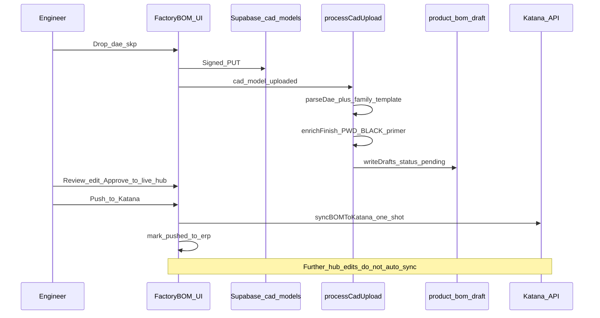

# CAD-to-ERP Staging Engine — Phase 1 Build Proposal

**Status:** Awaiting Architect review — **do not generate implementation files until approved**  
**Date:** 2026-09-14

## Architect verdict (recommendation)

**Do not greenfield `/api/cad-process` or a parallel Python `child_process` lane.** The Hub already has ~80% of Phase 1:

| Need | Already exists | Gap |
|------|----------------|-----|
| Secure `.dae` / `.skp` upload | [`CadUploadDropzone.tsx`](../../src/app/admin/factory-bom/CadUploadDropzone.tsx) + signed Supabase `cad-models` | UX copy; `.skp` is thumbnail-only (geometry requires `.dae`) |
| Async extract | Inngest `processCadUpload` → `processCadUploadJob` | Wire finish enrichment into this job |
| Draft staging | `instantiateDraftsFromDae` → `product_bom_draft` | Powder still `RM-PWD-GENERIC`; no primer |
| Manual Katana push | `publishApprovedRecipeToKatana` + "Publish recipes to Katana" | Rename; add `pushed_to_erp` lock; require Approve-first |
| No BOM cron | True — only health/digest crons | Disable **Quarantine → `product.approved` → manufacturing rewrite** |

**Geometry reality check:** There is **no Node `.skp` mesh parse**. Runtime geometry is Collada `.dae` (`parseDaeWeldmentFromXml`). Ruby walker / Python `mesh_obb_sticks.py` are offline CLI. Phase 1 UI should accept both extensions but **queue geometry only for `.dae`**; `.skp` keeps thumbnail path + clear operator message to also upload `.dae`.

---

## Target workflow (Phase 1)



---

## Proposed file structure (delta only)

### Extend (preferred) — no new `/admin/cad-ingestion` route in Phase 1

```
src/app/admin/factory-bom/
  CadUploadDropzone.tsx          # clarify .dae required for geometry; keep .skp thumb
  RecipeHeader.tsx / KatanaSyncButton.tsx
                                 # label → "Push to Katana"; disable if pushed_to_erp
  actions.ts                     # pushToKatanaStagingHandoff; gate on erp status
src/lib/cad-upload/
  instantiate-from-dae.ts        # call enrichFrameFinishDraft after writeDrafts
  enrich-finish-draft.ts         # NEW: powderPounds → PWD-BLACK + primer on FRAME parents
src/lib/heuristic-bom.ts         # keep powderPounds; family-templates stop emitting RM-PWD-GENERIC
src/lib/sketchup-cutlist/family-templates.ts
                                 # emit PWD-BLACK (+ primer) instead of RM-PWD-GENERIC
src/server/db/schema.ts          # erp_push_status on sku_mappings
src/server/db/migrations/00XX_erp_push_status.sql
src/inngest/functions.ts         # publishToKatana: SKIP manufacturing recipes
src/app/admin/quarantine/actions.ts
                                 # document: product.approved must not rewrite Katana recipes
docs/CAD_TO_ERP_STAGING.md       # short operator contract
```

### Explicitly **not** in Phase 1

- New `/api/cad-process` (duplicates Inngest + signed upload)
- Spawning Python from Next request path
- Dedicated `/admin/cad-ingestion` page (Workbench dropzone is the staging surface)
- Background Hub→Katana BOM cron (none exists; do not add)

If Architect insists on `/api/cad-process`, make it a **thin authenticated alias** that only calls `confirmCadUpload` / enqueues `cad/model.uploaded` — not a second processor.

---

## 1. Upload UI

**Location:** Keep under `/admin/factory-bom` (requires selected FIN-* SKU — correct for recipe staging).

**Changes to `CadUploadDropzone.tsx`:**

- Accept `.dae`, `.skp` (unchanged MIME checks via existing `requestCadUpload`)
- Copy: “`.dae` required for cut-list drafts; `.skp` updates thumbnail only”
- After `draft_ready`, banner: “Draft staged — review below, then Approve → Push to Katana”
- Auth remains session-gated server actions (no public API)

---

## 2. Pipeline wiring (Inngest, not ad-hoc API)

**Keep:** `confirmCadUpload` → `cad/model.uploaded` → `processCadUploadJob` → `instantiateDraftsFromDae`.

**Add post-instantiate enrichment** in `instantiate-from-dae.ts` (or new `enrich-finish-draft.ts`):

```ts
// After writeDrafts(plan):
await enrichFrameFinishOnDrafts(plan);
// For each SA-* metal parent (FRAME / SEAT / BACK / weldment):
//   LF = Σ tubing qty×scrap (RM-MET-%TUBING% only; exclude FLATBAR)
//   powder_lb = powderPounds(LF)           // 0.08×LF, min 0.1
//   primer_lb = max(0.1, powder_lb × 0.23/0.21)
//   upsert product_bom_draft: PWD-BLACK, PWD-GRAY-ZINC-EPOXY-PRIMER
//   source: "sketchup_geometry" | status: draft_pending_review
//   notes: "CAD enrich: powderPounds(LF)"
// Also remap any RM-PWD-GENERIC lines → PWD-BLACK
```

**Do not write live `product_bom` in the CAD job** — staging only (current behavior).

---

## 3. Handoff button — “Push to Katana”

**Rename** Factory control from “Publish recipes to Katana” → **“Push to Katana”**.

**Execution logic** (wrapper around existing `syncBOMToKatana`):

```ts
async function pushToKatanaStagingHandoff(rootSku: string) {
  // 1. Require live hub recipe (Approve already copied draft → product_bom)
  // 2. If erp_push_status === 'pushed_to_erp' → refuse unless override
  // 3. canMutateKatanaCatalog must be live
  // 4. syncBOMToKatana(sku)
  // 5. Set erp_push_status = 'pushed_to_erp' + channel_sync success
  // 6. Audit: factory_bom_push_to_katana
}
```

**Schema addition** on `sku_mappings`:

```ts
erp_push_status: 'not_pushed' | 'pushed_to_erp' | 'repush_allowed'
erp_pushed_at: timestamp | null
erp_pushed_by: text | null
```

UI: button disabled + badge “Katana is SoT” when `pushed_to_erp`.

**Approve vs Push stay separate:** Approve = hub live only; Push = one-shot Katana mint.

---

## 4. Safety lock — stop silent Katana overwrites

| Vector | Action |
|--------|--------|
| `DOWNSTREAM_MUTATIONS` | Keep **`false`**; document in `.env.example` |
| Inngest `publishApprovedProduct` | **Remove/gate** `publishHubManufacturingToKatana` — Quarantine must not re-POSTs recipes |
| Factory Push after first success | Hard-refuse unless override |
| CLI `sync-all-boms-to-katana` | Emergency only; no cron |
| Inbound Katana webhook | Already **410** — leave |
| CAD job | Never calls `syncBOMToKatana` — leave |

**Recommended policy (Option C):** Quarantine/Inngest never writes Katana **recipes**; **only** Factory “Push to Katana” does. Foundation catalog (`POST /materials|/products`) can remain on Quarantine for SKU minting if still needed.

---

## 5. Existing happy path to extend (reference)

```
1. /admin/factory-bom?sku=FIN-…
2. CadUploadDropzone → requestCadUpload → signed PUT → confirmCadUpload
3. Inngest processCadUpload (or CAD_UPLOAD_INLINE)
4. instantiateDraftsFromDae → product_bom_draft (+ ops draft)
5. runSecondaryExtract → recipe_estimates_draft
6. [NEW] enrichFrameFinishOnDrafts → PWD-BLACK + primer
7. Engineer edits → Approve → live product_bom
8. [RENAMED] Push to Katana → syncBOMToKatana → erp_push_status=pushed_to_erp
```

Key files today:

- `src/lib/cad-upload/process-job.ts`, `instantiate-from-dae.ts`
- `src/lib/sketchup-cutlist/parse-dae-weldment.ts`, `family-templates.ts`
- `src/lib/heuristic-bom.ts` → `powderPounds`
- `src/lib/katana.ts` → `syncBOMToKatana`
- `src/app/admin/factory-bom/actions.ts` → `publishApprovedRecipeToKatana`
- `src/inngest/functions.ts` → `publishApprovedProduct` (must stop recipe rewrite)

---

## Implementation order (after approval)

1. Migration: `erp_push_status` (+ timestamps) on `sku_mappings`
2. `enrich-finish-draft.ts` + wire into CAD instantiate / family-templates
3. Rename UI button + `pushToKatanaStagingHandoff` + disable-when-pushed
4. Strip manufacturing from Inngest `publishToKatana`
5. CadUploadDropzone copy + staging banner
6. `docs/CAD_TO_ERP_STAGING.md` + QA proof loop

---

## Decision needed before codegen

**Quarantine Inngest after Approve:** confirm **Option C** (Push-only recipes; no manufacturing rewrite from `product.approved`) vs keep foundation product/material mint on Quarantine but never recipes.

This proposal assumes **Option C**.
