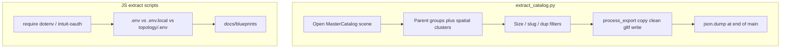

# Codebase Analysis Report (Markdown Only)

Write `[Cursor_Codebase_Analysis.md](Cursor_Codebase_Analysis.md)` at the repo root. Do **not** edit `[scripts/extract_catalog.py](scripts/extract_catalog.py)`, the JS extractors, or `package.json`. The user confirmed report-only.

The file will be a technical brief for the collaborator: verdict on each proposed fix, missed edge cases, and the exact current functions (not paraphrased) so they can write replacement code.

## What the codebase actually shows

**Blender pipeline is not a 634-file loop.** `[scripts/extract_catalog.py](scripts/extract_catalog.py)` processes groups in the *currently open* Blender scene (`bpy.context.scene`), then writes one `.blend` + one `.glb` per surviving SKU. It does not iterate `Blender/dist/`.

**Current disk state contradicts “manifest never written.”** All three of these already exist and line up:

- 77 entries in `[Blender/dist/catalog_manifest.json](Blender/dist/catalog_manifest.json)` (valid JSON, closed array)
- 77 files in `Blender/dist/blend/`
- 77 files in `Blender/dist/glb/`

That means a run **did** reach the end-of-`main()` write. The live problem is more likely **catalog completeness** (mostly pillows, generic `product_`* / `g-object` names) than a crash before `json.dump`. Incremental writes are still worth adding for the *next* larger run.

**JS extractors never created `docs/blueprints/`.** That directory is absent. Four of five scripts die on line 1 (`require('dotenv')` / `require('intuit-oauth')`). Neither package is in `[package.json](package.json)`. `[scripts/extract-live-intel.js](scripts/extract-live-intel.js)` does *not* import `dotenv`; it uses a custom `loadEnv`.




## Critique to put in the report

### 1. Incremental manifest writing — keep, but do not append JSON

- **Do not** append fragments onto `catalog_manifest.json` (invalid JSON on crash mid-write).
- **Do** rewrite the whole in-memory `manifest` list after each successful SKU (cheap at this size).
- **Also** write via temp file + `os.replace` so a crash mid-dump cannot leave a truncated file.
- On restart, optionally load an existing manifest and skip SKUs whose `.glb` already exists (re-run safety). The current script always re-exports.

### 2. Try/except around glTF — necessary but insufficient

Today only `clean_and_normalize` is wrapped. `bpy.ops.export_scene.gltf` and `bpy.data.libraries.write` are bare, so one failure kills the batch and **skips scene restore**.

Missed in the proposal:

- Wrap the **entire** `process_export` body; use `try/finally` to switch back to `base_scene`, remove `proc_scene`, and purge.
- Blender operators often **return `{'CANCELLED'}` without raising**. Check the operator result, not only exceptions.
- If cleanup fails in EDIT mode, later `select_all` / export can fail. Force OBJECT mode in `finally`.
- `bpy.context.window` is `None` in `blender --background`; `bpy.context.window.scene = proc_scene` will AttributeError. Need a window override / `windows[0]`.

### 3. GC / undo — right idea, wrong API details

`bpy.data.scenes.remove(proc_scene)` does **not** free copied mesh datablocks from `orig_obj.data.copy()`. That is the real leak.

Recommended sequence (document in the report, do not apply yet):

- At script start: `bpy.context.preferences.edit.use_global_undo = False` (stops `bpy.ops` from filling the undo stack). Prefer this over fighting undo history every iteration.
- After unlink: `bpy.data.orphans_purge(do_local_ids=True, do_linked_ids=True, do_recursive=True)` on Blender 4.x, or `bpy.ops.outliner.orphans_purge(...)` on 3.x.
- Optional `gc.collect()`.

Do not rely on “purge undo history” as the primary fix.

### 4. Completeness filters the strategy never mentions

This is the main reason the catalog looks like 77 pillows, not a full CPQ set:

- Unparented clusters with footprint **> 3.8 m are skipped** (likely the actual furniture on the showroom floor).
- Dedup is by `slugify(parent_or_collection_name)`. Blender `.001` suffixes are stripped, so distinct instances collapse to one SKU.
- Tiny-piece filters (`< 0.2 m` footprint) drop accessories but also anything mis-grouped.

Stabilizing export/GC will not recover skipped groups.

### 5. JS dependencies — `npm install` is necessary, not sufficient


| Script                                                                      | Crash point                                 | After install                                                                                   |
| --------------------------------------------------------------------------- | ------------------------------------------- | ----------------------------------------------------------------------------------------------- |
| `extract-woo-products.js`, `extract-ghl-*.js`, `extract-katana-baseline.js` | `require('dotenv')` — not in `package.json` | `dotenv.config()` loads **cwd `.env` only**, not `.env.local`                                   |
| `extract-qbo-schema.js`                                                     | `dotenv` + `intuit-oauth`                   | Hardcoded **sandbox** OAuth on `:8000`; interactive; needs `QBO_`*                              |
| `extract-live-intel.js`                                                     | Custom parser; **no dotenv import**         | Loads `../topology/.env` (**that file does not exist**; `topology/` is React UI) then `../.env` |


Repo convention: TS scripts use `@next/env` `loadEnvConfig` and `[.env.example](.env.example)` says copy to `**.env.local**`. Extract scripts will still miss `GHL_TOKEN`, `GHL_LOCATION_ID`, `WC_CONSUMER_KEY`, `QBO_*` (none of which are in `.env.example`) unless they load `.env.local`.

**Better than adding `dotenv`:** reuse `require('@next/env').loadEnvConfig(...)` like `[scripts/scrape-katana.ts](scripts/scrape-katana.ts)`. Still add `intuit-oauth` to `package.json` for QBO.

### 6. CRLF regex — overstated for this file

Current parser:

```javascript
envConfig.split('\n').forEach(line => {
  const match = line.match(/^([^#\s][^=]+)=(.*)$/);
  if (match) {
    process.env[match[1].trim()] = match[2].trim().replace(/^["']|["']$/g, '');
  }
});
```

`.trim()` already strips `\r`. This is **not** a textbook `$`-anchor CRLF miss. Prefer dotenv/`@next/env` anyway (quotes, `export`, spaces around `=`).

If they still convert to dotenv, **preserve override order**: current code loads topology first, then root `.env` **wins**. Antigravity’s snippet loads root first then topology, and dotenv **does not override** by default — duplicate keys would silently invert.

Other live-intel gaps: `httpsGet` never checks HTTP status (401 HTML written as “success”); GHL location ID is hardcoded vs `GHL_LOCATION_ID` in the other GHL scripts.

## Exact blocks the markdown will quote in full

From `[scripts/extract_catalog.py](scripts/extract_catalog.py)`:

- `main()` loop: grouping, filters, `process_export(...)`, then the single `json.dump` at lines 182–185
- Full `process_export()`: scene copy, cleanup try/except only, unwrapped `bpy.ops.export_scene.gltf`, `libraries.write`, `scenes.remove`, `manifest.append` with **no purge / no finally**

From `[scripts/extract-live-intel.js](scripts/extract-live-intel.js)`:

- Full `loadEnv` + the two `loadEnv(...)` calls (lines 5–19)

The report will also list the five `require('dotenv')` one-liners and the `intuit-oauth` import so the collaborator does not “fix” live-intel the same way as the other scripts.

## File to write

Single new file: `[Cursor_Codebase_Analysis.md](Cursor_Codebase_Analysis.md)`

Sections: verdict, Blender critique + quoted code, JS critique + quoted code, recommended replacement approach (guidance only), residual risks. No code changes in the same pass.