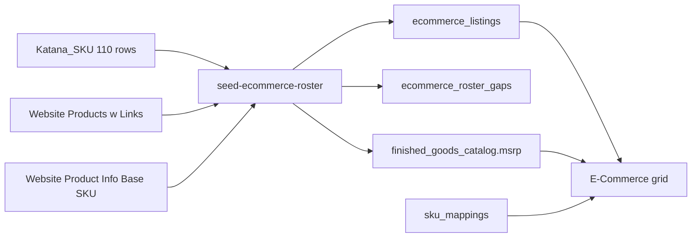

# Master Catalog E-Commerce Blueprint

Deliverable of this step: write [MASTER_CATALOG_BLUEPRINT.md](MASTER_CATALOG_BLUEPRINT.md) at the repo root with the architecture below. Do not change [src/app/embed/admin/master-catalog/page.tsx](src/app/embed/admin/master-catalog/page.tsx), [src/server/db/schema.ts](src/server/db/schema.ts), or run a migration until that file is approved for build.

## What the source files actually contain

The roster is the `Katana_SKU` sheet inside [data_migration/Pricing/E-Commerce - Website Product Info.xlsx](data_migration/Pricing/E-Commerce%20-%20Website%20Product%20Info.xlsx). It has 110 unique rows: `Original Name`, `Canonical Hub SKU`, `MSRP`. That set is a 1:1 match with rows flagged `E-Commerce=TRUE` on the workbook's `Website Products` sheet. Membership for the new tab is this roster. `finished_goods_catalog.is_web_visible` is not the predicate.

Join key across sheets is normalized `Memo/Description` (uppercase, collapsed whitespace, normalized inch marks). `Product/Service full name` is the wrong display name: the club-chair row is labeled `BRAVADA SWIVEL CHAIR`. Product Name in the grid is `Memo/Description`.

Legacy Base SKU is not in the E-Commerce workbook or in [data_migration/Pricing/Website Product Info - Website Products w_ Links.csv](data_migration/Pricing/Website%20Product%20Info%20-%20Website%20Products%20w_%20Links.csv). It lives on `Website Products w Links` in [data_migration/Pricing/Website Product Info.xlsx](data_migration/Pricing/Website%20Product%20Info.xlsx), column `Base SKU` (example `BRV-SWV-34X34`). 100 of 110 roster names match a base SKU. 10 do not. Nine base SKUs are shared by more than one canonical SKU (club and swivel both use `BRV-SWV-34X34`; sofa, armless, and corner share `BRV-SOF-72X34`). The column stays read-only and may duplicate.

Product links are on the E-Commerce workbook's `Website Products w Links` sheet and point at `https://ccpatiodev2.primeview.com`. About half the roster rows carry their own URL. Size siblings inherit the previous URL only when they sit in the same Drawing section and share a family key (product noun with dimensions stripped): `FIN-BRV-SOF-84X34` inherits `/product/bravada-sofa/` from the 72-inch row. Ten roster SKUs have no URL even after that rule: three Bravada daybeds (`FIN-BRV-DYB-78X72`, `FIN-BRV-DYB-78X78`, `FIN-BRV-DYB-84X78`), four Milan ottomans (`FIN-MLN-OTT-22X60`, `FIN-MLN-OTT-22X72`, `FIN-MLN-OTT-34X60`, `FIN-MLN-OTT-56X42`), two swings (`FIN-BRV-SWG-60X12`, `FIN-BRV-SWG-96X32`), and `FIN-TJM-UMB`. Those cells stay blank. This build does not call WooCommerce.

Steel MSRP is the grid price (109 of 110 also have an aluminum-frame price). Aluminum MSRP appears only in the expanded row.

The sheet `Collections` cell is blank on 61 of 110 roster rows, and `FIN-CAN-UMB` is labeled Miscellaneous. Collection and product type are derived at seed time, not read from that cell.

Prefix counts on the roster: Ocean 44, Bravada 40, Milan 11, Tenjam 8, Brooklyn 4, Kingston/KIN 2, Cantilever 1. Many `FIN-OCN-*` memos are Daisy, Star Leg, Taylor, or Fly, so collection is the leading product line in the memo, and product type is the Drawing section header (7 groups: sofas/chaises/club chairs, coffee and fly tables, dining/fire tables, dining chairs/benches/stools, ottomans, swings, umbrellas/pillows/accessories).

## Schema

Add two tables in [src/server/db/schema.ts](src/server/db/schema.ts). Generate a Drizzle migration. Leave `is_web_visible` on `finished_goods_catalog` and `quarantine_catalog` in place; the All-tab toggle can keep writing it. The E-Commerce tab never reads it.

`ecommerce_listings` — one row per roster canonical SKU that exists in `sku_mappings`:

- `global_sku` text primary key, FK to `sku_mappings.global_sku` on update cascade
- `product_name` text, the memo
- `legacy_base_sku` text null
- `legacy_sku_shared` boolean, true when another listing uses the same base SKU
- `product_url` text null
- `url_source` text: `row`, `sibling`, or `missing`
- `drawing_section` text, the product-type facet
- `collection_label` text
- `aluminum_msrp` numeric(10,2) null
- `marketing_description` text null, the long Description column
- `construction_details` text null, the Details column
- `sheet_order` integer
- `updated_at` timestamp

`ecommerce_roster_gaps` — roster names whose canonical SKU is absent from `sku_mappings`:

- `global_sku` text primary key
- `product_name` text
- `reason` text
- `updated_at` timestamp

Steel MSRP stays on `finished_goods_catalog.msrp`. The seeder writes the sheet's steel price onto that column for matched roster SKUs so the grid and the PIM share one number. Later inline edits on the All tab keep using `updateProductMSRP`. Aluminum is not written there.

## Seed

New script `scripts/db/seed-ecommerce-roster.ts`, same dotenv/tsx pattern as [scripts/db/ingest-oct1-pricing.ts](scripts/db/ingest-oct1-pricing.ts), with `--dry-run`. It reads both workbooks with the existing `xlsx` dependency.

Normalization and family-key inheritance live in a pure module `src/lib/ecommerce-roster.ts` so they can be unit-tested without a database. Family key is the memo with dimensions, inch marks, and height suffixes removed. Inheritance never crosses a Drawing section or a different family key. Dry-run prints own URLs, sibling URLs, missing URLs, shared legacy SKUs, and hub gaps.

Upsert is idempotent on `global_sku`. Re-runs refresh copy, URLs, aluminum price, and steel MSRP from the workbooks.

## Read path and UI

New server action `getEcommerceRoster()` in [src/app/embed/admin/master-catalog/actions.ts](src/app/embed/admin/master-catalog/actions.ts). It inner-joins `ecommerce_listings` to `finished_goods_catalog` and `sku_mappings` and also returns gap rows. `revalidatePath("/embed/admin/master-catalog")` stays on MSRP updates.

Replace the `web` view in [src/app/embed/admin/master-catalog/page.tsx](src/app/embed/admin/master-catalog/page.tsx) with an `ecommerce` view labeled E-Commerce. The other views (All, Broken Syncs, Missing Photos, By Collection, By Price Tier) and the quarantine tab stay. The CSV export that currently filters `isWebVisible` exports the roster instead.

New client components under `src/app/embed/admin/master-catalog/ecommerce/`:

- `EcommerceGrid.tsx` — floating container (`rounded-2xl`, `border-slate-100`, `bg-white`, `shadow-[0_8px_30px_rgb(0,0,0,0.04)]`), scroll container with a sticky header (`bg-white/90 backdrop-blur`), sortable columns
- `EcommerceFilters.tsx` — search plus two facet groups with counts: Collection and Product Type
- `EcommerceExpandedRow.tsx` — marketing description, construction details, aluminum MSRP

Columns, in order: expand chevron, Product Name, Canonical Hub SKU, Legacy SKU, MSRP, Product Link.

- Canonical SKU is `font-mono` and is the row key
- Legacy SKU is read-only; a small "shared" chip when `legacy_sku_shared` is true; an em dash when null
- MSRP is the steel price from `finished_goods_catalog`, still inline-editable through the existing `updateProductMSRP` action
- Product Link is an external anchor. Missing URLs render an em dash. Sibling URLs use the same anchor with a quiet "shared page" hint
- Header shows roster count, gap count, missing-link count, and missing-legacy count

There is no web-visibility switch on this view.

## Filtering, sorting, and state

110 rows. Load once from the server action. Filter, sort, and expand stay in component state. No Woo round trip and no pagination.

- Search matches product name, canonical SKU, and legacy SKU
- Collection and product type are multi-select facets; counts reflect the search box, then the other facet
- Sort is client-side on name, canonical SKU, legacy SKU, or MSRP, with a numeric parse for money
- One expanded `global_sku` at a time
- Empty facet result shows a short empty state inside the same container

## Build phase after this blueprint is approved

That later phase, not this step:

- Drizzle schema plus `npm run db:generate` / migrate
- Seeder and `src/lib/ecommerce-roster.ts` with unit tests for normalization, family-key inheritance, and shared-legacy detection
- Server action and the three UI components; browser-check the E-Commerce tab (sort, both facets, expand, missing link, shared legacy chip, MSRP save)
- `npm run qa:lifecycle` must exit 0 before that build is called done

Out of scope for the build as well: live WooCommerce permalink sync, color-level `FIN-*` variants, and removing `is_web_visible`.