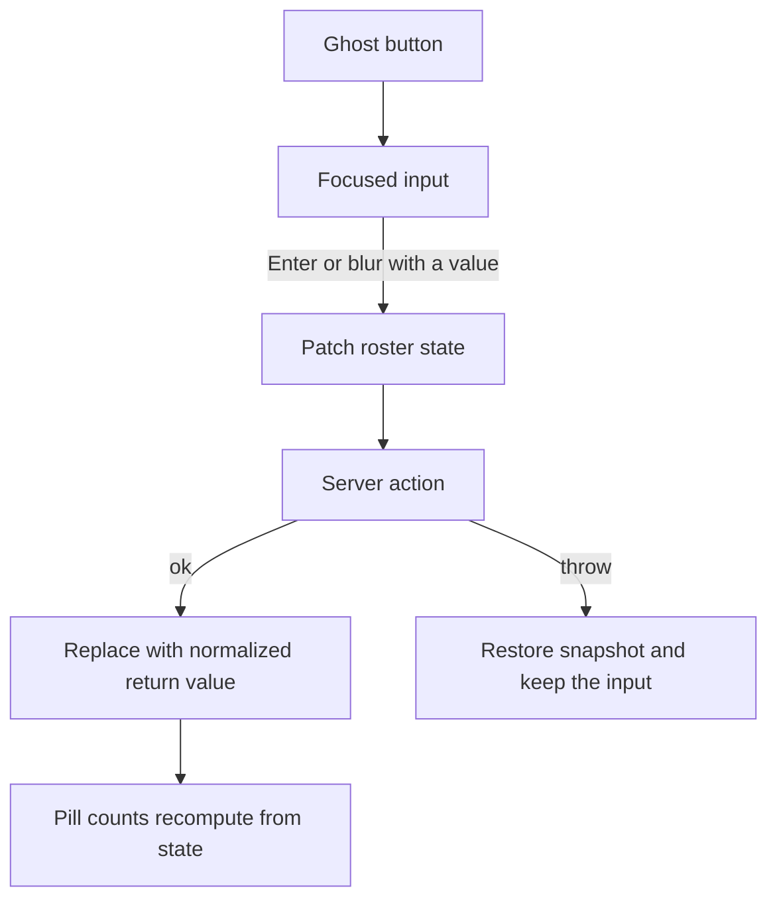

# Master Catalog Inline Editing Blueprint

Status: ready for review. Approving this plan writes the document to [data_migration/Pricing/MASTER_CATALOG_INLINE_EDITING_BLUEPRINT.md](data_migration/Pricing/MASTER_CATALOG_INLINE_EDITING_BLUEPRINT.md), beside the Product Bible blueprint. It does not change application code.

The Product Bible pills stay as they are. This build makes the gap slices writable.

## What the current page actually does

[EcommerceGrid.tsx](src/app/embed/admin/master-catalog/ecommerce/EcommerceGrid.tsx) is a client component. The roster lives in `useState` on [page.tsx](src/app/embed/admin/master-catalog/page.tsx), filled once by `getEcommerceRoster()`. Pill counts are derived from that state.

`revalidatePath("/embed/admin/master-catalog")` refreshes the next server render. It does not update this open grid. [handleEcommerceMsrp](src/app/embed/admin/master-catalog/page.tsx) already patches `setEcommerce` after `updateListingMsrp`. New saves must do the same. `revalidatePath` is still required on every new action so a reload, the marketing CSV, and a second tab see the write.

The steel MSRP cell waits for the server, then updates state. The web-visibility toggle is the pattern to copy for these fields: patch local state, call the action, restore the snapshot if it throws. The MSRP editor's `catch` only logs and then closes the input. Do not copy that. A failed link or legacy save stays open with the error.

## Locked correction: hub gaps are not a Factory BOM problem

Every `ecommerce_roster_gaps` row is seeded with reason `Hub SKU not present in sku_mappings`. The name is the key because several names can share one absent hub SKU.

[FactoryBomWorkbench](src/app/admin/factory-bom/FactoryBomWorkbench.tsx) uses `?sku=` only when that SKU is already in `listFactoryProducts()`. That list is `finished_good` rows whose `source_file` is like `vividworks_phase%`. A missing hub SKU is not in the list, so the page opens the first vividworks product instead. CAD upload also rejects the drop: [createCadUpload](src/app/admin/factory-bom/actions.ts) requires a `sku_mappings` row with `item_type = finished_good`, and `cad_uploads.global_sku` is a foreign key to that table.

A `[Mint in Factory BOM]` button on a gap row is a dead link. The resolution column mints the hub SKU in place. Factory BOM is the next step, after the SKU exists.

## Inline link and legacy SKU

Show the ghost control on any listing slice, not only inside the filtered pill.

- Missing link: `productUrl == null`. Label `+ Add Link`. A sibling row already has a URL and a `shared page` chip. Leave it alone.
- Missing legacy SKU: `legacyBaseSku == null`. Label `+ Add Legacy SKU`.

Click replaces the control with an autofocused input. Enter or blur with a non-empty value saves. Escape, or blur of an empty input, cancels and restores the ghost button. A ref ignores the second event when Enter also blurs. The button and input are disabled while that row is saving.

Client validation runs before the optimistic patch. The server repeats it and throws a structured `Error` message. No empty `catch`.

Normalize in [src/lib/ecommerce-roster.ts](src/lib/ecommerce-roster.ts):

- URL: trim, require `http:` or `https:`, `new URL` must succeed, length at most 2000. Do not invent a scheme. Reject anything else.
- Legacy base SKU: trim, uppercase, allow `A-Z`, `0-9`, and hyphen, length 2 to 40. Reject a value that starts with `FIN-`, `ASM-`, `SA-`, `RM-`, or `CUT-` so the hub SKU is not pasted into the legacy column.

`updateListingUrl(id, raw)` writes `product_url`, sets `url_source` to `row`, sets `url_operator_set` true, and sets `updated_at`. It does not copy the URL onto siblings. Return the saved URL.

`updateListingLegacySku(id, raw)` writes the normalized `legacy_base_sku`, sets `legacy_operator_set` true, then recomputes `legacy_sku_shared` for every listing with [flagSharedLegacy](src/lib/ecommerce-roster.ts). Return the saved SKU plus every `{ id, legacySkuShared }` that changed, including rows that lost the shared chip because they were the previous twin. The parent patches all of those rows. One write must not leave a stale shared chip until reload.

Both actions call `revalidatePath("/embed/admin/master-catalog")`.

Optimistic result while a filter pill is active: the row leaves that slice and the count drops. Toast `Link saved` or `Legacy SKU saved` so the disappearance is explained. Do not switch the pill back to listings.

Null steel MSRP currently formats as `$0.00` in `formatMoney`. Do not let these actions write a price. No change to the MSRP editor in this build.

## Seed must not wipe operator edits

[seed-ecommerce-roster.ts](scripts/db/seed-ecommerce-roster.ts) upserts `product_url`, `url_source`, `legacy_base_sku`, and `legacy_sku_shared` from the workbook on conflict. The next seed would erase every inline fix. Steel MSRP is already overwritten the same way. This build protects the two new operator fields. It does not change the steel MSRP seed rule.

New columns on `ecommerce_listings`, both boolean, not null, default false:

- `url_operator_set`
- `legacy_operator_set`

Add them with a new Drizzle migration after [0038_abnormal_magik.sql](src/server/db/migrations/0038_abnormal_magik.sql). No other schema change.

Seed conflict update:

- If `url_operator_set` is true, keep `product_url` and `url_source`.
- Otherwise take the workbook URL and source.
- If `legacy_operator_set` is true, keep `legacy_base_sku`.
- Otherwise take the workbook legacy SKU.
- After the upsert, recompute `legacy_sku_shared` from the rows just written, using `flagSharedLegacy`, including operator-kept values. Do not trust the workbook's shared flag on an operator-kept SKU.

## Hub gap resolution

New column on the gap table only: **Resolution**.

Cell copy: `Hub SKU is not in the hub. Mint it here before a CAD drop will stick.`

Button: `Mint hub SKU`. One click mints that `global_sku` once and promotes every gap row that shares it.

`mintHubSkuFromGap(globalSku)` in one transaction:

1. Normalize the SKU to uppercase. Load every gap with that SKU. If none, throw `Gap not found`.
2. Insert `sku_mappings` if absent: `item_type = finished_good`, `category` from [deriveCollection](src/lib/ecommerce-roster.ts) on the first name, `original_name` that first name, `source_file = master-catalog-gap-mint`, `is_active = true`. On conflict, do nothing.
3. Insert `finished_goods_catalog` if absent, with null `msrp`. Do not write `$0.00`.
4. Insert one `ecommerce_listings` row per gap name that is not already a listing. `id` is generated in the database. `drawing_section = Uncategorized`. `collection_label` from `deriveCollection`. `sheet_order` is one past the current max. `steel_msrp` null. `url_source = missing`. Both operator flags false. `canonical_sku_shared` from `flagSharedCanonical` across the new rows plus listings already on that SKU. Update those existing listings' shared flag in the same transaction.
5. Delete the promoted gap rows.
6. Return the new listing DTOs and the shared-flag patches.

`revalidatePath("/embed/admin/master-catalog")`. No Katana call. No WooCommerce call. No CAD upload.

The parent waits for this action, with the button labeled `Minting…` and every row for that SKU disabled. On success, remove those gaps, append the returned listings, recompute counts, and toast how many listings joined the roster. On throw, leave the gaps in place and show the error. Do not remove the gap before the transaction commits. A half-minted optimistic delete is worse than a short wait.

Null `steel_msrp` on a promoted listing displays as an em dash, not `$0.00`. Opening the price editor on that dash starts from an empty input. `formatMoney` stays as it is for real zeros. The listing mapper treats a null price as display `—` and a sort value that stays last, the same way a null legacy SKU sorts last.

## Factory BOM deep link, after the SKU exists

The listing Factory band already links to `/embed/factory-bom?sku={globalSku}`. Today an unknown SKU is discarded and the first vividworks product opens.

Change [FactoryBomWorkbench](src/app/admin/factory-bom/FactoryBomWorkbench.tsx) so a `?sku=` that is a real `finished_good` stays selected even when it is absent from the vividworks sidebar. Show a one-line note: `Opened from Master Catalog`. The CAD dropzone then targets that SKU. Do not add every non-vividworks finished good to the sidebar.

If `?sku=` is still not in `sku_mappings`, show `This SKU is not in the hub` and do not fall through to another product. Gap rows do not render this link. The listing Factory band does, and it works only after mint.

## Execution engine backlog

This backlog starts only after the blueprint file is handed to the execution engine.

1. Migration for the two operator flags. Update [schema.ts](src/server/db/schema.ts) and the seed upsert.
2. Pure normalizers plus unit tests for URL, legacy SKU, prefix rejection, and shared-flag recomputation. Reuse `flagSharedLegacy`. Do not mock Postgres.
3. `updateListingUrl`, `updateListingLegacySku`, and `mintHubSkuFromGap`, each with `revalidatePath`.
4. Ghost editors, optimistic rollback, parent state patches, gap Resolution column, null-price em dash.
5. Workbench deep link for one existing finished good.
6. Free port 3000, then `npm run qa:lifecycle` until exit 0. Do not put `KATANA_WEBHOOK_SECRET` in `.env.local`. Phase 2 injects the QA webhook secret only when it starts its own server.
7. In the browser: add a link, add a legacy SKU, confirm the filtered row leaves and the count drops, force a validation error and confirm rollback, mint one shared-SKU gap group, and open Factory BOM on the new SKU.

## Out of scope

- No edit of an existing sibling URL, an existing legacy SKU, marketing copy, or construction details.
- No WooCommerce write and no Katana product or recipe publish.
- No change to factory readiness, pill exclusivity, or the steel MSRP seed overwrite.
- No new auth gate. These actions sit next to `updateListingMsrp`.
- No Approve or Publish button on the gap row.

