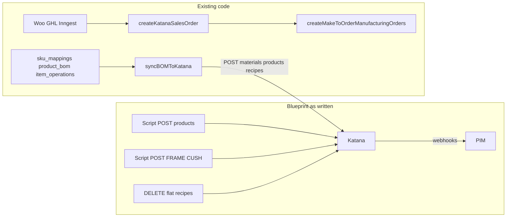

# Katana native multi-level BOM — technical review

**Verdict: not approved as written.** The manufacturing intent is sound (nested FRAME/CUSH, keep colorways off the FG, inject fabric at order time). The execution model fights the live schema, duplicates working code, uses the wrong Katana endpoints, and would destroy factory recipes without a PIM record of the new tree.

Approve a **revised PIM-first version** below. Do not greenfield Script 1/2/3 against production Katana.

## Live Supabase snapshot (today)

The multi-level schema is in place, but the manufacturing graph is empty. Blueprint scripts that assume they can `UPDATE sku_mappings` after a Katana POST have nothing local to hang FRAME/CUSH or BOM children on except 912 mapping rows with **no Katana IDs**.

- `sku_mappings`: 912 (`katana_variant_id` set = **0**; `item_type = sub_assembly` = **0**)
- `product_bom`: **0** — `syncBOMToKatana` would no-op / error (“No BOM lines”)
- `item_operations`: **0**
- `raw_materials_catalog`: **1** row (not 396 fabrics)
- `sku_aliases`: **194** (FG renames, not factory `OCE-`*/`BRA-*` ↔ `FIN-*`)
- `finished_goods_catalog`: 223
- `db:seed` / Excel ingest do **not** seed BOM

Live order path is Inngest SO → MTO (`ORDER_PIPELINE_MODE`), **not** `[KatanaService](src/server/katana/katana.service.ts)`. `unpackLineItemBom` (fabric from Woo meta) is unwired. `create_subassemblies` defaults false. There is no `/api/webhooks/katana` route; `incoming_webhooks.source` is only `woocommerce` | `ghl`. `KatanaSyncButton` exists but is not mounted on an admin page. `syncRawMaterialToKatana` has no dictionary server-action wrapper.

## What the blueprint gets right

- Katana **does** support subassemblies as products in a parent recipe ([Katana: using subassemblies](https://support.katanamrp.com/en/articles/5967064-using-subassemblies-in-product-recipes)); nested MOs go 10 levels deep.
- Colorway explosion is a real problem: 396 `FAB-*` must not become FG variants.
- MTO ingredient swap is a real API: `PATCH /manufacturing_order_recipe_rows/{id}` can change `variant_id` until the MO is `DONE` ([update MO recipe row](https://developer.katanamrp.com/reference/updatemanufacturingorderreciperows)).
- Powder coat in the live pull is a **routing step** (`operation_id` 522743), not a `PWD-`* ingredient. That matches the factory, not the PIM powder SKUs.
- Live Katana is still a flat cut-list: 934 recipes, all ingredients are the 13 bulk materials, 0 product-to-product edges (pull `2026-09-01T01:00:23Z`).

## Hard blockers vs this repo

1. **Wrong table name.** There is no `raw_materials` table. Materials live in `[sku_mappings](src/server/db/schema.ts)` (`item_type = raw_material`) plus `[raw_materials_catalog](src/server/db/schema.ts)`. BOM children **must** be `sku_mappings.global_sku` because `[product_bom.child_sku](src/server/db/schema.ts)` FKs there (`RESTRICT` on delete). Migration: `[0009_multi_level_bom.sql](src/server/db/migrations/0009_multi_level_bom.sql)`.
2. **Wrong create endpoint.** Materials are `POST /materials` with `variants[].sku`, not `POST /products` with `is_producible: false`. `is_producible` is a **product** flag. This is already implemented in `[upsertMaterialInKatana](src/lib/katana.ts)`.
3. **Code already does Phases 1–3 in the opposite direction.** `[syncBOMToKatana](src/lib/katana.ts)` walks `product_bom`, syncs `sub_assembly` children first, POSTs `/recipes` with `keep_current_rows: false`, POSTs `/product_operation_rows` (minutes → seconds). Dictionary already exposes `[syncBOMToKatanaAction](src/app/admin/dictionary/actions.ts)`. Three new scripts would bypass the hub and desync PIM.
4. `**/recipes` is deprecated.** Katana wants `[/bom_rows` / `/bom_rows/batch/create](https://developer.katanamrp.com/reference/createbomrow)` (max 250 rows). Existing sync still uses `/recipes`. New work should migrate that one function, not add a third writer.
5. **Create MO cannot carry a `materials[]` array.** Official create MO copies the product recipe automatically ([create manufacturing order](https://developer.katanamrp.com/reference/createmanufacturingorder)). `[KatanaService.toKatanaJson](src/server/katana/katana.service.ts)` sending `materials` is not a Katana field. Live pipeline already uses **sales order + MTO**, not that helper: `[createKatanaSalesOrder](src/lib/katana.ts)` then `[createMakeToOrderManufacturingOrders](src/lib/katana.ts)` from `[src/inngest/functions.ts](src/inngest/functions.ts)`.
6. **MTO swap is on the CUSH child MO, not the FG payload.** After nesting, parent recipe is `1× FRAME + 1× CUSH`. Generic fabric lives on the **cushion** MO recipe row. Middleware must: create SO → MTO with `create_subassemblies: true` → find child MO recipe row whose `variant_id` is generic fabric → `PATCH` to `FAB-`*. Today `create_subassemblies` **defaults false** and Inngest never passes `true`.
7. `**FRAME-[PARENT-SKU]` per Ocean variant over-builds.** 168 Ocean SKUs with recipes are mostly color variants of ~26 products. Per-variant FRAME duplicates the same tube cut-list six times. Key sub-assemblies by **model** (e.g. `SA-OCE-S-96-FRAME` / `SA-OCE-S-96-CUSH`), optional color config on FRAME if powder color must follow the FG. Do not prefix Global E2E with `FRAME-`/`CUSH-` hanging off legacy `OCE-S-96-GR-Y` until `[sku_aliases](src/server/db/schema.ts)` maps factory codes ↔ `FIN-`* (the 194 existing aliases are finished-good renames, not that crosswalk).
8. **Do not DELETE 934 live recipes.** Only 207 variants have recipes; 168 of those are Ocean (have ops). Bravada’s 38 cut-lists have **no** operations. A purge is irreversible on a production factory. Pilot **one Ocean model**, keep Bravada/Brooklyn/Dekton untouched.
9. **SoT conflict.** Blueprint: “Katana is absolute SoT.” This repo: PIM is the authoring hub (`product_bom.quantity * scrap_factor`, `item_operations` in minutes). Split SoT:
  - **PIM:** identity, aliases, intended tree, colorway SKUs, scrap.
  - **Katana:** inventory, executed recipes after sync, MO schedule, actual COGS on completion.
10. **No Katana→PIM/GHL webhook path.** `[incoming_webhooks.source](src/server/db/schema.ts)` is only `"woocommerce" | "ghl"`. `[katana_mo_records](src/server/db/schema.ts)` stores `external_ref` + `katana_mo_id` + `status`, not COGS. “Standard webhooks will pass immutable COGS downstream” is not in the schema and is not how Katana is wired today.
11. **Mutation gates (two of them).** `.env.local` has `DOWNSTREAM_MUTATIONS=false`. BOM/order pushes actually key off `ORDER_PIPELINE_MODE` (`log` / `approve` / `live`) via `[canMutateKatanaOrders](src/server/pipeline/mode.ts)`. Scripts must dry-run unless `live`. Katana rate limit is **60 req / 60 s**; 396 fabric creates is ~7+ minutes with backoff already in `katanaFetch`.
12. **Existing product upsert would make FRAME sellable.** `[upsertProductInKatana](src/lib/katana.ts)` hardcodes `is_sellable: true`. Sub-assemblies need `is_sellable: false`, `is_producible: true`, `is_purchasable: false` from `item_type`.

## Suggested code structure (replace Script 1/2/3)

Keep one Katana client: extend `[src/lib/katana.ts](src/lib/katana.ts)`. Add a **one-shot operator script** that only writes **Supabase**, then calls existing sync. Do not POST Katana from a second client.

| Workstream         | Where                                                                                                               | What                                                                                                                                                                                                                                                                                                                                                                              |
| ------------------ | ------------------------------------------------------------------------------------------------------------------- | --------------------------------------------------------------------------------------------------------------------------------------------------------------------------------------------------------------------------------------------------------------------------------------------------------------------------------------------------------------------------------- |
| A. Identity        | `sku_mappings` + `sku_aliases` + `raw_materials_catalog`                                                            | Mint/map the 13 bulk Katana materials to Global E2E (`MET-*` already exists, e.g. `MET-SQT20016`; foam/spacers likely need new `RM-*`). Write `katana_material_id` / `katana_variant_id` from the live dump **before** creating duplicates. Batch-ensure `FAB-`* / `STN-DKT-`* as **materials** via `ensureKatanaVariantForSku` (fix ID write-back on `syncRawMaterialToKatana`). |
| B. SA catalog      | `sku_mappings.item_type = sub_assembly`                                                                             | Insert `SA-{collection}-{model}-FRAME` and `-CUSH`. Fix `upsertProductInKatana` to honor `item_type`.                                                                                                                                                                                                                                                                             |
| C. Tree + routing  | `product_bom` + `item_operations`                                                                                   | Import Ocean cut-lists from `docs/katana_live_state/recipes.json` onto FRAME (metals/hardware) and CUSH (foam + **generic fabric** SKU). Parent FG: qty 1 of each SA. Move metal/powder/weld ops onto FRAME SKU; fabric/sew/stuff onto CUSH; QC onto FG. `scrap_factor` default 1.0 (Katana qty is net).                                                                          |
| D. Push            | `syncBOMToKatana`                                                                                                   | Prefer `/bom_rows/batch/create` (250 max) over deprecated `/recipes`. Ocean-only filter. Dry-run until `ORDER_PIPELINE_MODE=live`. Never `DELETE` until the new rows exist and a pull confirms depth 3.                                                                                                                                                                           |
| E. MTO inject      | `[src/inngest/functions.ts](src/inngest/functions.ts)` + `[unpackLineItemBom](src/server/katana/katana.service.ts)` | After SO create: `createMakeToOrderManufacturingOrders(ids, { createSubassemblies: true })`. New helper `applyMtoIngredientOverrides(moId, { genericVariantId, specificVariantId })` using `GET /manufacturing_order_recipe_rows?manufacturing_order_id=` then PATCH. Same pattern later for Dekton. Fail closed if generic row missing.                                          |
| F. Floor SOP       | Katana Shop Floor                                                                                                   | Linked MOs `MO-1`, `MO-1/1`, `MO-1/2` are native. Do not invent a second completion protocol. Auto-create is the API flag, not a training substitute for Complete taps.                                                                                                                                                                                                           |
| G. Downstream COGS | later, not Phase 1–4                                                                                                | Poll `GET /manufacturing_orders/{id}` for `total_cost` / `material_cost` / `operations_cost` / `subassemblies_cost` into `katana_mo_records` (migration). Do not add `katana` to `incoming_webhooks` until a real Katana webhook secret exists.                                                                                                                                   |

Pilot SKU: one Ocean sofa size (all color variants share one FRAME + one CUSH). Leave Bravada 38 recipes and Brooklyn 0-BOM SKUs alone.

## Payload / field notes that the blueprint skipped

- Recipe row has **no UOM** and **no scrap**; copy `material.uom` into `product_bom.unit_of_measure`.
- Generic fabric variant id in the pull: material `10609851` / variant `23178514` (sku `""`). That placeholder must stay in the CUSH recipe or MTO swap has no row to PATCH.
- Pushing all `FAB-*` into Katana is still correct for **stock/purchasing**; they just must not appear on the standard CUSH recipe.
- `PWD-*` stays routing unless you explicitly add a powder material line on FRAME (would double-count vs `Metal Powder Coating` op).
- Factory SKUs (`OCE-*`) vs PIM (`FIN-*`): 0 exact matches. Alias first or every parent_sku insert fails.

## Approval gate

Approve implementation only if: PIM remains authoring SoT; no production `DELETE` of recipes except Ocean pilot after a successful pull; MTO override is PATCH on child MO; materials go through `POST /materials`; FRAME/CUSH keyed by model not color variant; existing `syncBOMToKatana` / Inngest MTO path is extended rather than replaced.