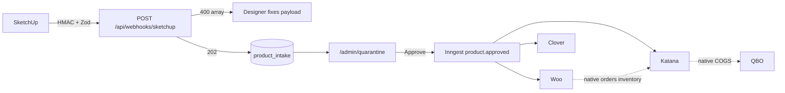

# CC Patio MDM Hub — Executive Brief, Gap Analysis, and Master Build Plan

**Binding SoT:** [`docs/MDM_MASTER_BLUEPRINT.md`](docs/MDM_MASTER_BLUEPRINT.md) (written 2026-09-02). Do not revive `docs/MASTER_ARCHITECTURE_BLUEPRINT.md`.

**Locked decisions:** Keep **Inngest**; do not install Trigger.dev. Keep the **relational adjacency BOM** in [`product_bom`](src/server/db/schema.ts); do not store trees as JSONB. Gateway is `POST /api/webhooks/sketchup` with `X-CCPatio-Signature`. Health cron is Inngest `system.health.ping` at `0 6 * * *`. Fan-out uses **parallel** `step.run` per channel. Freeze `/topology` and `/presentation` as demos. Transactional Woo/GHL → Katana SO/MTO is **out of the hub runtime**.

The Next.js app lives at **repo root** (`src/`), not `/middleware`.




---

## SECTION 1: Executive Build Brief

**Bounded context.** CC Patio manufactures fully-welded, highly configured outdoor furniture. Two data classes must never share one integration mesh:

- **Master data (this Next.js hub):** product identity, nested BOM, routing, MSRP, SEO, images, and the one-time creation of those records in Katana (manufacturing), WooCommerce (e-commerce catalog), and Clover (POS catalog).
- **Transactional data (native vendor connectors, not custom code):** Woo/Clover sales orders, live inventory deductions, Katana manufacturing orders from demand, Katana → QuickBooks COGS/inventory. Those remain Katana’s Woo connector, Katana’s QBO connector, and Clover’s own payment/QBO tools.

The hub is not an ERP, not a CRM, and not a payment reconcilers. GoHighLevel stays the staff CRM; the hub does not create Katana sales orders from Won opportunities.

**Why headless Next.js + Supabase, not WordPress.** Nested welded BOMs (finished good → frame/cushion sub-assemblies → extrusions, powder, foam, fabric, hardware) cannot live in Woo’s flat `wp_postmeta` EAV. The hub already models this as a Postgres adjacency list (`product_bom.parent_sku` / `child_sku`) with `item_operations` for welding/cutting/coating. WordPress is a **spoke** (REST catalog create), never the middleware.

**Defensive architecture that enables a permanent exit:**

1. **Zod at the SketchUp gateway.** Malformed geometry/BOM payloads return `400` with an issue array. Liability ends there; bad data never enters quarantine.
2. **Hardcoded TypeScript mappers** in `src/mappers/{katana,woocommerce,clover}.ts`. No Zapier-style mapper UI. A future API change is a file edit by a contractor, not an unmaintainable visual tool.
3. **Inngest durable fan-out** (already deployed as `ccpatio-middleware`). Saga steps are per channel: if Katana succeeds and Clover 429s, only Clover retries. The client’s IT uses the **Inngest dashboard Retry** — we do not build a custom DLQ UI.
4. **Idempotency.** `export_id` unique on intake; Inngest event ids `product-approve-{sku}-{version}`; stored `channel_sync` rows with provider external ids; Katana `Idempotency-Key` headers on mutating calls.
5. **Token-rot cron.** Daily Inngest job pings Katana/Woo/Clover with a cheap authenticated GET; `401` emails IT via existing Resend/Oh-Crap **before** a designer Approve fails at 4pm Friday.

---

## SECTION 2: Delta and Gap Analysis (what violates the thesis)

The live PIM (dictionary, raw materials, multi-level BOM, Katana product/recipe sync buttons) is the **right substrate**. The **binding docs and the order pipeline** are the wrong product.

### Architecture docs that must stop being source of truth

Treat as **HISTORICAL / V8 transactional bus**. Do not delete git history; add a banner and stop agents from executing them:

- `[docs/MASTER_ARCHITECTURE_BLUEPRINT.md](docs/MASTER_ARCHITECTURE_BLUEPRINT.md)` — currently binding; GHL Won → Katana SO+MTO; paths still say `middleware/`
- `[docs/data_sheets/CCPATIO MASTER BUILD PLAN.md](docs/data_sheets/CCPATIO MASTER BUILD PLAN.md)` — Sprints 0–5: outbox, three custom DLQs, `/api/admin/redrive`, QBO mutex, Clover fuzzy match
- `[docs/data_sheets/V8_MIDDLEWARE_ARCHITECTURE_RULES.md](docs/data_sheets/V8_MIDDLEWARE_ARCHITECTURE_RULES.md)` — Redis + `outbox_events` + CCR `effect_claims` (none of this exists in Drizzle)
- `[docs/data_sheets/Sprint_0_1implementation_plan.md](docs/data_sheets/Sprint_0_1implementation_plan.md)`
- `[docs/data_sheets/CCPatio_E2E_Customer_Lifecycle.md](docs/data_sheets/CCPatio_E2E_Customer_Lifecycle.md)` — Gate 1 MO / Gate 2 invoice
- `[docs/data_sheets/CCPATIO_ENTERPRISE_OPERATING_LIFECYCLE.md](docs/data_sheets/CCPATIO_ENTERPRISE_OPERATING_LIFECYCLE.md)`
- `[docs/data_sheets/CCPatio_SOP_Master_Matrix.md](docs/data_sheets/CCPatio_SOP_Master_Matrix.md)` and `[Workflow_Sequence_Audit_Report.md](docs/data_sheets/Workflow_Sequence_Audit_Report.md)` — generated from topology exception playlists
- `[PROGRESS.md](PROGRESS.md)` — celebrates Woo/GHL → Katana SO as complete

**Rewrite** `[docs/MASTER_ARCHITECTURE_BLUEPRINT.md](docs/MASTER_ARCHITECTURE_BLUEPRINT.md)` as the new SoT (this plan). Keep `[docs/katana_live_state/GAP_ANALYSIS_REPORT.md](docs/katana_live_state/GAP_ANALYSIS_REPORT.md)` — it is the MDM hard problem (0 SKU string matches: Katana `BRA-`*/`OCE-*` vs hub `FIN-*`/`FAB-*`).

### WordPress / PHP

**Zero `.php` files. Nothing to uninstall.** Woo exists as inbound **order** webhooks (`[src/app/api/webhooks/woocommerce/route.ts](src/app/api/webhooks/woocommerce/route.ts)`) which must leave the hub. Catalog **export** to Woo does not exist yet (`sync_to_woo` is a boolean only).

### Custom DLQ / visual mapper / outbox — planned or theatrical, mostly unbuilt

- V8 `outbox_events`, Redis dedupe, CCR leases, `/api/admin/redrive` — **do not build**
- `[quarantined_orders](src/server/db/schema.ts)` is **Woo order Zod-fail**, not product review — do not reuse as the quarantine UI
- `[src/components/views/ViewAuditLogs.tsx](src/components/views/ViewAuditLogs.tsx)` — fake “DLQ Terminal”; leave as presentation theater or strip from launchpad
- Topology Engineer panels (`[IntegrationEditorPanel](src/components/control/IntegrationEditorPanel.tsx)`, `[nodeIntegrationConfig.ts](src/schema/nodeIntegrationConfig.ts)`) are a visual **process** mapper, not a field mapper — freeze, do not extend into Zapier

### Runtime code that must leave the hub (transactional)

Disable and later extract/archive:

- `[src/inngest/functions.ts](src/inngest/functions.ts)` — `process-woocommerce-order`, `sync-ghl-opportunity` (Katana SO + MTO)
- `[src/app/api/webhooks/woocommerce/route.ts](src/app/api/webhooks/woocommerce/route.ts)`, `[src/app/api/webhooks/ghl/route.ts](src/app/api/webhooks/ghl/route.ts)`
- `[src/lib/katana.ts](src/lib/katana.ts)` functions `createKatanaSalesOrder`, `createMakeToOrderManufacturingOrders`, `mapWooOrderToKatanaSalesOrder`, `mapGhlOpportunityToKatanaSalesOrder` (keep product/material/recipe sync)
- `[src/server/pipeline/mode.ts](src/server/pipeline/mode.ts)` `ORDER_PIPELINE_MODE` as an **order** gate
- `[src/app/api/sandbox/katana-mto-test/route.ts](src/app/api/sandbox/katana-mto-test/route.ts)`
- Dead stubs: `[src/server/katana/katana.service.ts](src/server/katana/katana.service.ts)`, `[src/lib/qbo-queue.ts](src/lib/qbo-queue.ts)`, `[src/lib/katana-api.ts](src/lib/katana-api.ts)`

Keep (in-scope master sync, but stop calling them from dictionary Save; only from Approve):

- `[src/lib/katana.ts](src/lib/katana.ts)` `syncFinishedGoodToKatana` / recursive `syncBOMToKatana`
- `[src/lib/katana/client.ts](src/lib/katana/client.ts)` upserts
- Collapse the **second** BOM writer `[src/lib/katana/orchestrator.ts](src/lib/katana/orchestrator.ts)` into one mapper (two implementations race today)

### What is missing entirely vs the thesis

- No `src/mappers/`
- No SketchUp ingest route
- No product quarantine UI (Oh-Crap copy lies)
- No Woo catalog writer, no Clover client
- No token-health cron (`[/api/health](src/app/api/health/route.ts)` returns `{ ok: true }` only)
- Trigger.dev unused (correct to skip)

---

## SECTION 3: Missed action steps and blind spots

### BOM / schema

- **Relational adjacency is the right model** for multi-level welded BOMs. JSONB trees would block Katana recipe fan-out and cycle checks. Do **not** switch to JSONB.
- **No recursive SQL explosion.** Tree walk is TypeScript (`getBomTree`, depth 12). Add a `bom_explosion` SQL view (`WITH RECURSIVE`) for IT/debug and for mapper bottom-up ordering.
- **No DB cycle constraint.** Unique `(parent_sku, child_sku)` does not prevent A→B→A. Keep app `wouldCreateCycle`; add a trigger or check on insert.
- **Dual raw-material stores:** `[raw_materials_catalog](src/server/db/schema.ts)` is not FK’d to `[sku_mappings](src/server/db/schema.ts)`, but BOM children **must** be hub SKUs. Unify: RM rows are hub rows; the extra table becomes a view or 1:1 extension.
- `**staff_notes` is in Drizzle but not in SQL migrations** — schema drift; fix in the next migration batch.
- **Katana SKU crosswalk is unsolved.** Gap report: **0** overlapping SKUs. `sku_aliases` exists but is unused as BRA→FIN map. Fan-out will duplicate factory SKUs unless Approve either (a) links `katana_variant_id` via alias, or (b) creates new `FIN-`* products and leaves legacy `BRA-*` untouched. Default: **create hub SKUs as new Katana products**; never overwrite unmatched legacy variants.

### Security

- PIM auth is **email-domain cookie HMAC** (`*@ccpatio.com`), not Supabase Auth. Fine for a small ops team; document it in the runbook. Extend the same cookie to `/admin/quarantine`. Add an `operator_role` (`reviewer` | `admin`) before handoff — today any registrant can mutate the dictionary.
- **No RLS on public tables.** Writes use `POSTGRES_URL` (bypasses RLS). Enable RLS + revoke `anon`/`authenticated` on `public` as defense if the Data API is ever opened ([Supabase exposing tables](https://supabase.com/docs/guides/api/securing-your-api.md)).
- Storage policies require `authenticated`; the app uploads with **service role** and never signs into Supabase Auth — works, but is a footgun.
- `[/api/qa-test](src/app/api/qa-test/route.ts)` is **unauthenticated dictionary insert**. Gate with a secret or delete from production.
- Katana webhook route has **no HMAC** (stub). Either HMAC it or return 410.
- SketchUp ingest must use HMAC (`X-CCPatio-Signature`) + shared secret; IP allowlist optional.

### Idempotency / orchestration

- Inngest event ids exist for **orders**, not product publish.
- Katana `Idempotency-Key` is only on unused `KatanaService`. Product upserts in `katanaFetch` do not send it.
- Two `syncBOMToKatana` implementations + two mutation flags (`DOWNSTREAM_MUTATIONS` vs `ORDER_PIPELINE_MODE`) — operators cannot know which button hits live Katana.

### Edge cases overlooked

- **Partial saga:** Katana recipe written, Woo 401, Clover OK — retries must not POST a second Katana product. Persist per-channel status.
- **Katana recipe mutation policy:** do not DELETE production recipes; upsert rows; never silently remap BRA-* .
- **Woo simple vs variable products:** custom furniture is usually simple products + attributes, not Woo variations of powder SKUs (powder lives in Katana BOM).
- **Clover item name/SKU length and price in cents.**
- **Concurrent Approve** — use `sku_mappings.version` OCC; second Approve 409s.
- **SketchUp update vs create** — same `export_id` is idempotent 200; new export for same proposed SKU while `pending_review` replaces draft, not a second row.
- **Approve without MSRP** — block if Woo/Clover flagged; Katana-only (factory SKU, `sync_to_woo=false`) may allow empty MSRP.
- **Images:** SketchUp will not be SoT for hero photos; quarantine requires Storage upload before Woo/Clover if `sync_to_woo`.
- **Native connector collision:** once Woo↔Katana native orders are on, the hub must **never** send orders; document SKU identity so native maps by the same `FIN-`*.
- **Token rot during a running saga** — health cron is necessary but not sufficient; map 401 in mappers to a non-retryable Inngest error + Oh-Crap (IT rotates token, then Retry in Inngest).

---

## SECTION 4: Definitive master build plan

### Phase 0 — Governance (same day, before features)

- Rewrite `[docs/MASTER_ARCHITECTURE_BLUEPRINT.md](docs/MASTER_ARCHITECTURE_BLUEPRINT.md)` to this MDM thesis; stamp V8 docs HISTORICAL.
- Update `[PROGRESS.md](PROGRESS.md)` and launchpad copy (`[src/lib/launchpad-modules.ts](src/lib/launchpad-modules.ts)`) so Topology/Presentation are “Demo / not ingress”.
- Remove order functions from the Inngest `serve()` list so production cannot create Katana SOs even if `ORDER_PIPELINE_MODE=live`.
- Lock `/api/qa-test` behind `QA_LIFECYCLE_SECRET` (keep for `npm run qa:lifecycle`).

**Success:** Agents reading the repo cannot justify GHL→MO work. `serve()` has no Woo/GHL order consumers.

### Phase 1 — Database + SketchUp gateway

**Schema (Drizzle migration, then `npm run db:migrate`):**

- `product_intake` — `export_id` unique, `status` (`quarantined` | `approved` | `rejected` | `superseded`), `raw_payload` jsonb, `zod_issues` jsonb, `proposed_sku`, `created_by`
- `product_intake_bom` — normalized tree cloned from payload after Zod pass (or freeze validated jsonb + relational expand on approve). Prefer **relational clone into `product_bom` only after Approve**; quarantine edits a draft tree `intake_bom_lines` so unapproved SKUs never pollute the live dictionary.
- `channel_sync` — `(global_sku, channel)` unique, `external_id`, `status` (`pending|success|failed`), `last_error`, `payload_hash`
- `sku_mappings.clover_item_id`, `woo_product_id`; `finished_goods_catalog` SEO: `slug`, `seo_title`, `seo_description`
- `pim_operators.role`
- Unify RM: FK `raw_materials_catalog.sku` → `sku_mappings.global_sku`
- `bom_explosion` view (`WITH RECURSIVE`)
- Enable RLS on public tables; no policies for `anon`; service via `POSTGRES_URL` only
- Migration for `staff_notes` if missing on remote

**Gateway:** `POST /api/ingest/sketchup`

- HMAC timing-safe compare
- Zod: recursive BOM (max depth 12), qty > 0, UOM enum, operations, dimensions, `export_id` UUID
- Fail → **400** `{ errors: [{ path, message }] }` — **do not insert**
- Pass → persist intake `quarantined`, **202** `{ intake_id }`
- Idempotent replay of same `export_id` → 200 already_accepted

**SketchUp v1 contract** (locked until designers ship a plugin): `export_id`, `exported_at`, `designer_email`, `product.{name,collection,category,proposed_sku?}`, `dimensions`, `subassemblies[]` recursive `{ sku_or_name, item_type, qty, uom, children[], operations[] }`.

**Success:** Invalid payload never hits Postgres. Valid payload appears in intake table. `npm run qa:lifecycle` still passes (adjust e2e if order webhooks were asserted).

### Phase 2 — Quarantine UI

- Route `/admin/quarantine` (cookie-gated like dictionary)
- Queue of `quarantined` intakes; detail: BOM tree, dims, missing hub SKUs highlighted
- Human fields: MSRP, cost, SEO, image (existing Storage), `sync_to_woo`, Clover flag, proposed→canonical SKU
- Actions: Reject (reason), Save draft, **Approve** (server action: OCC, require MSRP if Woo/Clover, mint hub SKUs + BOM + operations, enqueue Inngest `product/approved`)
- Dictionary remains the **live catalog editor** for already-approved SKUs; Save does **not** fan out (preserves current Antigravity finding). A later “Publish changes” can enqueue the same Inngest job.

**Success:** Playwright: ingest fixture → UI shows row → set MSRP → Approve → row status `approved`. No Katana mocks in Phase 2 DB proof.

### Phase 3 — Hardcoded mappers

New files only; no visual mapper:

- `[src/mappers/katana.ts](src/mappers/katana.ts)` — wrap existing upserts; bottom-up: materials → SA products → FG → recipes (`qty * scrap_factor`) → `product_operation_rows`; send `Idempotency-Key`; write `katana_variant_id` / `katana_material_id`
- `[src/mappers/woocommerce.ts](src/mappers/woocommerce.ts)` — REST `products` create/update by SKU; price, description, image, `meta` SKU; skip if `sync_to_woo=false`
- `[src/mappers/clover.ts](src/mappers/clover.ts)` — inventory item create/update; skip if not retail
- Delete/merge `[orchestrator.ts](src/lib/katana/orchestrator.ts)` into the Katana mapper

**Success:** Unit tests: fixture intake → mapper payloads match snapshots; no HTTP.

### Phase 4 — Inngest fan-out (durable saga)

Replace order jobs with:

- `publish-approved-product` on `product/approved` — steps `katana`, `woocommerce`, `clover`; each step no-ops if `channel_sync.status=success` for that sku+version hash
- Concurrency key `event.data.globalSku` limit 1
- Rate-limit / retry on 429; **do not retry** 401/403 (Oh-Crap + Inngest failure)
- `onFailure` → existing Resend Oh-Crap with deep link `/admin/quarantine?sku=`
- Client IT retries from Inngest Cloud — **no** `/api/admin/redrive`, **no** custom DLQ page

**Success:** Kill Clover credentials mid-run → Katana row persisted, Clover step retries, no duplicate Katana product. Inngest dashboard shows failed Clover run.

### Phase 5 — Exit protocol

- Inngest cron `0 13 * * *` (18:00 UTC): GET Katana `/products?limit=1`, Woo `/products?per_page=1`, Clover `/v3/merchants/{id}/items?limit=1`; 401 → email `OH_CRAP_ADMIN_EMAIL`
- Expand `/api/health` to `{ db, katana, inngest }` **without** leaking tokens (liveness only)
- Runbook: `docs/IT_RUNBOOK.md` — env vars, Inngest Retry, token rotation, native connector checklist (Katana↔Woo orders, Katana↔QBO COGS), SKU policy, “do not open Data API”
- Handoff: Vercel + Supabase + Inngest Cloud access to client IT; `DOWNSTREAM_MUTATIONS` retired in favor of “Approve = publish”

**Success:** Revoked sandbox token produces an email without any Approve click. Runbook reviewed in a 30-minute IT call.

---

## SECTION 5: Immediate action items (today in the IDE)

Zod (`^4.4.3`) and Inngest (`^4.18.1`) are **already installed**. Do **not** `npm i @trigger.dev/sdk`. Do **not** scaffold a `/middleware` app.

**Step 1 — Freeze the old thesis so agents stop building the order bus**

Rewrite `[docs/MASTER_ARCHITECTURE_BLUEPRINT.md](docs/MASTER_ARCHITECTURE_BLUEPRINT.md)` (MDM hub only). Add `> HISTORICAL — transactional V8; do not implement` at the top of the Master Build Plan and V8 rules files.

**Step 2 — Stop live transactional consumers**

In `[src/app/api/inngest/route.ts](src/app/api/inngest/route.ts)`, unregister `processWooCommerceOrder` and `sync-ghl-opportunity`. Keep `archive-katana-variant` and staff digest. Optionally 410 the Woo/GHL webhook routes.

**Step 3 — Scaffold the hub files (no new dependencies)**

PowerShell from repo root:

```powershell
New-Item -ItemType Directory -Force -Path src/mappers, src/server/sketchup, src/app/api/ingest/sketchup, src/app/admin/quarantine
npm ls zod inngest
npx drizzle-kit generate
```

Then add (empty-but-typed) `[src/mappers/katana.ts](src/mappers/katana.ts)`, `woocommerce.ts`, `clover.ts`; Zod schema `[src/server/sketchup/ingest.schema.ts](src/server/sketchup/ingest.schema.ts)`; route handler HMAC+400/202. Env: `SKETCHUP_WEBHOOK_SECRET`, `WOOCOMMERCE_CONSUMER_KEY`, `WOOCOMMERCE_CONSUMER_SECRET`, `CLOVER_API_TOKEN`, `CLOVER_MERCHANT_ID`.

After those three, begin Phase 1 tables + `npm run qa:lifecycle` (required by workspace QA protocol on any code change).