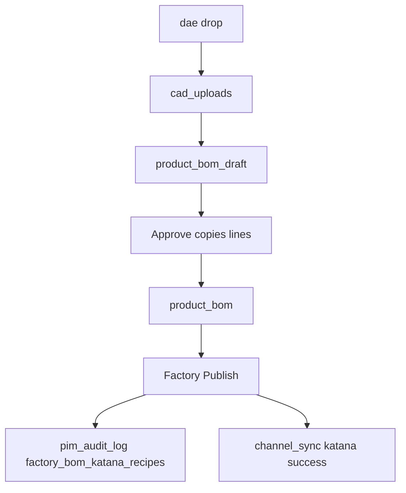

# Master Catalog Product Bible Blueprint

Status: ready for review. Approving this plan writes the document to [data_migration/Pricing/MASTER_CATALOG_PRODUCT_BIBLE_BLUEPRINT.md](data_migration/Pricing/MASTER_CATALOG_PRODUCT_BIBLE_BLUEPRINT.md), beside the existing catalog blueprint. It does not change application code.

Decisions locked with the business owner:

- Factory readiness is four mutually exclusive states, not the three colors in the original brief.
- Header pills are exclusive. One slice is visible at a time. Counts always describe the full roster.
- The new pill counts listings that are not Published.

## What the factory pipeline actually stores

`/embed/factory-bom` renders [FactoryBomWorkbench](src/app/admin/factory-bom/FactoryBomWorkbench.tsx) from [listFactoryProducts](src/server/factory-bom/list-factory-products.ts). That query is not the catalog population. It only loads `sku_mappings` rows with `item_type = finished_good` and `source_file` like `vividworks_phase%`. The Product Bible must score every `ecommerce_listings.global_sku`, including SKUs that never appear in that sidebar.

There is no single readiness column. Five records already exist:

- [cad_uploads](src/server/db/schema.ts) — one job per drop. `ext` is `dae` or `skp`. Status is `uploaded`, `queued`, `processing`, `draft_ready`, or `failed`. A `.skp` file is a thumbnail only and never counts as CAD. Geometry is the latest row with `ext = dae`.
- [product_bom_draft](src/server/db/schema.ts) — heuristic lines. `status` is `draft_pending_review`, `edited`, or `factory_approved`. Drafts do not feed Katana.
- [product_bom](src/server/db/schema.ts) — live recipe lines. Approve in [approveDraftRecipe](src/app/admin/factory-bom/actions.ts) copies draft parents into this table, then marks those drafts `factory_approved`. Presence of live lines is the approve gate. The table has no status column.
- [channel_sync](src/server/db/schema.ts) — one row per `(global_sku, channel)`. Katana status is `pending`, `success`, or `failed`. Product-shell publish and [upgrade-katana-legacy-skus.ts](scripts/ops/upgrade-katana-legacy-skus.ts) write this same row and do not publish a recipe.
- [pim_audit_log](src/server/db/schema.ts) — `action = factory_bom_katana_recipes` is written only by [publishApprovedRecipeToKatana](src/app/admin/factory-bom/actions.ts) after `syncBOMToKatana` returns ok.

`listFactoryProducts` rolls draft status with [rollupReviewStatus](src/app/admin/factory-bom/factory-bom-ui.ts): `edited` wins, then `draft_pending_review`, then all-`factory_approved`. It also looks at FRAME and CUSH parents, current `ASM-{stem}-{ROLE}` from [subAssemblySku](src/lib/heuristic-bom.ts) and legacy `SA-{stem}-{ROLE}`. `liveBom` on that screen is only `product_bom.parent_sku = finished good`. The catalog uses the wider parent set below so a recipe that lives on the frame sub-assembly still counts.

## Locked readiness rule

Compute once per distinct `global_sku`, then stamp every listing that shares it. Shared hub SKUs (`FIN-TJM-MIS` and the other six) show the same factory state on every website row. The pill still counts listing rows, matching the existing telemetry.

Related parents for one hub SKU: the SKU itself, `ASM-…-FRAME`, `ASM-…-CUSH`, `SA-…-FRAME`, and `SA-…-CUSH`.

Evidence:

- `liveRecipe`: any `product_bom` row whose `parent_sku` is in that parent set.
- `draftRollup`: `rollupReviewStatus` of `product_bom_draft.status` on that parent set. Reuse the existing function so the catalog and the workbench agree.
- `latestDae`: newest `cad_uploads` row for the hub SKU with `ext = dae`. Ignore `.skp`.
- `katana`: `channel_sync` where `channel = katana`.
- `recipePublished`: at least one `pim_audit_log` row for that SKU with `action = factory_bom_katana_recipes`.

First match wins:

1. **Published** — `liveRecipe` and `katana.status = success` and `recipePublished`.
2. **Factory approved** — `liveRecipe`, and the Published conjunction is false. A live day-zero or imported BOM with only a product-shell Katana sync stays here.
3. **Draft pending** — no live recipe, and either draft lines exist or `latestDae.status` is `uploaded`, `queued`, `processing`, or `draft_ready`.
4. **Missing CAD** — everything else, including a failed `.dae` with no draft lines and no live recipe.

Column sublabels, not extra states:

- Draft + rollup `edited` → `Edited`
- Draft + rollup `draft_pending_review` → `Auto-generated`
- Draft + in-flight CAD and no draft lines yet → `Extracting`
- Missing CAD + `latestDae.status = failed` → `Extract failed`
- Factory approved + `katana.status = pending` → `Katana pending`
- Factory approved + `katana.status = failed` → `Katana failed`
- Factory approved + success without the audit action → `Recipe not published`

Colors: Published emerald, Factory approved sky, Draft amber, Missing CAD rose. Put the state in a new Factory column so it is scannable. Repeat it in the expanded row with the evidence (filename, CAD status, draft rollup, live-recipe flag, Katana status) and a same-origin link to `/embed/factory-bom?sku={globalSku}`. Embed auth is the existing cookie and header, so the link does not invent a new key.

The pill label is **not published**. Its value is the count of listings whose state is not Published. Clicking it shows that slice.

## Roster query

Extend `getEcommerceRoster()` in [src/app/embed/admin/master-catalog/actions.ts](src/app/embed/admin/master-catalog/actions.ts). Do not `LEFT JOIN product_bom` onto `ecommerce_listings`. Draft and live tables are one-to-many and would duplicate listing rows.

After the existing listing and gap reads, collect distinct hub SKUs and run five set queries: latest `.dae` rows, draft statuses, live parents, Katana `channel_sync`, and distinct audit SKUs for `factory_bom_katana_recipes`. Reduce them in memory with a pure function, `deriveFactoryReadiness`, placed next to the factory read model (new file under `src/server/factory-bom/`). The function takes already-loaded evidence and returns the state plus sublabel. No database call inside it.

Add the result onto `EcommerceListing`. Gaps stay unchanged. A gap has no `sku_mappings` row, so it has no factory state.

No migration. No new table. No write to Katana, `product_bom`, or `cad_uploads`.

## Interactive pills

Today [EcommerceGrid.tsx](src/app/embed/admin/master-catalog/ecommerce/EcommerceGrid.tsx) renders static stats: `in roster`, `hub gaps`, `missing links`, `missing legacy SKU`. Rename the first label to **listings**. Add **not published**.

Pills are `aria-pressed` toggles. One is active. Activating a pill selects it. Activating the selected pill returns to listings. Counts never change with the selection.

- **listings** — full `ecommerce_listings` roster. Default.
- **hub gaps** — replace the grid with `ecommerce_roster_gaps`: Product Name, Missing SKU (`global_sku`), Reason. No expand, no MSRP editor, no factory column. Collection and type facets hide, because gaps do not have them. The search box filters name, missing SKU, and reason.
- **missing links** — roster rows with `urlSource === "missing"`.
- **missing legacy SKU** — roster rows with `legacyBaseSku == null`.
- **not published** — roster rows whose factory state is not Published.

On listing slices, the existing search, collection, and type filters in [EcommerceFilters.tsx](src/app/embed/admin/master-catalog/ecommerce/EcommerceFilters.tsx) apply after the pill slice. `Showing N of M` uses the slice as M, then the facet result as N. Pill counts above that line stay on the full roster.

## Links and expanded row

Product Link stops rendering the raw path from `linkLabel`. A row with `productUrl` gets a compact external control labeled `View Live` (`target="_blank"`, `rel="noopener noreferrer"`). Keep the existing `shared page` chip when `urlSource === "sibling"`. A missing URL stays an em dash.

Refactor [EcommerceExpandedRow.tsx](src/app/embed/admin/master-catalog/ecommerce/EcommerceExpandedRow.tsx) into four regions:

- **Marketing** — `marketingDescription`, `text-sm leading-7 text-slate-700`, empty copy in slate-400.
- **Construction** — `constructionDetails`, same body style.
- **Pricing** — aluminum MSRP as the figure, steel MSRP as the caption.
- **Factory** — full-width band under the three columns: state, sublabel, CAD filename, and the workbench link. When `canonicalSkuShared` is true, say that every listing on this hub SKU shares the recipe.

Section titles are `text-xs font-semibold uppercase tracking-wide text-slate-500` with space under them. Bump `COLUMN_COUNT` from 6 to 7 for the Factory column.

## Execution engine backlog

This backlog starts only after the blueprint file is approved for implementation.

1. Add `deriveFactoryReadiness` and a unit test with fixtures for each precedence step, including shell-sync false greens, failed CAD, in-flight CAD, shared parent rollup, and `.skp` ignored. Do not mock Postgres to force the lifecycle suite green.
2. Extend `getEcommerceRoster()` with the five set queries and the new listing fields.
3. Update `EcommerceGrid` pills, gap table, Factory column, and the View Live control.
4. Update `EcommerceExpandedRow` typography and the Factory band.
5. Run `npm run qa:lifecycle` and fix failures in app code. Phase 2 must keep hitting real Postgres.
6. Open the master catalog embed and exercise each pill, a shared-SKU row, a missing URL, and the factory link.

## Out of scope

- No WooCommerce calls, no Katana writes, and no Approve or Publish buttons on this grid.
- No change to `listFactoryProducts` population or to the V8 transactional bus.
- No schema change and no backfill of `pim_audit_log`. Historical recipe syncs that never wrote `factory_bom_katana_recipes` remain Factory approved until someone runs Factory Publish.

