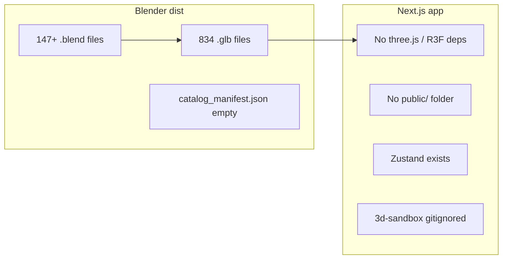
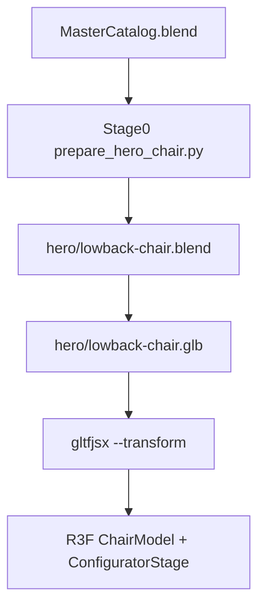

# Master End-to-End Action Plan — Review and Revised Execution Path

## Video goal (inferred)

The MP4 at `[3D_Goal_SKP_Converstion_FInal_Result_Game_Plan_Example.mp4](3D_Goal_SKP_Converstion_FInal_Result_Game_Plan_Example.mp4)` could not be frame-extracted in this environment (no ffmpeg; binary MP4 not readable). From the filename, your stage descriptions, and the VividWorks references in `[docs/MASTER_ARCHITECTURE_BLUEPRINT.md](docs/MASTER_ARCHITECTURE_BLUEPRINT.md)`, the target UX is:

- Orbit a **Ledge Lounger Signature Lowback Chair** in studio lighting
- Hover a part → **red outline** (frame / seat / pillow)
- Sidebar swatches change **frame metal color**, **cushion fabric tint**, and **pillow pattern** without reloading 4K textures per swatch

That aligns with CC Patio SKU seed data: **FIN-LED-CHA** / `"LEDGE LOUNGER SIGNATURE LOWBACK CHAIR"` in `[src/generated/sku-seed-data.json](src/generated/sku-seed-data.json)`.

## What the codebase actually has today




| Asset / area                                                                                                  | Status                                                                                        | Implication                                                                                |
| ------------------------------------------------------------------------------------------------------------- | --------------------------------------------------------------------------------------------- | ------------------------------------------------------------------------------------------ |
| `[c-ledge-lounger-signature-lowback-chair.glb](Blender/dist/glb/c-ledge-lounger-signature-lowback-chair.glb)` | **782 KB**, valid geometry                                                                    | Good hero candidate **after split**                                                        |
| Same file mesh structure                                                                                      | **1 mesh**, node `G-Object.10444`, material `[Color M00]1`                                    | Your Stages 3–4 assume `Mesh_Frame` / `Mesh_Seat` / `Mesh_Pillow` — **these do not exist** |
| `[g-object.glb](Blender/dist/glb/g-object.glb)`                                                               | 12 sub-meshes; `C-Component#*` = `D08_Bronzed_Mustard`, some `G-Object.*` = cushion materials | Useful reference for material grouping, **not** the isolated chair SKU                     |
| Bulk GLBs                                                                                                     | **641 files ~148 bytes** (empty stubs) + 147 healthy chair/component exports                  | Ignore stubs for POC; do not point gltfjsx at the bulk folder                              |
| `[catalog_manifest.json](Blender/dist/catalog_manifest.json)`                                                 | Currently `[]`                                                                                | Manifest is not blocking the single-hero POC                                               |
| `[package.json](package.json)`                                                                                | No `three`, `@react-three/*`, `gltfjsx`                                                       | Full npm bootstrap required                                                                |
| Web app                                                                                                       | TypeScript + Zustand (`[src/store/useAppStore.ts](src/store/useAppStore.ts)`)                 | Use `.ts` stores/components, not `.js`                                                     |
| Architecture policy                                                                                           | VividWorks CPQ marked **future** in blueprint                                                 | Treat this as **sandbox POC** under `[3d-sandbox/](3d-sandbox/)` (already gitignored)      |


**Verdict on your plan:** Stages 2–5 (micro-textures, Zustand, outline post-processing, studio lighting) are architecturally sound and match the demo intent. **Stage 1 as written will fail** because gltfjsx `--keepnames` will emit `nodes.G_Object_10444`, not three semantic parts. You chose the correct fix: **split the chair in Blender first**.

---

## Critical corrections to your original plan

1. **Add Stage 0 (Blender hero prep)** — mandatory before gltfjsx.
2. **Do not assume gltfjsx node names** — generate the component from actual output, then map parts by explicit name list or material class.
3. **Fix path inconsistency** — `--transform` writes `chair-transformed.glb`; your sample loads `/models/chair-transformed.glb` but copies `chair.glb`. Pick one path and preload the transformed file.
4. **Install R3F stack** — `three`, `@react-three/fiber`, `@react-three/drei`, `@react-three/postprocessing`, `@types/three`, and `gltfjsx` (dev).
5. **SSR guard** — wrap `<Canvas>` in a `"use client"` page with `dynamic(..., { ssr: false })`.
6. **Draco decoder** — after `--transform`, register Draco in the loader:
  ```ts
   import { DRACOLoader } from 'three/examples/jsm/loaders/DRACOLoader'
   useGLTF.setDRACOLoader(new DRACOLoader().setDecoderPath('/draco/'))
  ```
7. **Isolate from middleware** — build in `3d-sandbox/` so the POC does not entangle with admin/PIM routes.

---

## Revised pipeline




### Stage 0 — Blender hero split (you selected this path)

Create `[scripts/prepare_hero_chair.py](scripts/prepare_hero_chair.py)` (one-off, not the bulk catalog loop):

1. Open `[Blender/MasterCatalog.blend](Blender/MasterCatalog.blend)`.
2. Locate parent `**C-Ledge Lounger Signature Lowback Chair**` (matches existing slug `[c-ledge-lounger-signature-lowback-chair](Blender/dist/blend/c-ledge-lounger-signature-lowback-chair.blend)`).
3. Collect child mesh objects; **rename and keep as separate objects**:
  - `Mesh_Frame` — metal / extrusion / `D08_Bronzed_Mustard` or `[Color M00]` geometry
  - `Mesh_Seat` — cushion body
  - `Mesh_Pillow` — optional pillow mesh (if absent, duplicate seat mesh or omit pillow swatch until modeled)
4. If the current export truly merged everything into one mesh datablock, use Blender **Separate by Loose Parts** or **Separate by Material** in Edit Mode, then assign the names above.
5. Center on floor (reuse offset logic from `[scripts/extract_catalog.py](scripts/extract_catalog.py)`).
6. Write **self-contained** `.blend` via `bpy.ops.wm.save_as_mainfile` (not `libraries.write`) so Step 2 conversion never hits the empty-scene library bug.
7. Export GLB with native `export_scene.gltf` from that file (or run `[scripts/convert_blend_to_glb.py](scripts/convert_blend_to_glb.py)` on the hero file only).

**Acceptance gate:** hero GLB has **3 nodes** named `Mesh_Frame`, `Mesh_Seat`, `Mesh_Pillow` (pillow optional), each with `poly_count > 0`, file size **> 50 KB**.

### Stage 1 — Asset prep and gltfjsx

Inside `3d-sandbox/`:

```bash
mkdir -p public/models public/textures public/draco
cp ../Blender/dist/hero/lowback-chair.glb public/models/
npx gltfjsx public/models/lowback-chair.glb --transform --keepnames -o src/components/canvas/LowbackChairModel.tsx
```

Copy Draco WASM to `public/draco/` (gltfjsx / three.js standard).

### Stage 2 — Micro-texture strategy (keep as designed)

Your approach is correct:

- One tiled `canvas_normal.jpg` + `canvas_roughness.jpg`
- Programmatic `color={seatFabric}` on cushions
- One repeating `cabana_stripe.jpg` for pillow pattern
- Frame uses `meshStandardMaterial` with high metalness, no fabric maps

Place textures in `3d-sandbox/public/textures/`.

### Stage 3 — Zustand store

Create `[3d-sandbox/src/store/useConfiguratorStore.ts](3d-sandbox/src/store/useConfiguratorStore.ts)` (mirror your API, TypeScript):

- `metalColor`, `seatFabric`, `pillowOption`, `hoveredPart`
- Actions: `setMetalColor`, `setSeatFabric`, `setPillowOption`, `setHoveredPart`

Add a small HTML sidebar component bound to the same store.

### Stage 4 — Dynamic model + outline

Adapt your `ChairModel` sample with these fixes:

- Import generated `nodes` from `LowbackChairModel.tsx` — **do not hardcode** until gltfjsx runs
- Wrap each part in `<Select enabled={hoveredPart === 'frame'}>` etc.
- Use `onPointerOver` / `onPointerOut` with `e.stopPropagation()`
- Load transformed GLB path that gltfjsx references

### Stage 5 — Stage view

Create `[3d-sandbox/src/app/page.tsx](3d-sandbox/src/app/page.tsx)` or a route under the main app if you prefer:

- `<Canvas shadows>` + `Environment preset="city"` + directional light + `ContactShadows`
- `<Selection>` → `<EffectComposer autoClear={false}>` → `<Outline edgeStrength={15} visibleEdgeColor="#ff3300" />`
- `OrbitControls` with `maxPolarAngle={Math.PI / 2.05}`

Bootstrap `3d-sandbox` as a minimal Next.js app **or** a single `"use client"` page in the main app at `/configurator` — prefer `**3d-sandbox/`** to honor gitignore and future-scope policy.

---

## Risks and edge cases


| Risk                                              | Mitigation                                                                                   |
| ------------------------------------------------- | -------------------------------------------------------------------------------------------- |
| Lowback chair has only 1 material on 1 mesh today | Stage 0 must **geometry-split**, not only material-split                                     |
| Pillow mesh may not exist as separate object      | Start with frame + seat; add pillow when modeled or hide pillow swatch                       |
| 641 empty bulk GLBs                               | Out of scope for POC; add size check to `convert_blend_to_glb.py` later                      |
| React 19 + R3F version pin                        | Use current `@react-three/fiber@9` + matching `three@0.17x`; verify postprocessing peer deps |
| `--transform` changes scale/origin                | Verify chair sits on Y=0 after load; add `<group position={[0,0,0]}>` fix if needed          |


---

## Recommended execution order

1. **Stage 0** — Blender split + hero GLB validation (3 named meshes)
2. **Bootstrap** — `3d-sandbox` deps + folder layout
3. **Stage 1** — gltfjsx + Draco
4. **Stages 3–5** — store, model, stage, sidebar swatches
5. **Visual QA** — compare orbit/hover/outline/swatch behavior to the reference video manually

Do **not** start Stages 1–5 until Stage 0 acceptance gate passes — gltfjsx on the current monolithic GLB will produce a viewer that looks like the chair but cannot replicate the video’s part-level customization.