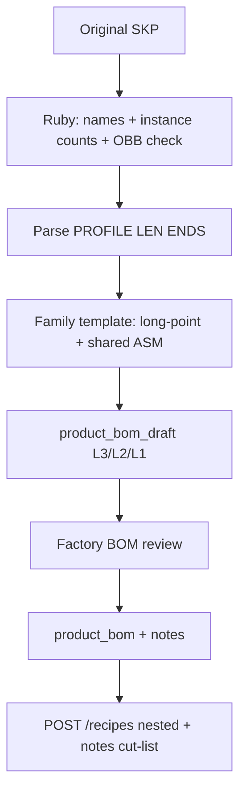

# Reverse-engineer cut-lists from visualization SketchUp models

## Verdict

**Best path is SketchUp Ruby on the original `.skp` files, plus per-family weldment templates.** The Bravada North Star sample is **named manufacturing components**, not polygon soup. Mesh fitting and vision models remain fallbacks/critics.

North Star artifacts (proposed, not released):

- [`docs/BOM_Examples/BOM_BRV-CLB-034034.csv`](docs/BOM_Examples/BOM_BRV-CLB-034034.csv) — L3/L2/L1 adjacency, qty **per parent**, shared `ASM-BRV-ARM` ×2
- [`docs/BOM_Examples/DWG_BRV-CLB-034034_BOM.pdf`](docs/BOM_Examples/DWG_BRV-CLB-034034_BOM.pdf) — long-point vs short-point, inferred qty, schematic not a shop drawing
- [`docs/BOM_Examples/BravadaSample.jpeg`](docs/BOM_Examples/BravadaSample.jpeg) — Outliner names already encode profile, gauge, length, mitres (`BRAVADA SEAT FRAME 2X2 16 GA 34" 45 45`)

Katana execution: **nested recipes** (FG → weldment SAs → bulk `RM-MET-*` in **feet**). Drawing `CUT-*` numbers stay in notes / PIM identity. They must not become chop-saw manufacturing orders.

---

## North Star — three operational layers

### 1. SketchUp extraction reality check

**What the JPEG actually shows.** This SKP is bucket C (named cut strings), not merged `Mesh_Frame`. Outliner definitions include:

- Assemblies: `BRAVADA CLUB CHAIR SEAT` / `ARM` / `BACK`
- Sticks: `BRAVADA SEAT FRAME 2X2 16 GA 34" 45 45`, `LEG 2X2 16 GA 8"`, `MIDDLE FRAME 1.5X.75 16 GA 30"`, `FLAT BAR HR FLAT 1/8" 30" 90 90`, arm top `32" 45 90`, back side `19" 90 45`, back top/center `30"`

The Ruby walker must **parse the definition name first**, then use geometry as a **checksum**, not the source of length.

**Qty is instance count, not a screenshot.** The PDF/CSV warn that slat and brace counts were inferred from a picture. The walker counts `ComponentInstance` occurrences of each definition (and nested instances inside `BRAVADA CLUB CHAIR ARM`). Do not guess “4 sides of a square.”

**Long point vs short point (PDF Detail A).** A 45° mitre on 2" square tube moves the length **2.0" per angled end** (`profile_width * tan(45°) = 2.0`). `PART_NUMBERING.md` §3 (referenced, not in-repo) fixes **long point as the stated / part-number length**. The model **mixes conventions**:

- Seat frame **34"** = long point (closes a 34×34 square)
- Back top **30"** = short point (`34 − 2 − 2`)
- Arm top **32"** = short point (`34 − 2`)
- Back post **19"** = short point (deck 10 + post 19 + top-rail 2 = 31 OA)

If you cut BACK TOP at 30" **long point**, the back finishes 30" against a 34" chair.

Walker + template rules:

- Record `name_length_in`, `obb_length_in` (definition bounds × instance scale), `end_a`, `end_b`, `profile`.
- **Do not treat OBB as cut length** on mitred parts. SketchUp component bounds on a 45/45 rail are closer to **long-point envelope** or a visual solid, but names in this sample already disagree with each other.
- Template (or a convention detector) converts to long point before anything is numbered:
  - `long_point = name_len + profile_in * (n45_a + n45_b)` when the name is classified short
  - `n45 = 1` if that end is 45°, else 0; 90° ends add 0
- **Envelope close-out:** seat rails at long-point 34 must match overall width; back-top long-point must equal seat inner span (34 − 2 − 2 = 30 short, 34 long). Failures become draft `notes` flags (`convention_conflict`), not silent rewrites. The CSV explicitly did not correct mixed lengths; the manager does.

**Kerf vs mitre.** Mitre changes **which number is printed on the chop saw**. Kerf (~1/8") is **buy extra**, not a dimension. Put kerf in `scrap_factor` on the bulk RM line (e.g. 1.02–1.08 already used on heuristic tubing). Never subtract kerf from `LENGTH_IN`.

**Name vs CSV discrepancies the template must not auto-resolve.** Outliner `BRAVADA ARM VERTICAL … 14" 45 90` vs CSV `CUT-SQ2-16-014.0-9090`. Flat-bar name states thickness only; PDF assumed 1.5" from `MET-034`. Walker stores the **string as stated**; family template / manager picks profile SKU (`RM-MET-FLATBAR` vs `RM-MET-15X075-TUBING`).

**When names are missing** (true viz soup): fall back to OBB sticks + family piece counts. That path cannot recover 45 vs 90; default 90/90 and flag low confidence.

### 2. Middleware translation and hierarchy

CSV convention: **qty is always per one parent** (Katana). `ASM-BRV-ARM` is qty **2** on the chair; each ARM child is qty **1** (1 per arm, 2 per chair when exploded).

Target adjacency (metal + existing CUSH):

- L3 `FIN-BRV-CLB-CHA-34X34` (hub engine SKU; alias CSV `BRV-CLB-034034` — do not fuzzy-match)
- L2 `SA-BRV-CLB-CHA-34X34-SEAT` qty 1, `SA-BRV-ARM` qty 2 (collection-shared, not handed), `SA-BRV-CLB-CHA-34X34-BACK` qty 1, `SA-…-CUSH` qty 1
- L1 on each weldment: **bulk RM in feet**, not one Katana variant per `CUT-*`

Why not store `CUT-SQ2-16-034.0-4545C` as recipe children in Katana: each unique cut would become a producible (or at least an ingredient that tempts nested MOs). Chop saw does not need 22 manufacturing orders per chair. `CUT-*` remains the **drawing / notes identity**.

**`product_bom_draft` already fits the graph.** Unique `(parent_sku, child_sku)` is the Katana qty-per-parent model: one row `SEAT → RM-MET-2X2-TUBING` with `quantity` = sum of stick feet on that weldment (PDF rollup: SQ2-16 **29.84 ft** per chair — split across SEAT/ARM/BACK parents, not double-counted). Four identical 34" rails are **qty 11.32 ft** on SEAT (4 × 34/12), not four rows.

Shared ARM: mint **one** `sku_mappings` row `SA-BRV-ARM`. Instantiator upserts its L1 recipe once. Every Bravada FG that uses the arm points at it with qty 2. If a later SKP measures a different arm length, **do not overwrite** the shared recipe — quarantine a length conflict for the manager (the factory rule “shared across collection” is a business constraint, not a geometry proof).

**Schema gap that blocks the North Star today.** Draft has `notes`; **live `product_bom` does not**. [`approveDraftRecipe`](src/app/admin/factory-bom/actions.ts) copies quantity, scrap, UOM only — mitre strings die on Approve. Before this pipeline writes granular drafts:

- Add `notes` (and optionally `cut_list jsonb`) to `product_bom`, copy on Approve, OR
- Add `product_bom_cut_lines` (parent_sku, profile, length_in, end_a, end_b, qty_ea, confidence) and keep `product_bom` as the Katana-facing feet rollup

Prefer **both**: adjacency for Katana qty, jsonb/cut_lines for the shop string and Factory BOM UI.

Draft-only until Approve. `recipe_source = sketchup_geometry`. Never write live `product_bom` from the Ruby job. Do not implement the V8 order bus.

Example draft rows (conceptual):

- `(FIN-BRV-CLB-CHA-34X34, SA-BRV-CLB-CHA-34X34-SEAT, 1, ea)`
- `(FIN-…, SA-BRV-ARM, 2, ea)`
- `(FIN-…, SA-…-BACK, 1, ea)`
- `(SA-…-SEAT, RM-MET-2X2-TUBING, 13.32, ft, scrap 1.08, notes: "4ea 34.0in 45/45C long-point; 4ea 8.0in 90/90")`
- `(SA-…-SEAT, RM-MET-15X075-TUBING, 10.00, ft, notes: "4ea 30.0in 90/90 slat")`
- `(SA-…-SEAT, RM-MET-FLATBAR, 5.00, ft, notes: "2ea 30.0in 90/90; width assumed 1.5in")`

### 3. Katana payload after Factory Manager Approve

Approve copies the nested graph to live `product_bom` (once notes exist). **Publish** is already [`publishApprovedRecipeToKatana`](src/app/admin/factory-bom/actions.ts) → [`syncBOMToKatana`](src/lib/katana.ts): bottom-up walk, `sub_assembly` children first, then `POST /recipes` `{ keep_current_rows: false, rows: [...] }`. Catalog recipes, **not** sales-order MTO. Mutations stay gated by `ORDER_PIPELINE_MODE` / E2E mirror.

For this chair, four recipe posts (plus CUSH):

1. **SEAT variant** — ingredients: `RM-MET-2X2-TUBING` qty **feet**, `RM-MET-15X075-TUBING` qty feet, `RM-MET-FLATBAR` qty feet, caps/hardware ea. `notes` = chop-saw list (`4 pcs SQ2-16 34.0" LP 45/45C; 4 pcs 8.0" 90/90; …`).
2. **ARM variant** (shared) — 2x2 footage for one arm (`32/12 + 14/12`); notes `1 pcs 32.0" 45/90; 1 pcs 14.0" 90/90`. Chair consumes **2** of this product, not 2× the footage on the FG.
3. **BACK variant** — posts + rails footage; notes include 90/45 and 45/45C.
4. **FG variant** — `1 × SEAT`, `2 × ARM`, `1 × BACK`, `1 × CUSH`. No bulk metal on the FG.

**Today’s bug:** [`syncBOMToKatana`](src/lib/katana.ts) sets `notes: line.unit_of_measure` (just `"ft"`). North Star requires `notes` = cut-list string (mitres + long-point). UOM stays on the Katana material (already `Ft` on bulk metals in [`katana-bulk-materials.ts`](src/lib/katana-bulk-materials.ts)).

**Quantity:** `quantity * scrap_factor` as today. Feet already include long-point / 12; scrap covers kerf and grind loss. Do not send 22 EA of phantom CUT SKUs.

**Operations:** weld/grind/powder on the **weldment** SKUs (`POST /product_operation_rows`); sew/stuff on CUSH; QC on FG. Unchanged pattern from the collection BOM review.

**MTO later (out of this pipeline, but the reason nesting exists):** SO → `create_subassemblies: true` yields linked MOs (chair + seat + 2× arm + back + cushion). Floor reads recipe notes on each weldment MO. Fabric colorway swap remains on the CUSH child MO, not on this metal tree. Do not wire V8 order bus as part of cut-list extract.

**Pilot:** one Bravada club chair SKP → draft → manager reconcile long-point flags → Approve → dry-run recipe JSON (`/api/qa/katana-recipe-preview`) before `ORDER_PIPELINE_MODE=live`. Do not DELETE the 38 live Bravada Katana recipes until the nested pull matches.

---

## Accuracy ceiling (updated)

- **Named SKPs like BravadaSample:** profile, gauge, mitre tokens, and instance qty can be high-80s if names are consistent; **length convention is the failure mode** (PDF).
- **Envelope / long-point close-out** is the automated QA, not GPT-4V.
- Soup files: still ~70–85% on footage + piece counts from templates; mitres default 90/90.

## Remaining extraction / hub notes

Ruby still walks groups for parent ASM assignment (`instance` inside `BRAVADA CLUB CHAIR ARM` → ARM recipe). Generate Report is not batchable; instance counts replace it.

Hub SKU map: `FIN-BRV-CLB-CHA-34X34` via [`generateFinishedGoodSku`](src/lib/sku-engine.ts) + [`Phase1_and_2_SKUs.csv`](Phase1_and_2_SKUs.csv). CSV `BRV-CLB-034034` is an alias candidate, not the live PK.

Quarantine webhook ([`ingest.schema.ts`](src/server/sketchup/ingest.schema.ts)) stays designer-authored JSON. This pipeline is bulk backfill only.

Mesh/AI remain fallbacks as in the original plan. Proof of concept is this one chair against the three BOM_Examples artifacts before scaling to 420.
