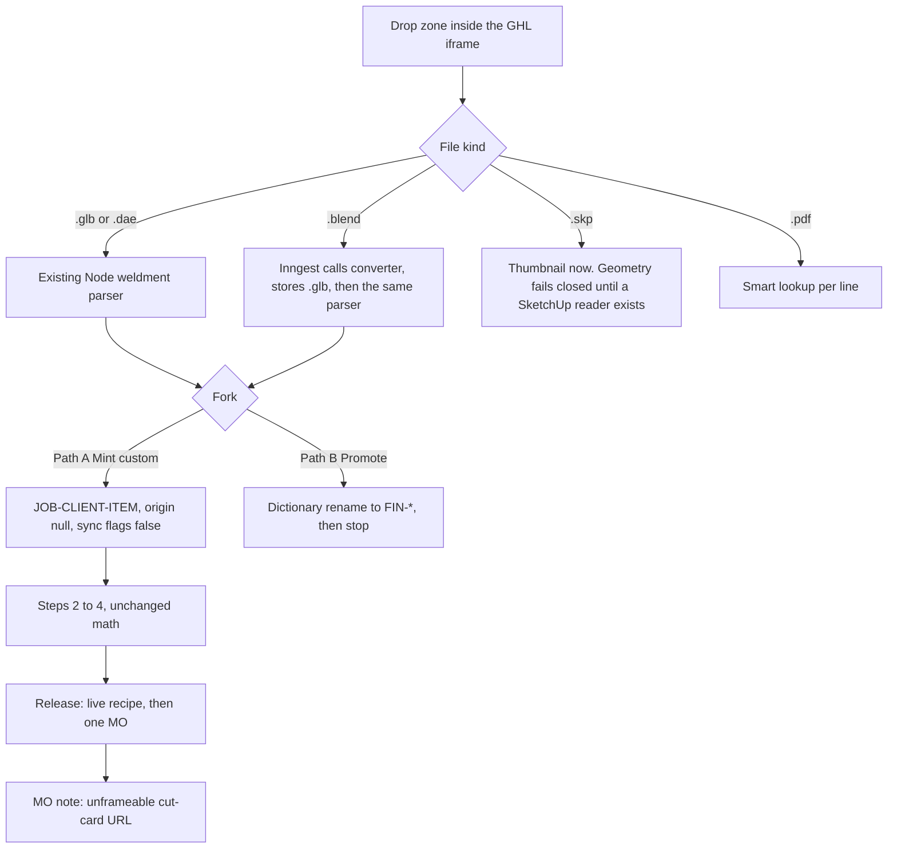

# Phase 5 — The Smart Funnel and Soft UI Overhaul

**Document:** `BUILD_PLAN.md`  
**Authoring phase:** `airlock-5-blueprint`  
**Intent:** Execution blueprint for the Airlock Wizard. File-first intake, a custom-versus-catalog fork, a conversion bridge that does not become a second BOM writer, and the light Mission Control shell. This phase writes no application code.  
**Allowed files this phase:** `.cursor/phase.lock`, `BUILD_PLAN.md`  
**Target test this phase:** `npm run typecheck`  
**Expected blast radius this phase:** `2`  
**Binding architecture:** `docs/MDM_MASTER_BLUEPRINT.md`. Do not implement the V8 transactional bus.  
**Stack (grounded):** Next.js `16.3.2` App Router, Drizzle, Supabase Postgres via `POSTGRES_URL`, Inngest, Tailwind 4. `PROJECT_STATE.md` matches `package.json`.

`.cursor/phase.lock` for this authoring turn is `airlock-5-blueprint`. It replaced `airlock-3-e2e` so this file could be saved. Implementation starts only after the director accepts this file. Each later packet is one fresh chat, one lock written by `node .cursor/skills/phase-lock/scripts/write-lock.mjs`, at most 8 `allowed_files` unless `override_blast_cap` is true, and `expected_blast_radius` equal to the actual diff. `node .cursor/skills/qca/scripts/qca.mjs` is the only certification authority. Exit code 2 stays `DEFECT_REJECTED`.

Antigravity executes the packets below in order.

---

## 0. What the audit found

### 0.1 The wizard is still SKU-first

`/embed/factory-bom` (`src/app/embed/factory-bom/page.tsx`) requires `getPimSession()`, loads every factory product, and renders `AirlockWizard`. The wizard header is a native `<select>` ("Select Product..."). With no `?sku=`, the body says "Please select a product to begin." Steps 1–4 already exist (`Step1Cad`, `Step2Materials`, `Step3Operations`, `Step4Release`). Continue on step 1 calls `step1AllowsContinue`, which demands a `.dae` or `.glb` row. Release on step 4 calls `evaluateAirlock` and renders blocking codes. The Release button has no server action wired in the embed component.

The glass card is already present (`bg-white/80 backdrop-blur-md rounded-2xl`). Buttons are still `blue-600` / `green-600`. Cut tickets are not monospaced. The admin workbench at `/admin/factory-bom` (`FactoryBomWorkbench`, `FactoryProductSidebar`) is a separate surface and stays a sidebar. Phase 5 does not merge those two layouts.

Playwright already deep-links `/embed/factory-bom?sku=` (`tests/e2e/factory-bom-lifecycle.spec.ts`). That query is the contract. Removing the dropdown must not remove it.

### 0.2 Two Katana lanes. Do not merge them

| Lane | Writer | What it creates |
|---|---|---|
| Factory recipe | `syncBOMToKatana` in `src/lib/katana.ts` | Recipes, BOM rows, operations. Drafts in `product_bom_draft` never go out. Live `product_bom` is the only source. |
| Sales-order MTO | `pushApprovedFactoryOrder` in `src/inngest/functions.ts`, `src/server/katana/katana.service.ts` | `POST /manufacturing_order_make_to_order` from a Katana sales-order row after human triage. Gate: `GHL_FACTORY_ORDERS=live`. |

`src/server/actions/*` is the commercial desk (`order-desk`, `dispatch`, `freight`, `logistics`, `inventory`, `generatePdf`). Factory BOM mutations live in `src/app/admin/factory-bom/actions.ts`. Phase 5 does not move them into `src/server/actions` and does not add a third BOM table.

`channel_sync` is one row per `(global_sku, channel)` with `channel` in `katana | woocommerce | clover`, `status` in `pending | success | failed`, and `payload_hash` varchar(64). A matching hash on success is the idempotent skip. Custom jobs must not insert WooCommerce or Clover rows. Absence is the ignore. A `failed` row would invite a retry.

### 0.3 Identity rules that already implement "Custom Build"

`sku_mappings.origin_check` allows `JOB-*` only when `product_origin` is null. `manufactured` requires `FIN-%`. `third_party` requires `3P-%`.

`katanaIsSellableProduct` (`src/lib/katana-product-flags.ts`) is true for a finished good only when the SKU starts with `FIN-`. A `JOB-*` finished good stays unsellable once that helper runs. `katanaProductSyncFlags` still marks a finished good producible.

`sync_to_woo` and `sync_to_clover` default false. `mapFinishedGoodToWooCommerce` returns `{ skip: true, reason: "sync_to_woo_false" }`. Path A keeps both flags false. Path B does not flip them. Catalog promotion renames into `FIN-*` through the existing dictionary rename and `sku_aliases`, sets `product_origin = manufactured`, and stops. MSRP, SEO, images, and `sync_to_woo` stay on the human quarantine in the master catalog. The airlock does not publish Woo or Clover.

### 0.4 CAD acceptance is narrower than the brief

| Surface | Accepts today |
|---|---|
| `CadUploadDropzone` | `.dae` and `.skp` only. Copy says `.skp` is a preview. |
| `AirlockDossierSchema` | `ext` enum `dae \| glb`. |
| `processCadUploadJob` | `.glb` and `.dae` run factory math. `.skp` extracts an embedded PNG, writes `finished_goods_catalog.image_url` when allowed, then fails the row with "thumbnail only." |
| Inngest `process-cad-upload` | Coerces every non-`skp` extension to `dae`, including `glb`. |

`.blend` is absent. There is no Python service in this repo. `docs/AUTOMATED_BOM_EXTRACTION_PLAN.md` rejected Blender headless and `trimesh` as a BOM engine. That rejection stands. Phase 5 may convert bytes to `.glb`. It may not let Python write `product_bom_draft`.

### 0.5 GHL iframe constraints (do not weaken)

`src/proxy.ts` and `src/lib/embed-auth.ts`:

- `/embed/**` sets `Content-Security-Policy: frame-ancestors 'self' https://app.gohighlevel.com https://*.gohighlevel.com https://*.leadconnectorhq.com https://*.highlevel.com https://*.msgsndr.com`, deletes `X-Frame-Options`, and sets `Referrer-Policy: no-referrer`.
- `/` and `/admin/**` are `frame-ancestors 'none'` plus `X-Frame-Options: DENY`. A factory worker's link must use that unframeable policy. It must not live under `/embed`.
- `?embedKey=` is copied to `x-ccpatio-embed-key` and to cookie `ccpatio-embed-auth` (`HttpOnly`, `Secure`, `SameSite=None`, `Partitioned`, `Path=/embed`, 7 days). The comparison is the raw secret, timing-safe. The key never becomes a Supabase user.
- `getPimSession` order: e2e god-mode cookie, then a real Supabase user, then the embed key. The synthetic principal is `ghl-embed@ccpatio.com` (`isEmbedPrincipal`). A human session outranks the iframe. MDM §2.5: the embed key is not `Ops_Manager` or `SuperAdmin`.
- `src/app/embed/layout.tsx` is `h-dvh` and `overflow-hidden`. The funnel scrolls inside the card, not the iframe document.
- File drops must use an `<input type="file">` inside the iframe. No `window.open` to Katana. No login wall for the synthetic principal. Long conversion cannot be a Vercel request. Inngest is the only durable runner. Trigger.dev, node-cron, and a custom DLQ are forbidden.

### 0.6 The Tracy Lapaglia factory order

`Blender/dist/FactoryOrder/SampleFactoryOrder.pdf` is 34 pages, 6,180,610 bytes, PDF 1.4, title `FACTORY ORDER - TRACY LAPAGLIA (08/31/26)`, creator Google. It is a showroom contract, not a mesh.

| Field | What the packet carries |
|---|---|
| Cover | Client `Tracy Lapaglia`. Date `AUG 31, 2026`. Architect in Charge `Paola M`. Designer in Charge `Mia G`. |
| Legal | Approval freezes the rendering. Later changes are a new charge. Waterfall tables are site-assembled and not to be dragged. |
| Structure | Sections `01`–`05`. Each section is a zone, not a SKU. |
| Line identity | Family name plus inches plus qty. Examples: `OCEAN SINGLE CHAISE LOUNGE 36 × 79` qty 2; `BROOKLYN OVERSIZED CHAISE 84 × 42 (CORNER ON RIGHT SIDE)` qty 1; `WATERFALL TABLE 112 × 40 (COUNTER HEIGHT)` qty 1. |
| Frame | Free text, not a profile code: `2 × 1`, `2 × 2`, `3 × 2 on legs`, `1 1/2 × 1 1/2`, `1 1/2 × 3/4`. Color on sampled lines: `BONE METAL`. |
| Stone | `DEKTON COLOR` (`EDORA` or blank), `DEKTON CUT` (`STRAIGHT`, `SHARK NOSE`, or blank). |
| Soft goods | Named cushions and pillows with thickness notes (`Seat: 5"`, `Back: 5" to 10"`) and fabric SKUs `8521-0000` Berenson Tuxedo, `5476-0000` Canvas Heather Beige. Strap note names the tube the straps must fit. |
| Notes | `Corner on right side`. `Counter height`. |

One PDF is many manufacturing identities. The funnel is a job of lines. Packet `airlock-5e-pdf-packet` looks each line up in the Global SKU Dictionary before anyone drops CAD. An exact published catalog SKU snaps on. A custom dimension or configuration is the only line that opens a dropzone. Collapsing Tracy into one `JOB-LAPAGLIA` SKU is a defect.

Text extraction already loses inch marks. The PDF packet is stored and confirmed by the designer. It does not replace CAD math.

---

## 1. Target experience

Showroom staff stay in GoHighLevel. They open `/embed/factory-bom`. Factory staff stay in Katana. They open a read-only cut-card URL from the manufacturing-order note. Nobody crosses logins.

Steps 2–4 stay the airlock. Zod evaluation, dossier hash, quarantine checklist, `GEOM_HYGIENE` manual entry, and `CATALOG_PUBLISH_MODE` dry-run do not get a bypass. Path A adds a job identity in front of step 1 and a manufacturing-order note after a clean release. Path B leaves the airlock and enters the dictionary. It does not call Katana, Woo, or Clover from the fork click.

### 1.1 SKU shape

`JOB-[CLIENT]-[ITEM]` must match the airlock regex `^[A-Z0-9][A-Z0-9-]{2,64}$`.

- Client slug from the opportunity or the PDF cover, `A-Z0-9` only, max 16. `Tracy Lapaglia` becomes `LAPAGLIA`.
- Item slug from the confirmed line name, max 24. `Ocean single chaise` becomes `OCEAN-CHAISE`.
- Collision suffix `-02`, `-03` inside the job.
- Example: `JOB-LAPAGLIA-OCEAN-CHAISE`.
- Insert `sku_mappings` before `cad_uploads`. The CAD table foreign-keys `global_sku`.
- `item_type = finished_good`, `product_origin = null`, `sync_to_woo = false`, `sync_to_clover = false`, `category` from the line family or `Custom`.
- `attributes.custom_build = true`, plus `job_id`, `section`, `line_no`, and the confirmed showroom fields (frame note, frame color, dekton color, dekton cut, cushion notes). Those fields are the ticket header. They are not recipe rows.
- No `finished_goods_catalog` row on Path A. That table is the commerce PIM. The `.skp` thumbnail writer must no-op when the finished-good row is absent.

### 1.2 Job header

New table `custom_build_jobs` (next migration after `0051_numerous_adam_warlock.sql`):

| Column | Role |
|---|---|
| `id` uuid PK | `attributes.job_id` on each line SKU |
| `client_slug` | Stable token in the SKU |
| `display_name` | `Tracy Lapaglia` |
| `ghl_opportunity_id` | Nullable. Unique when present, so one opportunity has one job header. Lines are many. |
| `architect_name`, `designer_name` | From the PDF cover, confirmed |
| `packet_storage_path` | The factory-order PDF in the existing documents bucket |
| `created_by` | Session email, including `ghl-embed@ccpatio.com` |

Do not store the job in `product_intake`, `quarantine_catalog`, or `quarantined_orders`. Those are other lanes.

### 1.3 Release and the factory link

Recipe publish stays `syncBOMToKatana` under `CATALOG_PUBLISH_MODE`. Default remains dry-run.

Manufacturing order is a separate Inngest event `factory.custom_job.released`. It runs only when the dossier parses with zero blocking codes, the recipe publish for that hash has succeeded, and `GHL_FACTORY_ORDERS=live`. `ORDER_PIPELINE_MODE` is not the switch.

- If `order_intake` for that `ghl_opportunity_id` already has a Katana MO id, patch that MO's note with the cut-card URL. Do not create a second MO.
- Otherwise `POST /manufacturing_orders` for the `JOB-*` variant. Do not call `POST /manufacturing_order_make_to_order`. That endpoint requires a sales-order row and would invent a Woo or GHL order.
- Idempotency: `katana_mo_records.external_ref = custom:{globalSku}:{dossierHash}`.
- Katana `is_sellable` stays false via `katanaIsSellableProduct`. `additional_info` carries `custom_build=1` and the cut-card URL. Ingredient notes stay the existing 255-character cut cards. The URL does not go in an ingredient note.
- WooCommerce and Clover publishers are not called. No `channel_sync` row for those channels.
- `syncGhlOpportunity` stays unregistered.

### 1.4 Read-only cut cards

New top-level route `/factory/cut-cards/[token]`.

- Capability URL. HMAC-SHA256 over `sku`, `exp`, and dossier hash, secret `FACTORY_CUT_CARD_SECRET`. Not `GHL_EMBED_SECRET`.
- Page verifies the token and renders the live cut list, the showroom header fields, and the stored `.glb` from a short-lived storage URL created on the server. The token does not contain the storage path.
- No session, no embed key, no release control, no draft edits.
- `src/proxy.ts`: the path is public and unframeable (`frame-ancestors 'none'`, `X-Frame-Options: DENY`, `Referrer-Policy: no-referrer`). It is not added to `PROTECTED_PREFIXES` and not added to the GHL frame allowlist.
- Expired or bad tokens render a single sentence and a 404 status. They do not redirect to login, which would try to frame the login page.

---

## 2. Hybrid conversion

Fast lane and heavy lift share one exit: a `.glb` or `.dae` byte blob in `cad_uploads`, then `processCadUploadJob`. Component-name hygiene, profile snap, and draft rows stay in `src/lib/sketchup-cutlist` and `src/lib/cad-upload/process-job.ts`.

| Lane | Input | Runtime | Then |
|---|---|---|---|
| Fast | `.glb`, `.dae` | Node, existing parsers | Draft BOM |
| Heavy | `.blend` | Inngest step HTTP to the converter | Store sibling `.glb`, re-enter the fast lane |
| SketchUp | `.skp` | Existing PNG scan | Thumbnail when a commerce image row exists. Geometry status `failed` with a stable code `SKP_CONVERT_UNAVAILABLE` |

`trimesh` does not read `.skp` or `.blend`. The converter's job is:

1. `.blend`: Blender `--background` exports glTF. A previous note in `.cursor/plans/catalog_analysis_report_e9b05236.plan.md` says `bpy.context.window` is `None` in background mode. The exporter must not touch `bpy.context.window`.
2. `trimesh` loads that glTF, checks the unit scale is inches, and refuses a mesh with no named weldment nodes. It writes normalized `.glb` bytes. It does not emit cut lists.
3. `.skp`: no reader ships in this packet. The endpoint returns `415` with `SKP_CONVERT_UNAVAILABLE`. The UI shows that sentence and keeps the fast-lane drop. A later packet may add a SketchUp SDK sidecar. It is not hidden inside `trimesh`.

The converter is a separate process. The Next.js app on Vercel only enqueues Inngest. The iframe shows `cad_uploads.status` (`uploaded`, `queued`, `processing`, `draft_ready`, `failed`) by polling the existing snapshot. No new status enum value is required: processing covers the heavy lift.

Fix the Inngest coercion in the fast-lane packet. Today `ext` becomes `dae` whenever it is not `skp`, so a `.glb` drop is sent to the DAE instantiator.

---

## 3. Soft UI

Tokens live in `src/app/admin/factory-bom/factory-bom-ui.ts` and are consumed by the embed. The canvas stays `bg-slate-50 text-slate-800`. Do not switch the factory embed to dark `.pim-glass`.

| Token | Use |
|---|---|
| `glassCard` | The existing floating card, one per step |
| `zinc` type (`text-zinc-500`, `text-zinc-800`) | Secondary labels and ticket headers |
| `slate` | Canvas, hairline borders, fields (`softField` already) |
| Emerald | Success only: proposal banner, release enabled, `statusClass` factory-approved. Replace `bg-green-50` and `bg-green-600` |
| `ticket` | `font-mono text-[12px] tabular-nums text-zinc-800` on cut cards in step 2 |
| Motion | 150ms opacity on the fork. `framer-motion` is already a dependency. One transition. No page-level animation that fights `h-dvh` |

`primaryButton` stays the slate tactile control. Step dots use slate and emerald, not `blue-600`. Checkboxes use the same emerald. Minimum hit target stays 44px. The empty state is the drop zone, not a sentence about the dropdown.

Admin workbench imports the same token file. Packet 5a may change shared class strings. It does not restructure `FactoryBomWorkbench`.

---

## 4. Packets

Each packet lists every file it may create or modify. Deprecated behavior is called out. No packet deletes `FactoryBomWorkbench`, `channel_sync`, `product_intake`, or the SketchUp thumbnail extractor.

### Packet `airlock-5a-ui-shell`

Visual shell on the current four steps. The native `<select>` element is removed. A styled SKU control still writes `?sku=`, so the Playwright deep link is unchanged. Intake routing is unchanged.

| | |
|---|---|
| Intent | Apply the token table in §3 to the embed wizard. |
| Target test | `npm run test:e2e:factory-bom` |
| Blast | 7 |

Modify:

- `src/app/admin/factory-bom/factory-bom-ui.ts`
- `src/app/embed/factory-bom/AirlockWizard.tsx`
- `src/app/embed/factory-bom/page.tsx`
- `src/app/embed/factory-bom/steps/Step1Cad.tsx`
- `src/app/embed/factory-bom/steps/Step2Materials.tsx`
- `src/app/embed/factory-bom/steps/Step3Operations.tsx`
- `src/app/embed/factory-bom/steps/Step4Release.tsx`

Do not modify the Playwright spec unless a role name changed. Button names `Continue` and `Release to Katana` stay.

### Packet `airlock-5b-job-schema`

| | |
|---|---|
| Intent | `custom_build_jobs` and a pure mint function that obeys `origin_check`. |
| Target test | `npx vitest run tests/custom-build-job.test.ts` |
| Blast | 4 |

Create:

- `src/server/factory-bom/mint-custom-job.ts`
- `tests/custom-build-job.test.ts`

Modify:

- `src/server/db/schema.ts`
- `src/server/db/migrations/0052_custom_build_jobs.sql` (Drizzle-generated; number follows `0051`)

Mint is a function, not a Katana call. Tests cover slug rules, the 64-character cap, collision suffix, `product_origin` null, both sync flags false, and rejection of a `FIN-` SKU on Path A.

### Packet `airlock-5b-intake-fork`

| | |
|---|---|
| Intent | Remove the dropdown. File-first zone. Fork UI. `?sku=` still opens an existing airlock. |
| Target test | `npm run test:e2e:factory-bom` |
| Blast | 8 |

Create:

- `src/app/embed/factory-bom/IntakeDropzone.tsx`
- `src/app/embed/factory-bom/FunnelFork.tsx`
- `src/server/factory-bom/promote-to-catalog.ts`

Modify:

- `src/app/embed/factory-bom/AirlockWizard.tsx` — delete the `<select>` and the "Please select a product" branch
- `src/app/embed/factory-bom/page.tsx` — optional `opportunityId`; do not require a SKU to render
- `src/app/admin/factory-bom/actions.ts` — one action, `beginAirlockIntake`, session-gated, calls mint or promote
- `src/app/admin/factory-bom/CadUploadDropzone.tsx` — accept `.glb` and `.dae` on the fast lane; keep `.skp` as thumbnail
- `tests/e2e/factory-bom-lifecycle.spec.ts` — only if the empty state assertion must learn the drop zone. Existing `?sku=` cases stay

`promote-to-catalog.ts` calls the dictionary rename already in `src/app/admin/dictionary/actions.ts`. It sets `attributes.custom_build = false` and `product_origin = manufactured` on the new `FIN-*` key. It does not set `sync_to_woo` or `sync_to_clover`.

Deprecated in this packet: the product `<select>` in `AirlockWizard.tsx`. `listFactoryProducts` remains for step 2 name lookup and for the admin sidebar.

### Packet `airlock-5c-fast-lane`

| | |
|---|---|
| Intent | `.glb` survives Inngest and runs `parseGlbWeldment`. |
| Target test | `npx vitest run tests/dae-weldment.test.ts` plus the CAD unit that covers the event ext |
| Blast | 4 |

Modify:

- `src/inngest/functions.ts` — preserve `glb`, `dae`, and `skp`. Anything else is `NonRetriableError`, not a silent coerce to `dae`.
- `src/lib/cad-upload/index.ts` — event type already includes `glb`; keep it aligned
- `src/lib/cad-upload/process-job.ts` — no behavior change for `.skp` in this packet
- `tests` file that asserts the event mapping (extend the nearest CAD test; do not weaken it)

### Packet `airlock-5c-python-bridge`

| | |
|---|---|
| Intent | `.blend` becomes `.glb` outside Vercel. `.skp` geometry fails closed with `SKP_CONVERT_UNAVAILABLE`. Python writes no draft rows. |
| Target test | `npx vitest run tests/cad-convert-client.test.ts` |
| Blast | 6 |

Create:

- `services/cad-convert/app.py` — HTTP convert, Blender background for `.blend`, trimesh inch check, `415` for `.skp`
- `services/cad-convert/export_blend.py` — no `bpy.context.window` access
- `src/lib/cad-upload/convert-client.ts` — server-only fetch, timeout, sha256 of the returned glb
- `tests/cad-convert-client.test.ts`

Modify:

- `src/lib/cad-upload/process-job.ts` — on `blend`, download, convert, store `.glb`, then call the existing glb branch. On `skp`, keep the thumbnail path and set `SKP_CONVERT_UNAVAILABLE` instead of the current prose-only failure.
- `src/inngest/functions.ts` — allow `blend` through to the job. Concurrency key stays `globalSku`.

The dropzone loading state is the existing `processing` status inside `IntakeDropzone`. If that UI does not fit this blast cap, it is a follow-up packet `airlock-5c-loading`, files limited to `IntakeDropzone.tsx` and `page.tsx`.

Deprecated: treating a `.skp` geometry request as a successful CAD upload. Thumbnail extraction stays.

### Packet `airlock-5d-factory-link`

| | |
|---|---|
| Intent | After a clean custom release, one MO note points at an unframeable cut-card page. |
| Target test | `npx vitest run tests/factory-cut-card-token.test.ts` |
| Blast | 7 |

Create:

- `src/server/factory-bom/cut-card-token.ts`
- `src/app/factory/cut-cards/[token]/page.tsx`
- `src/server/factory-bom/release-custom-build.ts`
- `tests/factory-cut-card-token.test.ts`

Modify:

- `src/proxy.ts` — public unframeable `/factory/cut-cards`
- `src/app/embed/factory-bom/steps/Step4Release.tsx` — wire the disabled button to the existing approve-then-publish action, then enqueue `factory.custom_job.released` only for `attributes.custom_build`
- `src/inngest/functions.ts` — register the function next to `pushApprovedFactoryOrder`. Do not fold it into that function.

Idempotency and the "existing order_intake MO" branch in §1.3 are inside `release-custom-build.ts`. Dry-run returns a receipt and writes no `katana_mo_records` row.

### Packet `airlock-5e-pdf-packet`

Smart lookup. A factory-order PDF is not a text prefill. Each parsed line is queried against the Global SKU Dictionary before a designer is asked for geometry.

| | |
|---|---|
| Intent | Match each factory-order line to a published catalog SKU, or flag it as a custom line and open CAD only on that row. |
| Target test | `npx vitest run tests/factory-order-packet.test.ts` |
| Blast | 6 |

Lookup, in `src/server/factory-bom/match-factory-order-line.ts`. Pure. No Katana HTTP.

1. Parse the line into family, width inches, depth inches, quantity, and a configuration note. `OCEAN SINGLE CHAISE LOUNGE 36 × 79` is family `OCEAN SINGLE CHAISE LOUNGE`, 36 by 79, configuration empty. `BROOKLYN OVERSIZED CHAISE 84 × 42 (CORNER ON RIGHT SIDE)` keeps the parenthetical as configuration.
2. Normalize case, inch marks, and `x` / `×` / `*`. Compare to `sku_mappings.original_name` plus the finished-good width and depth already stored for that SKU.
3. **Exact match.** One active catalog SKU has the same family and the same width and depth, configuration is empty, and `deriveFactoryReadiness` for that SKU is `published` (live `product_bom`, `channel_sync` Katana `success`, and a `factory_bom_katana_recipes` audit row). The line snaps to that `global_sku`. The row shows an emerald **BOM Certified** badge. No `cad_uploads` row. No `JOB-*` mint. The certified recipe is reused as-is.
4. **Custom exception.** Any of these is a custom line: no SKU with that family and those exact inches, a parenthetical configuration, or a family hit whose published dimensions differ. The row shows **Custom Line**. Step 1's dropzone renders on that row only. Confirming the geometry mints `JOB-[CLIENT]-[ITEM]` under the Path A rules in §1.1. Sibling rows stay closed.
5. A family-name hit is not enough. `OCEAN SINGLE CHAISE LOUNGE` at a catalog size other than 36 × 79 does not steal the Tracy 36 × 79 line.
6. The lookup does not write `product_bom_draft`, does not call Katana, and does not flip `sync_to_woo` or `sync_to_clover`. Gate 3 still ends catalog promotion at a `FIN-*` row with those flags false. Gate 1 still fail-closes raw `.skp`. Gate 2 still uses `POST /manufacturing_orders`, not make-to-order.

Create:

- `src/server/factory-bom/parse-factory-order-packet.ts` — best-effort text fields from §0.6. Unreadable inch marks stay blank for the designer to type.
- `src/server/factory-bom/match-factory-order-line.ts` — the exact-versus-custom decision above.
- `src/app/embed/factory-bom/PacketLines.tsx` — one row per line. Emerald **BOM Certified**, or **Custom Line** with that row's dropzone.
- `tests/factory-order-packet.test.ts` — Tracy strings, not the 6 MB PDF. One fixture SKU published at 36 × 79 snaps the Ocean chaise. The Brooklyn oversized line with a corner note stays custom even if a Brooklyn family exists.

Modify:

- `src/app/embed/factory-bom/IntakeDropzone.tsx` — `.pdf` takes the packet path
- `src/app/admin/factory-bom/actions.ts` — store the PDF on `custom_build_jobs.packet_storage_path` and persist each line's snapped SKU or custom flag

The sample file `Blender/dist/FactoryOrder/SampleFactoryOrder.pdf` stays a local artifact. It is not imported by the app.

---

## 5. Explicit non-goals

- No V8 transactional bus, no Woo order webhook, no `syncGhlOpportunity`.
- No second recipe writer in Python, trimesh, or Blender.
- No `channel_sync` channel named `custom`.
- No `sync_to_woo` or `sync_to_clover` flip on either fork path.
- No manufacturing order from the fork click. The MO waits for a zero-blocking dossier and both live gates.
- No factory route under `/embed`, and no embed key on `/factory/cut-cards`.
- No rewrite of `/admin/factory-bom` into the funnel.
- No change to `tests/e2e/factory-bom-lifecycle.spec.ts` except the empty-state case in packet `airlock-5b-intake-fork`.

---

## 6. Director gates

Confirmed by the director. These three gates are locked.

1. **SketchUp geometry** stays fail-closed (`SKP_CONVERT_UNAVAILABLE`) until a reader that is not `trimesh` is chosen. Packet `airlock-5c-python-bridge` ships the `.blend` path anyway.
2. **Custom MO** is `POST /manufacturing_orders` plus the existing recipe publisher. It is not `manufacturing_order_make_to_order` and it is not a second sales order.
3. **Catalog promotion** ends at a `FIN-*` dictionary row with commerce flags still false. Packet `airlock-5e-pdf-packet` may snap a line onto a SKU that is already published. It may not publish a new commerce SKU.
