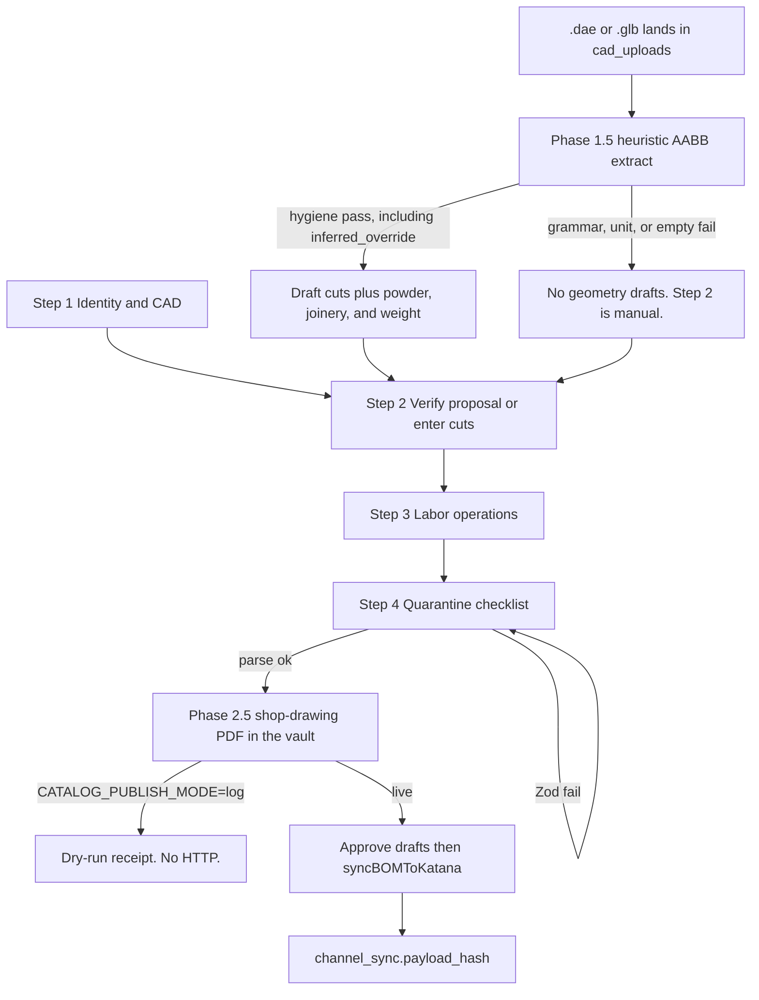

# 3D File to Katana Pipeline — Airlock Blueprint

**Document:** `KATANA_PIPELINE_BUILD_PLAN.md`  
**Authoring phase:** `step-5.2-katana-blueprint-auto-correct`  
**Intent:** Update the Katana blueprint to replace AABB hygiene failures with algorithmic auto-correction, and inject advanced manufacturing heuristic features. This phase writes no application code.  
**Allowed files this phase:** `.cursor/phase.lock`, `KATANA_PIPELINE_BUILD_PLAN.md`, `.cursor/session-stamp.json`, `.cursor/logs/qca-last.log`  
**Target test this phase:** `npm run typecheck`  
**Expected blast radius this phase:** `4` (tolerance `0`)  
**Binding architecture:** `docs/MDM_MASTER_BLUEPRINT.md`. Do not implement the V8 transactional bus.  
**Stack (grounded):** Next.js `16.3.2` App Router, Drizzle, Supabase Postgres via `POSTGRES_URL`, Inngest, Tailwind 4. `PROJECT_STATE.md` matches `package.json`.

Antigravity executes later phases only. Each later phase is one fresh chat, one `phase.lock` written by `node .cursor/skills/phase-lock/scripts/write-lock.mjs`, at most 8 `allowed_files` unless `override_blast_cap` is true, and `expected_blast_radius` equal to the actual diff. `node .cursor/skills/qca/scripts/qca.mjs` is the only certification authority.

---

## 0. Context and architecture

### 0.1 Airlock philosophy

The pipeline is a zero-trust factory airlock. A 3D model becomes a Katana recipe only after every required identity field, cut list, floor routing, and labor time is complete and validated. Draft rows never leave the airlock. Live hub rows are the only input to Katana. Katana HTTP is a later, explicit release, and a dry-run mode must still refuse a dirty dossier.

Two lanes already exist. Do not merge them.

| Lane | Owner | Katana surface | Airlock |
|---|---|---|---|
| Factory manufacturing (this blueprint) | `syncBOMToKatana` in `src/lib/katana.ts`, aliased `publishHubManufacturingToKatana` | `POST /bom_rows/batch/create` with `POST /recipes` fallback, then `POST /product_operation_rows` | `product_bom_draft`, `item_operations_draft`, `recipe_estimates_draft`, `cad_uploads` |
| Sales-order MTO | `src/server/katana/katana.service.ts` | `POST /manufacturing_orders` | Woo order Zod plus `sku_mappings` IDs. Out of scope here |

`src/server/katana/katana.service.ts` must not gain recipe or operation writers. Catalog publish stays behind `canMutateKatanaCatalog()` in `src/server/pipeline/catalog-mode.ts` (`CATALOG_PUBLISH_MODE=live`, or `KATANA_E2E_MIRROR=true`). Default mode is dry-run. `ORDER_PIPELINE_MODE` gates sales orders only. Do not use it as the factory switch.

### 0.2 What the scan found (2026-10-08)

The airlock tables and the Katana writer already exist. The gap is a hard completeness gate and a minimalist stepper. Today Approve copies drafts to live tables when any draft line exists (`approveDraftRecipe` in `src/app/admin/factory-bom/actions.ts`). Publish then calls `syncBOMToKatana`. Neither step requires a finished cut list, a locked resource on every operation, a note that fits Katana's 255-character cap, or a signed quarantine checklist.

`/embed/factory-bom` (`src/app/embed/factory-bom/page.tsx`) is a server page. It requires a PIM session, loads `listFactoryProducts()`, optionally resolves a linked finished good from `?sku=`, and renders `FactoryBomWorkbench` with `embedded`. The workbench is a dense sidebar plus cards (`CadUploadDropzone`, assembly tree, material rows, `BomOperationsPanel`, `EstimatePanel`, `RecipeHeader`). It is not a four-step wizard. Visual tokens live in `src/app/admin/factory-bom/factory-bom-ui.ts`: canvas `bg-slate-50`, solid white `card`, tactile `primaryButton`. Floating glass already used on the master-catalog embed is `bg-white/80 backdrop-blur-md rounded-2xl border border-white/40 shadow-[0_8px_30px_rgb(0,0,0,0.06)]`. The wizard uses that glass card on the factory canvas. It does not switch the factory embed to dark `.pim-glass`.

`docs/FACTORY_BOM_KATANA_UX_PLAN.md` is stale relative to code. `src/lib/factory-routing/resources.ts` already locks `KATANA_RESOURCES` and `STANDARD_TRACKS` for `aluminum_frame`, `cushion`, `final_assembly`, and `dekton_top`. `channel_sync.payload_hash` already exists. `CATALOG_PUBLISH_MODE` already exists. Later packets follow the code, not that older plan's "still open" rows.

### 0.3 Tables that already form the airlock

Do not create a second BOM, a second operations table, or a second CAD table.

| Table | Role | Katana? |
|---|---|---|
| `sku_mappings` | Hub identity. `global_sku` PK. `item_type` enum `raw_material \| sub_assembly \| finished_good \| service`. `katana_variant_id`, `katana_material_id`. `attributes` jsonb. | ID lookup only. Never invent IDs. |
| `finished_goods_catalog` | Commerce PIM for the finished good. PK/FK `global_sku`. Dims, MSRP, `na_fields`. | Not a recipe. |
| `raw_materials_catalog` | RM name, category, UOM, cost. `sku` FK to `sku_mappings`. | Material upsert input. |
| `cad_uploads` | One row per drop. `ext`, `status` enum `uploaded \| queued \| processing \| draft_ready \| failed`, `storage_path`, `sha256`, thumbnail fields. `.skp` is a thumbnail, never CAD. Newest `.dae` is the model. | Never posted. |
| `product_bom_draft` | Quarantine recipe lines. Unique `(parent_sku, child_sku)`. `cut_list` jsonb. `status` `draft_pending_review \| edited \| factory_approved`. `source` `heuristic \| manager \| katana_import \| sketchup_geometry \| secondary_extract`. | Must not be read by `syncBOMToKatana`. |
| `item_operations_draft` | Quarantine routings. `work_center`, `sequence`, `setup_time_mins`, `run_time_mins`. | Same. Live copy is `item_operations`. |
| `recipe_estimates_draft` | Weight, DIM, labor, packaging, manager `overrides`. PK `root_sku`. | Copied only on Approve when the operator opts in. |
| `product_bom` | Live recipe. Same shape as the draft, including `cut_list`. Unique `(parent_sku, child_sku)`. Quantity pushed is `quantity * scrap_factor`. | Sole BOM source for `loadLiveHubRecipeLines` and `syncBOMToKatana`. |
| `item_operations` | Live routing. Unique `(item_sku, work_center, sequence)`. Minutes stored. Katana receives seconds. | Sole ops source. |
| `channel_sync` | One row per `(global_sku, channel)`. Katana status `pending \| success \| failed`. `payload_hash` varchar(64). `external_id`, `last_error`. | Idempotency record. Not a payload store. |
| `pim_audit_log` | `action = factory_bom_katana_recipes` is the "recipe published" bit in `deriveFactoryReadiness`. | Audit only. |
| `katana_mo_records` | MO idempotency for the order lane. | Do not reuse for catalog recipes. |
| `product_intake` | SketchUp commerce quarantine (`quarantined \| approved \| rejected \| superseded`). Nested BOM sits in `raw_payload`. | Commerce lane. Factory CAD uses `product_bom_draft`, not this table. |
| `quarantine_catalog` | Sheet-description commerce quarantine. | Not factory cut sheets. |
| `quarantined_orders` | Woo/GHL order Zod failures. | Not this pipeline. |

Readiness today (`src/server/factory-bom/derive-readiness.ts`) is a display reduction: Published, Factory approved, Draft pending, Missing CAD. It is not the airlock. A SKU can show Factory approved with an empty cut list and still be one click from Katana.

### 0.4 Target stepper

One floating glass card. One step visible. Forward navigation is allowed only when that step's Zod slice passes. The Release control exists only on step 4 and stays disabled until `AirlockDossierSchema` parses and every blocking code is absent.



Related parents already used by readiness stay the tree the wizard walks: the hub SKU, `subAssemblySku(sku, "FRAME")`, `subAssemblySku(sku, "CUSH")`, and legacy `SA-{stem}-FRAME` / `SA-{stem}-CUSH`.

### 0.5 Non-goals

- Do not implement the V8 transactional bus.
- Do not POST `/manufacturing_orders` from this pipeline.
- Do not auto-Approve or auto-publish from a CAD upload or an Inngest extract.
- Do not invent `variant_id` or `material_id`.
- Do not add a parallel recipe writer beside `syncBOMToKatana`.
- Do not store cut geometry on `product_intake` or `quarantine_catalog`.
- Do not replace `KATANA_RESOURCES` with topology marketing labels.
- Do not silently truncate a Katana note inside the airlock. Truncation in `truncateKatanaBomRowNotes` remains a transport helper. The gate blocks when the resolved note exceeds 255 characters.
- Do not treat `.skp` as CAD. `.dae` and `.glb` are the only geometry inputs.
- Do not write `product_bom_draft` rows when component-name grammar, the inch unit, or an empty structural set fails hygiene. A stated length that disagrees with the AABB is not that failure. Manual Step 2 entry remains the fallback for a real hygiene miss.
- Do not call `generateTearSheetPdf` (`src/server/pim/tear-sheet.ts`) for the factory shop drawing. That function is the commerce leave-behind.
- Do not render the shop drawing from `UNKNOWN` profiles, from an unverified proposal, or from a hygiene-fail upload.
- Do not put an expiring signed URL in the Katana note. The note carries the stable vault `storage_path`.

---

## 1. Phase 1 — Airlock data layer

**Outcome:** Staging stays on the tables in §0.3. One new dossier row records the gate verdict. Drafts remain invisible to `explodeBomTree` and to `syncBOMToKatana`.

### 1.1 Reuse rules

- `product_bom_draft.cut_list` and `product_bom.cut_list` remain the cut-sheet artifact. Shape is `CutLine` in `src/lib/sketchup-cutlist/types.ts`: `role`, `profile` (`SQ2-16 \| RT1.5x0.75-16 \| FB0.125x1.5 \| SQ2x1-16 \| UNKNOWN`), `lengthIn`, `endA` (`45 \| 90 \| null`), `endB` (`45 \| 90 \| null`), `qtyEa`, `lengthConvention` (`long_point \| short_point \| square \| unknown`), `sourceName`, `confidence`, `drawingPartNumber`.
- `cad_uploads.storage_path` remains the file pointer. Do not copy bytes into jsonb.
- Approve continues to upsert live rows on `(parent_sku, child_sku)` and `(item_sku, work_center, sequence)`. The new gate runs before that upsert.
- `channel_sync.payload_hash` remains the Katana idempotency fingerprint. Do not add a second hash column on the dossier except as a copy of the preimage at release time.

### 1.2 New table `factory_release_gate`

Add this Drizzle table in `src/server/db/schema.ts` and a SQL migration. Do not drop or rename existing tables.

| Column | Type | Rule |
|---|---|---|
| `root_sku` | `text` PK, FK `sku_mappings.global_sku` `on update cascade` `on delete cascade` | Uppercase hub SKU. |
| `status` | enum `factory_release_status`: `quarantined`, `released` | Insert default `quarantined`. |
| `blocking_codes` | `jsonb` not null default `[]` | Array of the codes in §2.4. Empty array is necessary but not sufficient. |
| `checklist` | `jsonb` not null default `{}` | The four-step attestation object in §2.3. |
| `dossier_hash` | `varchar(64)` null | SHA-256 hex of the canonical dossier JSON. Null while quarantined. |
| `released_by` | `text` null | PIM operator email. Required when `status = released`. |
| `released_at` | `timestamp` null | Required when `status = released`. |
| `created_at` / `updated_at` | `timestamp` not null default now | |

Check constraint `factory_release_gate_released_attested`:

```sql
(status = 'quarantined')
OR (
  status = 'released'
  AND released_by IS NOT NULL
  AND released_at IS NOT NULL
  AND dossier_hash IS NOT NULL
  AND jsonb_array_length(blocking_codes) = 0
)
```

Index: none beyond the primary key. One row per root SKU.

Any draft mutation (`upsertDraftBomLine`, `deleteDraftBomLine`, `upsertDraftOperation`, `deleteDraftOperation`, `applyStandardTrack`, a new CAD ingest that writes drafts) sets `status` back to `quarantined`, clears `dossier_hash`, `released_by`, and `released_at`, and rewrites `blocking_codes` from the pure evaluator. A released row must not survive a draft edit.

### 1.3 Packet map for Phase 1

Blast cap is 8. Split.

**Packet `airlock-1-schema`**

- `src/server/db/schema.ts`
- the new migration SQL under the existing Drizzle migration directory (one file)
- `src/server/factory-bom/release-gate.ts` (insert/reset helpers only, no Katana HTTP)
- `.cursor/phase.lock`
- Target test: `npm run typecheck`
- Expected blast radius: 4 including the lock, or 3 if the lock is already the packet and the diff is the three product files. Count the lock if it changes in the same diff. Set `expected_blast_radius` to the actual file count before QCA.

**Packet `airlock-1-invalidate`**

- `src/app/admin/factory-bom/actions.ts` (call the reset helper from the draft mutators listed in §1.2)
- `src/server/factory-bom/release-gate.ts` only if the helper signature must change
- Target test: `npm run typecheck`
- Do not call `syncBOMToKatana` from these mutators.

---

## 1.5 Phase 1.5 — Heuristic extraction engine

**Outcome:** A `.dae` or `.glb` that lands on `cad_uploads` starts the existing background job. The job reads component bounding boxes and, only when every structural name passes the hygiene grammar, writes a cut-list proposal with `source = sketchup_geometry`. A lengthless name takes its cut length from the bounding box (`inferred`). A stated length that agrees within `0.25` in stays `stated`. A stated length that disagrees does not fail the file: the box wins and the cut is marked `inferred_override`. On that same pass the job proposes powder pounds from surface area, aluminum weight from metal volume, and weld-wire plus fastener quantities from intersected nodes. A grammar, unit, or empty-set miss writes no geometry drafts. The operator then types the cut list in Step 2. The job never Approves and never calls Katana.

### 1.5.1 Trigger

Reuse `cad/model.uploaded` and `processCadUploadJob` in `src/lib/cad-upload/process-job.ts`. Do not add a second event or a second CAD table.

| Ext | Job |
|---|---|
| `dae` | Existing Collada path (`parseDaeWeldment` / `instantiateDraftsFromDae`), after the hygiene gate below. |
| `glb` | New sibling parser. Same hygiene gate, same draft writer. |
| `skp` | Unchanged. Thumbnail only. Status `failed` with the existing thumbnail message. Not geometry. |

`cad_uploads.ext` is already free text. Extend `CadUploadedEventData.ext` from `"dae" \| "skp"` to `"dae" \| "glb" \| "skp"`. The dropzone accepts `.dae` and `.glb` as geometry. One in-flight job per SKU stays the concurrency rule.

On entry the job sets `cad_uploads.status = processing`. A new CAD ingest that writes drafts still resets `factory_release_gate` as required in §1.2.

### 1.5.2 Naming hygiene

SketchUp component definition names are the contract. The long axis of the axis-aligned bounding box is the cut length. The name supplies role, material, profile, and optional ends. Example that passes, and the name designers should use: `FRM-ALUM-2X2`.

```text
COMPONENT := ROLE "-" MATERIAL "-" PROFILE [ "-" LENGTH ] [ "-" ENDA "-" ENDB ]
ROLE        := FRM | LEG | ARM | SEAT | BACK | TOP | RAIL
MATERIAL    := ALUM | STL | DEK | FAB | HW
PROFILE     := 2X2 | 2X1 | 15X075 | FB125
LENGTH      := inches, digits with an optional decimal
ENDA, ENDB  := 45 | 90
```

Names are matched in full, uppercase, against that grammar. No extra tokens.

**Lengthless standard.** The supported name is `ROLE-MATERIAL-PROFILE`, for example `FRM-ALUM-2X2`. Designers do not put inches in the component name. The parser owns the cut length. A `LENGTH` token remains legal for models that already carry one. It is not required, and it is not the preferred form. New shop standards and the Step 2 empty-state copy say so.

**Trust the Math.** Compare a stated `LENGTH` to the AABB long axis. Tolerance is `0.25` in.

| Name | Length written to the cut | Ends | `confidence` |
|---|---|---|---|
| `FRM-ALUM-2X2` | Long axis of the world AABB, inches, two decimal places | `90` / `90` | `inferred` |
| `FRM-ALUM-2X2-34` and the AABB long axis is within `0.25` in of `34` | `34` from the name | `90` / `90` | `stated` |
| `FRM-ALUM-2X2-34` and the AABB long axis differs by more than `0.25` in (example: the box is `40`) | The AABB length. The name's `34` is stored as `statedLengthIn` and is not the cut | `90` / `90` | `inferred_override` |
| `FRM-ALUM-2X2-34-45-45` | Same length rule as the row above | `45` / `45` | `stated` when the box agrees, otherwise `inferred_override` |

A disagreement does not fail hygiene. The human text loses. The box is the cut list. `sourceName` stays the original component name so the discarded token is still visible.

| Profile token | `CutLine.profile` | Raw-material SKU |
|---|---|---|
| `2X2` | `SQ2-16` | `RM-MET-2X2-TUBING` |
| `2X1` | `SQ2x1-16` | `RM-MET-2X1-TUBING` |
| `15X075` | `RT1.5x0.75-16` | `RM-MET-15X075-TUBING` |
| `FB125` | `FB0.125x1.5` | `RM-MET-FLATBAR` |

`role` is the `ROLE` token. `lengthConvention` is `long_point` when either end is `45`, otherwise `square`. `drawingPartNumber` uses `formatDrawingPartNumber`.

A node is structural when its name starts with a `ROLE` token or contains a `PROFILE` token. Decorative nodes that are neither are ignored. The file fails hygiene when any structural node fails the grammar, when the unit is not inches, or when zero structural nodes pass. Failure is atomic. A stated length that disagrees with the AABB is not a failure.

### 1.5.3 Bounding boxes

Persist one snapshot on the upload row. Do not copy mesh bytes into jsonb.

Add nullable `geometry_snapshot jsonb` on `cad_uploads`:

```ts
{
  unit: "inch"
  hygiene: "pass" | "fail"
  failures: Array<{ name: string; reason: string }>
  components: Array<{
    name: string
    role: string
    material: string
    profile: "SQ2-16" | "SQ2x1-16" | "RT1.5x0.75-16" | "FB0.125x1.5"
    lengthIn: number
    statedLengthIn: number | null
    lengthSource: "aabb" | "stated"
    confidence: "stated" | "inferred" | "inferred_override"
    aabb: { min: [number, number, number]; max: [number, number, number] }
  }>
  derived: {
    powder: { surfaceFt2: number; pounds: number; method: "coverage" | "lb_per_ft"; drafted: boolean }
    weight: { aluminumLbs: number; aluminumPlfLbs: number | null; excludedNames: string[] }
    joinery: { jointCount: number; weldWireLb: number; fastenerEa: number; capEa: number }
  } | null
}
```

`.dae` keeps the Cheerio AABB already in `parseDaeWeldment`. `.glb` reads glTF nodes and `POSITION` accessors, applies the node world matrix, and emits the same snapshot shape. Both parsers share the hygiene module. A new pure module `src/lib/sketchup-cutlist/component-hygiene.ts` owns the grammar. It does not import Katana.

### 1.5.4 What the job writes

| Result | `cad_uploads.status` | `error_message` | Drafts |
|---|---|---|---|
| Hygiene pass and critic accepts | `draft_ready` | null | Replace this tree's `source = sketchup_geometry` rows only, including the derived powder, wire, fastener, and cap lines from §1.5.6. Leave `source = manager` rows. `status` on new rows is `draft_pending_review`. Merge `recipe_estimates_draft` weight fields from §1.5.6. Do not write `overrides.weightLbs`. |
| Hygiene fail | `failed` | prefix `GEOM_HYGIENE:` plus the failing names | Write nothing. Do not delete `source = manager` rows. Delete stale `source = sketchup_geometry` rows for this root so a previous pass cannot leak into a failed file. |
| Other parse or critic failure | `failed` | existing critic text | Write nothing. Do not delete manager or prior geometry rows. |

`GEOM_HYGIENE` is the upload error prefix. It is not a release blocking code. A failed extract is a legal path into manual Step 2.

### 1.5.5 Packet map for Phase 1.5

**Packet `airlock-1.5-hygiene`**

- `src/lib/sketchup-cutlist/component-hygiene.ts`
- `src/lib/sketchup-cutlist/parse-glb-weldment.ts`
- `src/lib/sketchup-cutlist/derived-heuristics.ts` (pure powder, volume weight, and joint counts from §1.5.6; no Katana import)
- `tests/component-hygiene.test.ts` (pass `FRM-ALUM-2X2` as `inferred`, stated length within `0.25` in stays `stated`, stated length `34` against an AABB of `40` passes as `inferred_override` with cut length `40`, decorative node ignored, one bad structural name fails the file)
- `tests/derived-heuristics.test.ts` (surface area to powder pounds, volume × `0.098` aluminum weight, one real intersection counts as one joint, parallel overlapping boxes count as zero joints)
- `.cursor/phase.lock`
- Target test: `npm run typecheck`

**Packet `airlock-1.5-ingest`**

- `src/lib/cad-upload/process-job.ts`
- `src/lib/cad-upload/index.ts` (`ext` union)
- `src/server/db/schema.ts` (`geometry_snapshot` only)
- one SQL migration for that column
- `.cursor/phase.lock`
- Target test: `npm run typecheck`
- Depends on `airlock-1-invalidate` so a proposal write resets the gate, and on `airlock-1.5-hygiene` for the grammar, the auto-correct, and `derived-heuristics.ts`.
- On a hygiene pass, call that module and write the §1.5.6 draft lines and the estimate merge. Do not add a second event.
- Do not call `syncBOMToKatana`.

### 1.5.6 Derived proposals (powder, weight, joinery)

These run only after hygiene passes, including a pass that contains `inferred_override` cuts. They read the cut lengths from §1.5.2 (the AABB length when the name lost). They do not invent `variant_id` or `material_id`. They do not add a blocking code. They do not Approve. A missing live child SKU leaves the numbers on `geometry_snapshot.derived` and writes no draft line for that material. `derived.drafted` on the powder object is false in that case. The same rule applies to wire, fasteners, and caps.

Parent SKU for every derived line is the same frame parent the cut lines already use. `source = sketchup_geometry`. `status = draft_pending_review`. `scrapFactor = 1`. `cut_list` is empty because these rows are not metal profiles. `AirlockRecipeLineSchema` already requires that. Quantity is rounded to 4 decimal places, the same rounding `computeWeight` uses. A rounded quantity of `0` writes no line.

**Surface area and powder.** For each passing metal component, developed area in square feet is `perimeterIn × lengthIn × qtyEa / 144`. `perimeterIn` comes from `material_physics_factors.perimeter_in` for that raw-material SKU and profile. When that cell is null, use the outside perimeter:

| Profile | Outside perimeter (in) |
|---|---|
| `SQ2-16` | `8` |
| `SQ2x1-16` | `6` |
| `RT1.5x0.75-16` | `4.5` |
| `FB0.125x1.5` | `3.25` |

Powder pounds are `surfaceFt2 / coverageSqftPerLb`. Coverage comes from the powder row on `material_physics_factors`. When that cell is null, coverage is `4`, the default `computeWeight` already uses. When perimeter cannot be resolved, pounds fall back to `powderPoundsFromTubingFeet` (`POWDER_LB_PER_TUBE_FT = 0.08` in `src/lib/level2-bom.ts`) and `method` is `lb_per_ft`. Otherwise `method` is `coverage`. The draft child is `resolveLiveIngredient(RM_POWDER_COAT, POWDER_LIVE_FALLBACKS)` (`RM-POWDER-COAT`, then `RM-PWD-GENERIC`, then `PWD-BLACK`). Unit of measure is `lb`.

**Dynamic weight.** For each passing component whose `MATERIAL` is `ALUM`, mass is cross-section area × AABB `lengthIn` × quantity × `ALUMINUM_DENSITY_LB_PER_IN3`. That constant is `0.098` (6061 shop density, pounds per cubic inch) and it lives in `derived-heuristics.ts`. Wall thickness for the three tube profiles is `0.060` in, which is the 16-gauge already encoded by the `-16` profile suffix. Flat bar is solid.

| Profile | Area (in²) | How |
|---|---|---|
| `SQ2-16` | `0.4656` | `2×2 − 1.88×1.88` |
| `SQ2x1-16` | `0.3456` | `2×1 − 1.88×0.88` |
| `RT1.5x0.75-16` | `0.2556` | `1.5×0.75 − 1.38×0.63` |
| `FB0.125x1.5` | `0.1875` | `0.125×1.5` solid |

The sum is `recipe_estimates_draft.est_weight_lbs` and `weight_breakdown.aluminum`. Merge `aluminum` into the existing breakdown object. Do not clear foam, fabric, powder, or hardware keys another extractor owns. Do not write `overrides.weightLbs`. If `overrides.weightLbs` is already a finite number, leave `est_weight_lbs` unchanged and still refresh `weight_breakdown.aluminum` so Step 2 can show the geometry figure beside the manager lock. Components whose material is not `ALUM` are omitted from the sum and listed on `excludedNames`. When `weight_plf` or `sku_mappings.attributes.weight_plf` is a positive number for that metal SKU, also store `weight_breakdown.aluminum_plf` as feet × that factor. The geometry job's `est_weight_lbs` stays the volume figure. Step 2 shows both when `aluminum_plf` is present. This job does not copy the estimate onto the live recipe.

**Hardware and joinery.** Expand each structural metal AABB (`ALUM` or `STL`) by `0.125` in on every side. An unordered pair is one joint when the expanded boxes intersect and the long axes are not parallel. Parallel overlapping boxes are one member split in the model, not a joint. Count each pair once. This count replaces the `nPieces * 1.5` guess in `src/lib/secondary-extraction/labor.ts` when `geometry_snapshot.derived.joinery` is present. The ingest packet passes that `jointCount`, and the weld inches below, into the existing labor estimator. It does not invent a second labor table.

Weld-wire pounds are the sum over joints of the smaller profile's outside perimeter (the table above) times `TIG_WIRE_LB_PER_IN`. That constant is `0.0003`: the cross-section of 1/16 in 4043 wire times `0.098`. Preferred child SKU is `RM-MET-TIG-WIRE`, unit `lb`, resolved with the same live-SKU rule as powder and with no fallback list. Fasteners: a joint of one `LEG` and one `FRM` or `RAIL`, with both recorded ends `90`, proposes quantity `2`, unit `ea`, preferred child `RM-HW-BOLT`, no fallback list. Caps: a `LEG` endpoint that participates in zero joints proposes quantity `1` through the existing `RM_PLASTIC_CAP_2X2` and `CAP_LIVE_FALLBACKS`. Caps are part of this joinery pass, not a fourth extractor.

`est_labor_minutes` may be refreshed from the existing secondary-extraction labor function using the counted joints. The refresh follows the same manager-lock rule as weight: do not overwrite `overrides` labor minutes when the operator has already set them.

---

## 2. Phase 2 — Validation engine

**Outcome:** One Zod module is the definition of "100% complete." UI, Approve, and Publish all call it. A dossier that fails Zod never updates `product_bom` and never calls Katana.

New module: `src/server/factory-bom/airlock.schema.ts`. It imports `KATANA_RESOURCES`, `isKatanaResource`, `normalizeKatanaResource`, `UNIT_OPTIONS` from `factory-bom-ui.ts`, and the cut-list unions from `src/lib/sketchup-cutlist/types.ts`. It does not import `src/lib/katana.ts` (keep the schema free of HTTP).

### 2.1 Cut line — 100% complete

`AirlockCutLineSchema` is stricter than the stored jsonb. Stored rows may contain `UNKNOWN` while the operator is still editing. The release parse rejects them.

| Field | Pass | Block code |
|---|---|---|
| `role` | non-empty string, max 80 | `CUT_ROLE` |
| `profile` | one of `SQ2-16`, `RT1.5x0.75-16`, `FB0.125x1.5`, `SQ2x1-16` | `CUT_PROFILE` |
| `lengthIn` | finite number `> 0` and `<= 10000` | `CUT_LENGTH` |
| `endA`, `endB` | `45` or `90` | `CUT_ENDS` |
| `qtyEa` | integer `>= 1` and `<= 10000` | `CUT_QTY` |
| `lengthConvention` | `long_point`, `short_point`, or `square` | `CUT_CONVENTION` |
| `sourceName` | non-empty, max 240 | `CUT_SOURCE` |
| `confidence` | `stated`, `inferred`, or `inferred_override` | `CUT_CONFIDENCE` |
| `drawingPartNumber` | non-empty string, max 64, or the parent line is not a metal profile | `CUT_PART` |

Metal detection: child `sku_mappings.category` matches `/metal|aluminum|tube|flat bar/i`, or `profile` is present and not `UNKNOWN`, or UOM is `in` or `ft` and `cut_list.length > 0`. If the line is metal, `cut_list` must be a non-empty array of `AirlockCutLineSchema`. Non-metal lines must have `cut_list` length `0`. A fabric, powder, or hardware row with leftover cuts is `CUT_UNEXPECTED`.

Resolved Katana note is `resolveKatanaIngredientNotes({ notes, cutList })`. If that string, trimmed, has length `> 255`, block `NOTE_TOO_LONG`. Do not call `truncateKatanaBomRowNotes` inside the gate.

### 2.2 Recipe row and operation row

`AirlockRecipeLineSchema`:

| Field | Pass | Block code |
|---|---|---|
| `parentSku` | matches `/^[A-Z0-9][A-Z0-9-]{2,64}$/` and exists | `PARENT_SKU` |
| `childSku` | same pattern, exists, `is_active`, not equal to parent | `CHILD_SKU` |
| child `item_type` | `raw_material` or `sub_assembly` | `CHILD_TYPE` |
| `quantity` | finite, `> 0`, `<= 1000000` | `QTY` |
| `scrapFactor` | finite, `> 0`, `<= 10` | `SCRAP` |
| `unitOfMeasure` | member of `UNIT_OPTIONS` (`ea`, `ft`, `yd`, `lb`, `lbs`, `boardft`, `slab`, `sqft`, `in`) | `UOM` |
| `status` | any review status while editing; release requires the gate row, not each line, to be the thing that flips | — |

Effective quantity is `quantity * scrapFactor`. It must be finite and `> 0` (`EFFECTIVE_QTY`).

`AirlockOperationSchema`:

| Field | Pass | Block code |
|---|---|---|
| `itemSku` | producible parent in the walked tree | `OP_SKU` |
| `workCenter` | `isKatanaResource(normalizeKatanaResource(workCenter))` and the stored value equals the normalized value | `OP_RESOURCE` |
| `sequence` | integer `>= 10` and `<= 9990`, unique per `(itemSku, sequence)` | `OP_SEQUENCE` |
| times | at least one of `setupTimeMins` or `runTimeMins` is finite and `> 0`; both `>= 0`; each `<= 100000` | `OP_TIME` |

Seconds sent to Katana are `Math.round(minutes * 60)` and must be an integer `>= 1` for each emitted setup or process row (`OP_SECONDS`). A zero-second row is omitted and, if that omission leaves the operation with no Katana row, the operation fails `OP_TIME`.

Track coverage, using `STANDARD_TRACKS`:

| Node | Required track | Block code |
|---|---|---|
| SKU ending `-FRAME` or item name/category indicating frame | `aluminum_frame` resources and sequences must be a superset of that track | `TRACK_FRAME` |
| SKU ending `-CUSH` | superset of `cushion` | `TRACK_CUSH` |
| root `item_type = finished_good` | superset of `final_assembly` | `TRACK_FIN` |
| Dekton / stone producible sub-assembly | superset of `dekton_top` | `TRACK_STONE` |

Superset means every track step's `resource` appears at that step's `sequence`. Extra manager steps at unused sequences are allowed. A legacy alias that normalizes to the right resource still fails `OP_RESOURCE` until the stored `work_center` is the canonical string. `applyStandardTrack` is the writer that makes this true. The gate does not rewrite rows.

### 2.3 Dossier object

`AirlockDossierSchema` is a `z.object` with `.strict()`:

```ts
{
  rootSku: string
  identity: {
    itemType: "finished_good" | "sub_assembly"
    originalName: string
    katanaVariantId: number | null
    cad: {
      uploadId: string
      ext: "dae" | "glb"
      status: "draft_ready" | "failed"
      sha256: string
      hygiene: "pass" | "fail"
    } | null
    cadWaived: false
  }
  nodes: Array<{
    sku: string
    itemType: "finished_good" | "sub_assembly"
    lines: AirlockRecipeLine[]
    operations: AirlockOperation[]
  }>
  checklist: {
    identityConfirmed: literal true
    cutListConfirmed: literal true
    operationsConfirmed: literal true
    quarantineConfirmed: literal true
  }
}
```

`cad` is required when any draft line on the tree has `source = sketchup_geometry`. A hygiene pass requires `cad.hygiene = "pass"`, `cad.status = "draft_ready"`, and `cad.ext` of `dae` or `glb`. A hygiene miss is a legal manual dossier: `cad.hygiene = "fail"`, `cad.status = "failed"`, and every line `source = manager`. Mixing `sketchup_geometry` lines with `hygiene = "fail"` is `GEOM_MIXED`. When every line is `source = manager` and the operator has not dropped a `.dae` or `.glb`, `cad` may be null only if a future packet adds an explicit waiver field. This blueprint sets `cadWaived` to the literal `false`. A missing geometry file blocks `CAD_REQUIRED` for `sketchup_geometry` and for any tree that has zero manager-sourced lines. `.skp` never satisfies `CAD_REQUIRED`. `sha256` must be 64 hex characters (`CAD_HASH`).

Graph rules evaluated after the object parse, in `evaluateAirlock(dossier)`:

1. Walk `nodes` depth-first. A repeated SKU is `CYCLE`.
2. Every `sub_assembly` child has its own node in `nodes` (`CHILD_NODE_MISSING`).
3. Every node has at least one line (`NODE_EMPTY_BOM`) and at least one operation that survives the seconds rule (`NODE_EMPTY_OPS`).
4. No duplicate `(parent, child)` (`DUP_EDGE`). The database unique index is the backstop, not the only check.
5. `katanaVariantId` may be null at validation time. Publish (§4) blocks `KATANA_VARIANT_UNRESOLVED` if `ensureKatanaVariantForSku` cannot return an id. The Zod schema does not invent one.

### 2.4 Katana payload schemas

These describe the HTTP body after ID substitution. They are the contract `syncBOMToKatana` must already satisfy. A later packet adds a pure builder that returns these objects and unit-tests them without network.

`KatanaRecipeReplaceSchema` (fallback `POST /recipes`):

```ts
z.object({
  keep_current_rows: z.literal(false),
  rows: z.array(z.object({
    product_variant_id: z.number().int().positive(),
    ingredient_variant_id: z.number().int().positive(),
    quantity: z.number().positive().finite(),
    notes: z.string().min(1).max(255).optional(),
    product_sku: z.string().min(1),
    ingredient_sku: z.string().min(1),
  })).min(1),
}).strict()
```

`KatanaBomRowSchema` (`POST /bom_rows/batch/create`, matching `toKatanaBomRowBody`):

```ts
z.object({
  product_item_id: z.number().int().positive(),
  product_variant_id: z.number().int().positive(),
  ingredient_variant_id: z.number().int().positive(),
  quantity: z.number().positive().finite(),
  notes: z.string().min(1).max(255).nullable(),
}).strict()
```

Batch length per request is `<= 250` (`KATANA_BOM_ROWS_MAX_BATCH`). An empty `rows` array is illegal. Katana's recipe endpoint cannot clear a BOM (`rows.minItems = 1`). Clearing stays `DELETE /bom_rows/{id}`.

`KatanaOperationReplaceSchema` (`POST /product_operation_rows`):

```ts
z.object({
  keep_current_rows: z.literal(false),
  rows: z.array(z.object({
    product_variant_id: z.number().int().positive(),
    operation_name: z.string().min(1).max(255),
    resource_name: z.enum(KATANA_RESOURCES),
    type: z.enum(["setup", "process"]),
    planned_time_parameter: z.number().int().positive(),
  }).strict()).min(1),
}).strict()
```

Setup row name is `` `${resolveKatanaOperationName(workCenter)} Setup` `` with `type: "setup"`. Process row name is `resolveKatanaOperationName(workCenter)` with `type: "process"`. `resource_name` is the normalized work center. `planned_time_parameter` is seconds.

### 2.5 Blocking-code list (closed)

The release path returns only these codes. UI maps each code to one sentence. Do not invent ad hoc strings in the action. `evaluateAirlock` emits the editing codes. `SHOP_DRAWING_REQUIRED`, `SHOP_NOTE`, `KATANA_VARIANT_UNRESOLVED`, and `CATALOG_DRY_RUN` are publish results.

`CAD_REQUIRED`, `CAD_HASH`, `GEOM_MIXED`, `PARENT_SKU`, `CHILD_SKU`, `CHILD_TYPE`, `CHILD_NODE_MISSING`, `QTY`, `SCRAP`, `EFFECTIVE_QTY`, `UOM`, `CUT_ROLE`, `CUT_PROFILE`, `CUT_LENGTH`, `CUT_ENDS`, `CUT_QTY`, `CUT_CONVENTION`, `CUT_SOURCE`, `CUT_CONFIDENCE`, `CUT_PART`, `CUT_UNEXPECTED`, `NOTE_TOO_LONG`, `OP_SKU`, `OP_RESOURCE`, `OP_SEQUENCE`, `OP_TIME`, `OP_SECONDS`, `TRACK_FRAME`, `TRACK_CUSH`, `TRACK_FIN`, `TRACK_STONE`, `CYCLE`, `NODE_EMPTY_BOM`, `NODE_EMPTY_OPS`, `DUP_EDGE`, `CHECKLIST`, `SHOP_DRAWING_REQUIRED`, `SHOP_NOTE`, `KATANA_VARIANT_UNRESOLVED`, `CATALOG_DRY_RUN`.

`CATALOG_DRY_RUN` is not a dossier defect. It is a publish result when `canMutateKatanaCatalog()` is false. The button copy says the dossier is complete and the environment is in log mode.

`CHECKLIST` fires when any of the four checklist literals is not `true`.

`GEOM_MIXED` fires when `cad.hygiene = "fail"` and any line still has `source = sketchup_geometry`. `GEOM_HYGIENE` stays an `error_message` prefix on `cad_uploads`. It is not a member of this list, so a manual cut list can still release.

`SHOP_DRAWING_REQUIRED` and `SHOP_NOTE` are publish codes, same class as `KATANA_VARIANT_UNRESOLVED`. They are absent while the operator is still editing. `evaluateAirlock` does not emit them. The release action returns them from §4.1 steps 4 and 5.

### 2.6 Definition of 100% complete

A file is 100% complete if and only if:

1. `AirlockDossierSchema.safeParse` succeeds.
2. `evaluateAirlock` returns `blocking_codes: []`.
3. `factory_release_gate.status` is `released` for that `dossier_hash`.
4. Live `product_bom` and `item_operations` for the walked parents equal the approved draft snapshot (same parent/child pairs, same effective quantities, same resolved notes, same operations).
5. Every producible node's `sku_mappings.katana_variant_id` is a positive integer, or `ensureKatanaVariantForSku` returns one before HTTP.
6. Every ingredient variant resolves through `findVariantBySku` / `ensureKatanaVariantForSku` to a positive `ingredient_variant_id`.
7. Phase 2.5 has written one current `shop_drawing` PDF whose bytes are a pure function of the verified cut list and `geometry_snapshot`, and the root recipe note either carries that vault path inside 255 characters or the release returns `SHOP_NOTE`.

Steps 4–7 are publish preconditions. Steps 1–3 are the quarantine release. CAD upload, heuristic extract, draft edit, and estimate recalculation do not perform steps 4–7.

### 2.7 Packet map for Phase 2

**Packet `airlock-2-zod`**

- `src/server/factory-bom/airlock.schema.ts`
- `src/server/factory-bom/evaluate-airlock.ts`
- `tests/airlock-dossier.test.ts` (pure fixtures: empty cut, `UNKNOWN` profile, 256-char note, legacy resource string, missing cushion track, cycle, happy frame+cush+fin, hygiene-fail manual dossier, `GEOM_MIXED`, shop-note overflow, `inferred_override` passes `CUT_CONFIDENCE`, any other confidence string fails it)
- `.cursor/phase.lock`
- Target test: `npx vitest run tests/airlock-dossier.test.ts` and the lock's `target_test` must be that command. `npm run typecheck` still runs inside QCA because the auditor always runs `typecheck` and `lint`.

**Packet `airlock-2-wire-approve`**

- `src/app/admin/factory-bom/actions.ts` (`approveDraftRecipe` returns `{ ok: false, error, blockingCodes }` when evaluation fails; no live upsert on failure)
- `src/server/factory-bom/evaluate-airlock.ts` only if a type export is missing
- Target test: `npm run typecheck`

---

## 2.5 Phase 2.5 — Shop-drawing PDF

**Outcome:** After the dossier parses and `evaluateAirlock` returns no editing codes, the release action renders one 2D shop drawing from the verified cut list and the stored bounding boxes, saves it in the asset vault, and carries the stable path on the Katana payload. The commerce tear sheet is a different document and a different function.

### 2.5.1 When it runs

The renderer runs inside the release action, after step 3 of §4.1 and before the dossier hash is frozen. It does not run on upload, on Step 2 Continue, or from Inngest. Inputs are the database cut lines that just parsed and `cad_uploads.geometry_snapshot` for that `cad.uploadId`. A hygiene-fail manual dossier still renders: the cut list is the verified manager lines, and the snapshot's `components` array may be empty. The drawing then prints the cut schedule without stick callouts. A missing snapshot on a `hygiene = "pass"` dossier returns `SHOP_DRAWING_REQUIRED` and does not POST.

The PDF is a pure function of root SKU, `original_name`, cad `sha256`, sorted cut lines, and the snapshot. Same inputs produce the same bytes and the same SHA-256.

### 2.5.2 Page

New module `src/server/factory-bom/shop-drawing.ts`. Engine is `jsPDF`, the same library `src/server/quotes/estimate-pdf.ts` uses. Do not import `src/server/pim/tear-sheet.ts`.

The single page contains:

- Title block: root SKU, original name, source ext (`dae` or `glb`), source `sha256`, generated-at timestamp omitted from the bytes so the hash stays stable.
- Cut schedule, one row per verified `AirlockCutLine`: drawing part number, role, profile, length (in), end A, end B, qty, convention, source name. Length is the airlock length, which is the AABB when `confidence` is `inferred_override`. The source-name cell keeps the original component name, including a discarded `LENGTH` token.
- Orthographic stick callouts for each `geometry_snapshot.components` entry: the long axis only, labeled with `name` and `lengthIn`. No mesh render, no texture, no camera.

`UNKNOWN` cannot appear here because the release parse already rejected it.

### 2.5.3 Vault

Add `shop_drawing` to `product_asset_kind`. Bucket `product-documents`, content type `application/pdf`, one current revision per `(global_sku, kind)`, same unique indexes as the other non-gallery kinds. Write through the existing asset-vault helper. Do not store the PDF on `cad_uploads` or inside `cut_list`.

Returned value:

```ts
{
  assetId: string
  storagePath: string
  sha256: string
}
```

`storagePath` is the stable vault key. Do not mint a signed URL for the Katana body. A later UI may sign a download URL for the operator. That signature is not part of the payload or the dossier hash. If the current `shop_drawing` row already stores this `sha256`, keep that row and do not bump `revision`.

### 2.5.4 Katana link

Append the path to the finished-good root node's first recipe-row note only:

```text
{resolved cut note} | Shop:{storagePath}
```

If the resolved cut note is empty, the note is `Shop:{storagePath}`. Trimmed length must be `<= 255`. Longer than 255 returns `SHOP_NOTE` and does not call `truncateKatanaBomRowNotes`. The hash in §4.2 includes `shopDrawingSha256`. A second release with the same cuts and the same snapshot reuses the same bytes and the same hash.

`KatanaRecipeReplaceSchema` and `KatanaBomRowSchema` stay as written in §2.4. The shop path rides inside `notes`. No new HTTP field.

### 2.5.5 Packet map for Phase 2.5

**Packet `airlock-2.5-shop-pdf`**

- `src/server/factory-bom/shop-drawing.ts`
- `src/server/db/schema.ts` (enum value `shop_drawing` only)
- `src/server/pim/asset-vault.ts` (kind map entry only: pdf, `product-documents`, one current)
- one SQL migration for the enum value
- `tests/shop-drawing.test.ts` (pure: two identical inputs, one byte match; `UNKNOWN` is not a renderer concern and is not fed in)
- `.cursor/phase.lock`
- Target test: `npm run typecheck`
- Depends on `airlock-2-zod` for the cut-line contract.
- The publish action does not change in this packet. §4.1 is the caller.

---

## 3. Phase 3 — Minimalist UI

**Outcome:** `/embed/factory-bom` presents four steps inside one glass card. The existing workbench components remain the data editors inside the steps. This phase does not add a second client cache or a second save path.

### 3.1 Shell

Route stays `src/app/embed/factory-bom/page.tsx`. It remains `dynamic = "force-dynamic"`, still calls `getPimSession()`, and still returns the access-key empty state when the session is missing.

Replace the direct `FactoryBomWorkbench` mount with a server-fed wizard:

- File: `src/app/embed/factory-bom/AirlockWizard.tsx` (`"use client"`).
- Props: `products`, `initialSku`, `linkedProduct`, and a server-loaded `AirlockSnapshot` for the selected SKU (draft lines, draft ops, latest DAE, gate row).
- Layout: full-height factory canvas (`canvas` from `factory-bom-ui.ts`). Centered column `max-w-3xl`. One card:

```text
bg-white/80 backdrop-blur-md rounded-2xl border border-white/40
shadow-[0_8px_30px_rgb(0,0,0,0.06)] p-6 sm:p-8
```

- Header: SKU, 4 dots, step title. No sidebar. No metric tiles.
- Footer: Back (ghost tactile button) and Continue (`primaryButton`). Both `min-h-11` (44px). Continue is `disabled` when the step slice fails.
- Selected SKU is the `sku` search param, updated with `router.replace`, not a second store.
- Admin `/admin/factory-bom` keeps `FactoryBomWorkbench` until a later packet. Do not fork save actions.

### 3.2 Step 1 — Identity / CAD

Shows:

- Global SKU (read-only once selected), `original_name`, `item_type` badge (`FG` / `FRAME` / `CUSH` / `SA` via `assemblyBadge`).
- Existing `CadUploadDropzone` for `.dae` and `.glb`. Status pill from `cad_uploads.status`. A `GEOM_HYGIENE:` failure lists the rejected component names and still allows Continue into manual Step 2. Any other `failed` upload shows `error_message` and does not enable Continue.
- Thumbnail from `thumbnail_url` when `thumbnail_source` is `skp_embed` or `operator_upload`. The thumbnail is not a CAD success.
- Continue enabled when `itemType` is `finished_good` or `sub_assembly`, `originalName` is non-empty, and either the latest `.dae` or `.glb` is `draft_ready`, or that upload failed with prefix `GEOM_HYGIENE:`. A tree with no geometry file stays blocked (§2.3, `cadWaived` is false).

Empty state: "Drop a .dae or .glb to start the airlock." No tables.

### 3.3 Step 2 — Raw materials

One assembly at a time (finished good, then each sub-assembly). Reuse `BomMaterialRow` and the material combobox. Each row shows SKU, quantity, UOM select bound to `UNIT_OPTIONS`, scrap factor, and cut cards when the line is metal.

The step is not a blank slate.

| Latest geometry upload | What the operator sees |
|---|---|
| `draft_ready` and at least one line with `source = sketchup_geometry` | Banner: "Proposed from SketchUp geometry. Verify each cut." When any cut is `inferred_override`, the banner adds: "A component name stated a length the bounding box does not match. The cut uses the box." Cut cards are pre-populated from those drafts. Profile, length, ends, qty, and convention are filled. The operator edits any card that is wrong and saves. Source stays `sketchup_geometry`. |
| `failed` with `error_message` prefix `GEOM_HYGIENE:` | Banner: "Component names do not match the lengthless standard FRM-ALUM-2X2. Enter the cut list manually." Cut cards start empty. Saves use `source = manager`. A stated-length disagreement is not this banner. |
| No geometry file | Continue never arrived here (§3.2). |

Cut card fields, and no others: qty, length (in), end A, end B, convention (`LP` / `SP` / `SQ`), profile. Hide JSON. Manager note is a single one-line field. Saving calls existing `upsertDraftBomLine`. Deleting calls `deleteDraftBomLine`.

On a `draft_ready` proposal, under the cut cards, show the §1.5.6 rows that were actually drafted: powder in `lb`, weld wire in `lb`, fasteners in `ea`, and caps in `ea`. Each is a normal material row. The operator may edit or delete it before Continue. Aluminum weight is the existing `recipe_estimates_draft.est_weight_lbs` figure, captioned with the volume method (`0.098` lb/in³). It is not a recipe line. When `weight_breakdown.aluminum_plf` is present, show that number beside it. A derived material that was not drafted because the child SKU is absent shows the snapshot quantity and does not add a blocking code.

Continue enabled when every node on the tree passes `AirlockRecipeLineSchema` and metal cut rules. `inferred_override` is a legal confidence, so a trust-the-math cut does not block Continue by itself. A pre-populated proposal that still contains `UNKNOWN` does not pass. Show the blocking code's sentence under the card. Do not enable Continue because a draft status happens to be `edited` or because the heuristic job returned `draft_ready`.

### 3.4 Step 3 — Labor operations

Reuse `BomOperationsPanel` with the resource `<select>` limited to `KATANA_RESOURCES`. Sequence, setup minutes, run minutes. Buttons: Apply aluminum frame track, Apply cushion track, Apply final assembly, Apply Dekton track. They call existing `applyStandardTrack` with `trackId` `aluminum_frame | cushion | final_assembly | dekton_top` and `mode` `replace` or `fill_gaps`.

Continue enabled when §2.2 operations and track coverage pass for every producible node.

### 3.5 Step 4 — Quarantine checklist

Four checkboxes, default off, each `min-h-11`:

1. Identity and CAD match the model I intend to release.
2. Every cut list is complete and the tablet note fits.
3. Every labor step uses a locked workstation and a time.
4. I understand nothing is sent to Katana until this checklist is complete.

The primary control label is **Release to Katana**. It is disabled until all four are checked and `evaluateAirlock` returns no codes. On click, the server action re-reads the database, re-runs the evaluator, and ignores the client payload except the four booleans and the SKU. If the environment is not live, the card shows the dry-run receipt from §4.5 and does not claim a Katana write.

Blocking codes render as a short list above the button. A code clears only after a successful save of the underlying field and a re-evaluation.

### 3.6 Packet map for Phase 3

Keep each packet inside the blast cap. Shared UI tokens stay imported from `factory-bom-ui.ts`. Do not edit `globals.css` unless a packet's allow-list names it.

**Packet `airlock-3-shell`:** `page.tsx`, `AirlockWizard.tsx`, snapshot loader `src/server/factory-bom/load-airlock-snapshot.ts`, `.cursor/phase.lock`.

**Packet `airlock-3-steps`:** step components under `src/app/embed/factory-bom/steps/` (four files) plus the wizard if the props change. Step 2 implements the proposal banner and the hygiene-fail manual fallback from §3.3. If that exceeds 8 with the lock, split steps 1–2 and steps 3–4.

**Packet `airlock-3-e2e`:** `tests/e2e/factory-bom-lifecycle.spec.ts` gains a quarantine assertion that Release stays disabled with an empty cut list, plus a proposal assertion that a `sketchup_geometry` fixture renders pre-filled cut cards and a `GEOM_HYGIENE` fixture renders the manual banner. Do not weaken existing assertions. Target test remains the factory-bom Playwright script only inside a packet whose lock says so. This blueprint phase does not run Playwright.

Browser verification for any packet that changes the wizard: open `/embed/factory-bom` with a valid access key, walk all four steps, confirm Release stays disabled on an incomplete fixture, and confirm the admin factory-bom route still loads.

---

## 4. Phase 4 — Katana sync

**Outcome:** Release builds one canonical payload, hashes it, and either no-ops, dry-runs, or calls the existing writer once. Retries with the same hash do not create a second recipe.

### 4.1 Preconditions inside `publishApprovedRecipeToKatana`

Order is fixed:

1. `requireSession()`. Missing session returns `{ ok: false }` and writes nothing.
2. Load drafts, CAD, estimates, and `factory_release_gate` from Postgres. Do not trust the client dossier.
3. `evaluateAirlock`. It does not emit `SHOP_DRAWING_REQUIRED` or `SHOP_NOTE`. On any code it does return, respond `{ ok: false, blockingCodes }` and do not upsert live rows.
4. Render the shop drawing (§2.5). If the current `shop_drawing` row already has this byte hash, keep it. Otherwise write one vault revision. Failure to write returns `SHOP_DRAWING_REQUIRED` and does not upsert live rows.
5. Build the root note with the ` | Shop:{storagePath}` suffix. If the trimmed note exceeds 255 characters, return `SHOP_NOTE` and do not upsert live rows.
6. Compute the dossier hash, including `shopDrawingSha256`. A null stored `dossier_hash` means the row is still quarantined and is not a mismatch. A non-null stored hash that differs returns `blockingCodes: ["CHECKLIST"]` after resetting the gate to `quarantined` (the draft changed under the operator).
7. Upsert `product_bom` and `item_operations` exactly as `approveDraftRecipe` does today, including `formatKatanaIngredientNote` when the manager note is empty.
8. Resolve variant IDs. A null that `ensureKatanaVariantForSku` cannot fill returns `KATANA_VARIANT_UNRESOLVED` and does not POST. The function may create the Katana product or material only when `canMutateKatanaCatalog()` is true. In log mode, skip HTTP and return the dry-run receipt. The vault write from step 4 still stands.
9. Build bodies with the existing functions. Do not hand-roll a third JSON shape.
10. If `channel_sync` for `(rootSku, "katana")` has `status = success` and `payload_hash` equal to the new hash, return `{ ok: true, idempotent: true }` and do not POST.
11. POST through `syncBOMToKatana(rootSku)` only.
12. On success, set `channel_sync.status = success`, `payload_hash`, `external_id` to the root variant id, clear `last_error`, and insert `pim_audit_log` action `factory_bom_katana_recipes`. On `KatanaApiError`, set `status = failed`, store `last_error`, leave the gate `released` (the dossier is still valid; the spoke failed), and return the error string. Do not catch-and-swallow.

`revalidatePath` the embed factory-bom path and the admin factory-bom path after a successful live write or a failed spoke write so the UI cannot show a cached success.

### 4.2 Payload construction (already implemented — do not fork)

For each producible node, children that are `sub_assembly` sync first (`syncNode`). A repeated SKU throws `BOM cycle detected`.

Recipe row fields written by `syncBOMToKatana`:

| HTTP field | Source |
|---|---|
| `product_variant_id` | parent `sku_mappings.katana_variant_id` after ensure |
| `ingredient_variant_id` | `resolveIngredientVariant(childSku).id` |
| `quantity` | `Number(quantity) * scrapFactor` where scrap `<= 0` or non-finite becomes a hard error in the airlock (the writer today coerces bad scrap to `1`; the gate must not let that row through) |
| `notes` | `resolveKatanaIngredientNotes` or, if that is empty, `unit_of_measure`. The finished-good root's first row then appends ` \| Shop:{storagePath}` (§2.5.4). |
| `product_sku` / `ingredient_sku` | hub SKUs, diagnostic, not the Katana key |

Path selection (`src/lib/katana-bom-rows.ts`):

- `KATANA_USE_BOM_ROWS` unset or any value other than `false|0|off|no` → `POST /bom_rows/batch/create`.
- Before create: `GET /bom_rows?product_variant_id=` and `DELETE /bom_rows/{id}` for that variant. `404` on GET means an empty set.
- Body uses `product_item_id` from the parent variant's `product_id`. Missing `product_item_id` is a 422-class failure and may fall back.
- Fallback `POST /recipes` with `{ keep_current_rows: false, rows }` only when `shouldFallbackKatanaBomRows(status)` is true (`404`, `405`, `410`, `422`, `501`).
- `401` and `403` propagate. No fallback.
- Chunk size 250.

Operation rows, same node, after the recipe POST:

| Condition | Body row |
|---|---|
| setup seconds `> 0` | `operation_name = "{name} Setup"`, `type = "setup"`, `planned_time_parameter = seconds`, `resource_name = normalized work center` |
| run seconds `> 0` | `operation_name = name`, `type = "process"`, same resource and seconds |
| both zero | omit |

POST `{ keep_current_rows: false, rows }` to `/product_operation_rows` when there is at least one row and mutations are allowed.

Idempotency-Key header on recipe batch calls: `factory-bom:{ROOT_SKU}:{dossier_hash}`. The hash is SHA-256 of canonical JSON with sorted keys: root SKU, each node's SKU, lines sorted by child SKU, operations sorted by sequence, resolved notes, effective quantities as fixed 4-decimal strings, resource names, setup seconds, run seconds, and `shopDrawingSha256`. Checklist booleans are not part of the hash. Operator email is not part of the hash. The signed download URL is not part of the hash.

### 4.3 Dry-run receipt

When `canMutateKatanaCatalog()` is false, `syncBOMToKatana` already returns `dryRun: true` and counts rows without HTTP. The wizard prints:

- mode label from `catalogPublishModeLabel()`
- node count, recipe row count, operation row count
- the dossier hash
- the sentence: "Nothing was sent to Katana."

`channel_sync` stays untouched in dry-run so a later live release is not mistaken for a prior success.

### 4.4 Failure modes the UI must surface

| Failure | Operator sees | Retry |
|---|---|---|
| Zod / blocking codes | Checklist list, Release disabled | Edit the step that owns the code |
| `SHOP_DRAWING_REQUIRED` | "Shop drawing was not saved to the vault." | Release again. No HTTP until the PDF row exists |
| `SHOP_NOTE` | "The shop-drawing path does not fit in the Katana note." | Shorten the root cut note. Do not truncate |
| `KATANA_VARIANT_UNRESOLVED` | "This SKU has no Katana variant yet." | Release again after the ensure path can resolve it |
| `401` / `403` | "Katana refused the credential." No recipe fallback | Fix the token. Same hash retries |
| `422` after fallback also fails | `last_error` text | Fix the field. Hash changes if the dossier changes |
| Network throw | structured error, `channel_sync.status = failed` | Same hash is safe to retry because replace-style POST uses `keep_current_rows: false` and bom-row replace deletes then creates |
| Success + same hash | "Already in Katana." | No HTTP |

### 4.5 Packet map for Phase 4

**Packet `airlock-4-publish-gate`**

- `src/app/admin/factory-bom/actions.ts` (`publishApprovedRecipeToKatana` and the shared approve path)
- `src/lib/katana.ts` only for the idempotency key and the "do not coerce scrap" hard error when called from the airlock. Keep the change inside `syncBOMToKatana`. Do not edit `katana.service.ts`.
- `src/server/factory-bom/dossier-hash.ts`
- `src/server/factory-bom/shop-drawing.ts` only if the release action needs a type export that `airlock-2.5-shop-pdf` did not add
- `.cursor/phase.lock`
- Target test: `npm run typecheck`

**Packet `airlock-4-channel-sync`**

- the `channel_sync` update in the publish action
- a focused unit test that a matching `payload_hash` skips the writer (inject a fake fetch or test the pure skip predicate)
- Target test: `npm run typecheck`

If `src/lib/katana.ts` and the action and the hash helper and a test exceed a comfortable review, keep Katana edits in their own packet and have the action call a new exported `releaseFactoryBomToKatana(rootSku)` that lives next to `syncBOMToKatana` and immediately delegates to it after the hash check.

### 4.6 Done when

A root SKU with a `draft_ready` DAE or GLB, a complete metal cut list, locked resources on frame, cushion, and final assembly, four checked attestations, a current `shop_drawing` vault row, and `CATALOG_PUBLISH_MODE=log` produces a dry-run receipt and zero Katana HTTP. The same dossier with `CATALOG_PUBLISH_MODE=live` results in one `syncBOMToKatana` pass whose root note contains `Shop:{storagePath}`, a `channel_sync` success row whose `payload_hash` matches the dossier including `shopDrawingSha256`, and an audit row `factory_bom_katana_recipes`. A second click does not POST. Clearing one cut length returns the gate to `quarantined` and disables Release. A file whose structural names fail the lengthless `FRM-ALUM-2X2` grammar leaves Step 2 on manual entry and still releases once that manual list parses. A file whose stated length disagrees with the AABB still proposes cuts at `inferred_override`, plus the derived powder, weight, and joinery rows, and those rows release only after they parse. `npm run qa:lifecycle` is the acceptance run for the packet that touches the publish path, executed by that packet's author, not by this blueprint phase.

---

## 5. Execution order

| Order | Packet id | Depends on | Application code |
|---|---|---|---|
| 0 | `step-5.1-katana-blueprint-expansion` | `step-5-katana-blueprint-generation` | None. Prior edition of this document. |
| 0a | `step-5.2-katana-blueprint-auto-correct` | 0 | None. This document. Trust the Math, lengthless names, and §1.5.6 derived proposals. |
| 1 | `airlock-1-schema` | 0a | `factory_release_gate` |
| 2 | `airlock-1-invalidate` | 1 | Draft edits reset the gate |
| 3 | `airlock-1.5-hygiene` | 1 | Naming grammar, AABB auto-correct, and pure derived heuristics. No drafts. |
| 4 | `airlock-1.5-ingest` | 2 and 3 | Proposal drafts including powder and joinery, weight merge, or `GEOM_HYGIENE` and no geometry rows |
| 5 | `airlock-2-zod` | 1 | Zod + evaluator + unit fixtures, including `GEOM_MIXED` and shop-note fixtures |
| 6 | `airlock-2-wire-approve` | 5 | Approve refuses incomplete dossiers |
| 7 | `airlock-2.5-shop-pdf` | 5 | Shop-drawing PDF and `shop_drawing` vault kind |
| 8 | `airlock-3-shell` | 5 | Wizard shell on `/embed/factory-bom` |
| 9 | `airlock-3-steps` | 4 and 8 | Four steps, including the Step 2 proposal |
| 10 | `airlock-4-publish-gate` | 6, 7, and 9 | Hash, shop-note link, dry-run, `syncBOMToKatana` |
| 11 | `airlock-4-channel-sync` | 10 | Idempotent skip |
| 12 | `airlock-3-e2e` | 11 | Playwright quarantine, proposal, and manual-fallback assertions |

Each row is a new phase lock. Do not batch them. Do not certify a packet because this blueprint exists.
