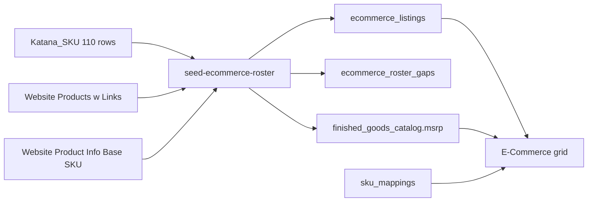

# Master Catalog E-Commerce Blueprint

Status: revised after the duplicate-SKU after-action review. The listing row is a website product, not a hub SKU.

This document replaces the Master Catalog "Web Visible" tab with an E-Commerce grid. Membership is the 110-row Katana canonical roster, not `finished_goods_catalog.is_web_visible`.

Decisions locked with the business owner:

- The `Katana_SKU` sheet is the membership set. Product links come from the links sheet, including a family-matched sibling URL. The ten SKUs with no URL stay blank. This build does not call WooCommerce.
- The grid price column is the steel MSRP. The aluminum-frame MSRP appears only inside the expanded row.

## What the source files actually contain

The roster is the `Katana_SKU` sheet inside `data_migration/Pricing/E-Commerce - Website Product Info.xlsx`. It has 110 unique rows: `Original Name`, `Canonical Hub SKU`, `MSRP`. That set is a 1:1 match with rows flagged `E-Commerce=TRUE` on the workbook's `Website Products` sheet. Membership for the new tab is this roster.

Join key across sheets is normalized `Memo/Description` (uppercase, collapsed whitespace, normalized inch marks). `Product/Service full name` is the wrong display name: the club-chair row is labeled `BRAVADA SWIVEL CHAIR`. Product Name in the grid is `Memo/Description`.

Legacy Base SKU is not in the E-Commerce workbook or in `data_migration/Pricing/Website Product Info - Website Products w_ Links.csv`. It lives on `Website Products w Links` in `data_migration/Pricing/Website Product Info.xlsx`, column `Base SKU` (example `BRV-SWV-34X34`). 100 of 110 roster names match a base SKU. 10 do not. Nine base SKUs are shared by more than one canonical SKU (club and swivel both use `BRV-SWV-34X34`; sofa, armless, and corner share `BRV-SOF-72X34`). The column stays read-only and may duplicate.

Product links are on the E-Commerce workbook's `Website Products w Links` sheet and point at `https://ccpatiodev2.primeview.com`. About half the roster rows carry their own URL. Size siblings inherit the previous URL only when they sit in the same Drawing section and share a family key (product noun with dimensions stripped): `FIN-BRV-SOF-84X34` inherits `/product/bravada-sofa/` from the 72-inch row. Ten roster SKUs have no URL even after that rule:

- `FIN-BRV-DYB-78X72`, `FIN-BRV-DYB-78X78`, `FIN-BRV-DYB-84X78`
- `FIN-MLN-OTT-22X60`, `FIN-MLN-OTT-22X72`, `FIN-MLN-OTT-34X60`, `FIN-MLN-OTT-56X42`
- `FIN-BRV-SWG-60X12`, `FIN-BRV-SWG-96X32`
- `FIN-TJM-UMB`

Those cells stay blank.

Steel MSRP is the grid price. 109 of 110 roster rows also have an aluminum-frame price. Aluminum MSRP appears only in the expanded row.

The sheet `Collections` cell is blank on 61 of 110 roster rows, and `FIN-CAN-UMB` is labeled Miscellaneous. Collection and product type are derived at seed time, not read from that cell.

Prefix counts on the roster: Ocean 44, Bravada 40, Milan 11, Tenjam 8, Brooklyn 4, Kingston (`FIN-KIN`) 2, Cantilever 1. Many `FIN-OCN-*` memos are Daisy, Star Leg, Taylor, or Fly, so collection is the leading product line in the memo. Product type is the Drawing section header:

- Sofas, chaises, and club chairs
- Coffee tables, T-tables, and flying tables
- Dining tables, fire tables, and related
- Dining chairs, benches, and stools
- Ottomans
- Swings
- Umbrellas, pillows, accessories, and misc



## Revision: one hub SKU, many website listings

`Katana_SKU` has 110 rows and 110 unique `Original Name` values, but only 101 unique Canonical Hub SKUs. Seven SKUs are reused. Nine extra rows are different products with different steel prices, not duplicate copies of the same listing:

- `FIN-BRV-MIN-LOV-48X34` — mini loveseat $2,520 and armless mini loveseat $2,320
- `FIN-BRV-ARM-SOF-72X34` — two armless-sofa strings that differ only by whitespace, $2,880 and $3,360
- `FIN-OCN-FLY-BST-18X18` — fly-leg barstool bar height $810 and counter height $780
- `FIN-OCN-FLY-BST-17X21` — half-back barstool bar height $830 and counter height $800
- `FIN-KIN-MIS` — Kindle heater $4,995 and Kindle lamp $4,975
- `FIN-TJM-MIS` — four Tenjam products ($599.99, $729.99, $1,599.99, $1,759.99)
- `FIN-TJM-CHA` — Freelo chair $499.99 and Moon chair $749.99

`global_sku` stays the foreign key to `sku_mappings`. It is not the primary key. A composite primary key of `(global_sku, product_name)` is the wrong identity: a later workbook correction that moves a name onto a different hub SKU would delete and reinsert the row, and the grid's expand and price editor need a single stable id. `product_name` is already unique across all 110 raw Original Names, including the two armless-sofa strings. Do not unique on the normalized memo. Normalization collapses that whitespace pair and would drop the $480 price difference.

The grid price is the listing's own steel MSRP. `finished_goods_catalog.msrp` is one number per hub SKU. Writing every roster row into that column would leave only the last price for `FIN-TJM-MIS`. Inline edit on this tab updates the listing row. It also updates `finished_goods_catalog.msrp` only when that hub SKU has exactly one listing.

## Schema

Add two tables in `src/server/db/schema.ts`. Leave `is_web_visible` on `finished_goods_catalog` and `quarantine_catalog` in place. The E-Commerce tab never reads it.

`ecommerce_listings` — one row per roster Original Name whose canonical SKU exists in `sku_mappings`:

- `id` uuid primary key, `defaultRandom()`
- `global_sku` text not null, FK to `sku_mappings.global_sku` on update cascade, indexed, not unique
- `product_name` text not null, unique (`ecommerce_listings_product_name_uidx`)
- `steel_msrp` numeric(10,2) null — the grid MSRP
- `legacy_base_sku` text null
- `legacy_sku_shared` boolean, true when another listing uses the same base SKU
- `canonical_sku_shared` boolean, true when another listing uses the same hub SKU
- `product_url` text null
- `url_source` text: `row`, `sibling`, or `missing`
- `drawing_section` text, the product-type facet
- `collection_label` text
- `aluminum_msrp` numeric(10,2) null
- `marketing_description` text null
- `construction_details` text null
- `sheet_order` integer
- `updated_at` timestamp

`ecommerce_roster_gaps` — one row per roster Original Name whose canonical SKU is absent from `sku_mappings`. Several gaps can share one missing SKU, so the name is the key:

- `product_name` text primary key
- `global_sku` text not null
- `reason` text
- `updated_at` timestamp

Hub steel price: when a canonical SKU appears on exactly one listing, the seeder writes that steel price to `finished_goods_catalog.msrp`. When a SKU appears on more than one listing, the seeder does not overwrite `finished_goods_catalog.msrp`. Aluminum is never written to `finished_goods_catalog`. The grid does not join `finished_goods_catalog`. A missing hub price row must not hide a listing.

## Seed

New script `scripts/db/seed-ecommerce-roster.ts`, same dotenv/tsx pattern as `scripts/db/ingest-oct1-pricing.ts`, with `--dry-run`. It reads both workbooks with the existing `xlsx` dependency.

Normalization and family-key inheritance live in a pure module `src/lib/ecommerce-roster.ts` so they can be unit-tested without a database. Family key is the memo with dimensions, inch marks, and height suffixes removed. Inheritance never crosses a Drawing section or a different family key. Dry-run prints own URLs, sibling URLs, missing URLs, shared legacy SKUs, and hub gaps.

Keep every `Katana_SKU` row. Do not drop a row because its canonical SKU was already seen. Upsert listings on `product_name` (`onConflictDoUpdate` target `ecommerce_listings.product_name`) and gaps on `product_name`. Re-runs refresh the hub SKU, copy, URLs, aluminum price, and `steel_msrp` from the workbooks.

`flagSharedLegacy` must key its result map by `product_name`, not `global_sku`. A map keyed by hub SKU keeps only the last listing in a shared group. Add the same count for `canonical_sku_shared`.

Join copy, links, and legacy base SKU by normalized memo, as today. Prices and row identity come from the raw `Katana_SKU` Original Name, so the two armless-sofa strings stay two listings even though normalization treats them as one memo. Dry-run must print `Katana_SKU sheet rows: 110`, `Listings stored: 110` (minus hub gaps), and `Duplicate-SKU rows skipped: 0`.

## Read path and UI

`getEcommerceRoster()` in `src/app/embed/admin/master-catalog/actions.ts` returns `id` and reads `steel_msrp` from `ecommerce_listings`. It joins `sku_mappings` only, so a listing whose hub SKU exists still appears when `finished_goods_catalog` has no row. `revalidatePath("/embed/admin/master-catalog")` stays on MSRP updates.

`updateListingMsrp(id, newPriceRaw)` writes `ecommerce_listings.steel_msrp` for that uuid. If that listing's `global_sku` has exactly one row in `ecommerce_listings`, it also writes `finished_goods_catalog.msrp`. Shared hub SKUs do not call `updateProductMSRP`.

Replace the `web` view in `src/app/embed/admin/master-catalog/page.tsx` with an `ecommerce` view labeled E-Commerce. The other views (All, Broken Syncs, Missing Photos, By Collection, By Price Tier) and the quarantine tab stay. The CSV export that currently filters `isWebVisible` exports the roster instead.

New client components under `src/app/embed/admin/master-catalog/ecommerce/`:

- `EcommerceGrid.tsx` — floating container (`rounded-2xl`, `border-slate-100`, `bg-white`, `shadow-[0_8px_30px_rgb(0,0,0,0.04)]`), scroll container with a sticky header (`bg-white/90 backdrop-blur`), sortable columns
- `EcommerceFilters.tsx` — search plus two facet groups with counts: Collection and Product Type
- `EcommerceExpandedRow.tsx` — marketing description, construction details, aluminum MSRP

Columns, in order: expand chevron, Product Name, Canonical Hub SKU, Legacy SKU, MSRP, Product Link.

- Row identity is `listing.id`. React keys, expand state, and the MSRP editor use that uuid. The canonical SKU is `font-mono` and may repeat. When `canonical_sku_shared` is true, show a "shared hub" chip on the SKU
- Legacy SKU is read-only; a small "shared" chip when `legacy_sku_shared` is true; an em dash when null
- MSRP is `steel_msrp` on that listing. Saving one row does not change the price of another row that happens to use the same hub SKU
- Product Link is an external anchor. Missing URLs render an em dash. Sibling URLs use the same anchor with a quiet "shared page" hint
- Header shows roster count, gap count, missing-link count, and missing-legacy count

There is no web-visibility switch on this view.

## Filtering, sorting, and state

110 rows. Load once from the server action. Filter, sort, and expand stay in component state. No Woo round trip and no pagination.

- Search matches product name, canonical SKU, and legacy SKU
- Collection and product type are multi-select facets; counts reflect the search box, then the other facet
- Sort is client-side on name, canonical SKU, legacy SKU, or MSRP, with a numeric parse for money
- One expanded listing `id` at a time
- Empty facet result shows a short empty state inside the same container

## Antigravity fix sequence

`0038_majestic_zombie` was generated with `global_sku` as the primary key and has not been applied. Replace it. Do not apply it and then alter it.

1. Confirm the migration is unapplied. In psql or the Supabase SQL editor:

```sql
select id, hash, created_at
from drizzle.__drizzle_migrations
order by created_at desc
limit 5;
```

If `0038_majestic_zombie` is absent, delete these three artifacts and do not edit any earlier migration:

- `src/server/db/migrations/0038_majestic_zombie.sql`
- `src/server/db/migrations/meta/0038_snapshot.json`
- the last entry of `src/server/db/migrations/meta/_journal.json` (`idx` 38, tag `0038_majestic_zombie`)

If that tag is already in `drizzle.__drizzle_migrations`, stop. Do not delete it. Add a new migration that adds `id`, `steel_msrp`, and `canonical_sku_shared`, drops the primary key on `global_sku`, adds the uuid primary key and the `product_name` unique index, and changes `ecommerce_roster_gaps` so `product_name` is the primary key.

2. Replace the `ecommerce_listings` and `ecommerce_roster_gaps` definitions in `src/server/db/schema.ts` with the columns in the Schema section. Follow the existing `(table) => [uniqueIndex(...)]` pattern used by `product_bom`. `global_sku` uses `.references(...)` and an `index`, not `.primaryKey()`.

3. Run `npm run db:generate`, then `npm run db:migrate`.

4. In `scripts/db/seed-ecommerce-roster.ts`, delete the `seen` set that skips a second row for the same SKU. Build one listing per `Katana_SKU` row. Set `steel_msrp` from that row's `MSRP`. Upsert with `target: ecommerce_listings.product_name`. Upsert gaps with `target: ecommerce_roster_gaps.product_name`. Write `finished_goods_catalog.msrp` only for hub SKUs that appear once. Do not insert a catalog row just to satisfy a join.

5. In `src/lib/ecommerce-roster.ts`, change `flagSharedLegacy` so the returned map is keyed by product name. Count legacy base SKUs across listings. Add a `flagSharedCanonical` helper keyed the same way.

6. In `actions.ts`, add `id` and `canonicalSkuShared` to `EcommerceListing`. Select `ecommerce_listings.steel_msrp` as the grid price. Add `updateListingMsrp`. In `EcommerceGrid.tsx` and `page.tsx`, key expand, edit, and save off `listing.id`.

7. Dry-run, then seed:

```bash
npx dotenv -e .env.local -- tsx scripts/db/seed-ecommerce-roster.ts --dry-run
npx dotenv -e .env.local -- tsx scripts/db/seed-ecommerce-roster.ts
```

The dry-run must show 110 sheet rows and zero skipped duplicate-SKU rows. `FIN-TJM-MIS` must appear four times with four prices.

8. Open the E-Commerce tab. Confirm 110 rows (minus any hub gaps), two rows that share `FIN-TJM-CHA` with different prices, a shared-hub chip, a missing link, expand on one of a shared pair without opening the other, and an MSRP save that changes only that row.

## QA acceptance of the applied build

Accepted:

- `0038_abnormal_magik` is the listing-identity migration. `0038_majestic_zombie` stays deleted.
- The seed keeps all 110 names, upserts on `product_name`, and is idempotent. A second run stays at 79 listings and 31 gap rows.
- Dropping the `finished_goods_catalog` join is correct. The grid price is `steel_msrp`.
- The 31 gaps are hub SKUs absent from `sku_mappings` (Daisy and Star Leg tables, dining benches, fly-leg and Taylor seating, pillows, the round daybed, the round swing, the Lido umbrella). They are not a primary-key bug. Do not mint those SKUs in this pass. The grid shows the 79 names whose hub SKU exists, and the header count shows the 31.

Accepted follow-ups:

- The Canonical Hub SKU cell in `EcommerceGrid.tsx` shows the amber "shared" chip when `canonicalSkuShared` is true, with the title "Another listing uses this canonical hub SKU".
- `scripts/db/fix-migration-ledger.ts` records `0037_omniscient_wolfpack` with `created_at` `1791068285458` and hash `005b2525bdbde7e26dbd232978f3c728243f127649d52b4ec812b766bf0c19d7`. That hash is the SHA-256 of the raw SQL file, which is what Drizzle stores. The script does not run the 0037 SQL. Keep the script. Run it only on a database that already has 0037's tables and is missing that ledger row. Do not run it on an empty database: Drizzle treats the latest `created_at` as the high-water mark and would then skip 0037's SQL and apply only later files. A fresh database does not need the script. `db:migrate` applies journal entries in order from the SQL files.

`db:migrate` exiting 0 after the ledger insert does not mean Drizzle applied 0038 on that run. 0038 was already the newest `created_at`, so the command had nothing newer to apply. The 0037 row completes the history of this database.

Out of scope: live WooCommerce permalink sync, minting hub SKUs for the 31 gaps, color-level `FIN-*` variants, and removing `is_web_visible`. The E-Commerce tab has not been exercised in a browser in this review.
