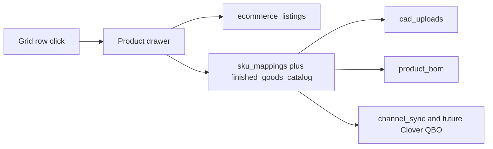

# PIM God Mode Product Drawer

Status: saved. This document is the build spec. Application code is unchanged until a separate execution handoff.

This is a new phase on top of the Product Bible and the inline editors. Ghost buttons, pills, factory readiness, and hub-gap mint stay. The drawer is the place staff finish the rest of the product. It does not replace those paths.

The GHL dashboard and the Clover-to-QuickBooks pipeline are the phases after this one. This drawer only leaves them a stable product record to read.

## Two identities, one drawer

A row in the grid is an `ecommerce_listings` record. Several listings already share one `sku_mappings.global_sku` (`FIN-TJM-MIS` is four products). CAD, BOM, channel sync, Clover, and QuickBooks ids hang off the hub SKU. Marketing copy, steel MSRP, aluminum MSRP, URL, and legacy SKU hang off the listing.

The drawer opens on a listing id. The header shows the hub SKU and, when `canonicalSkuShared` is true, the line `Shared by N listings. Hub edits apply to all of them.` Listing sections save the one row. Hub sections state that plainly before the operator edits.

Clicking the product name opens the drawer. The chevron still expands the quick-read row. Ghost buttons for a missing link and a missing legacy SKU stay on the grid. Add `?listing={id}` on the master-catalog URL so a refresh reopens the same drawer inside the embed.

## Locked rule: a live SKU does not mutate

`global_sku` is the primary key. `finished_goods_catalog`, `product_bom`, `cad_uploads`, `channel_sync`, and `ecommerce_listings` all reference it. [Dictionary rename](src/app/admin/dictionary/actions.ts) already moves that key and writes `sku_aliases`. The drawer must not do that because someone changed a dimension.

- Before the first save, Collection, Category, and dimensions only preview a SKU. Nothing is written.
- After the hub row exists, those fields still edit the human labels and the catalog dimensions. The canonical SKU stays. The drawer says `This SKU is permanent.`
- A different SKU is a successor: a new hub row and a new listing, copied from this one. The old listing is left in place so the operator can archive it. No automatic alias and no automatic Katana rename.

Preview pattern, new products only: `FIN-{collection code}-{category code}-{length}X{width}`. Height is stored and is not part of the SKU, matching `FIN-BRV-ARM-SOF-34X34`. Codes come from a fixed map in `src/lib`, not from free text. Bravada is `BRV`. Armless Sofa is `ARM-SOF`. Dimensions are positive integers in inches. If that SKU already exists, Save is blocked and the drawer names the existing product.

Existing roster SKUs are not regenerated. `FIN-TJM-MIS` stays `FIN-TJM-MIS`.

## What the drawer edits

Staff are not locked out of the columns they already own. External ids stay visible and read-only.

Listing, saved on `ecommerce_listings`:

- Product name, collection label, drawing section
- Steel MSRP and aluminum MSRP
- Product URL and legacy base SKU, through the same normalizers and operator flags as the ghost editors
- Marketing description and construction details

Hub, saved on `sku_mappings` and `finished_goods_catalog` with `sku_mappings.version`:

- Catalog length, depth, height, arm height, sit height, and weight
- Primary `image_url`
- SEO title, SEO description, and slug
- `is_web_visible`
- Local `base_cost` and catalog `cost`, labeled `Local cost. Not posted to QuickBooks.`

Read-only, so the next financial phase has a place to land:

- `katana_variant_id`, `woo_product_id`, `clover_item_id`, `qbo_item_id`, `qbo_item_code`, `qbo_accounts`
- `sync_to_woo` and `sync_to_clover` once the completeness gate below allows them
- `ghl_dropdown_value`
- The four factory states already on the grid: Missing CAD, Draft pending, Factory approved, Published

Logistics: [`logistics_profiles`](src/server/db/schema.ts) requires a Katana variant id. Do not insert a profile for a product that has none. When a profile exists, the drawer edits `weight_lb` and `ltl_class` using the class list already enforced by `logistics_profiles_ltl_class_known`. When it does not, weight stays on `finished_goods_catalog.weight`.

Marketing copy is sanitized HTML, not a free document. The server allowlist is `p`, `br`, `strong`, `em`, `ul`, `ol`, `li`, and `a` whose href is `http` or `https`. The expanded row renders that sanitized HTML. The marketing CSV strips tags. The grid excerpt stays plain text.

Every listing save and every existing ghost save bumps an integer `version` on `ecommerce_listings`. Hub saves send `expectedVersion` and bump `sku_mappings.version`. A mismatch throws `This product was saved by someone else. Reload.` and does not write. `revalidatePath("/embed/admin/master-catalog")` still runs. The open page patches drawer state from the action result, the same way the grid patches a link save.

## Asset vault

Do not add a second CAD pipeline.

- `.dae` and `.skp` call the existing Factory BOM upload. The file still has to match the hub SKU, and the Inngest draft extract is unchanged. The drawer shows the latest `cad_uploads` status.
- The primary ecommerce image uses the existing `product-images` bucket and `finished_goods_catalog.image_url`.
- Tear sheets and extra images go in a new `product_assets` table and a `product-documents` bucket: `global_sku`, `kind` (`tear_sheet`, `assembly`, `gallery`), storage path, filename, content type, byte size. PDF, PNG, and JPEG only. No executable types. Delete removes the storage object and the row.

A hub SKU must already exist before any drop. The blank new-product drawer previews the SKU and enables dropzones only after the first save.

## New product and retirement

`+ Add New Product` on the catalog header opens an empty drawer. Save mints `sku_mappings`, `finished_goods_catalog`, and one `ecommerce_listings` row in one transaction, reusing the rules in [mint-hub-sku.ts](src/server/master-catalog/mint-hub-sku.ts). It does not call Katana or WooCommerce. The new row appears on the roster with Missing CAD and a null steel price shown as an em dash.

Archive is per listing, not per hub. A new `archived_at` timestamp hides that listing from the default roster and forces nothing on its siblings. A separate `Retire hub SKU` sets `sku_mappings.is_active` false only when every listing on that SKU is archived. It also sets `sync_to_woo` and `sync_to_clover` false.

This phase does not delete a Woo product, a Katana product, or a Clover item. `channel_sync` history stays. The flags are what the later sync and the Clover-to-QuickBooks pipeline will honor. An archived listing can be restored by clearing `archived_at`.

## Completeness, beside factory readiness

The factory pill stays a factory fact. Completeness is a second score and does not turn Missing CAD into 75 percent.

The checklist is eight gates. Each is present, or explicitly not applicable where the catalog already supports `na_fields`:

- Hub SKU minted
- Product name and collection
- Steel MSRP, or not applicable
- Product URL
- Marketing description
- Primary image, or not applicable
- Factory state is Draft pending, Factory approved, or Published, or manufacturing is not applicable
- Weight present, or not applicable

The bar is `complete gates / 8`. At 8 of 8, and only when the listing is not archived, the operator may turn on `sync_to_woo` or `sync_to_clover`. Those switches do not publish. Below 8, they stay off. 100 percent means ready for a later sync, not synced.

## Financial seam, not the financial build

The next pivot is Clover to QuickBooks. This phase does not start it. The drawer already shows the columns that pivot will use: `sync_to_clover`, `clover_item_id`, `base_cost`, `cost`, `qbo_item_id`, `qbo_item_code`, and `qbo_accounts`. Archive and `is_active` are the retirement switches that pipeline must respect. No token refresh, no journal entry, and no Clover charge is in this phase.

## Execution backlog

1. Migration: `ecommerce_listings.version` and `ecommerce_listings.archived_at`, plus `product_assets`. Default version 1. Existing rows stay unarchived.
2. Nomenclature map and preview function, with tests for the Bravada armless-sofa example, a collision, and a refusal to change a saved SKU.
3. Drawer shell, read-only, opened from the product name and from `?listing=`.
4. Listing save and hub save with version checks. Ghost saves bump the same listing version.
5. New-product mint and listing archive. Hub retire only when every sibling is archived.
6. Asset drops: existing CAD and image writers, plus the document bucket.
7. Completeness checklist and disabled sync switches.
8. Free port 3000, then `npm run qa:lifecycle` until exit 0. Do not put `KATANA_WEBHOOK_SECRET` in `.env.local`.
9. Browser: open a shared SKU, save copy, confirm the sibling listing changed only on hub fields, create a new product without a Katana call, archive one listing, and confirm a dimension edit does not rewrite the SKU.

## Out of scope

- No in-place SKU mutation and no call to the dictionary rename.
- No Woo, Katana, Clover, QuickBooks, or GHL write.
- No removal of pills, ghost editors, or the four factory states.
- No second CAD pipeline and no V8 transactional bus.
- No financial posting.
