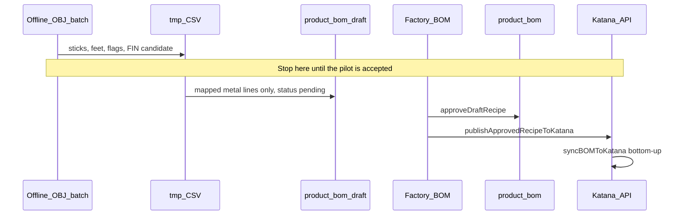

# Automated Metal BOM Extraction from Website OBJ Models

**Status:** For review. No extractor, no draft writes, and no Katana calls until this brief is accepted.  
**Date:** 2026-10-01  
**Audience:** Principal review before any implementation.  
**Binding source of truth:** [`docs/MDM_MASTER_BLUEPRINT.md`](./MDM_MASTER_BLUEPRINT.md). Draft before live. No V8 transactional bus. CAD math does not auto-Approve and does not auto-publish to Katana.

Related lanes this brief extends, and does not replace:

- Factory BOM draft → Approve → Publish: [`docs/FACTORY_BOM_KATANA_UX_PLAN.md`](./FACTORY_BOM_KATANA_UX_PLAN.md), `syncBOMToKatana` in `src/lib/katana.ts`
- Named SketchUp cut-lists (higher fidelity when a real `.skp` exists): `src/lib/sketchup-cutlist`
- Parametric footage guesses already in the hub: `src/lib/level2-bom.ts`
- Which physical stick is on the shelf: [`docs/METAL_AND_LOGISTICS_CUTOVER_PLAN.md`](./METAL_AND_LOGISTICS_CUTOVER_PLAN.md)

---

## 1. Verdict

These website files can produce a **reviewable metal cut-list** for most of the catalog. They cannot be trusted as an unattended Katana writer.

| Decision | Recommendation |
|---|---|
| Corpus | 66 SketchUp OBJ models, each with an MTL. Units are inches on every file. Folder on disk is `Blender\Website Products\MTL  files for website products` (two spaces). |
| Parser | **TypeScript in this repo.** A streaming OBJ group walker. No new runtime. |
| Geometry kernel | For each 6-face solid, measure **boundary edge lengths**, then snap the cross-section to a known extrusion. World-axis bounding boxes are a fallback only. |
| What “feet” means | Sum of **long-point inches ÷ 12**, grouped by profile, stored as net feet. Kerf stays in `scrap_factor` (1.08), applied once at Katana publish. |
| SKU the recipe consumes | Hub identity stays `RM-MET-*`. The Katana ingredient should be the **stocked purchasing variant** (`MET-TB22060` for 2×2×16g, and the cousins in §5). This is an owner lock; see §8. |
| Katana write | **No direct OBJ → API path.** Batch review file, then `product_bom_draft` + `cut_list`, then the existing Approve → `syncBOMToKatana` button. |
| Rejected as the v1 engine | Blender headless, and a Python `trimesh` service. Both solve a harder mesh problem than these files are. |

Pilot bar, before any draft row is written: `1 BRAVADA club chair.obj` must report **30.17 ft net of 2×2** (measured) against the shop rollup of **29.84 ft**. That is a 1.1% gap and an acceptable first lock. The same file’s flat-bar and slat counts **disagree** with the old drawing assumption; those lines stay flagged, not auto-corrected (§4.6).

---

## 2. What the files actually contain

Header of every OBJ:

```text
# Alias OBJ Model File
# Exported from SketchUp, (c) 2000-2012 Trimble Navigation Limited
# File units = inches
```

A survey of all 66 models on 2026-10-01:

| Fact | Measured |
|---|---|
| OBJ / MTL | 66 / 66 |
| Units | `inches` on all 66. No file is metric. |
| Groups (`g` lines) | 1,865 |
| 6-face box groups | 1,156 |
| Other groups (cushions, pillows, fused frames, caps, stone) | 709 |
| Groups whose world box looks like a stick | 1,136 |
| Models with zero stick-like groups | 6 (Waterfall side table, Laylo, Freelo, two Shayz loungers, Moon, Mibster) |
| Largest files | Round swing and Bravada swing, about 13 MB each. Club chair is 166 KB. |

Group names are visual, not manufacturing names: `Mesh12 Group15 Group12 Group1 Model`. Materials are render colors (`_Color_M06_4`, `Color_M00`, `_Carrera_Marble_14`), not alloys and not gauges. A metal tube and a flat bar on the same chair share one gray. **Profile comes from the cross-section. The MTL is only a filter** (drop marble, carpet, pillows, and cushion shells).

Many sticks inherit the previous `usemtl` because SketchUp omits the line on later groups. The parser carries the last material forward. A blank material is not a reason to drop a stick.

### 2.1 The club chair is already a cut-list

`1 BRAVADA club chair.obj` is 29 groups. Twenty-two of them are 6-face sticks. The 2×2 members, in inches:

| Length | Count | Shop meaning (from the named Bravada sample, for comparison) |
|---:|---:|---|
| 34 | 3 | Seat-frame rails. Named sample states 34" long-point, 45/45. |
| 32 | 2 | Arm tops. Named sample states 32". |
| 30 | 3 | Back top / seat rails. |
| 21 | 2 | Back posts. Named sample states **19" short-point**. 19 + 2" of mitre = 21. The visual solid stored the longer number. |
| 14 | 2 | Arm verticals. |
| 10 | 2 | Short rails. |
| 8 | 2 | Legs. Named sample states 8". |

Net 2×2 = 362 in = **30.17 ft**. The North Star drawing rollup for SQ2-16 on this chair is **29.84 ft**. Same chair, same family, one-third of a foot apart.

Also on that file, and **not** the same as the drawing assumption:

| Mesh section | Pieces | Net feet | Drawing / template assumed |
|---|---:|---:|---|
| 1.50 × 0.75 | 1 × 30" | 2.50 | About four 1.5×0.75 slats (~10 ft) |
| 1.00 × 0.125 | 5 × 30" | 12.50 | Two pieces of flat bar, and the template guessed 1.5" width |

The mesh is allowed to win. The conflict is shown to the manager. It is not smoothed into `level2-bom.ts`.

### 2.2 A bounding box is the wrong ruler on a rotated stick

`19 OCEAN sofa 72.obj` mesh 13 is one 6-face solid. Its world-axis box is **29 × 5.94 × 2**. Snapping that box would invent a 6" deep section and a single 29" length.

Its boundary edges are **2", 2.83", 25", and 29"**:

- 2" is the real tube size.
- 2.83" is the 45° cut face of a 2" square (`2 × √2`), not a second profile.
- 29" and 25" are the long point and the short point. The 4" gap is two 45° ends on 2" tube (`2" + 2"`).

The same pattern is on the sofa’s 68" / 64" rails. Square-cut members (Milan 1×1, fire-pit 1.5×0.75, club-chair axis-aligned 2×2) have one long-edge length, and the end is recorded as 90/90.

That is the whole extraction result the shop can use: **profile, long-point length, end condition, piece count.** Gauge is not in the mesh.

### 2.3 Some models have no sticks to find

`34 Waterfall side table 40 x 13.obj` is two solids: a fused 38×13×11 frame (44 faces) and a Carrara top. There is no per-tube group. Splitting that solid in Blender would invent a cut-list. Those six zero-stick files, plus any later file whose frame is one blob, go to **quarantine** with status `fused_mesh`. The existing parametric guess in `level2-bom.ts` may be shown beside them as a comparison. It is not written as if it were measured.

---

## 3. Technology choice

### 3.1 Use the TypeScript OBJ walker

The hub already turns geometry into draft recipe rows (`parseDaeWeldment`, family templates, `cut_list` jsonb, `formatKatanaIngredientNote`, `syncBOMToKatana`). The website OBJs are simpler than the Collada path: most metal parts are 8-vertex hexahedra with the length written in the edges.

V1 lives as a pure function plus an offline batch script. It does not run inside a Next.js request, and it does not spawn Blender or Python.

| Proposed module (after approval) | Role |
|---|---|
| `src/lib/obj-cutlist/parse-obj-weldment.ts` | Pure parser. Buffer in, sticks and rollups out. No database. |
| `src/lib/obj-cutlist/profile-crosswalk.ts` | Section → `RM-MET-*` and purchasing `MET-*`. |
| `scripts/ops/extract-website-obj-boms.ts` | Read the 66 files, write a review CSV/JSON under `tmp/`. |
| Existing `product_bom_draft` writer | Used only after the pilot CSV is accepted. Same `recipe_source` family as CAD (`sketchup_geometry` or a sibling value `obj_geometry` — lock in §8). |
| Existing `syncBOMToKatana` | The only Katana recipe writer. |

`@gltf-transform` and the DAE Cheerio parser stay where they are. This corpus is OBJ text; converting it to glTF first adds a step and no information.

### 3.2 Why the other two engines wait

| Engine | When it would earn a place | Why it is not v1 |
|---|---|---|
| **Blender headless (`blender -b -P`)** | A later project that must boolean-split a fused visual solid into tubes. | New binary, version-locked `bpy`, and a nondeterministic mesh stack for files that are already 8-vertex boxes. The fused-frame files should be quarantined, not auto-split. |
| **Python `trimesh`** | Oriented-box fitting on the high-poly minority (Ocean mesh 11 has 61 faces and 56 vertices). | Second runtime, second BOM writer, and the SKP plan already demoted mesh fitting to a fallback. A stick with 61 faces is flagged `non_prism` and left out of the automatic quantity until a person accepts it. |

---

## 4. Geometry extraction

### 4.1 Pipeline

```mermaid
flowchart TD
  obj["OBJ + MTL inches"]
  groups["Stream groups, vertices, faces, carried material"]
  class["Classify each group"]
  prism["6-face hexahedron: boundary edge lengths"]
  drop["Drop cushion, pillow, stone, cap, fused blob"]
  flag["non_prism or unmapped section: flag, exclude from qty"]
  snap["Snap section to profile crosswalk"]
  mitre["Unequal long edges become long-point and end angles"]
  roll["Sum inches to net feet per profile"]
  sku["Filename to FIN candidate via sku-engine, exact hub match"]
  review["tmp review CSV. No draft. No Katana."]

  obj --> groups --> class
  class --> prism --> snap --> mitre --> roll --> sku --> review
  class --> drop
  class --> flag --> review
```

### 4.2 Parse rules

1. Refuse the file when the header unit is missing or is not `inches`. Do not guess meters. All 66 current files pass.
2. Stream `v`, `f`, `g`, `usemtl`. Ignore `vt` and `vn` for measurement.
3. OBJ face indices are 1-based and may be negative. Resolve both.
4. Quantize vertex coordinates to 0.001" before counting unique corners.
5. A group is a **prism candidate** when it has 6 faces and 8 unique vertices.
6. A group is **excluded metal** when any of these hold:
   - material name matches marble, stone, carpet, pillow, or cushion shell (`_Carrera_Marble_14`, `Carpet_Loop_Pattern`, `Pillow_`, `Color_M00` cushion blocks, `FrontColor` on fat shells)
   - unique vertices > 24, or faces > 24 (pillows on this corpus run 918 to 18,658 faces)
   - the two section edges both exceed 4.5" (a cushion slab or a fused frame)
7. A 6-face group that fails the prism test, or a stick-like group with extra faces (Ocean mesh 11), is `non_prism`. It is listed in the review file and omitted from the rolled-up quantity.

### 4.3 Edge measurement

On each prism, walk the face loops and collect each undirected boundary edge once.

Cluster lengths with a tolerance of **0.08"** (thin stock under 0.20" uses **0.02"** so 0.125" does not merge into 0.25").

Then:

1. The longest cluster, or the longest pair of clusters, is the **stick length**.
2. When two long clusters differ by approximately `section` or `2 × section`, the cut length is the **longer** one (long point, the rule already in `src/lib/sketchup-cutlist/long-point.ts`). The shorter one is stored as `shortPointIn`. One-width gap → one 45° end. Two-width gap → 45/45. The 2.83" edge on a 2" stick is the miter face (`section × √2`), and it is discarded as a profile dimension when it matches that ratio within 8%.
3. When every long edge matches, both ends are **90/90**. The extractor does not copy 45° from the Bravada family template onto a square-cut visual solid. A template mismatch is a review column, not a rewrite.
4. The remaining two short clusters are the section, ordered major × minor.
5. Piece identity for notes is `(profile, longPointIn, endA, endB)`. Identical sticks increment `qtyEa`. They do not become separate Katana rows.

Kerf is not subtracted from the length. `DEFAULT_TUBE_SCRAP_FACTOR` / `LEVEL2_SCRAP` is **1.08**, stored on the recipe line as `scrap_factor`. Net feet stay in `quantity`. `syncBOMToKatana` already sends `quantity * scrap_factor`. Pre-multiplying in the extractor would buy `1.08²`. The level-2 helper that bakes scrap into the quantity is a different writer; this pipeline follows the cut-list writer.

Feet for a profile = `sum(longPointIn × qtyEa) / 12`, rounded to 4 decimal places after the sum. Do not round each stick to feet first.

### 4.4 Gauge

The mesh has no wall thickness. Every automatic metal line is **assumed 16 gauge**, written into the note and the review file. 11 gauge (`MET-TB22120` for 2×2) is a purchasing choice a person makes. The extractor never emits it.

### 4.5 Worked numbers the pilot must reproduce

From `1 BRAVADA club chair.obj`, before scrap:

| Profile | Net feet | Note sketch |
|---|---:|---|
| 2×2 tube | 30.17 | Piece counts in §2.1. Ends stay 90/90 unless that mesh’s long edges actually differ. |
| 1.5×0.75 tube | 2.50 | `1 pcs @ 30.0 in` |
| 1×1/8 flat | 12.50 | `5 pcs @ 30.0 in` |

From `19 OCEAN sofa 72.obj` mesh 13 specifically: profile 2×2, long point 29", short point 25", ends 45/45. The review file must show those three facts, and it must not show a 5.94" section.

### 4.6 Confidence and gates

A file is **draft-eligible** only when all of these hold:

- Unit is inches.
- At least one mapped prism exists.
- Every included stick snapped to the crosswalk, or the unmapped sticks are listed and the operator has accepted “publish the mapped lines only.”
- The longest stick is at most `max(filename width, filename depth, filename height) + 6"`. A longer stick means a bad edge cluster. The file stays in review.
- 2×2 footage on the Bravada club chair stays inside **±5% of 29.84 ft** (the measured 30.17 ft passes).

A file is **not draft-eligible** when the frame is one fused solid, or when zero prisms survive the filters. Status `fused_mesh` or `no_metal`.

Envelope and family-template deltas are columns on the CSV (`mesh_ft`, `template_ft`, `delta_ft`). They never overwrite the mesh quantity.

---

## 5. SKU mapping

Two joins. Neither is fuzzy.

### 5.1 File name → finished good

Filenames are merchandising titles: `1 BRAVADA club chair.obj`, `19 OCEAN sofa 72.obj`, `41 Propane fire pit table 56 x 42.obj`.

1. Strip the leading index.
2. Run the existing `generateFinishedGoodSku` rules in `src/lib/sku-engine.ts` (collection `BRAVADA → BRV`, category `CLUB CHAIR → CLB-CHA`, dimensions from the title).
3. Accept the candidate only when `sku_mappings.global_sku` equals that candidate **or** `sku_mappings.original_name` equals the stripped title after the same normalization `sow-phases.ts` already uses.
4. Otherwise the row is `unmatched_fg`. Do not mint a `FIN-*` from a filename. Do not fuzzy-match `BRA-*` / `OCE-*` legacy Katana SKUs (blueprint §11).

The metal parent on that finished good is the existing frame / seat / back / arm sub-assembly when the hub already has one. When it does not, the draft proposes a single `SA-…-FRAME` child and puts the metal on that child. Bulk tube does not sit on the `FIN-*` row when a frame sub-assembly exists. That is the same nesting rule as the Bravada North Star: the chair consumes weldments; the weldment consumes feet.

Anonymous `GroupN` ids (the two 32" + 14" sticks that share `Group22` on the club chair) are stored on the cut line as `sourceGroup`. V1 does not split SEAT / ARM / BACK from those ids. A later template can, after a person checks one chair per collection. Shared arms (`ASM-BRV-ARM`) are not overwritten by one OBJ; a length conflict is quarantined the same way the SketchUp instantiator already quarantines it.

### 5.2 Cross-section → metal SKU

Snap major × minor, order-independent, tolerance ±0.08" (±0.02" below 0.20"). First match wins. Anything else is `UNMAPPED` and blocks silent publish.

| Section (in) | Profile code | Hub recipe identity | Purchasing variant that holds sticks | Notes |
|---|---|---|---|---|
| 2.00 × 2.00 | `SQ2-16` | `RM-MET-2X2-TUBING` | `MET-TB22060` | 16g assumed. `MET-SQT20016` is a duplicate name, not a second recipe. 11g is `MET-TB22120` and is manual. |
| 2.00 × 1.00 | `SQ2x1-16` | `RM-MET-2X1-TUBING` | `MET-TB21060` | |
| 2.00 × 0.75 | `RT2x0.75-16` | `RM-MET-2X075-TUBING` | `MET-TB234060` | |
| 1.50 × 0.75 | `RT1.5x0.75-16` | `RM-MET-15X075-TUBING` | `MET-TB11234060` | The 2.83" miter face must not land here. |
| 1.00 × 1.00 | `SQ1-16` | needs a hub row if missing | `MET-TB11060` | Milan chair is full of 1×1. Confirm the hub SKU before draft write. |
| 1.00 × 0.125 | `FB1x0.125` | `RM-MET-FLATBAR` | `RM-MET-FLATBAR` until the cutover confirm, else the 1×1/8 purchasing code | Width is 1", not the 1.5" the old flat-bar template assumed. `MET-FH18112` is 1.5×1/8 and is a different section. |
| 1.50 × 0.125 | `FB1.5x0.125` | no `RM-MET-*` yet | `MET-FH18112` | Create the hub alias only after this section is actually measured. |
| 1.00 × 0.25 | `FB1x0.25` | do not use `RM-MET-FLATBAR` | `MET-FH141` | Thickness separates 1/8 from 1/4. |

`RM-MET-*` rows already exist in `src/lib/katana-bulk-materials.ts` with Katana variant ids and UOM `ft`. Purchasing cousins are named in those notes and in the metal cutover plan. The crosswalk is a table in code, reviewed in the CSV, not a string guess at publish time.

On-hand metal from the 1 Oct 2026 count is planned onto the **purchasing** variants at Katana location `98179`. A recipe that consumes `RM-MET-2X2-TUBING` (variant `23143123`) will not decrement `MET-TB22060`. MRP then shows tube on the shelf and a shortage on the placeholder. Section 8 asks you to lock the ingredient. The recommended lock is: **hub `child_sku` remains `RM-MET-*` for the Factory screen; the Katana `ingredient_variant_id` is the purchasing variant.** Both SKUs are printed in the ingredient note so the floor can see the alias.

UOM on every metal line is `ft`. Caps, powder, fabric, foam, and Dekton are out of this extractor. Powder pounds can be derived later by the existing `powderPounds` helper from accepted tube feet. This brief does not add that row.

### 5.3 What is not a metal recipe row

| Visual | Treatment |
|---|---|
| Cushions, pillows | Ignored. Existing `CUSH` recipes stay. |
| Dekton / marble tops | Ignored. A plate of 56×42×1 is a top, not flat bar. |
| Plastic caps and small hardware (< 3" on every axis) | Ignored. `RM-HRD-2X2-METAL-CAP` stays a parametric line if the frame recipe already has it. |
| Fire-pit burner, propane tray, umbrellas, shades | `no_metal` or manual. The propane fire-pit file does contain real 1.5×0.75 sticks; those sticks are in scope, the burner hardware is not. |
| `CUT-*` drawing numbers | Notes and `cut_list` only. They are not Katana variants and not manufacturing orders. |

---

## 6. Katana payload strategy

### 6.1 The write that is allowed



The batch’s first ship is the review file. Draft insertion is a second approval. Publish stays the Factory button, gated by `canMutateKatanaCatalog` / `CATALOG_PUBLISH_MODE`. A dry-run (catalog mode off) must be read before any live push. No sales order, no manufacturing order, no stock adjustment, no stocktake.

`syncBOMToKatana` walks children first, ensures each variant exists, then replaces that node’s recipe. Replacement is already implemented as:

- Preferred: `GET /bom_rows?product_variant_id=…`, `DELETE` each existing row, `POST /bom_rows/batch/create`
- Fallback: `POST /recipes` with `keep_current_rows: false`

Because replace means “the hub row set becomes the Katana row set,” the draft for that parent must already contain the **full** recipe: extracted metal **plus** the cushion, powder, cap, and Dekton lines the hub already had. A metal-only payload would erase the cushion on the next publish. The merge rule is: replace `RM-MET-*` / mapped `MET-*` lines on the frame parent; leave every other child SKU untouched.

Do not `DELETE` recipes by hand outside that replace. Do not post the same feet onto both `RM-MET-2X2-TUBING` and `MET-TB22060`.

### 6.2 Row shape

Hub line (draft, then live after Approve):

| Column | Example |
|---|---|
| `parent_sku` | `SA-BRV-CLB-CHA-34X34-FRAME` (real parent once the FIN match is confirmed) |
| `child_sku` | `RM-MET-2X2-TUBING` |
| `quantity` | `30.1667` net feet |
| `scrap_factor` | `1.08` |
| `unit_of_measure` | `ft` |
| `notes` | chop-saw string from `formatKatanaIngredientNote` |
| `cut_list` | full JSON, one object per distinct stick |

Katana body, built by the existing `toKatanaBomRowBody` (notes truncated to **255** characters):

```json
{
  "data": [
    {
      "product_item_id": 0,
      "product_variant_id": 0,
      "ingredient_variant_id": 0,
      "quantity": 32.58,
      "notes": "3 pcs @ 34.0 in · square · 3 pcs @ 30.0 in · square · 2 pcs @ 32.0 in · square · 2 pcs @ 21.0 in · square · 2 pcs @ 14.0 in · square · 2 pcs @ 10.0 in · square · 2 pcs @ 8.0 in · square · purch MET-TB22060"
    }
  ]
}
```

`quantity` on the wire is `30.1667 × 1.08 = 32.58` ft. The ids are filled from live `sku_mappings.katana_variant_id` / the purchasing variant at publish time. The zeros above are placeholders so this document is not mistaken for a captured live call.

`product_item_id` is the Katana **product** id of the parent variant (`findVariantById` → `product_id`). The batch path is `POST /bom_rows/batch/create`, chunks of 250 (`KATANA_BOM_ROWS_MAX_BATCH`). When that route returns 404, 405, 410, 422, or 501, the existing client falls back to:

```json
{
  "keep_current_rows": false,
  "rows": [
    {
      "product_variant_id": 0,
      "ingredient_variant_id": 0,
      "quantity": 32.58,
      "notes": "3 pcs @ 34.0 in · square · …"
    }
  ]
}
```

401 and 403 do not fall back. Mutating calls keep sending `Idempotency-Key`, as the blueprint already requires.

Operations (cut, weld, grind, powder) stay on the aluminum standard track already in the Factory workbench. This extractor does not post `/product_operation_rows`.

### 6.3 One parent, one material, many sticks

Katana gets **one row per profile per parent**, quantity in feet. The 16 distinct 2×2 sticks on the club chair are one ingredient row. The chop-saw list lives in `notes` and the full structure lives in `cut_list`. A 255-character note will truncate on a daybed; the tablet still has `cut_list`. The note prefix should include the profile code so a truncated string is still identifiable (`SQ2-16 · 3 pcs @ 34.0 in · …`).

### 6.4 Idempotency and scope of the first publish

- Re-running the OBJ batch overwrites the review file, not Katana.
- Re-running Approve replaces draft lines for that parent’s metal children and preserves other children.
- Re-running Publish replaces that variant’s bom rows with the hub set. A second publish of an unchanged hub payload should no-op once `channel_sync.payload_hash` matches (blueprint Tier 1.3).
- Pilot publish is one finished good, catalog dry-run first, then a single live push if you explicitly set the catalog mode. The other 65 files stay in `tmp/` until that one recipe is checked on the Katana screen.

---

## 7. Pilot sequence

| Step | File | Pass condition |
|---|---|---|
| 0 | `1 BRAVADA club chair.obj` | 30.17 ft of 2×2 (±5% of 29.84). Flat bar 12.50 ft of 1×1/8 shown as a conflict, not rewritten. No database write. |
| 1 | `19 OCEAN sofa 72.obj` | Mesh 13 reported as 2×2, 29" long point, 25" short point, 45/45. World box 5.94" does not appear as a profile. |
| 2 | `22 MILAN club chair.obj` | 1×1 sticks land on `MET-TB11060` / the confirmed hub alias. Cushion blob (18k faces) excluded. |
| 3 | `41 Propane fire pit table 56 x 42.obj` | 1.5×0.75 sticks kept. 56×42×1 marble top excluded. |
| 4 | `34 Waterfall side table 40 x 13.obj` | Status `fused_mesh`. Zero recipe rows. |
| 5 | Remaining 61 | Review CSV only. Draft writer still off. |

The CSV columns:

`file, fin_candidate, match, parent_sku, profile, hub_sku, purchasing_sku, pieces, long_point_in, ends, net_ft, scrap_factor, katana_ft, confidence, flag`

---

## 8. Decisions to lock before coding

1. **Katana ingredient.** Recommended: hub row `RM-MET-*`, wire id = purchasing `MET-*` from §5.2. Alternate: consume `RM-MET-*` in Katana too, and move the October stick count onto those variants before go-live. Pick one. Using both will double-consume or consume an empty bin.
2. **1×1 tube hub SKU.** `MET-TB11060` exists as a purchasing code. Confirm the `RM-MET-*` alias, or authorize one new raw-material row, before Milan drafts.
3. **Flat bar 1×1/8.** Recommended: trust the mesh (1.00 × 0.125) and map it to `RM-MET-FLATBAR` only after you accept that this SKU means 1×1/8, which is what the cutover note already says. The 1.5" width in the old template is retired for this pipeline.
4. **16 gauge assumption.** Recommended: always 16g in the note, never 11g from geometry.
5. **Mitres.** Recommended: trust unequal long edges; leave equal long edges as 90/90 even when the Bravada template says 45.
6. **Recipe source value.** Recommended: `obj_geometry` on these drafts so they can be filtered apart from DAE `sketchup_geometry`. Requires the `recipe_source` enum to allow it. If you would rather not touch the enum, reuse `sketchup_geometry` and put `OBJ` in the note.
7. **Fused frames.** Recommended: quarantine. Parametric `level2-bom.ts` may be attached later by a person. Blender is not authorized to split them in v1.
8. **Nesting.** Recommended: one frame parent in v1. Seat / arm / back split waits until one OBJ per collection has been checked against the shop.

---

## 9. Out of scope

- Cushion, fabric, foam, powder, primer, Dekton, and hardware quantities.
- Creating or deleting Katana products, stock adjustments, stocktakes, sales orders, or manufacturing orders.
- Remapping legacy `BRA-*` / `OCE-*` SKUs.
- Auto-Approve, auto-publish, or any path that writes live `product_bom` from the batch.
- The V8 order bus.
- Replacing the SketchUp Ruby / DAE pipeline for models that already have named components. When both a named `.skp` and a website OBJ exist, the named component lengths win and the OBJ is the checksum.

---

## 10. Implementation sequence after acceptance

1. Pure parser + crosswalk + unit tests frozen on the club-chair and Ocean mesh-13 fixtures (no I/O).
2. Batch script → `tmp/` CSV for all 66. Read the five pilot rows in §7.
3. Only then: draft upsert for the club chair, Factory screen check, catalog dry-run of `syncBOMToKatana`.
4. Live push of that one parent when you say so.
5. Then the rest of the draft-eligible files, still one Approve at a time.
