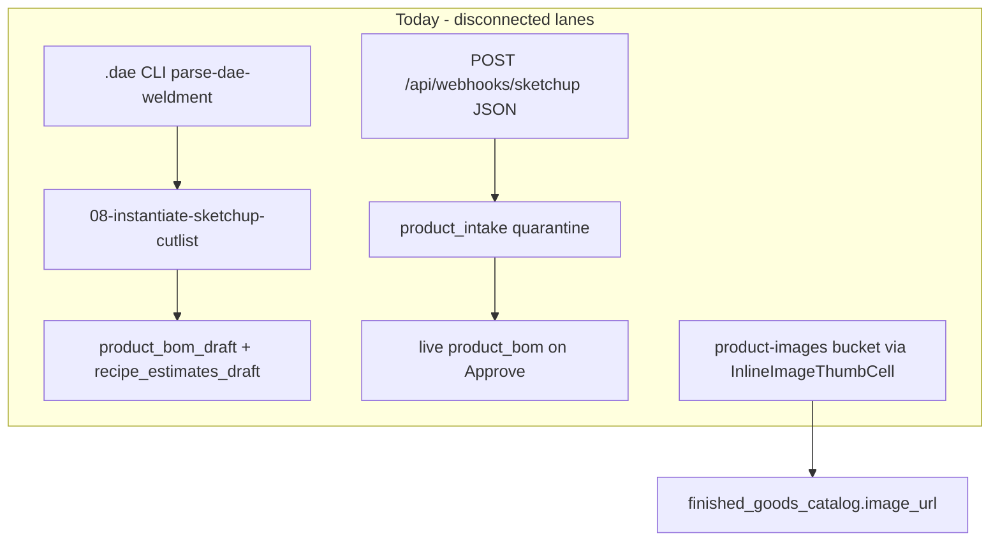
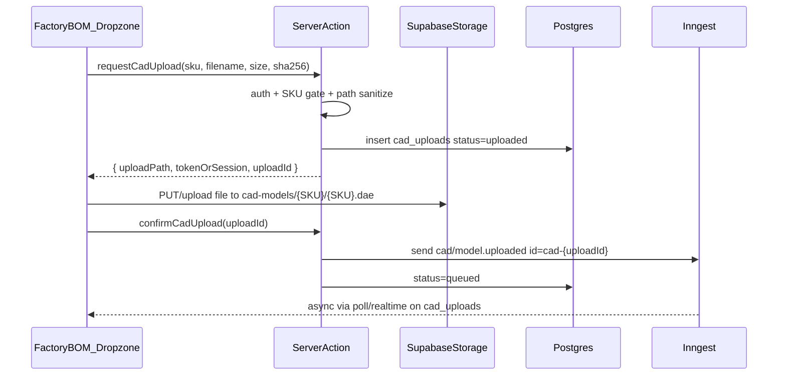
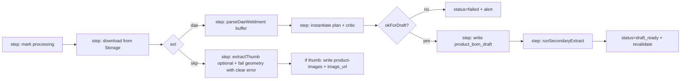

# CAD Drag-and-Drop Upload Pipeline — Architectural Research Plan

**Status:** Implemented (Factory BOM dropzone → Storage → Inngest/`CAD_UPLOAD_INLINE` → drafts)  
**Audience:** Enterprise Systems / PIM / Factory BOM  
**Binding SoT:** [`docs/MDM_MASTER_BLUEPRINT.md`](MDM_MASTER_BLUEPRINT.md) (draft-before-live; no V8 bus)  
**Date:** 2026-09-10

---

## Executive verdicts (locked)

| Decision | Verdict |
|---|---|
| **Primary UI surface** | Factory BOM Workbench (`/admin/factory-bom`), SKU-scoped dropzone under `RecipeHeader` / empty-draft panel — **not** Product Detail Modal |
| **Upload transport** | **Direct client → Supabase Storage** (signed/resumable or authenticated upload) for CAD bytes; Server Action only mints signed path + enqueues Inngest |
| **Background compute** | **Inngest** event `cad/model.uploaded` → download → DAE AABB parse → instantiate drafts → secondary extract |
| **Thumbnail** | **Hybrid:** (1) best-effort Node PNG scan from `.skp` as opportunistic enrichment; (2) **required dual-accept** dropzone (`.dae`/`.skp` + optional `.jpg`/`.png`) as the production-reliable path for `finished_goods_catalog.image_url` |
| **Live hub / Katana** | Untouched until Factory Approve (existing gate) |

---

## Current-state facts (codebase)



- **Only storage bucket today:** `product-images` (public, 5 MB, image MIME only) — [`supabase/migrations/20260826202822_product_images_bucket.sql`](../supabase/migrations/20260826202822_product_images_bucket.sql), uploads in [`src/app/admin/dictionary/actions.ts`](../src/app/admin/dictionary/actions.ts) `saveCatalogDraft`.
- **Inngest live:** `product.approved`, `katana/variant.archive`, two crons — [`src/inngest/functions.ts`](../src/inngest/functions.ts), serve [`src/app/api/inngest/route.ts`](../src/app/api/inngest/route.ts).
- **DAE → drafts:** Cheerio AABB in [`scripts/diagnostics/parse-dae-weldment.ts`](../scripts/diagnostics/parse-dae-weldment.ts) → family templates in [`src/lib/sketchup-cutlist`](../src/lib/sketchup-cutlist) → `08-instantiate…` → `runSecondaryExtract`. Sample DAE ~69 KB (light); cost scales with vertex arrays.
- **`.skp`:** Present as samples / Ruby exporter SoT; **no Node geometry parse**. Thumbnail PNG often embedded (scan for `89 50 4E 47…` through `IEND`; format varies by SketchUp year / ZIP-era files).
- **Product Detail Modal:** No file/image UI; links to Factory BOM. Images are dictionary-only today.

---

## Pillar 1 — Supabase Storage

### Bucket architecture

| Bucket | Visibility | Purpose | Path convention | Limits (proposed) |
|---|---|---|---|---|
| `cad-models` | **Private** | Canonical CAD binaries | `{global_sku}/{global_sku}.{ext}` e.g. `FIN-WFT-DIN-TAB-72X28/FIN-WFT-DIN-TAB-72X28.dae` | 50–100 MB; MIME `model/vnd.collada+xml`, `application/octet-stream`, `.dae`/`.skp` |
| `product-images` | Public (existing) | PIM / Woo thumbnails | Keep existing `{sku}-{timestamp}.{ext}` **or** add stable `{sku}/hero.{ext}` | Keep 5 MB images |

**Rename rule:** On accept, object key **must** equal Master SKU basename (`FIN-…dae` / `FIN-…skp`). Reject upload if selected workbench SKU ≠ filename stem unless operator confirms “force rename to selected SKU.”

**Metadata table (new, draft-adjacent):** `cad_uploads` (recommended)

| Column | Role |
|---|---|
| `id` uuid PK | Job id |
| `global_sku` FK hub | Selected FG |
| `storage_path` | `cad-models/…` |
| `original_filename` | Browser name |
| `content_type`, `byte_size`, `sha256` | Integrity |
| `status` | `uploaded` \| `queued` \| `processing` \| `draft_ready` \| `failed` |
| `inngest_event_id` | Idempotency |
| `error_message` | Operator-visible |
| `thumbnail_source` | `skp_embed` \| `operator_upload` \| `none` |
| `thumbnail_url` | Public URL if written |
| timestamps + `uploaded_by` | Audit |

Do **not** stuff binaries into `product_intake.raw_payload`. Blueprint JSON quarantine remains a separate lane.

### Upload flow (bandwidth-aware)

**Chosen:** Direct client → Supabase for CAD bytes.



**Why not buffer through Next.js Server Action?**

- Vercel body limits and function memory make multi‑MB `.skp` / heavy `.dae` risky.
- Existing image path already uses admin client on server for small images; CAD is a different scale class.
- Direct upload preserves Vercel bandwidth and keeps the Action thin (auth + policy + enqueue).

**Auth note:** Prefer authenticated user JWT + Storage RLS on `cad-models` (INSERT/SELECT for signed-in operators). Fall back to short-lived signed upload URL minted with service role if RLS policy work slips. Never expose service role to the browser.

---

## Pillar 2 — Background processing (Inngest)

### Event contract

```ts
// Event name
"cad/model.uploaded"

// data
{
  uploadId: string;      // cad_uploads.id
  globalSku: string;     // FIN-…
  storagePath: string;   // cad-models/FIN-…/FIN-….dae
  ext: "dae" | "skp";
  sha256?: string;
  operatorEmail: string;
}
```

Idempotency: `id: \`cad-uploaded-${uploadId}\``.

### Function steps (durable)



1. **Mark processing** on `cad_uploads`.
2. **Download** object to Buffer / temp file (Inngest step; retries safe).
3. **Geometry path (v1):** only `.dae` → lift `parseDaeWeldment` to accept `Buffer`/`string` (today path-based) → `instantiate*` family template → `critiqueCutlistPlan` → refuse draft write if `!okForDraft`.
4. **Write drafts** with `source=sketchup_geometry`, same conventions as `08-instantiate-sketchup-cutlist.ts` (never live `product_bom`).
5. **`runSecondaryExtract(globalSku)`** → `recipe_estimates_draft`.
6. **SKP path (v1):** thumbnail extract only (Pillar 3); geometry remains Ruby/DAE until a second phase. UI must say “`.skp` accepted for preview; upload `.dae` Collada export for cut-list math.”
7. **onFailure:** `sendOhCrapAlert` + `cad_uploads.status=failed` (reuse Mission Control failure patterns).

### Concurrency / timeouts

- `concurrency: { key: "event.data.globalSku", limit: 1 }` — one CAD job per SKU.
- Prefer Inngest step timeouts over a single Vercel request; keep DAE parse in a dedicated `step.run` so large XML doesn’t sit in the upload Action.
- Soft size gate at upload (e.g. reject > 25 MB for v1) until soak tests prove larger files.

### Binding MDM alignment

- Drafts quarantine CAD math → Factory Approve remains the only gate to live adjacency.
- Do **not** enqueue `product.approved` from CAD upload.
- Do **not** call Katana sync from this function.

---

## Pillar 3 — Thumbnail dilemma (definitive)

### Reality check

| Format | Geometry for our AABB pipeline | Embedded preview |
|---|---|---|
| `.dae` | Yes (existing Cheerio AABB) | No |
| `.skp` | No Node geometry today | Often yes (embedded PNG / CDib; newer files may be ZIP-packaged) |

Node **can** often extract a preview PNG by scanning for the PNG signature `89 50 4E 47 0D 0A 1A 0A` and reading through `IEND` (community-proven; openskp docs describe CDib wrappers). This is **best-effort**, version-sensitive, and **not** a substitute for a marketing-quality hero image.

### Verdict (locked)

**Do not bet the PIM visual on SKP hex extraction alone.**

**Production UX = dual-accept dropzone:**

1. **Required for cut-list automation:** `.dae` (Collada export named to Master SKU).
2. **Optional / recommended for PIM image:** `.jpg` / `.png` / `.webp` (operator screenshot or render) → existing `product-images` + `finished_goods_catalog.image_url` (same ownership rules as dictionary — do not clobber executive image without confirm).
3. **Optional enrichment:** If `.skp` is dropped, attempt embedded PNG extract in Inngest; on success and only if `image_url` empty (or operator checked “Replace image”), write thumbnail. On failure, silent skip + tip to attach a still.

This keeps Factory math reliable (DAE) and PIM visuals reliable (explicit image), while still harvesting free SKP previews when present.

---

## Pillar 4 — UI/UX flow

### Placement

**Primary:** Factory BOM Workbench for the selected Phase 1/2 FG.

- Empty draft state copy → replace “Run the heuristic seed…” with a prominent **CAD dropzone**.
- When a draft already exists → compact strip under `RecipeHeader` (“Replace CAD / re-run extract”) with confirm.

**Secondary CTA only:** Product Detail Modal “Manage BOM / Build Recipe” already deep-links; optional one-line “Upload CAD on Factory BOM” — no second upload implementation there.

**Dictionary:** Keep commerce image editing on `InlineImageThumbCell`; workflow SOW chips already focus P1/P2 rows.

### Processing states

Drive UI from `cad_uploads.status` (Realtime on table or 2 s poll):

| Status | UI |
|---|---|
| `uploaded` / `queued` | Amber chip “Queued…” |
| `processing` | Spinner “Parsing weldment / writing drafts…” |
| `draft_ready` | Emerald “Draft ready” + toast + auto `reload()` of draft tree / estimate panel |
| `failed` | Rose error + message + “Retry” (re-send Inngest with same `uploadId` or new upload) |

Show last job timestamp + operator email. Disable Approve-critical confusion: chip “CAD job running” while `processing`.

### Operator guardrails

- Dropzone bound to **selected SKU**; rename target shown before upload.
- Accept list: `.dae` (primary), `.skp` (thumb), images (visual).
- Warn if SOW Phase filter is off and SKU isn’t on Phase lists (soft warn, don’t block).

---

## Step-by-step build roadmap

### Phase A — Foundations (1–2 days)

1. Migration: `cad-models` private bucket + RLS; `cad_uploads` table; journal entry.
2. Shared Storage helper (admin + signed upload) extracted from dictionary image code.
3. Server Actions: `requestCadUpload` / `confirmCadUpload` / `getCadUploadStatus`.
4. Lift `parseDaeWeldment` to accept Buffer; unit-test against `FIN-WFT-DIN-TAB-72X28.dae`.

### Phase B — Inngest worker (2–3 days)

5. Register `process-cad-upload` on `cad/model.uploaded`; wire into `inngestFunctions`.
6. Steps: download → parse → critic → draft write → `runSecondaryExtract` → status.
7. Failure alerts + concurrency per SKU.
8. QA: upload fixture DAE for a seed FG → prove `product_bom_draft` + `recipe_estimates_draft` rows (Phase 2 DB proof style).

### Phase C — Factory BOM dropzone (1–2 days)

9. `CadUploadDropzone` under RecipeHeader / empty state; bind to selected SKU.
10. Status chip + Realtime/poll; refresh draft tree + Estimate Panel on `draft_ready`.
11. Dual-accept image path → `product-images` + optional `image_url` update with confirm.

### Phase D — SKP thumbnail enrichment (optional, 1 day)

12. `extractSkpThumbnail(buffer): Buffer | null` (PNG signature → IEND; ZIP scan fallback for modern SKP).
13. Only fill empty `image_url` unless override checked.
14. Document limitations in IT runbook (version drift).

### Phase E — Hardening

15. Size/MIME allowlists; virus/content-type sniffing; audit log `factory_bom_cad_upload`.
16. `npm run qa:lifecycle` + targeted Factory BOM E2E (mock Storage or fixture upload in test env).
17. Ops: bucket lifecycle (retain last N versions per SKU).

### Explicit non-goals (v1)

- Full `.skp` geometry / Ruby-in-server.
- Auto-Approve or Katana publish from upload.
- Replacing the HMAC SketchUp JSON → `product_intake` quarantine path (remains designer plugin contract).
- Server-side mesh rendering of DAE for thumbnails.

---

## Risk register

| Risk | Mitigation |
|---|---|
| Large DAE OOM / timeout | Size gate; Inngest steps; stream later if needed |
| Wrong SKU rename | Confirm dialog; stem must match unless force |
| Critic rejects draft | Surface critic messages in `cad_uploads.error_message` |
| SKP thumb brittle | Dual-upload image required for marketing SoT |
| Stale UI after async job | Realtime on `cad_uploads` + reload drafts |
| Public CAD leak | Private `cad-models`; signed download only |

---

## Success criteria

1. Operator on Factory BOM drops `FIN-….dae` for a Phase SKU → within ~1–2 minutes sees draft TREE + amber AI estimates without CLI.
2. Optional still attaches to `image_url` for dictionary/Woo.
3. Live `product_bom` / Katana unchanged until existing Approve / Publish.
4. `npm run qa:lifecycle` remains green; new upload path covered by a durable DB proof or E2E fixture.
