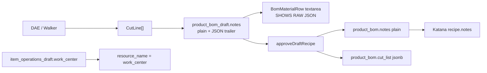

# Factory BOM × Katana UX Alignment — Execution Plan

**Status:** Approved — PR-A (Phase 1 Cut Cards) complete / ready for review  

**Audience:** Factory Manager UX / Katana Integration  
**Binding SoT:** [`docs/MDM_MASTER_BLUEPRINT.md`](MDM_MASTER_BLUEPRINT.md) (draft-before-live; no V8 bus)  
**Related:** [`docs/CAD_UPLOAD_PIPELINE_PLAN.md`](CAD_UPLOAD_PIPELINE_PLAN.md)  
**Date:** 2026-09-10

---

## Executive verdict

The extraction engine is correct. The Factory BOM UI is not. We serialize a brilliant `CutLine[]` into a JSON trailer inside `product_bom_draft.notes`, then hand the floor manager a raw developer payload in a textarea. Operations are free-text “work centers” instead of Katana’s Operation step / Resource / Setup / Run grid. Approve already *splits* plain notes vs `cut_list` for the hub — but the draft UI never used that split, and Katana tablet notes are still whatever plain prefix survived (often buried under JSON the manager never should have seen).

| Decision | Verdict (locked for build) |
|---|---|
| **Cut-list presentation** | Never show raw JSON. Detect trailer → **Cut Cards** table. Separate **Manager note** textarea for human text only. |
| **Draft persistence** | Phase 1: split/recompose via existing trailer convention. Phase 1.5 (preferred hardening): add `product_bom_draft.cut_list` jsonb to mirror live `product_bom`. |
| **Katana ingredient notes** | On Approve (and sync), format from **structured** `cut_list`, not from the textarea blob. Tablet string: `4 pcs @ 34.0 in · 45°/45° mitre`. |
| **Operations UI** | Rename columns to Katana nomenclature; table layout; Standard Track one-click insert with **exact** `resource_name` strings already used by labor/heuristic sync. |
| **Live hub / Katana gate** | Unchanged: drafts until Approve; publish still via existing Katana recipe/ops posts. |

---

## Current-state facts (code)



### Cut-list shape (canonical)

`CutLine` in `src/lib/sketchup-cutlist/types.ts`:

| Field | Role |
|---|---|
| `qtyEa` | Piece count (not `qty`) |
| `lengthIn` | Cut length inches |
| `endA` / `endB` | `45 \| 90 \| null` |
| `profile` | ProfileCode |
| `lengthConvention` | `long_point` \| `short_point` \| `square` \| `unknown` |
| `drawingPartNumber` | e.g. `CUT-SQ2-16-34.0-4545C` (what looked like `"id"` in the video) |
| `role`, `sourceName`, `confidence` | Traceability |

Trailer write (CAD + CLI instantiate):

```ts
`${line.notes}\n${JSON.stringify({ cut_list: line.cutList })}`
```

Plain prefix today comes from `formatCutNote` → e.g. `4ea 34.0in 45/45C LP CUT-SQ2-16-34.0-4545C` (`src/lib/sketchup-cutlist/long-point.ts`).

Parser already exists: `parseCutListFromNotes` (`src/lib/secondary-extraction/parse-notes.ts`) — same regex as `approveDraftRecipe`.

### Operations today

`BomOperationsPanel`: free-text Work center + Seq + Setup min + Run min. List is not a Katana-like grid.

`syncBOMToKatana` (`src/lib/katana.ts`):

- Setup row: `operation_name = "{work_center} Setup"`, `resource_name = work_center`, `type: "setup"`
- Process row: `operation_name = work_center`, `resource_name = work_center`, `type: "process"`
- Times: minutes → seconds via `planned_time_parameter`

**No resource ID map.** Strings must match live Katana Resources exactly.

Known good strings (labor / heuristic / collection-bom):

| Floor language | Hub / Katana `resource_name` |
|---|---|
| Cut | `Metal Cutting` |
| Weld | `Building & Welding` |
| Grind | `Metal Grinding` |
| Sandblast | `Metal Sandblasting` |
| Powder Coat | `Metal Powder Coating` |
| Final QC | `Quality Check` |
| Fabric Cut / Sew / Stuff | `Fabric Cutting`, `Fabric Sewing`, `Cushion Stuffing` |

**Gap:** “Primer” is not a first-class string in secondary-extraction labor today. Phase 2 must verify against live Katana Resources before inventing a name.

---

## Pillar 1 — Dummy-proof Cut-List UI

### Problem

`BomMaterialRow` binds the entire `line.notes` string (plain + `\n{"cut_list":[...]}`) into one textarea. Managers cannot edit qty/length/angles without destroying the structure secondary extract + approve depend on.

### Target UX

```
┌─ Tube RM-MET-SQ2-16 ─────────────────────────────┐
│ Qty scrap UOM …                                   │
│                                                   │
│ Cut list                                          │
│ ┌─────┬──────────┬─────────┬──────────┬────────┐ │
│ │ Qty │ Length   │ Ends    │ Conv     │ Part # │ │
│ │  4  │ 34.0 in  │ 45°/45° │ LP       │ CUT-…  │ │
│ └─────┴──────────┴─────────┴──────────┴────────┘ │
│ [+ Add cut row]                                   │
│                                                   │
│ Manager note (optional)                           │
│ ┌───────────────────────────────────────────────┐ │
│ │ Check long-point on apron rails               │ │
│ └───────────────────────────────────────────────┘ │
└───────────────────────────────────────────────────┘
```

### Data contract (draft)

**UI model (client):**

```ts
type CutCardRow = {
  qtyEa: number;
  lengthIn: number;
  endA: 45 | 90 | null;
  endB: 45 | 90 | null;
  lengthConvention: LengthConvention;
  drawingPartNumber?: string | null;
  role?: string;
  profile?: string;
};

type MaterialNotesState = {
  managerNote: string;   // human-only; never JSON
  cuts: CutCardRow[];    // empty = no structured list
};
```

**Load:** `parseCutListFromNotes(line.notes)` → seed cards from full `CutLine` when present (extend parser to return richer rows for UI, or add `parseCutListTrailer` in `sketchup-cutlist` that returns full `CutLine[]`).

**Save (Phase 1 — no schema change):**

```ts
function composeDraftNotes(managerNote: string, cuts: CutLine[]): string | null {
  const plain = managerNote.trim() || (cuts.length ? cuts.map(formatCutNote).join("; ") : "");
  if (!cuts.length) return plain || null;
  return `${plain}\n${JSON.stringify({ cut_list: cuts })}`;
}
```

Still call existing `upsertDraftBomLine({ notes: composed })`.

**Save (Phase 1.5 — schema harden, recommended before scale):**

- Migration: `product_bom_draft.cut_list jsonb not null default '[]'`
- `upsertDraftBomLine` accepts `notes` (manager only) + `cutList`
- `approveDraftRecipe` reads draft column directly (stop regex on draft)
- Keep trailer write only as **read-compat** for rows written before migration; one-time backfill script optional
- Live `product_bom` already has `cut_list` — draft finally mirrors live

### Edit rules

| Action | Behavior |
|---|---|
| Edit qty / length / ends on card | Updates structured array; regenerates `drawingPartNumber` via `formatDrawingPartNumber` when profile known |
| Add / remove cut row | Mutates array only |
| Manager note | Never touches `cut_list` |
| Empty structured + empty note | `notes = null`, no trailer |
| Legacy row with only free text | No cards; textarea-only mode until manager “Convert to cut list” (optional Phase 4) |

### Shared module (do not duplicate regex)

Promote a single package API under `src/lib/sketchup-cutlist/notes-codec.ts` (or extend `parse-notes.ts`):

- `splitBomNotes(notes) → { managerNote, cutList }`
- `composeBomNotes({ managerNote, cutList })`
- `formatFloorCutCard(cut)` — display helper for cards
- `formatKatanaIngredientNote(cuts | single)` — tablet string (Pillar 3)

Secondary extraction and approve **must** import the same codec (delete divergent regex copies).

---

## Pillar 2 — Katana UI mirroring (`BomOperationsPanel`)

### Problem

Panel title “Routing / Work Centers” + free-text work center + stacked list ≠ Katana Operations tab. Cognitive tax for staff who live in Katana all day.

### Target grid (column rename → Katana language)

| Our column today | Katana label | DB field |
|---|---|---|
| Work center | **Resource** | `work_center` (unchanged column name) |
| Seq | **Operation step** (display order; step name = Resource or “{Resource} Setup” at sync) | `sequence` |
| Setup min | **Setup time** | `setup_time_mins` |
| Run min | **Run time** / type operation duration | `run_time_mins` |

UI chrome:

- Header: **Operations** (Katana word)
- Table headers exactly as above
- Inline edit on existing rows (today: display-only + remove; add-only form)
- Resource control = **select** from canonical catalog (not free text by default); “Custom resource…” escape hatch for edge cases
- Show sync preview hint: “Katana will post Setup + Process rows for this Resource”

### Standard Track (metal frame default)

One-click checklist / dropdown: **Apply metal frame track**

| Step | Sequence | Resource (`work_center`) | Default setup | Default run |
|---|---|---|---|---|
| 1 | 10 | `Metal Cutting` | 0 or labor default | from secondary extract if present, else blank |
| 2 | 20 | `Building & Welding` | … | … |
| 3 | 30 | `Metal Grinding` | … | … |
| 4 | 40 | `Metal Sandblasting` | … | … |
| 5 | 50 | **Primer** — *verify live Katana name* | … | … |
| 6 | 60 | `Metal Powder Coating` | … | … |
| 7 | 70 | `Quality Check` | … | … |

Implementation notes:

- Server action `applyStandardTrack({ itemSku, trackId: "metal_frame" | "cushion" })` inserts missing steps only (idempotent on `item_sku + work_center + sequence` or skip if Resource already present)
- Do **not** wipe manager-edited times unless “Replace track” confirmed
- Cushion track: Fabric Cutting → Sewing → Stuffing → Quality Check (already in `labor.ts`)
- Source stamp: `manager` for track insert; preserve `secondary_extract` rows when only filling gaps

### Canonical resource catalog module

New: `src/lib/factory-routing/resources.ts`

```ts
export const KATANA_RESOURCES = [ ... ] as const;
export const STANDARD_TRACKS: Record<TrackId, TrackStep[]>;
```

Single source for UI select, track apply, and docs. Topology stage labels (`FACTORY_WORK_CENTER_STAGES`) stay visualization-only — **never** post those to Katana.

---

## Pillar 3 — Katana sync payload (data routing)

### Today’s Approve → Katana path (keep structure)

1. `approveDraftRecipe` → live `product_bom.notes` (plain) + `product_bom.cut_list` (jsonb)
2. `publishApprovedRecipeToKatana` / `syncBOMToKatana` → recipe row `notes: (line.notes ?? "").trim() || unitOfMeasure`
3. Ops → `resource_name: work_center` (string identity)

### Gap vs tablet requirement

Plain notes may still be engineer dialect (`4ea 34.0in 45/45C LP CUT-…`). Floor tablet needs:

`4 pcs @ 34.0 in · 45°/45° mitre`  
(multi-line or ` · ` joined for multiple cut cards)

### Locked sync behavior

| Surface | Source of truth | Formatter |
|---|---|---|
| Hub `product_bom.cut_list` | Structured array | unchanged jsonb |
| Hub `product_bom.notes` | Manager note **or** auto floor summary if manager note empty | set at Approve from structured data |
| Katana recipe `notes` | Prefer hub notes; if empty, regenerate via `formatKatanaIngredientNote(cut_list)` | never send JSON; never send UOM as substitute when cuts exist |
| Katana ops | `work_center` string | must be catalog Resource |

**Approve change (critical):**

```ts
const cutList = draft.cut_list ?? parseFromTrailer(draft.notes);
const managerNote = draft.notesPlain ?? stripTrailer(draft.notes);
const katanaReadyNotes =
  managerNote?.trim() ||
  (cutList.length ? formatKatanaIngredientNote(cutList) : null);

// live product_bom
notes: katanaReadyNotes,
cut_list: cutList,
```

Optional: also rewrite `formatCutNote` outputs used as plain prefix so Factory + Katana share one human dialect — but **tablet formatter is authoritative at Approve**, so even old drafts heal on Approve.

### Resource string gate

Before POST `/product_operation_rows`, optionally soft-warn (dev/QA) if `work_center` ∉ `KATANA_RESOURCES`. Do not invent IDs. Do not map topology labels.

---

## Pillar 4 — Schema / Drizzle mapping summary

| Layer | Today | Target |
|---|---|---|
| `product_bom_draft.notes` | plain + JSON trailer | Phase 1: still composed; Phase 1.5: **manager note only** |
| `product_bom_draft.cut_list` | missing | Phase 1.5: jsonb `CutLine[]` |
| `product_bom.notes` | plain after approve | floor-ready string |
| `product_bom.cut_list` | jsonb | unchanged |
| `item_operations_draft.work_center` | free text | catalog-constrained UI; same column |
| UI `DraftBomLine` | `notes: string` | `notes: string` + `cutList: CutLine[]` (API returns split) |

Server actions to touch:

- `listDraftLinesForParent` — return split fields
- `upsertDraftBomLine` — accept `cutList?` + `notes` (manager)
- `approveDraftRecipe` — format Katana notes from structure
- `applyStandardTrack` — new
- `upsertDraftOperation` — optional Resource enum validation

---

## Execution Roadmap

### Phase 0 — Research lock (½ day, no UI yet)

1. Pull live Katana Resources list (API or GAP report) and confirm Primer / Grind / Sandblast exact strings.
2. Freeze `KATANA_RESOURCES` + metal/cushion track tables in the plan appendix once verified.
3. Capture 2–3 real `product_bom_draft.notes` samples (including the video SKU) as fixtures for codec tests.

**Exit:** Resource strings approved; fixtures committed under `tests/fixtures/cut-notes/`.

---

### Phase 1 — Cut Cards (dummy-proof UI) — **highest priority**

1. Extract/unify `notes-codec` (`split` / `compose` / `formatKatanaIngredientNote` / `formatFloorCutCard`).
2. Refactor `BomMaterialRow`:
   - If `cutList.length > 0` → Cut Cards table + Manager note box
   - Else → Manager note only (current textarea, relabeled)
3. Wire save through `compose` → existing `upsertDraftBomLine`.
4. Unit tests: round-trip trailer; corrupt JSON → safe fallback; empty cuts.
5. E2E: Factory BOM material row shows cut qty/length **without** raw `{` in DOM (`data-testid` on cut cards).

**Exit:** Video 04:22 failure mode impossible; `qa:lifecycle` green.

---

### Phase 1.5 — Draft schema parity (recommended before ops polish if time allows)

1. Migration `0021_product_bom_draft_cut_list.sql`.
2. Backfill: `splitBomNotes` → populate jsonb; strip trailer from notes.
3. Update instantiate writers (CAD + `08-instantiate`) to write column + plain notes only.
4. Simplify approve (prefer column).

**Exit:** No new draft rows contain JSON trailers; legacy reader still accepts trailer once.

---

### Phase 2 — Operations panel = Katana mirror + Standard Tracks

1. Visual refactor `BomOperationsPanel` → Operations table with Katana headers.
2. Resource `<select>` from `KATANA_RESOURCES`.
3. Inline edit save via `upsertDraftOperation`.
4. `applyStandardTrack` + UI control on frame/weldment nodes.
5. Tests: track apply idempotent; sync payload still uses `resource_name = work_center`.

**Exit:** Floor manager can one-click metal track; panel readable next to Katana screenshot at 08:10.

---

### Phase 3 — Approve / Katana tablet notes

1. Implement `formatKatanaIngredientNote` (plural join rules).
2. Change `approveDraftRecipe` to set live notes from structure (Pillar 3).
3. Harden `syncBOMToKatana` / `toKatanaRecipePosts`: if notes empty and `cut_list` present, format; **never** send JSON; prefer cuts over bare UOM.
4. Update `tests/katana-recipe-notes.test.ts` + recipe preview QA path.
5. Manual Proof: Approve sample FG → Katana tablet / recipe preview shows `N pcs @ L in · A°/B° mitre`.

**Exit:** Worker-facing Katana notes match floor language; hub retains jsonb.

---

### Phase 4 — Polish, QA gauntlet, docs

1. Optional “Convert free text → cut list” helper.
2. Empty-state copy, a11y labels, mobile density for tablet-ish viewports.
3. Update Factory BOM runbook section in IT docs if needed.
4. Full `npm run qa:lifecycle` with Proof of Life block.
5. Flip this plan **Status** to Implemented.

---

## Non-goals (explicit)

- Do not auto-Approve or auto-publish to Katana from CAD upload.
- Do not implement V8 transactional bus.
- Do not replace Katana Resources with topology stage marketing names.
- Do not store cut geometry in `product_intake` quarantine.

---

## Risk register

| Risk | Mitigation |
|---|---|
| Manager edits textarea and deletes JSON trailer (today) | Phase 1 removes JSON from editable surface |
| Primer resource name wrong | Phase 0 live verify |
| Dual writers (CAD + CLI) keep emitting trailer after 1.5 | Update both instantiate paths in same PR |
| Secondary extract breaks if notes shape changes | Point it at shared codec; keep `CutListPiece` projection |
| Inline op edit races | Same `isPending` / reload pattern as material rows |

---

## Suggested first build PR (after approval)

**PR-A (Phase 1 only):** notes-codec + Cut Cards + tests + E2E assert no raw JSON.  
**PR-B (Phase 1.5 + 3):** draft `cut_list` column + Approve/Katana formatters.  
**PR-C (Phase 2):** Operations Katana grid + Standard Tracks.

Do not start coding until this document is approved (same gate as CAD upload plan).
