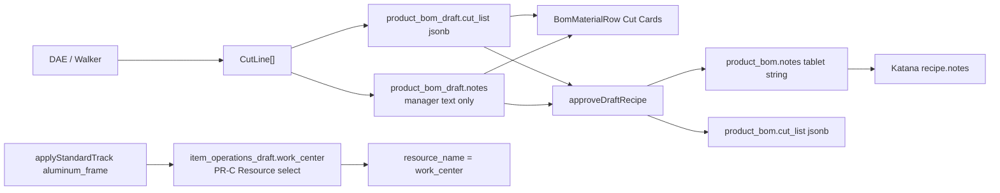

# Factory BOM × Katana UX Alignment — Execution Plan

**Status:** PR-A/B/C **COMPLETE** · Tier 1.1–1.3 **COMPLETE** (Resource SSOT, cushion track, `CATALOG_PUBLISH_MODE`, `payload_hash`) · Remaining optional = full Path A→`syncBOMToKatana` collapse + §5B Tier 2  
**Audience:** Factory Manager UX / Katana Integration  
**Binding SoT:** [`docs/MDM_MASTER_BLUEPRINT.md`](MDM_MASTER_BLUEPRINT.md) (§5 / §5A–§5C; draft-before-live; no V8 bus)  
**Related:** [`docs/CAD_UPLOAD_PIPELINE_PLAN.md`](CAD_UPLOAD_PIPELINE_PLAN.md)  
**Updated:** 2026-09-13 (Tier 1 convergence shipped; `qa:lifecycle` green)

---

## Executive verdict

Cut Cards, draft `cut_list`, tablet-formatted Approve/sync notes, Katana-mirrored Operations grid, Aluminum Frame Standard Track, and Approve ops upsert are **shipped**.  

The remaining factory risk is **Resource vocabulary drift**: secondary extraction / heuristic / collection / CAD instantiate still emit legacy strings (`Building & Welding`, `Quality Check`, `Metal Powder Coating`, …) while PR-C UI + `applyStandardTrack` use locked physical Resources (`Welding Station`, `Quality Control`, `Powder Coating Booth`, `Curing Oven`, …). That drift can create duplicate Katana cells and break capacity planning.

| Decision | Verdict |
|---|---|
| **Cut-list presentation** | **Shipped.** Cut Cards + Manager note. Structure in `product_bom_draft.cut_list`. |
| **Draft persistence** | **Shipped.** `cut_list` jsonb (migration 0021). |
| **Katana ingredient notes** | **Shipped.** `formatKatanaIngredientNote` / `resolveKatanaIngredientNotes`. |
| **Operations UI + Aluminum Standard Track** | **Shipped (PR-C).** Resource `<select>`; Apply Aluminum Frame Routing; ops upsert (`0022`). |
| **Resource SSOT across all writers** | **Open — next code PR** (blueprint §5B Tier 1.1). |
| **Cushion Standard Track** | **Open** (same PR as Tier 1.1). |
| **Live hub / Katana gate** | Drafts until Approve; explicit Factory Publish. Gate still named `ORDER_PIPELINE_MODE` — replace under §5B Tier 1.2. |

---

## Codebase reality check (2026-09-13)

```mermaid
flowchart LR
  DAE["DAE / Walker"] --> CUT["CutLine[]"]
  CUT --> COL["product_bom_draft.cut_list jsonb"]
  CUT --> NOTE["product_bom_draft.notes\nmanager text only"]
  COL --> UI["BomMaterialRow Cut Cards"]
  NOTE --> UI
  COL --> APPROVE["approveDraftRecipe"]
  NOTE --> APPROVE
  APPROVE --> LIVE_N["product_bom.notes tablet string"]
  APPROVE --> LIVE_C["product_bom.cut_list jsonb"]
  LIVE_N --> KAT["Katana recipe.notes"]
  OPS["item_operations_draft.work_center\nPR-C Resource select"] --> KOPS["resource_name = work_center"]
  TRACK["applyStandardTrack aluminum_frame"] --> OPS
```

| Video claim | Code today |
|---|---|
| JSON dump in CUT / CHOP SAW NOTES textarea | **Fixed** |
| Free-text Routing / Work Centers | **Fixed** — Resource `<select>` from `KATANA_RESOURCES` |
| Manual 15-step routing from memory | **Fixed** — Apply Aluminum Frame Routing (14-step locked track) |
| Ops panel ≠ Katana MO grid | **Fixed** — Operation step / Resource / Setup / Run |
| Katana tablet gets developer JSON | **Fixed** |
| Labor/heuristic still use old Resource names | **Open** — Tier 1.1 |

### Cut Cards edit contract (do not regress)

| Action | Behavior |
|---|---|
| Edit qty / length / ends on card | Updates `CutLine[]`; save via `upsertDraftBomLine({ notes, cutList })` |
| Manager note | Human-only; never touches `cut_list` |
| Legacy free-text only | Textarea mode until optional Convert polish |
| Approve | `notes = managerNote \|\| formatKatanaIngredientNote(cutList)` |
| Katana sync | `resolveKatanaIngredientNotes` — never JSON |

**Optional polish (PR-D / blueprint Tier 2.4):** Conv column, regenerate `drawingPartNumber`, Convert free-text → cards.

---

## Phase 0 Resource lock (APPROVED — physical workstations)

Resources are **physical cells**. Primer and final coat share **Powder Coating Booth**. Both cures share **Curing Oven**. Pack uses **Assembly & Packaging**. Do not invent “Heat Primer” / “Heat Powder”.

### Locked `KATANA_RESOURCES`

1. Material Handling  
2. Metal Cutting  
3. Welding Station  
4. Grinding Station  
5. Sandblasting  
6. Powder Coating Booth  
7. Curing Oven  
8. Quality Control  
9. Assembly & Packaging  

SSOT module: [`src/lib/factory-routing/resources.ts`](../src/lib/factory-routing/resources.ts).

### Aluminum Frame Standard Track (shipped — 14 steps)

| Seq | Floor language | `resource_name` |
|---|---|---|
| 10 | Prep / Staging | `Material Handling` |
| 20 | Cut (chop saw) | `Metal Cutting` |
| 30 | Tack / Build | `Welding Station` |
| 40 | Grind Phase 1 | `Grinding Station` |
| 50 | Finish Weld | `Welding Station` |
| 60 | Grind Phase 2 | `Grinding Station` |
| 70 | Frame Check | `Quality Control` |
| 80 | Sandblast | `Sandblasting` |
| 90 | Primer | `Powder Coating Booth` |
| 100 | Primer Cure | `Curing Oven` |
| 110 | Final Coat | `Powder Coating Booth` |
| 120 | Final Bake | `Curing Oven` |
| 130 | Final Check | `Quality Control` |
| 140 | Pack | `Assembly & Packaging` |

### Cushion track (planned — Tier 1.1)

Fabric Cutting → Fabric Sewing → Cushion Stuffing → Quality Control  

Note: fabric Resources are **not** in the locked metal `KATANA_RESOURCES` array today. Tier 1.1 must either extend the catalog with fabric cells used in production or keep cushion Resources as an additive set that is still SSOT (not free text). Prefer extending the catalog with exact Katana fabric Resource names already used in live data.

**Do not post** topology stage marketing labels (`FACTORY_WORK_CENTER_STAGES`).

### Sync contract (unchanged)

`syncBOMToKatana` (`src/lib/katana.ts`):

- Setup row: `operation_name = "{work_center} Setup"`, `resource_name = work_center`, `type: "setup"`
- Process row: `operation_name = work_center`, `resource_name = work_center`, `type: "process"`
- Times: minutes → seconds via `planned_time_parameter`

---

## Pillar status

### Pillar 1 — Cut Cards — SHIPPED

See Cut Cards contract above. Writers: CAD instantiate + CLI instantiate write column + plain manager notes.

### Pillar 2 — Ops UI + Standard Track — SHIPPED (aluminum); SSOT remaining

- UI: `BomOperationsPanel` — Operations header; Resource select; inline edit; Apply Aluminum Frame Routing.  
- Action: `applyStandardTrack({ trackId: "aluminum_frame", mode: "replace" | "fill_gaps" })`.  
- Approve: live ops **upsert** on `(item_sku, work_center, sequence)`.

### Pillar 3 — Katana tablet notes — SHIPPED

Regression guard only via existing tests.

---

## Remaining execution (aligned to MDM §5B)

### Tier 1.1 — Resource SSOT + cushion (NEXT CODE PR)

1. Point `labor.ts`, `heuristic-bom.ts`, `collection-bom.ts`, CAD/`08-instantiate`, E2E seeds at `KATANA_RESOURCES` / shared aliases.  
2. Add `STANDARD_TRACKS.cushion` + UI Apply Cushion Routing.  
3. Unit tests: every emitted Resource ⊆ catalog; aluminum track regression green.  
4. `npm run qa:lifecycle`.

### Tier 1.2 — Single Katana writer + catalog gate rename

Documented in MDM §5B — separate authorization after 1.1.

### Tier 1.3 — `channel_sync.payload_hash`

Documented in MDM §5B — separate authorization.

### Tier 2.4 — Cut Cards polish (optional)

Conv column, part# regen, Convert free-text → cards.

---

## Non-goals (explicit)

- Do not auto-Approve or auto-publish to Katana from CAD upload.  
- Do not implement V8 transactional bus.  
- Do not replace Katana Resources with topology stage marketing names.  
- Do not rebuild Cut Cards / notes-codec / PR-C ops UI.  
- Do not store cut geometry in `product_intake` quarantine.  
- Do not invent action-named oven/booth Resources.

---

## Risk register

| Risk | Mitigation |
|---|---|
| Legacy Resource strings from labor/heuristic create duplicate Katana cells | Tier 1.1 SSOT migration |
| Same Resource twice (Weld×2) confuses managers | Floor label in draft `notes`; sequence distinguishes visits |
| Dual Katana writers diverge | MDM §5B Tier 1.2 |
| `ORDER_PIPELINE_MODE` confuses operators | Rename catalog gate (Tier 1.2) |

---

## Suggested build PR board

| PR | Scope | Status |
|---|---|---|
| PR-A | notes-codec + Cut Cards | **Done** |
| PR-B | draft `cut_list` + Approve/Katana formatters | **Done** |
| PR-C | Operations Katana grid + Aluminum Standard Track + Approve ops upsert | **Done** |
| **PR-D1** | Resource SSOT unification + cushion track | **Next — authorize separately** |
| PR-D2 | Single Katana writer + catalog gate rename | After D1 |
| PR-E | Cut Cards polish | Optional |

---

## Appendix A — Files index

| Area | Path |
|---|---|
| Material row UI | `src/app/admin/factory-bom/BomMaterialRow.tsx` |
| Ops panel UI | `src/app/admin/factory-bom/BomOperationsPanel.tsx` |
| Assembly card | `src/app/admin/factory-bom/BomAssemblyCard.tsx` |
| Workbench | `src/app/admin/factory-bom/FactoryBomWorkbench.tsx` |
| Server actions | `src/app/admin/factory-bom/actions.ts` |
| Notes codec | `src/lib/sketchup-cutlist/notes-codec.ts` |
| **Resource catalog SSOT** | `src/lib/factory-routing/resources.ts` |
| Labor (migrate) | `src/lib/secondary-extraction/labor.ts` |
| Heuristic (migrate) | `src/lib/heuristic-bom.ts` |
| Op bucketing (migrate) | `src/lib/collection-bom.ts` |
| Katana sync | `src/lib/katana.ts` |
| Recipe graph notes | `src/lib/katana-recipe-graph.ts` |
| Schema | `src/server/db/schema.ts` |
| Migration 0021 | `src/server/db/migrations/0021_product_bom_draft_cut_list.sql` |
| Migration 0022 | `src/server/db/migrations/0022_item_operations_sku_wc_seq_uidx.sql` |

---

## Appendix B — Phase 0 verification checklist

- [x] Live/architect Resource lock captured (2026-09-13) — physical workstation consolidation  
- [x] Primer folded into `Powder Coating Booth`  
- [x] Heat/Cure folded into `Curing Oven`  
- [x] Pack / Final Finish → `Assembly & Packaging`  
- [x] Frozen aluminum_frame 14-step table in `resources.ts` + this appendix  
- [ ] Fabric / cushion Resource names confirmed against live Katana (Tier 1.1 prerequisite)  
