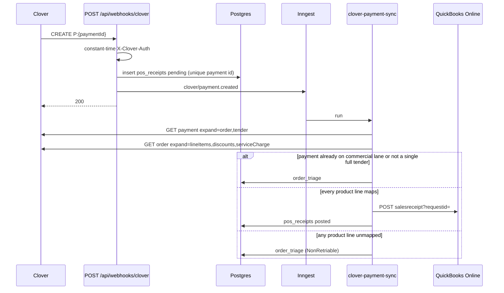

# Financial Pipeline Blueprint

**Status:** Proposed. Not authorized for implementation.
**Date:** 2026-10-04
**Scope:** Showroom Clover POS tender → deterministic Master Catalog translation → QuickBooks Online Sales Receipt.
**Binding constraint:** This document does not authorize code. Execution starts only after the decisions in §14 are accepted and `docs/MDM_MASTER_BLUEPRINT.md` is amended.

---

## 1. What this epic is

A paid Clover register ticket becomes one QuickBooks Sales Receipt.

1. Clover notifies this app that a payment was created.
2. The HTTP handler authenticates the call, stores the notice, and returns 200.
3. An Inngest worker loads the payment and its order, maps each inventory line to `global_sku` and `qbo_item_id`, and posts one Sales Receipt whose total equals the Clover tender.
4. Funds land in `QBO_GATEWAY_CLEARING_ACCOUNT_ID`.
5. A line that has no QuickBooks item is parked in `order_triage`. It is not retried until a person maps it and redrives it.

The receipt total is the reconciliation key. If QuickBooks recalculates tax, drops a modifier, or doubles a split tender, the clearing account will not zero when the processor deposit arrives. Every edge case in §8 is judged by that rule.

## 2. What this epic is not

`docs/MDM_MASTER_BLUEPRINT.md` currently forbids a custom QuickBooks invoice path and a Clover deposit matcher. `docs/COMMERCIAL_DOCUMENT_LANE.md` forbids a QuickBooks invoice mutex. Those bans stay in force. This epic is a narrow exception and must be written into the MDM blueprint before any worker ships.

| Flow | Owner | This epic |
| --- | --- | --- |
| Katana COGS and inventory into QuickBooks | Katana’s native connector | Untouched |
| Quote deposit and balance (`clover_checkouts`, commercial document lane) | Commercial document lane | Excluded. A payment id already claimed by that lane must not also become a Sales Receipt |
| Fuzzy “which deposit matches which invoice” | Retired V8 bus | Forbidden |
| WooCommerce order ingress | Native Katana connector | Forbidden |
| Catalog fan-out (create or update a Clover item) | Existing `publishToClover` | Untouched, except it must write the Clover item id back onto `sku_mappings.clover_item_id` so this pipeline can read it |
| Refunds, voids, and credit memos | Later epic | Park or ignore. Do not post a negative Sales Receipt in v1 |
| In-memory `src/lib/qbo-queue.ts` | Abandoned simulator | Do not call it |

`syncCloverPayment` is already registered on `/api/inngest`. The stub is not the design. Shipping it as-is will post wrong totals and retry unmapped items until Inngest gives up.

## 3. Current code, and why it cannot ship

| Surface | Path | What it actually does |
| --- | --- | --- |
| Webhook | `src/app/api/webhooks/clover/route.ts` | Accepts the Clover setup ping. Compares `X-Clover-Auth` to `CLOVER_WEBHOOK_SECRET`. Dispatches `clover/payment.created` for `CREATE` events whose `objectId` starts with `P:`. Awaits `inngest.send` before the 200. Does not strip the `P:` prefix. Does not persist the payload. |
| Worker | `src/inngest/clover-sync.ts` | Registered from `src/inngest/functions.ts`. Fetches the payment, then the order. Looks up `sku_mappings.clover_item_id` using the **line item id**. Throws on a miss, which Inngest retries. Hardcodes `CustomerRef` `"1"`. Sets `Amount` to `price / 100` and `Qty` to `unitQty \|\| 1`, so a normal quantity of 1 (Clover sends `1000`) becomes one thousand, and `Amount` is not `Qty × UnitPrice`. |
| Clover read | `src/server/integrations/clover/client.ts` | Uses `CLOVER_MERCHANT_TOKEN` and `CLOVER_API_URL`. Catalog publish uses `CLOVER_API_TOKEN`, `CLOVER_API_BASE`, and `CLOVER_MERCHANT_ID`. Two names for one credential. |
| QBO write | `src/server/integrations/qbo/client.ts` | Singleton row `qbo_auth_tokens`. Refresh under `pg_advisory_xact_lock(987654321)`. `pushToQBO` sets `DepositToAccountRef` from `QBO_GATEWAY_CLEARING_ACCOUNT_ID`. No Intuit `requestid`. Tokens are plaintext. |
| OAuth | `src/app/api/auth/qbo/callback/route.ts` | Exchanges the auth code and upserts the singleton row. Keep it. |
| Catalog id | `src/lib/clover-catalog.ts` → `channel_sync.external_id` | The Clover inventory id from publish is stored on `channel_sync` (`channel = 'clover'`). Nothing writes `sku_mappings.clover_item_id`. The worker’s lookup column is therefore empty after a successful catalog sync. |
| Commerce roster | `ecommerce_listings` | Product-name roster. `global_sku` is a non-unique foreign key. No `clover_item_id`. No `qbo_item_id`. It is not the translation table. |
| Ingress log | `incoming_webhooks` | `source` is only `woocommerce` or `ghl`. Cannot record Clover without a migration. |
| Dead letter | `quarantined_orders` | Same source enum, and it is for Zod SKU failures on the retired order bus. Do not overload it. |
| Queue stub | `src/lib/qbo-queue.ts` | In-process array and a `setTimeout`. Not durable. |

### 3.1 Clover does not HMAC the body

Clover’s webhook contract is:

- A setup POST whose JSON contains `verificationCode`. The handler must log it and return 200 so the developer dashboard can finish subscription.
- Later posts carry header `X-Clover-Auth`. The value is the auth code configured on the Clover app. It is a shared secret, not a signature over the bytes.

There is no `Clover-Signature` header and no documented HMAC. Building a body-signature check will reject every live event. The control is: constant-time compare of `X-Clover-Auth`, reject when `CLOVER_WEBHOOK_SECRET` is unset, and reject merchant ids outside an allowlist (`CLOVER_MERCHANT_ID`, comma-separated if a second register is added later).

## 4. Target flow



The handler returns 200 only after the `pos_receipts` insert commits. `inngest.send` runs after that insert. If the send fails, the row stays `pending` and a sweeper re-emits it. Returning 200 before the insert drops money on the floor. Awaiting only the HTTP send, with no row, drops money when Inngest accepts and then the worker crashes before its first step.

## 5. Webhook receiver

File: `src/app/api/webhooks/clover/route.ts`. Runtime stays `nodejs`. `dynamic = "force-dynamic"`.

1. Read the raw body once. Parse JSON. Invalid JSON returns **400**. Clover should not retry a body we can never parse. Do not return 200 for garbage.
2. If `verificationCode` is present, log it and return 200. Do not require the auth header on that ping. Clover sends the ping before the auth code is confirmed.
3. Compare `X-Clover-Auth` to `CLOVER_WEBHOOK_SECRET` with a constant-time compare. Missing header, missing secret, or mismatch returns **401**.
4. Ignore anything that is not `body.merchants` as an object: return 200 with `ignored: true`.
5. For each merchant id, skip the merchant when it is not on the allowlist (200, do not dispatch).
6. For each event, act only when `type === "CREATE"` and `objectId` starts with `P:`. Strip that prefix. The Clover REST path is `/payments/{id}` without `P:`.
7. `UPDATE` and `DELETE` return inside the 200 and are not dispatched in v1. A later refund epic owns them.
8. Upsert `pos_receipts` on `(merchant_id, clover_payment_id)`. First insert wins. A duplicate webhook does not send a second Inngest event when status is already `posted` or `triaged`. A `pending` row may re-send; the worker is idempotent.
9. `inngest.send({ name: "clover/payment.created", data: { merchantId, paymentId, posReceiptId } })`.
10. Return 200. The handler does not call Clover or QuickBooks.

Event name stays `clover/payment.created` so the registered function does not fork.

## 6. Worker

File: `src/inngest/clover-sync.ts`. Keep id `clover-payment-sync`. Add `retries: 4` and `concurrency: { limit: 2 }` so a token refresh stampede cannot form behind the advisory lock. `onFailure` writes the Inngest error onto `pos_receipts` and emits the existing staff alert path only for exhausted retries, not for triage.

Steps, in order. Each step’s return value is the only input to the next step. Do not close over a mutated object across `step.run`.

| Step | Name | Retriable failure | Terminal failure |
| --- | --- | --- | --- |
| 1 | `load-receipt-row` | Database blip | Row missing |
| 2 | `fetch-clover-payment` | 429, 5xx, network | 404 after retries |
| 3 | `fetch-clover-order` | 429, 5xx, network | Payment has no order id |
| 4 | `classify` | — | See §7. Classification never calls QuickBooks |
| 5 | `translate` | Database blip | Unmapped product line → triage, `NonRetriableError` |
| 6 | `build-sales-receipt` | — | Totals do not match tender to the cent → triage `total_mismatch` |
| 7 | `push-sales-receipt` | 429, 5xx, 401 after one refresh | 400 validation → triage `qbo_rejected` |
| 8 | `mark-posted` | Database blip | — |

Use `NonRetriableError` for every triage reason. A missing map will still be missing in five minutes. Retrying it creates noise and can post a partial receipt if a later attempt only fails halfway. Transient Clover and Intuit errors stay ordinary throws.

Idempotent replay: if step 8 already set `qbo_sales_receipt_id`, step 7 returns that id and does not POST again.

### 6.1 Clover reads

One client. Delete the split between `CLOVER_MERCHANT_TOKEN` / `CLOVER_API_URL` and `CLOVER_API_TOKEN` / `CLOVER_API_BASE`. The worker uses the catalog client’s resolver.

- `GET /v3/merchants/{merchantId}/payments/{paymentId}?expand=order,tender,cardTransaction`
- `GET /v3/merchants/{merchantId}/orders/{orderId}?expand=lineItems,lineItems.item,lineItems.modifications,lineItems.discounts,lineItems.taxRates,discounts,serviceCharge`

`lineItems.item.id` is the inventory id. `lineItems.elements[].id` is the **line** id. The stub looks up the line id. That will never hit `sku_mappings` or `channel_sync`.

Expand caps: if Clover pages line items (`offset` / `limit`, default page 100), follow `href` until every element is loaded. A truncated order must not post.

## 7. Translation

`ecommerce_listings` is the wrong table for this join. Several listings can share one `global_sku` (`canonical_sku_shared`). It has no Clover id and no QuickBooks item id. Using it as a lookup would either miss or pick an arbitrary roster row.

Canonical path for an inventory-backed line:

1. Inventory id = `line.item.id`.
2. Find `sku_mappings` where `clover_item_id` equals that id and `is_active` is true. Read `global_sku` and `qbo_item_id`.
3. If that column is null, find `channel_sync` where `channel = 'clover'`, `status = 'success'`, and `external_id` equals the inventory id. That row’s `global_sku` joins back to `sku_mappings` for `qbo_item_id`.
4. If the line carries a non-empty `sku` or `itemCode` equal to a `global_sku`, use that as a last resort and record `resolved_via: "sku_string"` on the receipt line. This covers a register item that was typed to the hub SKU before the id write-back existed.
5. A hit with a null `qbo_item_id` is still unmapped. Catalog sync can succeed in Clover while nobody minted the QuickBooks item.

Prerequisite, same epic, before the worker is turned on in production: `publishToClover` writes the returned Clover id onto `sku_mappings.clover_item_id` in the same success path that upserts `channel_sync`. Without that write, step 2 is empty and every ticket depends on the fallback.

Do not query `ecommerce_listings` to choose a QuickBooks item. A receipt line may store `global_sku` for the admin triage screen. If a display name is needed and several listings share the SKU, show the Clover line name, not a guessed roster name.

### 7.1 Lines that are not products

| Clover shape | v1 action |
| --- | --- |
| Inventory item, both ids present | Sales item line |
| Inventory item, missing `qbo_item_id` or missing Clover link | Triage `unmapped_sku`. Whole order stops. No partial receipt |
| Custom amount / open item (no `item.id`) | Triage `open_item` |
| Modifier with a price | Fold the cents into the parent line. Append the modifier name to `Description`. Do not require a QuickBooks item per modifier |
| Modifier with no price | Description only |
| Line discount or order discount | One negative Sales item line against `QBO_POS_DISCOUNT_ITEM_ID`. Missing env var → triage `discount_unconfigured` |
| Service charge | One line against `QBO_POS_SERVICE_CHARGE_ITEM_ID`, or triage `service_charge_unconfigured` |
| Tip | One line against `QBO_POS_TIP_ITEM_ID` (liability or tip-income item, chosen by finance). Missing env and a non-zero tip → triage `tip_unconfigured`. A zero tip is omitted |
| Order-level note | `PrivateNote`, not a line |

One unmapped **product** fails the whole receipt. House accounts (discount, tip, service charge, tax) are configuration, not per-SKU maps. They fail closed when the env id is missing and the amount is non-zero.

## 8. Edge cases

### 8.1 Fractional quantity and money

Clover `unitQty` is thousandths of a unit. `1000` means 1. `1500` means 1.5. `250` means 0.25. The stub treats `unitQty` as the quantity, so a single chair posts as 1,000 chairs.

`price` on a Clover line is integer cents. Before implementation, freeze one sandbox order of each kind below as a fixture and assert the formula against it. Do not guess from the stub.

Working rule until that fixture contradicts it:

- `qtyMilli = unitQty` when it is a positive integer, else `1000` when the line is a simple each-item.
- `qty = qtyMilli / 1000`.
- Unit price cents = the line’s unit price field the fixture identifies (not the extended total).
- Extended cents = the line’s extended amount if Clover sent one; otherwise `round(qtyMilli * unitPriceCents / 1000)`.
- QuickBooks `Qty` is the decimal quantity. `UnitPrice` is unit dollars. `Amount` is extended dollars.
- `Amount` must equal `round(Qty × UnitPrice, 2)` within one cent. If QuickBooks would reject the triple, adjust `UnitPrice` so `Qty × UnitPrice` rounds to the extended cents, and keep `Amount` equal to those cents. The tender match wins over a pretty unit price.
- All intermediate math is integer cents. Convert to a JSON number only at the payload boundary, with exactly two decimal places. No `price / 100` on a running float.

Cases the fixture must include:

- Qty 1, fixed price.
- Qty 3, fixed price.
- Fractional qty (fabric or a weighted open item if the register allows it), `unitQty` not divisible by 1000.
- A line whose extended cents are not `qty * unitPrice` because of a modifier or an included discount.
- A zero-price line (warranty card, note). Omit it from QuickBooks. Do not send `Amount: 0` unless the item is configured to allow it. Zero-price inventory that is a real SKU still must be mapped, then omitted from the money lines and listed in `PrivateNote`.
- Negative price. Triage `negative_line`. Do not invent a credit memo.

### 8.2 Tax

Clover tax and QuickBooks tax are different systems. Automated Sales Tax in QuickBooks will recompute the tax from the ship-from address and ignore a Clover rate. The receipt total will then differ from the card tender by cents or by dollars, and the clearing account will not clear.

v1 rule: the Sales Receipt is **tax-as-collected**, not tax-as-recalculated.

- Product lines use a non-taxable tax code (`QBO_NONTAXABLE_CODE`, typically `NON`) so QuickBooks does not add tax on top.
- The Clover order tax total, in cents, becomes one line on `QBO_POS_TAX_ITEM_ID`. That QuickBooks item is a liability (sales tax payable), not income. Finance creates it before go-live.
- If Clover tax is 0, omit the line.
- If several Clover `taxRates` are present, sum them. Do not map each Clover rate id to a QuickBooks `TaxCode` in v1. A per-rate map is a later epic and is only worth it if finance rejects the lump-sum liability line.
- If the company file is on Automated Sales Tax and Intuit rejects `NON` or rejects a manual tax item, stop and triage `tax_mode_rejected`. Do not let Intuit silently recompute.
- A mismatch between summed line tax and `order.tax` or payment tax fields greater than 1 cent is triage `tax_mismatch`. Do not pick a winner.

Commercial-lane quotes still do not calculate tax (decision 13). This lump-sum line is only for register tickets.

### 8.3 Customer matching and guest checkout

A Sales Receipt requires `CustomerRef`. The register usually has no customer.

v1: every showroom ticket posts to one QuickBooks customer, `QBO_WALKIN_CUSTOMER_ID` (display name such as `Clover POS Walk-in`). Do not create a QuickBooks customer per ticket. Guest checkout would mint thousands of empty customers and collide on blank emails.

When Clover sends a customer:

- Read email and phone if `expand=customers` is available on the order.
- Do **not** search-and-create in v1. Matching “the same person” on a partial phone number will attach a showroom sale to the wrong books customer.
- Put the Clover customer name, email, and phone into `PrivateNote` and `CustomerMemo` so a bookkeeper can reclass later.
- An explicit future decision can turn on match-by-exact-email against an existing QuickBooks customer. It stays off until finance asks. No match means walk-in, never a create.

`CustomerRef: "1"` in the stub is not acceptable. Customer `1` is whoever was created first in that company file.

### 8.4 Split tender, partial pay, and the commercial lane

Clover can take two tenders for one order (card plus cash, or two cards). The webhook fires per payment. If each payment posts the full order, revenue doubles.

v1 accepts a payment only when all of these hold:

- `result` is `SUCCESS`.
- `amount` is positive.
- The payment is not a refund (`refunds` empty, and the object is not a credit).
- `amount` equals the order total to the cent (single tender covering the whole ticket).
- The payment id is not already stored on a commercial-document checkout or payment event. Those charges are deposits, not register item sales. Posting them here double-counts the quote.

Anything else is triage, with a specific reason:

| Condition | Reason |
| --- | --- |
| Two or more payments, or amount ≠ order total | `split_or_partial_tender` |
| Refund, void, or `result` other than `SUCCESS` | `not_a_sale` |
| Payment id belongs to the quote/deposit lane | `commercial_lane_payment` |
| Order id missing | `payment_without_order` |

`not_a_sale` is recorded and the worker returns without retry. It is not an admin mapping task.

### 8.5 Discounts, tips, and service charges

A 10% line discount must reduce the receipt. Folding the discount into the product `Amount` hides it from the discount account and makes the unit price lie. Prefer a separate negative line on the house discount item, and leave the product line at the pre-discount extended cents, **only if** the sum of product lines + discount + tax + tip + service charge equals the payment amount.

If Clover has already netted the discount into `line.price` and also sent a discount element, using both will subtract twice. The fixture in §8.1 must show whether `price` is gross or net. The builder applies this test before push:

```
sum(product extended)
+ tax
+ tip
+ service charge
+ discounts   // discounts are negative; include only if they are not already inside product extended
== payment.amount
```

If both “discount already in price” and “discount not in price” fail the equality, triage `total_mismatch`. Do not push a receipt that is off by more than 0 cents. One cent of rounding across many fractional lines may be absorbed on the **last** product line’s `Amount` only, and only when the absolute gap is 1 cent. Larger gaps are bugs, not rounding.

### 8.6 Idempotency and duplicates

Three layers, all required:

1. **Ingress.** Unique `(merchant_id, clover_payment_id)` on `pos_receipts`.
2. **Worker.** Before POST, if `qbo_sales_receipt_id` is set, return it.
3. **Intuit.** `POST /v3/company/{realmId}/salesreceipt?requestid={id}`.

Intuit `requestid` is at most 50 characters. Same id and same body returns the original receipt. Same id and a different body returns 400, which is what we want: a changed mapping must not silently create a second receipt under a reused key.

Request id: `sr_` plus the first 40 hex chars of SHA-256 of `merchantId + ":" + paymentId`. Stable across retries. Do not use a UUID per attempt.

Also set `DocNumber` to a deterministic value Intuit will accept (max 21 characters). Use `C` + the Clover payment id, truncated to 21. If the company file uses auto-generated doc numbers, omit `DocNumber` rather than fighting the preference. That flag is an open decision (§14). `PrivateNote` always contains the full payment id and order id.

A network timeout after Intuit committed is the dangerous case. The retry must reuse the same `requestid`. It must not generate a new one.

### 8.7 OAuth refresh

Keep the singleton `qbo_auth_tokens` row and the transaction-scoped advisory lock. The lock is held across the Intuit token HTTP call today, which holds a Postgres connection for the round trip. That is acceptable at register volume. Do not invent a second mutex.

Refresh when `expires_at` is within 5 minutes, as the client already does. On refresh failure (invalid_grant), triage is wrong: every sale would park. Mark `pos_receipts.error` with `qbo_auth_failed`, throw a retriable error, and alert. A person reconnects via `/api/auth/qbo/callback`. Do not rotate the refresh token outside that lock.

Tokens are **not encrypted** today. `vendor_credentials.encrypted_token` is also written as plaintext; pgsodium is a comment, not a control. This epic does not pretend otherwise. v1 keeps the existing table. Encryption is a separate vault epic (§14) and must not block receipt posting. Logs must never print `access_token` or `refresh_token`. The OAuth callback must stop returning raw provider error bodies to the browser if those bodies can echo a token.

`DepositToAccountRef.value` is `QBO_GATEWAY_CLEARING_ACCOUNT_ID`. If that env var is empty, fail the step before HTTP. Never post a receipt into Undeposited Funds by accident.

### 8.8 Other register junk

| Case | Action |
| --- | --- |
| Test merchant vs production merchant | Allowlist. Sandbox base URL stays `CLOVER_API_BASE` / `QBO_API_URL`. Do not infer sandbox from `NODE_ENV` alone; the current QBO client does, and a production Node process pointed at a sandbox company (or the reverse) will post to the wrong host |
| Currency other than USD | Triage `unsupported_currency` |
| Line item name longer than QuickBooks description limits | Truncate description to 4000. The item ref is the identity |
| Duplicate Clover inventory ids on two `global_sku` rows | Triage `ambiguous_clover_id`. Do not pick the first row |
| Inactive SKU | Triage `inactive_sku` |
| Order with zero line items and a positive payment | Triage `no_lines` |
| Webhook arrives before Clover has committed line items (empty expansion, payment exists) | Retriable error, not triage. Inngest backoff covers the race |
| Clock skew on `TxnDate` | Use the payment’s Clover timestamp converted in `America/Phoenix`, not the worker’s UTC date, so a 6pm register close does not land on the next QuickBooks day during part of the year. Confirm the company file’s close timezone with finance |

## 9. Dead letter: `order_triage`

New table. Do not widen `quarantined_orders`.

```text
order_triage
  id                  uuid pk
  pos_receipt_id      uuid not null references pos_receipts(id)
  merchant_id         text not null
  clover_payment_id   text not null
  clover_order_id     text
  reason              text not null
  unmapped_lines      jsonb not null default '[]'
  snapshot            jsonb not null          -- payment + order used to decide
  status              text not null default 'open'   -- open | resolved | discarded
  resolution_note     text
  created_at          timestamptz
  updated_at          timestamptz
  unique (merchant_id, clover_payment_id, reason) where status = 'open'
```

`unmapped_lines` entries: `{ cloverLineId, cloverItemId, cloverName, cloverSku, priceCents, unitQty }`.

`pos_receipts` (ingress plus outcome):

```text
pos_receipts
  id                    uuid pk
  merchant_id           text not null
  clover_payment_id     text not null
  clover_order_id       text
  status                text not null   -- pending | posted | triaged | ignored
  qbo_sales_receipt_id  text
  qbo_request_id        text not null
  amount_cents          integer
  global_skus           text[]          -- denormalized for the admin list
  last_error            text
  created_at            timestamptz
  updated_at            timestamptz
  unique (merchant_id, clover_payment_id)
```

On triage the worker:

1. Upserts `order_triage` inside the same step that sets `pos_receipts.status = 'triaged'`.
2. Throws `NonRetriableError` with the reason code.
3. Does not call QuickBooks.

Redrive (same epic, otherwise the table is a landfill): an admin action `redriveOrderTriage(id)` checks that every previously unmapped line now resolves, sets the receipt back to `pending`, and sends `clover/payment.created` again. The QuickBooks `requestid` stays the original. If a previous attempt actually created a receipt, step 7 must find it (request id replay or a query by `DocNumber`) and link it instead of inserting another.

v1 admin UI is a list, not a mapper. Mapping still happens in the Master Catalog by setting `qbo_item_id` and confirming `clover_item_id`. The triage row shows the Clover ids the operator must attach. Building a second mapping form in this epic will drift from the PIM.

`incoming_webhooks.source` gains `'clover'` only if we also want the generic log. `pos_receipts` is the financial source of truth. A second log is optional and easy to get wrong (the current duplicate path overwrites a good row’s status to `duplicate`). Prefer `pos_receipts` alone.

## 10. QuickBooks payload

Illustrative shape. Field values come from the translator, not from literals in the route.

```json
{
  "TxnDate": "2026-10-04",
  "PrivateNote": "Clover payment {id} order {id} merchant {id}",
  "CustomerRef": { "value": "{QBO_WALKIN_CUSTOMER_ID}" },
  "DepositToAccountRef": { "value": "{QBO_GATEWAY_CLEARING_ACCOUNT_ID}" },
  "Line": [
    {
      "DetailType": "SalesItemLineDetail",
      "Amount": 129.0,
      "Description": "Line name; modifier names",
      "SalesItemLineDetail": {
        "ItemRef": { "value": "{qbo_item_id}" },
        "Qty": 1,
        "UnitPrice": 129.0,
        "TaxCodeRef": { "value": "{QBO_NONTAXABLE_CODE}" }
      }
    }
  ]
}
```

`pushToQBO` must take the request id as an argument and append `?requestid=`. It must not mutate a shared payload object (the current function assigns `DepositToAccountRef` on the caller’s object). Minor version query param stays whatever the Intuit app is certified for; do not bump it casually.

House items (`QBO_POS_TAX_ITEM_ID`, `QBO_POS_DISCOUNT_ITEM_ID`, `QBO_POS_TIP_ITEM_ID`, `QBO_POS_SERVICE_CHARGE_ITEM_ID`) are env ids, not rows in `sku_mappings`. They are not finished goods.

## 11. Environment

| Variable | Role |
| --- | --- |
| `CLOVER_WEBHOOK_SECRET` | Value of `X-Clover-Auth` |
| `CLOVER_MERCHANT_ID` | Allowlist. Comma-separated later |
| `CLOVER_API_TOKEN` | One token. Retire `CLOVER_MERCHANT_TOKEN` |
| `CLOVER_API_BASE` | `https://api.clover.com` or sandbox. Retire `CLOVER_API_URL` |
| `QBO_CLIENT_ID` / `QBO_CLIENT_SECRET` / `QBO_OAUTH_REDIRECT_URI` | Existing OAuth |
| `QBO_API_URL` | Explicit. Stop branching on `NODE_ENV` |
| `QBO_GATEWAY_CLEARING_ACCOUNT_ID` | `DepositToAccountRef` |
| `QBO_WALKIN_CUSTOMER_ID` | Guest and named-but-unmatched tickets |
| `QBO_NONTAXABLE_CODE` | Default `NON` |
| `QBO_POS_TAX_ITEM_ID` | Lump-sum tax liability item |
| `QBO_POS_DISCOUNT_ITEM_ID` | Negative discount line |
| `QBO_POS_TIP_ITEM_ID` | Tip line |
| `QBO_POS_SERVICE_CHARGE_ITEM_ID` | Service charge line |

Missing financial ids fail closed at the start of `build-sales-receipt` with a clear error. They are not optional defaults.

## 12. Build order

No step starts until §14 is signed. Application code is out of scope for this document.

1. **Governance.** Amend MDM: showroom Sales Receipt exception, explicit non-goals, pointer to this file. Historical banner stays on the V8 plans. Do not revive them.
2. **Schema.** `pos_receipts`, `order_triage`. Drizzle migration. Unique payment key. No change to `ecommerce_listings`.
3. **Catalog write-back.** `publishToClover` persists `clover_item_id` on `sku_mappings` when Clover returns an id. Backfill from `channel_sync` where `channel = 'clover'` and `status = 'success'` and `external_id` is not `skipped`.
4. **Credential cleanup.** One Clover token and one base URL. Worker and catalog share the client.
5. **Pure translator.** A function with no I/O: Clover order + resolution map + house item ids → either a Sales Receipt body plus cent-reconciliation, or a triage reason. Unit tests cover §8 with fixtures. This is the only place amounts are computed.
6. **Webhook.** Auth, allowlist, prefix strip, `pos_receipts` insert, Inngest send, 200. Tests for ping, 401, duplicate, and non-payment events.
7. **Worker.** Replace the body of `syncCloverPayment`. Wire `requestid`. `NonRetriableError` on triage. Do not register a second function.
8. **Redrive.** Server action plus a minimal admin list of open `order_triage` rows. Reuse Master Catalog to fix the map, then redrive.
9. **Proof.** Sandbox Clover payment and sandbox QuickBooks company. Assert one receipt, clearing account, second webhook does not create a second receipt, unmapped line creates one triage row and zero receipts.

`npm run qa:lifecycle` is required on the implementation pass. It is not a substitute for the sandbox receipt assertion, because the lifecycle suite does not tender a card.

## 13. Test matrix the execution pass must hit

| Case | Expected |
| --- | --- |
| Verification ping | 200, no Inngest event |
| Bad or missing `X-Clover-Auth` | 401, no row |
| `CREATE` `P:abc` | Row pending, event data `paymentId = abc` |
| Duplicate delivery after `posted` | 200, no second event |
| Qty 1 (`unitQty` 1000) | QuickBooks `Qty` 1, amount in dollars equals cents |
| Fractional `unitQty` | Qty matches thousandths; amount matches extended cents |
| Unmapped inventory id | `order_triage` open, no QuickBooks POST, function does not retry |
| Two SKUs, one unmapped | No receipt at all |
| Split tender | Triage `split_or_partial_tender` |
| Payment id already on the quote lane | `ignored` or triage `commercial_lane_payment`, no receipt |
| Same `requestid` retried after a timeout | One Sales Receipt |
| Token inside the 5-minute window | One refresh under the advisory lock, then POST |
| Empty `QBO_GATEWAY_CLEARING_ACCOUNT_ID` | Error, no POST |
| Discount already netted in `price` plus a discount element | Not double-counted; or `total_mismatch` if the fixture is ambiguous |
| Tax 847 cents | Non-taxable product lines plus one tax line of 8.47; receipt total equals tender |
| Guest, no Clover customer | Walk-in `CustomerRef` |
| Redrive after `qbo_item_id` is filled | Original request id, one receipt, triage `resolved` |

## 14. Decisions required before execution

1. **MDM amendment.** Accept this showroom Sales Receipt path as an exception to “the hub does not write QuickBooks.” Confirm the commercial-lane deposit path and the Katana COGS connector stay the only other money flows, and that fuzzy matching stays dead.
2. **Tax.** Accept lump-sum tax on a liability item with product lines forced non-taxable. Reject if finance requires Automated Sales Tax to recalculate. Recalculation cannot be made to match Clover to the cent.
3. **Customer.** Accept a single walk-in customer. Named Clover customers are memo-only in v1.
4. **Split tender.** Accept triage rather than allocation in v1.
5. **Refunds.** Accept “record and ignore” in v1. No credit memo.
6. **House items.** Finance creates the clearing account, walk-in customer, tax item, discount item, tip item, and service-charge item in the target company file and supplies the ids.
7. **Doc numbers.** Either the company file allows manual `DocNumber`, or we omit it and rely on `requestid` plus `PrivateNote`.
8. **Token encryption.** Defer. Do not block on pgsodium.
9. **`ecommerce_listings`.** Confirm it is not on the translation path. The join is `channel_sync` / `sku_mappings.clover_item_id` → `sku_mappings.qbo_item_id`.

Until those are answered, the execution engine does not start.
