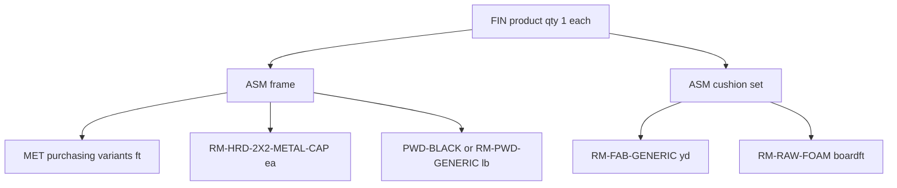

# Katana Day Zero BOM — Build Plan

**Status:** For approval. No publish script and no Katana recipe writes until this plan is accepted.  
**Date:** 2026-10-01  
**Binding context:** [`docs/MDM_MASTER_BLUEPRINT.md`](./MDM_MASTER_BLUEPRINT.md). This document is a one-shot owner exception: Katana has not been used operationally, so the recipes in it today are test data and parametric guesses and may be replaced. After Day Zero, the Factory Approve → Publish button is the only recipe writer again. This plan does not build the V8 order bus, and it does not post sales orders, manufacturing orders, or stock adjustments.

Inputs already on disk:

- Metal truth: `tmp/obj-metal-bom-review.json` (66 website OBJs, regenerated 2026-10-02).
- Soft-goods formulas: `fabricYards`, `foamBoardFeet`, `powderPounds` in `src/lib/heuristic-bom.ts`.
- Caps and leg count: `legCountFromWidth` in `src/lib/level2-bom.ts`.
- Replace mechanic already in `src/lib/katana.ts`: delete the variant’s `/bom_rows`, then `POST /bom_rows/batch/create`. Fallback `POST /recipes` with `keep_current_rows: false`.

---

## 1. Verdict

Build one local recipe document per catalog product, then replace that product’s Katana recipe with the document. Do not merge ingredient rows with whatever is already on the variant.

| Decision | Day Zero rule |
|---|---|
| Metal | From the OBJ review only. Ingredient SKU is `recipeSku` (`MET-*`). Quantity on the wire is `katanaFt` (net feet × 1.08). Do not multiply by 1.08 again. |
| Metal that level-2 would have guessed | Dropped. `buildLevel2Plan` still emits `RM-MET-*` with scrap baked into the quantity. Those lines are the guesses being replaced. |
| Fabric and foam | Heuristic formulas, on the cushion sub-assembly. Placeholders stay `RM-FAB-GENERIC` and `RM-RAW-FOAM`. Colorways are not exploded. |
| Hardware and powder | Caps and powder on the frame. Powder pounds are computed from the **measured tube feet**, not from `tubingFeet()`. |
| Where each line sits | Finished good consumes one frame and, for seating, one cushion set. Metal, caps, and powder sit on the frame. Fabric and foam sit on the cushion. |
| Overwrite | Delete every current recipe row on that variant, then create the new set. Katana has no recipe `PUT` in this codebase. |
| First trigger | `--dry-run` only, and the club-chair payload below is the acceptance exhibit. `--confirm` is a later instruction. |

---

## 2. Product tree

The hub already builds this shape in `buildHeuristicPlan` (`src/lib/heuristic-bom.ts`). Day Zero keeps it.



| Parent | Children | Source |
|---|---|---|
| `FIN-*` | `1 ea` frame. Seating also `1 ea` cushion set. | Structural. No bulk metal on the finished good. |
| `ASM-…-FRAME` | One row per mapped `MET-*`, plus caps, plus powder. Tables with Dekton or “fire” in the name also get `1 slab` `RM-DKT-GENERIC-SLAB`. | OBJ `katanaFt` for metal. Heuristic for the rest. |
| `ASM-…-CUSH` | Fabric yards and foam board-feet. Seating only. Tables have no cushion parent. | Heuristic. |

SKU stems come from the review file’s `finCandidate` / `proposedParentSku`, then `subAssemblySku(fin, "CUSH")`. The club chair file has no size in the name, so the review currently proposes `FIN-BRV-CLB-CHA` and `ASM-BRV-CLB-CHA-FRAME`. The named North Star in code is `FIN-BRV-CLB-CHA-34X34`. The dry-run resolves a live Katana variant in this order:

1. Exact `finCandidate`.
2. `finCandidate` plus dimensions taken from the filename (`72`, `56 x 42`) or, when the filename has none, the collection default (`34×34`, Ocean depth `38`).
3. `sku_aliases` / the legacy map in `src/lib/katana-fin-bom.ts` (`CLB-CHA` → `CC`).

If none of those variants exist, the row is `needs_variant`. Confirm does not invent a finished good from a filename. The dry-run lists the create-or-reuse decision for the frame and cushion parents. A missing frame or cushion **product** may be created on confirm, because a recipe cannot hang on a variant that does not exist. A missing finished good is not created in this pass.

Colorway finished goods (`-BE`, `-BO`, and the rest) are not given their own metal recipes. They keep pointing at the unsuffixed frame. Fabric stays the generic placeholder so a later order can swap `FAB-*`.

---

## 3. How a local BOM is built

Script to add after approval: `scripts/ops/publish-day-zero-boms.ts`.

```text
npx dotenv -e .env.local -- tsx scripts/ops/publish-day-zero-boms.ts --dry-run
npx dotenv -e .env.local -- tsx scripts/ops/publish-day-zero-boms.ts --dry-run --only "1 BRAVADA club chair.obj"
npx dotenv -e .env.local -- tsx scripts/ops/publish-day-zero-boms.ts --confirm --only "1 BRAVADA club chair.obj"
```

Default is dry-run. `--confirm` without `--dry-run` is the only write mode.

### 3.1 Metal rows

For each file in `tmp/obj-metal-bom-review.json` with `status: "measured"` and `draftEligible: true`:

- One Katana ingredient per `recipes[]` entry whose `recipeSku` starts with `MET-`.
- `quantity` = `katanaQuantityFt`.
- `notes` = the cut list, oldest-style shop string, truncated to 255 characters (`KATANA_BOM_ROW_NOTES_MAX`):

```text
{qty}x{longPoint}" {endA}/{endB}[ short {shortPoint}][ compound]
```

Cuts are joined with `"; "`. The 2×2 row on the club chair becomes:

```text
1x34" 45/45 short 30; 2x32" 45/45; 2x32" 45/90 short 30; 3x30" 90/90; 2x21" 45/45 short 17 compound; 2x14" 45/90 short 12; 2x10" 45/90 short 8; 2x8" 90/90
```

The full cut array stays in the dry-run JSON even when the Katana note is shortened. `rejectedPlaceholderSku` (`RM-MET-*`) is never sent.

Files that are `fused_mesh`, `no_metal`, or not `draftEligible` are omitted from the metal replace. They appear in the dry-run as `skipped` with the reason. Heuristic tube quantities are not substituted for them in v1.

### 3.2 Soft rows (heuristic, not the OBJ)

Dimensions: filename tokens when present. Otherwise `dimSource: "catalog_default"` and width/depth `34` (`38` depth for Ocean). The dry-run prints `dimSource` on every product so a default can be rejected before confirm.

Scrap is applied **once**, into the quantity that Katana stores. The script does not also send a scrap factor for Katana to multiply.

| Line | Parent | Formula for a 34×34 club chair | Wire quantity |
|---|---|---|---|
| Fabric | cushion | `fabricYards(34, 34, 0, false)` = 3.5679 yd, × 1.1 | **3.9247 yd** `RM-FAB-GENERIC` |
| Foam | cushion | `foamBoardFeet(34, 34)` = 32.1111 board-ft, × 1.05 | **33.7167 boardft** `RM-RAW-FOAM` |
| Powder | frame | `powderPounds(tube net ft)`. Tube net ft = 29.8333 + 2.5 = 32.3333. × 0.08 = 2.5867 lb, × 1.05 | **2.7160 lb**. SKU `PWD-BLACK` when that variant exists, otherwise `RM-PWD-GENERIC`. Flat bar is not in the powder base. |
| Caps | frame | `legCountFromWidth(34)` = 4 | **4 ea** `RM-HRD-2X2-METAL-CAP` |

Width ≥ 72 uses 6 caps. Tables omit fabric, foam, and the cushion parent.

### 3.3 What is not combined

- Level-2 `RM-MET-2X2-TUBING` / `RM-MET-15X075-TUBING` / `RM-MET-FLATBAR` quantities. Those are the parametric guesses.
- A second scrap pass on `katanaFt`.
- Operations. This push replaces recipe rows only. Existing operation rows are left in place.
- Stock, purchase orders, and sales orders.

---

## 4. Club chair exhibit (dry-run target)

`1 BRAVADA club chair.obj`. Metal figures are the reviewed `katanaQuantityFt` values. Soft figures use the 34×34 default and must be labeled `dimSource: "catalog_default"` until a live SKU with an explicit size wins resolution.

**Frame** `ASM-BRV-CLB-CHA-FRAME` (or the resolved 34×34 twin):

| Ingredient | Quantity | Notes |
|---|---:|---|
| `MET-TB22060` | 32.22 ft | `1x34" 45/45 short 30; 2x32" 45/45; 2x32" 45/90 short 30; 3x30" 90/90; 2x21" 45/45 short 17 compound; 2x14" 45/90 short 12; 2x10" 45/90 short 8; 2x8" 90/90` |
| `MET-FH181` | 13.5 ft | `5x30" 90/90` |
| `MET-TB11234060` | 2.7 ft | `1x30" 90/90` |
| `RM-HRD-2X2-METAL-CAP` | 4 ea | `4 legs` |
| `PWD-BLACK` or `RM-PWD-GENERIC` | 2.7160 lb | `powderPounds(32.3333 tube ft) × 1.05` |

**Cushion** `ASM-BRV-CLB-CHA-CUSH`:

| Ingredient | Quantity | Notes |
|---|---:|---|
| `RM-FAB-GENERIC` | 3.9247 yd | `MTO fabric placeholder — swap FAB-* at order time` |
| `RM-RAW-FOAM` | 33.7167 boardft | `4in seat slab` |

**Finished good** (resolved `FIN-*`):

| Ingredient | Quantity | Notes |
|---|---:|---|
| frame variant | 1 ea | `FG consumes one welded frame` |
| cushion variant | 1 ea | `FG consumes one cushion set` |

Dry-run writes `tmp/day-zero-bom-bravada-club.json` with that tree, the resolved Katana variant ids (or `null` plus `needs_variant`), and `dimSource`. No HTTP write.

---

## 5. Katana replace

For each parent that has a live variant id, on `--confirm`:

1. Ensure the frame and cushion products exist (create only those sub-assemblies, idempotency key `day0-product:{sku}`).
2. Read current `/bom_rows?product_variant_id=`.
3. `DELETE` each existing row.
4. `POST /bom_rows/batch/create` with the new rows (`product_item_id`, `product_variant_id`, `ingredient_variant_id`, `quantity`, `notes`). Chunks of 250.
5. If that route returns 404, 405, 410, 422, or 501, `POST /recipes` with `keep_current_rows: false` and the same rows. 401 and 403 do not fall back.
6. Send `Idempotency-Key: day0-bom:{sku}`.

Order is children first: cushion, then frame, then finished good. Replacing the finished good before the frame exists would point at a variant with no recipe.

Because replace means “these rows are the whole recipe,” the local document must already contain metal **and** soft goods before the delete. A metal-only post would erase fabric.

Hub follow-through, same confirm, same document: replace `product_bom` rows for those three parents so the next Factory Publish cannot write the old guesses back over Katana. Draft rows are updated to the same document with `recipe_source` left as-is and a manager note `day-zero 2026-10-01`. This is the one-shot exception to draft-before-live. It is not a new ongoing bypass.

Confirm refuses to run when `canMutateKatanaCatalog` is off. The first confirm is one file: `--only "1 BRAVADA club chair.obj"`. The other 65 stay in the dry-run report until that chair’s three recipes have been looked at in Katana.

---

## 6. Gates

| Gate | Result |
|---|---|
| `draftEligible !== true` | Skip. Listed. No delete. |
| Any stick with `recipeSku: null` | Skip the whole product. |
| Finished good variant not in Katana | `needs_variant`. No delete. |
| Ingredient variant missing | Fail that product before any delete. |
| `katanaFt` already includes 1.08 | Wire quantity is `katanaFt` for metal. Soft goods get their own single scrap multiplier. |
| Second run of the same `--confirm` | Replace again with the same payload. Idempotency key plus “delete then create” keeps the recipe equal to the file, not doubled. |

---

## 7. Decisions to lock

1. **34×34 default** for the club chair file, which has no size in the filename. Confirm or name the live SKU that should receive this recipe (`FIN-BRV-CLB-CHA` versus `FIN-BRV-CLB-CHA-34X34`).
2. **Powder SKU:** `PWD-BLACK` when the variant exists, otherwise `RM-PWD-GENERIC`.
3. **Hub write on confirm.** Recommended: yes, replace `product_bom` for the same three parents in the same run, so Factory Publish cannot restore the guesses.
4. **Fused and no-metal OBJs** (Waterfall side table, Laylo, Freelo, Shayz, Moon, Mibster, and any file that is not `draftEligible`) stay out of v1. They are listed, not overwritten.
5. **Operations** stay untouched in this push.

---

## 8. After approval

1. Implement `scripts/ops/publish-day-zero-boms.ts` as a pure local builder plus a confirm path that only calls the existing Katana replace.
2. Run `--dry-run --only "1 BRAVADA club chair.obj"` and review `tmp/day-zero-bom-bravada-club.json` against section 4.
3. Stop. Confirm is a separate instruction.
