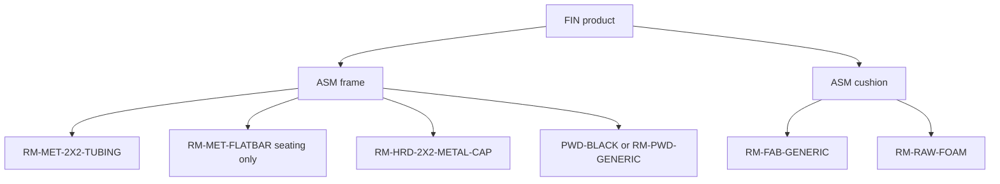

# Heuristic catalog BOM catch-up

**Status:** For approval. No Katana writes and no `--confirm` until this brief is accepted. The first execution after approval is a dry-run of `FIN-BRV-SOF-84X34` only.

Binding context: [docs/KATANA_DAY_ZERO_BOM_PLAN.md](docs/KATANA_DAY_ZERO_BOM_PLAN.md) and [docs/MDM_MASTER_BLUEPRINT.md](docs/MDM_MASTER_BLUEPRINT.md). This pass replaces parametric guesses. It does not post sales orders, manufacturing orders, or stock.

After approval, save this brief as [docs/KATANA_HEURISTIC_BOM_PLAN.md](docs/KATANA_HEURISTIC_BOM_PLAN.md) and add [scripts/ops/publish-heuristic-boms.ts](scripts/ops/publish-heuristic-boms.ts).

## 1. What gets a recipe

Live catalog comes from `GET /products` (paged), not the September dump. One recipe per base model. Color suffixes (`BL`, `WH`, `WT`, `BR`, `BE`, `BO`, `GR`) are stripped the same way as [src/lib/collection-catalog.ts](src/lib/collection-catalog.ts). Colorways keep pointing at the unsuffixed frame.

Target collections, matched on Katana `category_name` or `FIN-` prefix from [src/lib/sku-engine.ts](src/lib/sku-engine.ts):

- Bravada `FIN-BRV-`
- Brooklyn `FIN-BRK-`
- Ocean `FIN-OCN-`
- Milan `FIN-MLN-`
- Taylor `FIN-TAY-`
- Daisy `FIN-DAI-`
- Waterfall `FIN-WFT-`
- Firepit bases: category or name is a firepit **base** (`BASE` / `FRP-`). A full firepit table that already has Day Zero metal stays skipped.

Skip, and never delete their recipes:

- Every `finSku` with `status: "ready"` in [tmp/day-zero-bom-dry-run.json](tmp/day-zero-bom-dry-run.json) (the 2026-10-02 confirm artifact), plus that product’s `ASM-*-FRAME` and `ASM-*-CUSH`. That artifact has 32 unique ready SKUs, including the Bravada 72 sofa `FIN-BRV-SOF-72-72X34`. The 84 sofa is not in that set. Skipping the whole ready set is stricter than a remembered count of 14, so a ground-truth recipe cannot be replaced by a guess.
- Third-party / no-recipe categories, matched on category or name, not on the Milan prefix: Tenjam (`TJM`), Ledge Lounger, Umbrellas (`UMB`), Cabanas (`CAB`), Flexy (`ESY`), Marina (category/name Marina — `sku-engine` also maps the word Marina to `MLN`, which must not drop Milan), Kindle Living Heaters, Fire Glass.

Accessories that `classifyFamily` already marks skip (covers, umbrella weights, shades) stay skipped even inside a target collection.

## 2. Tree and formulas

Do not call `buildHeuristicPlan` as the writer. It always emits 4 caps and stores scrap in a separate column. Assemble the Day Zero parent list from the pure functions:

- `tubingFeet`, `fabricYards`, `foamBoardFeet`, `powderPounds` in [src/lib/heuristic-bom.ts](src/lib/heuristic-bom.ts)
- `legCountFromWidth`, `seatingFlatbarFeet`, `tableHeightIn` in [src/lib/level2-bom.ts](src/lib/level2-bom.ts)
- `subAssemblySku` for `ASM-{stem}-FRAME` and `ASM-{stem}-CUSH`



Quantity rules, matching Day Zero wire format (scrap baked into the number, hub `scrap_factor` `1.0000`):

- Seating height missing: `tubingFeet` uses its own 30 in default. Table height comes from `tableHeightIn` (coffee 16 in, dining/bar/fire 30 in) and is passed into `tubingFeet`.
- `RM-MET-2X2-TUBING` quantity is `tubingFeet × 1.08`. `tubingFeet` itself is net. Level 2 already bakes 1.08 into feet because Katana consumes the quantity. Do not apply 1.08 twice.
- Seating frames also get `RM-MET-FLATBAR` at `seatingFlatbarFeet` (that helper already includes 1.08). Tables do not get flatbar. No `MET-*` cut-list SKUs and no `RM-MET-15X075-TUBING`.
- Caps: `legCountFromWidth(width)` of `RM-HRD-2X2-METAL-CAP`. Width 84 in is 6, under 72 in is 4.
- Powder: `powderPounds(net tubing feet) × 1.05` lb. Prefer live `PWD-BLACK`, else `RM-PWD-GENERIC`, same lookup as Day Zero.
- Cushion, seating only: `fabricYards(width, depth, 0, false) × 1.1` yd of `RM-FAB-GENERIC`, and `foamBoardFeet(width, depth) × 1.05` boardft of `RM-RAW-FOAM`.
- Finished good consumes `1 ea` frame and, for seating, `1 ea` cushion. Tables and firepit bases have no cushion parent.
- Dekton or “fire” in a table name adds `1 slab` `RM-DKT-GENERIC-SLAB` on the frame, same as Day Zero.

## 3. Bravada Sofa 84 exhibit

`FIN-BRV-SOF-84X34` is 84 × 34 in, seating, height default 30. Net `tubingFeet` is 29.6667 ft. Posted 2×2 quantity is 32.0400 ft. Flatbar is 14.4000 ft. Caps are 6. Powder is 2.4920 lb. Fabric is 9.6963 yd. Foam is 83.2000 boardft.

Parents:

- `FIN-BRV-SOF-84X34` → `ASM-BRV-SOF-84X34-FRAME` 1 ea, `ASM-BRV-SOF-84X34-CUSH` 1 ea
- Frame → `RM-MET-2X2-TUBING` 32.0400 ft, `RM-MET-FLATBAR` 14.4000 ft, `RM-HRD-2X2-METAL-CAP` 6 ea, powder 2.4920 lb
- Cushion → `RM-FAB-GENERIC` 9.6963 yd, `RM-RAW-FOAM` 83.2000 boardft

Dry-run writes that document to `tmp/heuristic-bom-bravada-sofa-84.json`, including resolved Katana variant ids or `needs_variant`. A missing finished good is not created. A missing frame or cushion product may be created only on a later `--confirm`, because a recipe cannot hang on a variant that does not exist.

## 4. Script

[scripts/ops/publish-heuristic-boms.ts](scripts/ops/publish-heuristic-boms.ts) follows [scripts/ops/publish-day-zero-boms.ts](scripts/ops/publish-day-zero-boms.ts):

```text
npx dotenv -e .env.local -- tsx scripts/ops/publish-heuristic-boms.ts --dry-run
npx dotenv -e .env.local -- tsx scripts/ops/publish-heuristic-boms.ts --dry-run --only FIN-BRV-SOF-84X34
npx dotenv -e .env.local -- tsx scripts/ops/publish-heuristic-boms.ts --confirm
```

Default is dry-run. `--confirm` without `--dry-run` is the only write mode, and it is not run in this approval step.

- `--dry-run` prints the target and skip counts and always writes the 84 sofa JSON. It does not call Katana mutations or Postgres writes.
- `--confirm` reuses `replaceKatanaVariantRecipe` in [src/lib/katana.ts](src/lib/katana.ts): delete existing `/bom_rows` for the variant, then `POST /bom_rows/batch/create`. Order is cushion, frame, finished good. Idempotency key `heuristic-bom:{sku}`.
- Same confirm also replaces hub `product_bom` and `product_bom_draft` for those three parents, `reviewed_by` `heuristic-bom`, same transaction shape as Day Zero. Missing raw-material hub rows are inserted only when the live Katana variant exists. Confirm refuses to delete a recipe if any ingredient variant is missing.

## 5. After approval

1. Write [docs/KATANA_HEURISTIC_BOM_PLAN.md](docs/KATANA_HEURISTIC_BOM_PLAN.md) from this brief.
2. Implement the script and the pure document builder next to the existing Day Zero helpers.
3. Run `--dry-run --only FIN-BRV-SOF-84X34` and stop. `--confirm` waits for a separate instruction after the JSON is reviewed.
