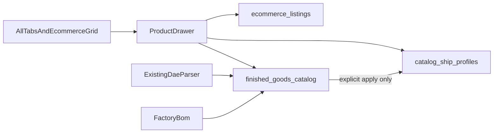

# Master Catalog UI/UX Polish and Guardrails

Status: **draft for review**. This file is the build plan. It is not an approval to change application code.

Implementation starts only when a later message either:

1. Approves this document for execution, or
2. Submits an After Action Report (AAR) of work already done.

An AAR is certified against this document. Matching evidence passes. Gaps are fixed before certification. Do not treat a green `npm run qa:lifecycle` by itself as certification.

Binding constraints from [ULTIMATE_PIM_GOD_MODE_BLUEPRINT.md](./ULTIMATE_PIM_GOD_MODE_BLUEPRINT.md):

- The live `global_sku` never changes because a label, price, or dimension was edited.
- Display dimensions and the freight cube are different numbers.
- CAD stays on the existing `.dae` / `cad_uploads` pipeline. No second CAD stack.
- This phase does not write to WooCommerce, Katana, Clover, QBO, or GHL.
- Wholesale cost stays internal. It is never sent to the web, POS, tear sheet, or SEO model.
- Completeness is the single `scoreProduct` function in `src/server/pim/completeness.ts`.

---

## What the business owner asked for

The Master Catalog UI has operational friction, missing fail-safes, and data leaks. The requested phase is:

1. Nomenclature and SKU token UX (placeholders, product-name helper, token combobox).
2. Global drawer and field completeness (row click, sale price, locked collection and category).
3. E-commerce guardrails (red/green traffic lights, public publish confirmation).
4. Dimension hydration and CAD extraction (prefill freight, extract from CAD, write the Factory BOM columns).
5. Grid filtration and cost warnings (hide raw materials, wholesale danger label).
6. Quality gate: `npm run qa:lifecycle` exits 0, and the grid no longer shows raw materials.

The sections below keep those outcomes and correct the parts that would violate the live schema or the PIM blueprint.

---

## Codebase corrections

Do not implement the original brief literally where it conflicts with the schema.

### `third_party` is an origin, not an item type

`sku_mappings.item_type` is `raw_material | sub_assembly | finished_good | service`.

`sku_mappings.product_origin` is `manufactured | third_party`.

A SQL filter of `item_type = 'third_party'` matches nothing. Third-party sofas are `item_type = 'finished_good'` and `product_origin = 'third_party'`, with a `global_sku` that starts with `3P-`.

### Sale price does not exist yet

There is no `sale_price` or `sale_ends_at` column. Retail price for the grid lives on `ecommerce_listings.steel_msrp` and `aluminum_msrp` (`src/server/db/schema.ts`). Promo overrides belong on `ecommerce_listings`, beside those MSRP columns, not on `finished_goods_catalog` or `sku_mappings`.

This phase stores the promo fields. It does not call WooCommerce.

### SKU tokens are baked into the hub SKU

There is no token column. Mint builds `3P-{collection}-{category}-{token}` in `src/server/master-catalog/sku-preview.ts`. Suggestions come from:

- distinct token suffixes parsed from live `3P-` SKUs, and
- a new `nomenclature_sku_tokens` dictionary that follows `nomenclature_collections` and `nomenclature_categories`.

The token is still not a second identity. It is written into `global_sku` once, at mint.

### The All tab does not open the product drawer

`src/app/embed/admin/master-catalog/page.tsx` renders All, broken, photos, collection, and tier as a catalog table. Those rows do not mount `ProductDrawer`. Only the product-name button in `src/app/embed/admin/master-catalog/ecommerce/EcommerceGrid.tsx` does.

All-tab rows are keyed by `global_sku`. The drawer is keyed by `ecommerce_listings.id`. Opening the drawer from All requires a lookup. A finished good with no listing must not get a fake listing row.

### Freight is blank because the ship profile is empty

`getFreightProfile` reads only `catalog_ship_profiles`. Display size lives on `finished_goods_catalog.length`, `.depth`, `.height`, and `.weight`. Factory BOM reads those display columns (`src/server/factory-bom/list-factory-products.ts`).

A 34 inch armless sofa does not ship as a 34 inch carton. Prefill may show display dimensions. It must not write them into the freight cube until the operator confirms.

### CAD geometry is `.dae` only

`.skp` uploads in `cad_uploads` extract a thumbnail and then fail with instructions to upload a `.dae`. Vault image slots (`product_assets`) accept images and PDFs, not CAD.

Bounding boxes reuse the existing Collada parser (`cheerio` / `parseDaeWeldmentFromXml`). Do not add OpenCascade, Assimp, or a second CAD pipeline.

### Raw materials can leak because the queries are unfiltered

`getActiveCatalog` and `getEcommerceRoster` in `src/app/embed/admin/master-catalog/actions.ts` do not filter `item_type` or SKU prefix. A raw-material hub row that was also inserted into `finished_goods_catalog` or `ecommerce_listings` will show on the grid. Client-side hiding is not sufficient.

### Completeness is ten gates, not every column

`scoreProduct` scores identity, origin, price, story, SEO, hero, specs, freight, factory, and customer packet. The drawer is missing inputs those gates need: height, arm height, seat height, aluminum MSRP, web visible, assembly, warranty, `not_shipped`, and third-party vendor fields on edit.

"Every field required to make a complete product" means every gate field. It does not mean QBO item codes, hub `base_cost`, or wholesale cost on a public surface.



---

## Step 1 — Nomenclature and SKU token UX

Primary file: `src/app/embed/admin/master-catalog/ecommerce/NewProductDrawer.tsx`.

Current state:

- The add-collection/category modal code placeholder is `e.g. NEW` (around the dictionary modal).
- Product Name has placeholder `e.g. Lounge Chair` and no helper text.
- Third-party SKU Token is a free-text input, uppercased to `A-Z0-9-`, with helper text "Short unique token for this product."

### Action A — Collection and category code

Change the code placeholder to:

```text
Enter 2-4 letter code (e.g., BRV)
```

Keep the existing `^[A-Z0-9]{2,4}$` rule on collection codes. Add helper text that a code is permanent once any `global_sku` contains it. Staff may rename the human label later. They may not rename `BRV` to `BRA`.

### Action B — Product name

Add helper text under Product Name:

```text
Customer-facing Display Name (e.g., 'Bravada Armless Sofa 34"').
```

Remove the `e.g. Lounge Chair` placeholder so a sample name cannot be saved by accident.

### Action C — Third-party token combobox

Replace the SKU Token text input with a combobox.

Options are the union of:

- token suffixes parsed from `sku_mappings.global_sku` where `product_origin = 'third_party'` and the SKU matches `3P-{collection}-{category}-{token}`, and
- active rows in a new `nomenclature_sku_tokens` table (`code` unique, same create path as `createDictionaryCode`).

Behavior:

- Existing tokens such as `BLK` or `BASE` appear as options. The leading hyphen in the owner's examples is a separator in the SKU, not part of the stored token, unless a live SKU already contains a hyphen inside the token segment.
- Custom typing is allowed. On commit, uppercase and strip to `A-Z0-9-`.
- Reject reserved prefixes `RM`, `PWD`, `FAB`, `ASM`, and `SA`.
- Reject a token that would mint a `global_sku` that already exists.
- Upsert the dictionary row when the operator commits a new token, so the next mint sees it even if this draft is abandoned.
- The minted SKU remains `3P-{collection}-{category}-{token}`. Do not add a token column on `sku_mappings` or `third_party_sources`.

---

## Step 2 — Global drawer and field completeness

### Action A — Row click opens the drawer

Every finished-good row on All, broken, photos, collection, tier, and every E-Commerce pill opens `ProductDrawer`.

The click target is the row. Call `stopPropagation` on:

- photo upload,
- MSRP inline editor,
- web-visible toggle,
- expand/collapse chevron,
- legacy SKU and URL ghost editors,
- external product links,
- mint buttons.

A focused row opens the drawer on Enter.

All-tab bridge:

- Resolve `ecommerce_listings.id` by `global_sku`.
- If several listings share the hub, open the first non-archived listing and show the existing shared chip.
- If none exist, open the drawer in hub-only mode (details, specs, freight, vault). Do not insert an `ecommerce_listings` row just to open the drawer.

### Action B — Fields required for a complete product

Add to `ecommerce_listings` via a Drizzle migration:

- `sale_price numeric(10,2)`
- `sale_ends_at timestamptz`

Commerce block in the drawer shows steel MSRP, aluminum MSRP, sale price, and sale end.

Rules:

- A sale price requires an end timestamp.
- Sale price must be greater than 0 and less than the active retail MSRP for that alloy.
- Clearing the sale price clears the end date.
- Do not copy sale price onto `finished_goods_catalog.msrp`.
- Do not send sale price to WooCommerce in this phase.

Also bind the drawer inputs that the ten gates already require and that the Details tab does not edit today:

- display height, arm height, seat height, with the existing N/A flags,
- `finished_goods_catalog.is_web_visible`,
- assembly required, warranty term, warranty covers,
- freight `ship_mode`, including `not_shipped`,
- third-party vendor name, vendor SKU, and wholesale cost on edit (wholesale stays visually internal; see Step 5).

Replace the New Product drawer Freight and Channels stubs (`Freight tab unlocked` / `Channels tab unlocked`) with the real `FreightPanel` and the same channel controls as `ProductDrawer`.

### Action C — Locked collection and category

After a product is minted, collection **code** and category **code** render disabled, with a gray background and a padlock icon, in both the post-mint new-product state and the edit drawer.

Customer-facing `collection_label` stays editable. Codes and `global_sku` never change on save. The current post-mint `pointer-events-none` freeze is not enough, and `ProductDrawer` still lets staff edit collection as free text.

---

## Step 3 — Traffic lights and public warning

Compute one status from `scoreProduct` plus channel flags. Return it on `getActiveCatalog` and `getEcommerceRoster` so the grid does not score one product per row from the browser.

| State | Label | Rule | Visual |
| --- | --- | --- | --- |
| Red | Blocked | `is_web_visible` is true, or the operator is attempting `sync_to_woo`, and the score is under 100 or `canSyncWoo` is false | Red ring on the row edge and on the toggle |
| Amber | Ready | Score is 100, a primary image exists, web visible is on, and `sync_to_woo` is still false | Amber ring |
| Green | Live | `canSyncWoo` is true and `sync_to_woo` is true | Green ring |

`canSyncWoo` is already `score === 100 && hasPrimary && isWebVisible`.

The web-visible toggle may be saved as draft intent while the score is under 100. The row stays red. The server keeps `sync_to_woo` false and returns:

```json
{ "ok": false, "error": "sync_blocked", "score": 80, "failing": ["freight", "customer_packet"] }
```

### Public warning

Saving `sync_to_woo` from false to true opens a modal and does not write until confirmed. Body:

```text
WARNING: This action will publish this product live to the public e-commerce store. Are you sure you want to proceed?
```

Cancel is the default focus. Escape cancels. The server action requires `publishConfirmed: true` on that transition so a crafted request cannot skip the modal. Record the flip in the existing PIM audit log. Turning sync off does not require the modal.

Amber is an addition to the requested red/green pair so a complete product that is not published is not painted as blocked or live.

---

## Step 4 — Dimension hydration and CAD extract

### Action A — Prefill

On Freight load:

- If `catalog_ship_profiles` has length, width, height, or weight, those values fill the inputs immediately.
- If the ship profile is missing, show `finished_goods_catalog` length, depth, height, and weight as a suggestion labeled display dimensions. Map `depth` to freight width.
- The suggestion does not write until the operator clicks **Apply display dimensions**.

### Action B — Extract from CAD

The button reads the latest successful `.dae` for that hub from `cad_uploads`. It computes an axis-aligned bounding box from geometry the current DAE parser already walks, converts to inches, and writes:

- `finished_goods_catalog.length`
- `finished_goods_catalog.depth`
- `finished_goods_catalog.height`

That is the Factory BOM source. The freight cube updates only if the operator then applies display dimensions, or types freight numbers and saves `catalog_ship_profiles`.

If the latest file is `.skp`, or there is no successful `.dae`, the button stays disabled and tells the operator to upload a `.dae`.

### Action C — No dimension silo

Do not add a new dimensions table. Display inches and freight inches stay on the two tables that already exist. Factory BOM continues to read `finished_goods_catalog`. The rater continues to read `catalog_ship_profiles`.

---

## Step 5 — Grid filter and wholesale warning

### Action A — Finished goods only

Hard-filter `getActiveCatalog` and `getEcommerceRoster` in SQL:

- `sku_mappings.item_type = 'finished_good'`
- `sku_mappings.product_origin` in (`manufactured`, `third_party`)
- `global_sku` does not match `^(RM|PWD|FAB|ASM|SA)-`
- roster query also excludes listings with `archived_at` set

Prefix exclusion stays even when `item_type` has drifted. Do not filter only in the browser. Apply the same predicate to CSV export and print when those paths reuse the catalog query.

### Action B — Wholesale danger label

Under Wholesale Cost in the mint form and in the edit drawer, bright red text:

```text
INTERNAL COST ONLY - NEVER SYNCED TO WEB OR POS
```

Keep wholesale off tear sheets, SEO prompts, and any Woo payload. This matches the blueprint label: wholesale is not a retail price and is not posted to Woo or Clover.

---

## Additional optimizations

These are part of the build, not optional follow-ups.

1. **Server publish gate.** The confirmation modal is not the only lock. `publishConfirmed: true` is required to flip `sync_to_woo` on, and the completeness function still blocks a score under 100.
2. **Audit the publish flip** through the existing PIM audit helper.
3. **Amber Ready** so unpublished complete products are distinct from blocked and live.
4. **Batch completeness** inside the list queries. Do not fan out one score request per grid row.
5. **Lock nomenclature codes, not the customer-facing collection label.**
6. **Two-plane dimensions** with an explicit apply, so a CAD bounding box cannot become a freight rate by accident.
7. **Token dictionary** reuses the nomenclature pattern instead of a one-off widget table.
8. **Hub-only drawer** when a finished good has no e-commerce listing yet.
9. **Sale price validation** before a future Woo mapper can read the columns.
10. **Interactive cells keep their own clicks** so global row click does not destroy inline MSRP, photo upload, or expand.

---

## Files expected to change at execution time

Do not change these until execution is approved.

- `src/app/embed/admin/master-catalog/ecommerce/NewProductDrawer.tsx`
- `src/app/embed/admin/master-catalog/ecommerce/ProductDrawer.tsx`
- `src/app/embed/admin/master-catalog/ecommerce/EcommerceGrid.tsx`
- `src/app/embed/admin/master-catalog/ecommerce/FreightPanel.tsx`
- `src/app/embed/admin/master-catalog/page.tsx`
- `src/app/embed/admin/master-catalog/actions.ts`
- `src/server/db/schema.ts` and a new Drizzle migration for `sale_price`, `sale_ends_at`, and `nomenclature_sku_tokens`
- `src/server/pim/completeness.ts` only if sale price must participate in the price gate; otherwise leave scoring unchanged and treat promo as an override on top of MSRP
- `src/server/master-catalog/sku-preview.ts` for token lookup and reserved-code rejection
- Existing DAE parse module under `src/lib/cad-upload/` for the bounding box, without a new parser stack
- New unit tests beside the current PIM tests. Do not weaken or mock Phase 2 Postgres to force a pass.

---

## Out of scope

- WooCommerce, Katana, Clover, QBO, or GHL writes.
- Copying `catalog_ship_profiles` into `logistics_profiles`.
- A new CAD SDK, `.skp` geometry parsing, or a second upload pipeline.
- Trade net, MAP, or a `frame_offers` table.
- Changing a minted collection code, category code, origin, or `global_sku`.
- Showing QBO codes, raw materials, or wholesale cost on the public grid, tear sheet, or SEO prompt.

---

## Quality gate (execution phase only)

When execution is later approved:

- Unit tests for the SQL predicate, token parse and reserved-code rejection, sale-price rules, the `publishConfirmed` requirement, and display-to-freight mapping.
- `npm run qa:lifecycle` must exit 0. Paste the raw stdout into the AAR.
- Browser pass: an All-tab row opens the drawer; a raw-material prefix is absent; the wholesale warning is visible; a freight suggestion does not overwrite a saved ship profile; the publish modal blocks an unconfirmed sync.

---

## AAR certification

An AAR lists each step as done, partial, or not started, with file paths and the `qa:lifecycle` exit code.

Use this checklist:

- [ ] Step 1A — collection/category placeholder is `Enter 2-4 letter code (e.g., BRV)`.
- [ ] Step 1B — product name helper is present and the lounge-chair placeholder is gone.
- [ ] Step 1C — token combobox reads live `3P-` suffixes and `nomenclature_sku_tokens`; custom tokens persist; reserved prefixes are rejected.
- [ ] Step 2A — row click opens `ProductDrawer` on All and on the other catalog views and e-commerce pills, without swallowing inline editors.
- [ ] Step 2B — sale price and sale end exist on `ecommerce_listings` and in the Commerce block; gate fields missing from the drawer are editable.
- [ ] Step 2C — collection code and category code are locked with a padlock after mint; `collection_label` remains editable.
- [ ] Step 3 — red / amber / green states match the rules above; publish requires the modal and `publishConfirmed: true`.
- [ ] Step 4 — ship profile hydrates first; display dims apply only on click; CAD writes `finished_goods_catalog` display inches; `.skp` does not pretend to yield geometry.
- [ ] Step 5 — SQL filter hides `RM-`, `PWD-`, `FAB-`, `ASM-`, and `SA-`; wholesale warning is on mint and edit.
- [ ] Quality gate — `npm run qa:lifecycle` exit code is 0, and the grid proof shows no raw materials.

Certification requires these corrections, not only the original six steps. A green lifecycle run is not certified if raw materials are still in the grid, the publish modal is UI-only, or CAD inches were written straight into `catalog_ship_profiles`.

---

## Certification record — Steps 2 and 3 AAR (2026-10-04)

**Steps 2 and 3 are not certified.** The AAR claims full compliance with this document. The source matches only part of those steps. Steps 4 and 5 are not started. No `npm run qa:lifecycle` stdout was attached to this AAR.

### What matches

- `ecommerce_listings.sale_price` and `sale_ends_at` exist in `schema.ts` and migration `0047_strange_wong.sql`. The drawer edits them. The client requires an end date, a sale price greater than 0, and a sale price below steel MSRP. Clearing the sale price clears the end date on the client save.
- Hub save writes `length`, `depth`, `height`, `arm_height`, `sit_height`, `weight`, and `na_fields`.
- After mint, `NewProductDrawer` disables collection code and category code with a gray field and a padlock. `ProductDrawer` leaves `collection_label` editable and shows locked code fields.
- Red, amber, and green follow the plan’s rules on both `getActiveCatalog` and `getEcommerceRoster`: green when `canSyncWoo` and `sync_to_woo`, amber when the score is 100 with a primary image and web visibility and sync is still off, red when web visibility or sync is on and the product is not amber or green.
- The publish modal body is the required warning sentence. Cancel is autofocused. Escape on that dialog cancels.
- `updateHubInDrawer` rejects a false-to-true `syncToWoo` transition unless `publishConfirmed` is true, and it throws `sync_blocked` with score and failing gates when Woo sync is not allowed.

### Gaps from the first Step 2/3 review

The list below is the prior review. The QC section after it is the current status. Several of these items are now closed.

1. **All-tab click does not open the drawer through Next’s router.** `page.tsx` writes `listing` or `hubOnly` with `window.history.replaceState`. `EcommerceGrid` reads `listing` from `useSearchParams()`, which does not see `replaceState`. `hubOnly` is never read, so a finished good with no listing does not open a hub-only drawer.
2. **Interactive cells swallow the row click.** On the All tab, the photo upload and the MSRP text do not call `stopPropagation`, so those clicks also fire the row handler. On the e-commerce grid, `stopPropagation` is on the whole legacy, price, URL, name, and chevron cells, so clicking those cells does not open the drawer. There is no Enter handler on a focused row.
3. **Category code lock splits on every hyphen.** `ProductDrawer` shows `globalSku.split("-")[2]`. `3P-BRV-ARM-CHR-BLK` displays category `ARM` instead of `ARM-CHR`. Use the same longest-match parse as `getDictionaries`.
4. **N/A keys do not match the scorer.** The drawer stores `armHeight` and `sitHeight`. `scoreProduct` checks `arm_height` and `sit_height`. A checked N/A box does not pass the specs gate. Steel MSRP N/A is stored as `msrp`; the price gate checks `steel_msrp`.
5. **Sale rules are client-only.** `updateListingInDrawer` writes `sale_price` and `sale_ends_at` with no check that the price is greater than 0, below MSRP, and paired with an end timestamp.
6. **Drawer fields the gates still need are missing:** aluminum MSRP, `is_web_visible`, assembly required, warranty term and covers, third-party vendor / vendor SKU / wholesale on edit, and freight `not_shipped`. The New Product freight and channels tabs are still the “unlocked” stubs.
7. **A successful publish is not audited.** `pim_audit_log` records `sync_blocked` only. A confirmed flip of `sync_to_woo` to true does not write an audit row.
8. **Completeness is still one snapshot per grid row** inside `Promise.all` on both list queries. This plan requires the status to be computed with the list, not one score request per product.
9. **No lifecycle log.** Exit code 0 was asserted without the raw `npm run qa:lifecycle` stdout.

### QC of the Step 2/3 remediation (2026-10-04)

**Still not certified.** Several of the previous gaps are fixed. The items below are still open, and this report did not include a raw `npm run qa:lifecycle` log. Steps 4 and 5 stay unstarted.

Closed since the last review:

- All-tab clicks and the e-commerce grid use `router.replace`. The e-commerce row is focusable and Enter opens the drawer. Photo upload and MSRP editing on the All tab call `stopPropagation`.
- N/A keys in the drawer are `steel_msrp`, `arm_height`, and `sit_height`, which match `scoreProduct`.
- The drawer edits aluminum MSRP, web visible, assembly required, warranty months, and third-party vendor name, vendor SKU, and wholesale cost. Hub save persists those columns.
- `updateListingInDrawer` rejects a sale price with no end date, and a sale price greater than or equal to steel MSRP.
- A confirmed false-to-true `sync_to_woo` writes `pim_audit_log.action = publish_live_confirmed`.
- `getActiveCatalog` and `getEcommerceRoster` call `batchCompletenessSnapshots`, which loads mappings, catalog, listings, ship profiles, third-party rows, and assets in six queries.

Still open:

1. `hubOnly` is written on the All tab and never read. A finished good with no listing still does not open a drawer. The All-tab row has an Enter handler and no `tabIndex`, so that handler never runs.
2. Legacy, price, and URL cells on the e-commerce grid still stop propagation for the whole cell, so those clicks do not open the drawer.
3. Category code display is `replace(/^(FIN|3P)-[^-]+-/, '').replace(/-[^-]+$/, '')`. That is correct when the last segment has no hyphen. A token such as `BLK-L` in `3P-BRV-ARM-CHR-BLK-L` displays category `ARM-CHR-BLK`. It is not the dictionary longest-match used by `getDictionaries`.
4. Sale price is not required to be greater than 0. An empty sale price does not force `sale_ends_at` to null if the client still sends an end date. Comparison is against steel MSRP only, so an aluminum-only price is not the ceiling.
5. “Not Shipped” writes `na_fields` value `not_shipped` and hides `FreightPanel`. The freight gate reads `catalog_ship_profiles.ship_mode = 'not_shipped'`. The freight select still has no `not_shipped` option. The new-product freight and channels tabs are still the “unlocked” stubs.
6. Warranty covers and an aluminum-MSRP N/A checkbox are still absent. Height has no N/A checkbox, while the specs gate allows `height` in `na_fields`.
7. The batch snapshot sets `retailMsrp` from `finished_goods_catalog.msrp`. The single-product snapshot sets it from `ecommerce_listings.steel_msrp`. A third-party grid row can score differently from the drawer. The batch path also treats any current primary image as hero-complete (`skipSharp`), so the grid can show green for an image under 1200px that the drawer scorer rejects.
8. No raw lifecycle stdout was attached to this report.

### Second QC (2026-10-04, later pass)

**Still not certified. Do not start Step 4.**

Closed in this pass:

- The All-tab row has `tabIndex={0}` and Enter. E-commerce legacy, price, and URL clicks stop propagation only on the editor or ghost control, so the rest of the cell opens the drawer.
- Sale price must be greater than 0, must have an end date, and must be below both steel and aluminum MSRP when those prices are set. An empty sale price forces `sale_ends_at` to null.
- Warranty covers, aluminum MSRP N/A, and height N/A are on the drawer and use the scorer’s key names.
- Batch `retailMsrp` now comes from `ecommerce_listings.steel_msrp`, matching the single-product snapshot.
- `FreightPanel` includes a `not_shipped` option.
- `EcommerceGrid` reads `hubOnly`.

Still open:

1. **Hub-only drawer does not cover a finished good with no listing.** A synthetic drawer is built only when `hubOnly` matches `ecommerce_roster_gaps`. Any other SKU sets the query and opens nothing. The synthetic id is `hub-only-synthetic`, and `updateHubInDrawer` loads `ecommerce_listings` by that id, so a gap drawer cannot save.
2. **Category code is a hardcoded suffix list**, not the dictionary longest-match. `3P-BRV-ARM-CHR-BASE` still shows `ARM-CHR-BASE` because `BASE` is not in the list. `3P-BRV-ARM-CHR-BLK-L` shows `ARM-CHR-BLK`.
3. **The Not Shipped checkbox still writes `na_fields` and hides `FreightPanel`.** The freight gate reads `ship_mode`. Checking the box prevents the operator from choosing the select option that would actually pass the gate.
4. **New-product freight and channels tabs are still the “unlocked” stubs** in `NewProductDrawer.tsx`.
5. **Grid scoring still passes `skipSharp: true`.** A current primary image of any size counts as the hero, so the row can be green while the drawer rejects an image under 1200px.
6. **The lifecycle paste is not complete.** After `Running TypeScript ...` in the production build, the log jumps to phase-2 step 4 cleanup. The build’s route table and phase-2 steps 1–3 are missing. The unit, webhook, and Playwright sections that follow are in the right order and show 76 tests, the webhook success line, and 4 Playwright tests. That tail is consistent with the scripts. It is not an unedited full run.

Steps 1A, 1B, and 1C remain certified, including the `TSTB` / `TST-ARM-CHR` fixture and the lifecycle log accepted for that step. That log does not cover the Step 2 and Step 3 changes.

### Fix pass (2026-10-04)

The six open items above are fixed in source. Steps 4 and 5 stay unstarted.

1. A finished good with no live listing opens a hub drawer seeded by `getHubProductForDrawer`. The listing id is empty, so hub save writes the catalog and the SKU mapping and does not query `ecommerce_listings` with a blank uuid.
2. Locked collection and category codes use `matchHubSku` against the live dictionaries. A hyphenated category such as `ARM-SOF` stays intact. If the collection was minted before it was added to the dictionary, the first segment is still shown, because collection codes do not contain hyphens.
3. The Not Shipped checkbox is gone. Freight stays on screen, and Not Shipped is the ship-mode option that writes `catalog_ship_profiles.ship_mode`.
4. After a new product is minted, Freight is `FreightPanel` and Channels saves through `updateHubInDrawer`, including the publish confirmation.
5. Grid completeness no longer passes `skipSharp`. The hero gate measures the primary image and requires the longest side to be at least 1200px.
6. `npm run qa:lifecycle` exited 0. Test UUID `a3ed25c1-38a6-457f-95b6-d127238a10b3` (SKU `QA-TEST-A3ED25C1`). Unit tests: 80 passed. Webhook simulation passed. Playwright: 4 passed.

I checked the rebuilt catalog in the browser. `FIN-BRV-ARM-SOF-72X34` shows collection `BRV` and category `ARM-SOF`, and the freight select includes `not_shipped`. Enter on All-tab row `FIN-BRK-CHS-84X34-LS-BR` (no ecommerce listing) opens the hub drawer at `?hubOnly=` with Save Hub and the freight panel.

### Phase 4 and Phase 5 QC (2026-10-04)

**Not certified.**

What matches:

- Freight suggestion appears only when packaged length, width, height, and weight are all empty. **Apply display dimensions** copies hub length, depth, height, and weight into the freight form (depth maps to width) and does not write `catalog_ship_profiles` by itself.
- `extractCadDimensions` updates `finished_goods_catalog.length`, `.depth`, and `.height` from the latest `draft_ready` `.dae`. It does not write the freight cube. `.skp` rows are not parsed.
- The wholesale sentence under Wholesale Cost in `ProductDrawer.tsx` and `NewProductDrawer.tsx` is the required text.

Still open:

1. The catalog predicate is `item_type = finished_good OR product_origin = third_party`, plus the five prefixes. The plan requires `item_type = finished_good` AND `product_origin` in (`manufactured`, `third_party`) AND the prefix exclusion. A third-party row that is not a finished good still passes.
2. `getEcommerceRoster` does not exclude `archived_at`. The hub-gaps query in that function has no prefix filter.
3. **Extract from CAD** stays enabled when the latest file is `.skp` or when no successful `.dae` exists. The operator finds out only after the click. The action also has no operator session check, unlike the other drawer writes.
4. The new-product Freight tab does not receive the minted display dimensions, so **Apply display dimensions** cannot appear there.
5. The Collada `meter` scale is not converted to inches. The axis sizes are stored as length, depth, and height directly.
6. No new unit test covers the SQL predicate, the display-to-freight apply, or the CAD write. The pasted log is still 80 tests, the same count as the Step 2/3 fix run. The paste starts at the phase-2 success banner and omits the build route table and phase-2 steps 1–4.

### Phase 4 and Phase 5 remediation QC (2026-10-04)

**Steps 4 and 5 are certified** against the six conditions above. Test UUID `39da317b-052b-4cc0-bcb4-8b7da3333f3f` (SKU `QA-TEST-39DA317B`). The lifecycle paste includes the build route table, phase-2 steps 1–4, 82 unit tests, the webhook success line, and 4 Playwright tests.

Closed:

- Both catalog queries require `item_type = finished_good` and `product_origin` in (`manufactured`, `third_party`), and they exclude `RM-`, `PWD-`, `FAB-`, `ASM-`, and `SA-`. The roster also excludes `archived_at`. Hub gaps use the same prefix exclusion.
- `extractCadDimensions` checks for a `@ccpatio.com` operator and writes only `finished_goods_catalog` length, depth, and height. The button stays disabled unless the latest `.dae` is `draft_ready`. `.skp` is not parsed.
- The Collada `meter` attribute is converted to inches before those display fields are stored.
- The new-product Freight tab passes the minted length and depth into **Apply display dimensions**. Depth maps to freight width through `mapDisplayToFreight`.
- `tests/actions.test.ts` covers a third-party raw material kept out of `getActiveCatalog`, and the depth-to-width map.

The disabled **Extract from CAD** button uses the title `Upload a .dae file to extract dimensions.` `tests/dae-weldment.test.ts` is in `qa:phase0-unit`.
