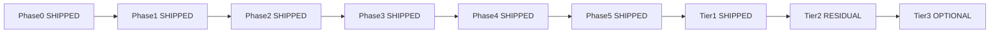

# MDM Hub — Master Execution Plan

**Document ID:** `MDM_EXECUTION_PLAN`  
**Path:** `docs/MDM_EXECUTION_PLAN.md`  
**Binding SoT:** [`docs/MDM_MASTER_BLUEPRINT.md`](./MDM_MASTER_BLUEPRINT.md)  
**Audience:** Lead Systems Architect (authorization) · Coding agents (implementation)  
**Created:** 2026-09-13  
**Status:** ACTIVE — PR sequencing for MDM Phases 1–5 + residual completeness

---

## 0. How to use this document

1. **Do not implement code from this file until the architect authorizes a specific PR ID** (e.g. `PR-1a`, `PR-T2.1`).  
2. Every PR must exit `npm run qa:lifecycle` with code **0** before the next PR starts (see §QA).  
3. Binding architecture, non-goals, and V8 bans live only in the Master Blueprint. This file sequences work; it does not replace the SoT.  
4. **Reality check (codebase as of 2026-09-13):** MDM Phases **0–5 are already implemented** in-tree. Phase 0 + §5B Tier 1 (Resource SSOT, `CATALOG_PUBLISH_MODE`, `payload_hash`) are also done. PRs below are therefore labeled:

| Label | Meaning |
|---|---|
| **SHIPPED** | Present in repo; do **not** rebuild. Use the checklist as a regression / audit gate only. |
| **RESIDUAL** | Gap still open against blueprint “fully complete”; requires fresh authorization. |
| **OPTIONAL** | §5C advancement — not required for hub completeness. |

Agents that re-implement SHIPPED PRs violate blueprint §16.8.



---

## 1. Phase 1 — SketchUp gateway & recursive schema

**Blueprint:** §9  
**Goal:** Valid CAD → quarantined draft; invalid CAD never touches Postgres; nested BOMs queryable via recursive SQL.

### PR-1a — Drizzle: `product_intake` + `channel_sync` + SEO + RM FK

| Field | Value |
|---|---|
| **Status** | **SHIPPED** |
| **Migrations** | `0013_mdm_phase1_intake.sql` (and journal successors through `0015`) |
| **Schema** | [`src/server/db/schema.ts`](../src/server/db/schema.ts) |

**Exact tables / columns (do not invent alternate shapes):**

| Object | Key columns / rules |
|---|---|
| `product_intake` | PK `export_id` (uuid); `status` enum `quarantined \| approved \| rejected \| superseded`; `raw_payload` jsonb NOT NULL; `zod_issues` jsonb; `proposed_sku`; `created_by`; `reject_reason`; OCC `version`; timestamps |
| `channel_sync` | PK uuid; `global_sku` → `sku_mappings`; `channel` enum `katana \| woocommerce \| clover`; `external_id`; `status` enum `pending \| success \| failed`; `last_error`; **`payload_hash` varchar(64)** (added migration `0023`); unique `(global_sku, channel)` |
| `finished_goods_catalog` SEO | `slug`, `seo_title`, `seo_description` (Phase 1 SEO columns — present) |
| `raw_materials_catalog` | FK to `sku_mappings.global_sku` (1:1 extension; BOM children must be hub SKUs) |

**Intake draft BOM (blueprint nuance):** Separate relational “intake BOM lines” table was **not** created. Nested BOM lives in `product_intake.raw_payload` and is flattened on Approve (`src/server/sketchup/draft-bom.ts`). Factory CAD uses `product_bom_draft` instead. Optional relational intake table = §5C / **PR-OPT-intake-bom**.

**Authorize next only if:** schema drift detected vs production; otherwise skip to regression checklist.

**Regression checklist:**

- [ ] `product_intake` unique on `export_id`  
- [ ] Invalid SketchUp payload → **zero** new intake rows  
- [ ] `channel_sync` unique `(global_sku, channel)` + `payload_hash` column exists  

---

### PR-1b — `bom_explosion` view + `src/server/db/queries/bom.ts`

| Field | Value |
|---|---|
| **Status** | **SHIPPED** |
| **Module** | [`src/server/db/queries/bom.ts`](../src/server/db/queries/bom.ts) |

**SQL strategy (live implementation):**

```sql
WITH RECURSIVE bom_explosion AS (
  SELECT
    :root::text AS root_sku,
    pb.parent_sku, pb.child_sku, pb.quantity, pb.scrap_factor,
    pb.unit_of_measure, pb.notes,
    1 AS depth,
    ARRAY[pb.parent_sku, pb.child_sku]::text[] AS path
  FROM product_bom pb
  WHERE pb.parent_sku = :root
  UNION ALL
  SELECT
    be.root_sku, pb.parent_sku, pb.child_sku, pb.quantity, pb.scrap_factor,
    pb.unit_of_measure, pb.notes,
    be.depth + 1,
    be.path || pb.child_sku
  FROM product_bom pb
  INNER JOIN bom_explosion be ON pb.parent_sku = be.child_sku
  WHERE be.depth < 12
    AND NOT (pb.child_sku = ANY (be.path))  -- cycle guard
)
SELECT ... ORDER BY depth, parent_sku, child_sku;
```

**Drizzle logic:** `db.execute(sql\`...\`)` with bound `rootSku`; max depth **12**; cycle prevention via path array membership.

**API surface:**

- `explodeBomTree(rootSku): Promise<BomExplosionRow[]>`  
- Row shape: `root_sku`, `parent_sku`, `child_sku`, `quantity`, `scrap_factor`, `unit_of_measure`, `notes`, `depth`, `path[]`

**Regression checklist:**

- [ ] Seeded welded fixture depth ≥ 3 returns ordered paths  
- [ ] Cycle A→B→A does not infinite-loop  

---

### PR-1c — Zod ingest contract

| Field | Value |
|---|---|
| **Status** | **SHIPPED** |
| **File** | [`src/server/sketchup/ingest.schema.ts`](../src/server/sketchup/ingest.schema.ts) |

**Validation outline (must remain):**

| Rule | Implementation |
|---|---|
| Max BOM depth | `SKETCHUP_MAX_BOM_DEPTH = 12`; recursive `createSubassemblySchema(depth)` refuses deeper children |
| Qty | `z.number().positive()` |
| UOM | non-empty trimmed string |
| Operations | `work_center` min 1; optional `sequence`, `setup_mins`, `run_mins` ≥ 0 |
| `export_id` | UUID (top-level product payload) |
| Dimensions | optional length/depth/height/arm/sit/weight; `.strict()` objects |
| Item types | optional enum `raw_material \| sub_assembly \| finished_good \| service` |

Companion flatten helper: [`src/server/sketchup/draft-bom.ts`](../src/server/sketchup/draft-bom.ts).

---

### PR-1d — `POST /api/webhooks/sketchup`

| Field | Value |
|---|---|
| **Status** | **SHIPPED** |
| **Route** | [`src/app/api/webhooks/sketchup/route.ts`](../src/app/api/webhooks/sketchup/route.ts) |
| **Secret** | `SKETCHUP_WEBHOOK_SECRET` (HMAC header `X-CCPatio-Signature`) |

**Behavioral contract:**

| Case | HTTP | DB |
|---|---|---|
| Missing/invalid HMAC | **401** | no insert |
| Zod fail | **400** `{ errors: [{ path, message }] }` | **no insert** |
| Valid new `export_id` | **202** | insert `product_intake` status `quarantined` |
| Replay same `export_id` | **200** | still one row (idempotent) |

**Auth note:** Route is public (not cookie-gated); HMAC is the edge control. Proxy must not require session for this path.

**Regression checklist:**

- [ ] Malformed body → 400 + zero intake rows  
- [ ] Valid → 202 + `quarantined`  
- [ ] Replay → 200 + still one row  

---

## 2. Phase 2 — Data quarantine UI

**Blueprint:** §10  
**Goal:** Humans enrich and approve; raw SketchUp never publishes; Approve never calls Katana/Woo/Clover synchronously.

### PR-2a — Quarantine list + detail UI

| Field | Value |
|---|---|
| **Status** | **SHIPPED** |
| **Files** | [`src/app/admin/quarantine/page.tsx`](../src/app/admin/quarantine/page.tsx), [`QuarantineClient.tsx`](../src/app/admin/quarantine/QuarantineClient.tsx), [`actions.ts`](../src/app/admin/quarantine/actions.ts) |
| **Auth** | Supabase session via [`src/proxy.ts`](../src/proxy.ts); `*@ccpatio.com` |
| **Launchpad** | Quarantine module in `src/lib/launchpad-modules.ts` |

**Architecture:**

1. **List** — intakes with `status = quarantined` (and optionally rejected/superseded filters).  
2. **Detail** — render nested BOM from `raw_payload` (via draft-bom flatten).  
3. **Missing SKU flag** — for each child `sku_or_name` / minted hub SKU candidate, query `sku_mappings`; highlight rows **not** present (operator must resolve before Approve or allow minting).  
4. **Enrichment fields** — MSRP, cost, SEO (`slug` / title / description), image (Storage), `sync_to_woo`, Clover/retail flag, canonical SKU override when `proposed_sku` empty/colliding.  
5. **Reject** — reason required; status → `rejected`.  
6. **Supersede** — newer export for same proposed SKU marks prior pending intake `superseded`.

**Cookie-less visit** → redirect `/`.

---

### PR-2b — Approve Server Action (mint + copy + event only)

| Field | Value |
|---|---|
| **Status** | **SHIPPED** |
| **File** | `src/app/admin/quarantine/actions.ts` (Approve path) |

**Strict sequence (must not change):**

1. Session + OCC check on `product_intake.version` (conflict → UI error / 409 semantics).  
2. Validate MSRP policy: required when `sync_to_woo` or Clover enabled; factory-only may allow empty MSRP.  
3. Mint / upsert hub SKUs on `sku_mappings` (+ FG catalog commerce/SEO).  
4. Flatten payload → insert live `product_bom` + `item_operations` (adjacency list only — **no JSONB tree**).  
5. Mark intake `approved`; bump `version`.  
6. Enqueue Inngest event **`product.approved`** with `{ globalSku, exportId }`.  
7. **MUST NOT** perform outbound HTTP to Katana, WooCommerce, or Clover inside the Server Action.

**Dictionary rule:** Save on `/admin/dictionary` still does **not** fan out. Republish = re-emit `product.approved` or Factory Publish (separate action).

**Regression checklist:**

- [ ] Approve with `sync_to_woo=true` and empty MSRP blocked  
- [ ] Approve emits Inngest event; network log shows **no** Katana/Woo/Clover from the action  
- [ ] Live `product_bom` rows exist after Approve  

---

## 3. Phase 3 — Hardcoded translation mappers

**Blueprint:** §11  
**Goal:** Code is the mapping UI; pure (or I/O-thin) TypeScript; unit-testable without live HTTP.

### PR-3a — Mapper package skeleton + types

| Field | Value |
|---|---|
| **Status** | **SHIPPED** |
| **Files** | [`src/mappers/types.ts`](../src/mappers/types.ts), [`katana-catalog-guard.ts`](../src/mappers/katana-catalog-guard.ts) |

**Hub graph input:** `HubProductGraph` — SKUs, BOM edges, operations, commerce fields, Katana ids.  
**Guard:** `stageKatanaCatalogGraph` strips colorway SKUs / enforces generic fabric+powder placeholders before publish.

---

### PR-3b — `src/mappers/katana.ts`

| Field | Value |
|---|---|
| **Status** | **SHIPPED** (MDM Path A) |
| **File** | [`src/mappers/katana.ts`](../src/mappers/katana.ts) |

**Bottom-up request plan (`buildKatanaPublishPlan`) — foundation only (PR-T2.0):**

1. **Materials** — `POST /materials` for each `raw_material` (idempotency key `katana-material-{sku}`).  
2. **Products** — `POST /products` for SAs then FG (idempotency key `katana-product-{sku}`).  

**Manufacturing (unified):** `publishHubManufacturingToKatana` / `syncBOMToKatana` posts `/recipes` + `/product_operation_rows` from live hub (qty×scrap, cut-list notes, `normalizeKatanaResource`).

**Idempotency-Key:** Attached by Phase 4 executor (`publish-channels`) on foundation POSTs.

**Companion Path B (Factory):** [`syncBOMToKatana`](../src/lib/katana.ts) / [`publishHubManufacturingToKatana`](../src/lib/katana.ts) posts recipes/ops from live hub tables. **PR-T2.0 SHIPPED** — Path A no longer posts recipes/ops from the mapper plan.

---

### PR-3c — WooCommerce + Clover mappers

| Field | Value |
|---|---|
| **Status** | **SHIPPED** |
| **Files** | [`src/mappers/woocommerce.ts`](../src/mappers/woocommerce.ts), [`src/mappers/clover.ts`](../src/mappers/clover.ts) |
| **HTTP clients** | `src/lib/woocommerce-catalog.ts`, `src/lib/clover-catalog.ts` |

| Spoke | Behavior |
|---|---|
| Woo | Catalog product upsert by SKU; **skip** when `sync_to_woo` false |
| Clover | Item upsert; **skip** when not retail; respect field limits |

**Unit tests:** Ocean-sofa-style fixture snapshots under `tests/` — **no live HTTP**.

**Regression checklist:**

- [ ] Mapper unit tests green without network  
- [ ] Orchestrator file absent (`src/lib/katana/orchestrator.ts` deleted)  

---

## 4. Phase 4 — Durable orchestration fan-out

**Blueprint:** §12  
**Goal:** Approve is fire-and-forget; partial failures retry per spoke; IT uses Inngest Cloud (no custom DLQ).

### PR-4a — `publish-approved-product` Inngest saga

| Field | Value |
|---|---|
| **Status** | **SHIPPED** |
| **File** | [`src/inngest/functions.ts`](../src/inngest/functions.ts) → `publishApprovedProduct` |
| **Registry** | `inngestFunctions` (order consumers **unregistered**) |
| **Serve** | [`src/app/api/inngest/route.ts`](../src/app/api/inngest/route.ts) |

**Saga steps (exact):**

| Step | Name | Behavior |
|---|---|---|
| 1 | `load-hub-state` | `loadHubProductGraph(globalSku)` |
| 2 | `validate-catalog-graph` | `stageKatanaCatalogGraph` — NonRetriable on guard fail |
| 3a–c | Parallel | `publish-katana`, `publish-woocommerce`, `publish-clover` via `Promise.all` + `step.run` |

**Concurrency:** limit **1** per `event.data.globalSku`.

**Retries:** Inngest defaults for 429/5xx. **Do not retry** 401/403 — `NonRetriableError` + Oh-Crap.

**onFailure:** Resend Oh-Crap with deep link `/admin/quarantine?sku=…`.

---

### PR-4b — Channel executors + `payload_hash` skip

| Field | Value |
|---|---|
| **Status** | **SHIPPED** (Tier 1.3) |
| **Files** | [`src/server/mdm/publish-channels.ts`](../src/server/mdm/publish-channels.ts), [`src/server/mdm/channel-sync.ts`](../src/server/mdm/channel-sync.ts) |

**Idempotency algorithm per spoke:**

1. Build spoke payload (Katana plan / Woo map / Clover map).  
2. `payloadHash = SHA-256(JSON.stringify(canonicalPayload))`.  
3. Read `channel_sync` for `(global_sku, channel)`.  
4. If `status === success` **and** `payload_hash === payloadHash` → **skip** (return `{ skipped: true }`).  
5. Else call provider with `Idempotency-Key`; upsert `channel_sync` success/failure + hash.  

**401/403:** `throwProviderAuthOrRethrow` → NonRetriable.

**Forbidden:** `/api/admin/redrive`, Presentation “DLQ Terminal” as real ops, custom DLQ tables.

**Regression checklist:**

- [ ] Simulated Clover 504 after Katana 200 → Katana `channel_sync` stays success; Clover retries; no second Katana product  
- [ ] Identical republish → Katana step skipped via hash  

---

## 5. Phase 5 — Exit protocol

**Blueprint:** §13  
**Goal:** Client IT owns tokens and retries; developers own mapper/schema contracts only.

### PR-5a — `system.health.ping` cron

| Field | Value |
|---|---|
| **Status** | **SHIPPED** |
| **Function** | `systemHealthPing` in `src/inngest/functions.ts` |
| **Cron** | `0 6 * * *` (daily 06:00) |

**Behavior:** Lightweight authenticated GET to Katana, WooCommerce, Clover. Any **401/403** → Oh-Crap to `OH_CRAP_ADMIN_EMAIL` naming the spoke. Optional: [`GET /api/health`](../src/app/api/health/route.ts) non-secret liveness (db / inngest configured) — not a token substitute.

---

### PR-5b — `docs/IT_RUNBOOK.md` required headers

| Field | Value |
|---|---|
| **Status** | **SHIPPED** |
| **File** | [`docs/IT_RUNBOOK.md`](./IT_RUNBOOK.md) |

**Required section headers (must remain present):**

1. **Architecture Summary** — hub is catalog-only; not an order processor  
2. **Secret Management & Key Rotation** — Vercel / Supabase / `.env.local`; table of keys (Katana, Woo, Clover, SketchUp HMAC, Resend, Inngest, Postgres)  
3. **Inngest DLQ & Retry Guide** — find `publish-approved-product` / `system.health.ping`; Retry after 401 rotation or 5xx  
4. **When to escalate to a developer** — schema/mapper/API contract vs token vs 429  
5. **Native connector checklist** — Katana↔Woo orders/inventory; Katana↔QBO COGS — **not this repo**  
6. **SKU policy** — hub `FIN-*` / `SA-*` / `RM-*`; do not collide with unmanaged legacy Katana SKUs  
7. **Data API posture** — do not expose Supabase Data API on hub tables  

**Success criteria:** 30-minute IT read-through sufficient to rotate a key and retry a failed publish.

---

## 6. Residual PRs — authorize next (post Phase 1–5)

These are the **only** code PRs that should be newly authorized after reviewing this plan. They map to Master Blueprint §5B Tier 2 / residual Tier 1.2.

### PR-T2.0 — Collapse dual Katana recipe writers (SHIPPED)

| Concern | Detail |
|---|---|
| **Problem** | Path A (`publishToKatana` mapper plan) and Path B (`syncBOMToKatana`) both POST `/recipes` + `/product_operation_rows` |
| **Solution** | Path A foundation-only (`buildKatanaPublishPlan` = materials + products); manufacturing via `publishHubManufacturingToKatana` (= `syncBOMToKatana`) from live hub |
| **Files** | `src/server/mdm/publish-channels.ts`, `src/lib/katana.ts`, `src/mappers/katana.ts`, `tests/mappers.test.ts` |
| **Gate** | `CATALOG_PUBLISH_MODE` on foundation POSTs + unified writer; no order POSTs |

### PR-T2.1 — Katana stub webhook harden (SHIPPED)

| Concern | Detail |
|---|---|
| **File** | `src/app/api/webhooks/katana/route.ts` |
| **Action** | Returns **`410 Gone`** (`transactional_ingress_retired`); no parse/process |
| **Constraint** | Not a transactional order listener |
| **QA** | `scripts/qa/simulate-webhooks.ts` asserts 410 |

### PR-T2.2 — Hub table RLS lockdown (SHIPPED)

| Concern | Detail |
|---|---|
| **Tables** | `sku_mappings`, `product_bom`, `item_operations`, `product_intake`, `channel_sync`, `finished_goods_catalog`, `raw_materials_catalog` |
| **Migration** | `src/server/db/migrations/0024_hub_tables_rls_lockdown.sql` |
| **Action** | `ENABLE ROW LEVEL SECURITY`; `REVOKE ALL … FROM anon, authenticated` |
| **Note** | Drizzle via `POSTGRES_URL` bypasses RLS; this is Data-API defense in depth |

### PR-T2.3 — Soft-migrate `/recipes` → `/bom_rows` (SHIPPED)

| Concern | Detail |
|---|---|
| **Prerequisite** | Katana API contract confirmed for `/bom_rows` |
| **Action** | Feature-flag `KATANA_USE_BOM_ROWS` (default **on**) behind the single writer; `POST /bom_rows/batch/create` with delete-then-create replace semantics; keep `/recipes` fallback on 404/405/410/422/501. Never fall back on 401/403. |
| **Files** | `src/lib/katana-bom-rows.ts`, `src/lib/katana.ts` (`postKatanaManufacturingBom`), E2E mirror + recipe preview |

### PR-T2.4 — Cut Cards polish (SHIPPED)

Conv column; regenerate `drawingPartNumber` on edit; Convert free-text → cut cards (`parseFreeTextCutCards` + `BomMaterialRow`).

### PR-OPT-intake-bom — Relational intake draft BOM (OPTIONAL §5C)

Only if SketchUp volume justifies leaving `raw_payload`-only flatten. Prefer Factory `product_bom_draft` for manufacturing edits.

---

## 7. Environment variables (execution reference)

| Variable | Phase / PR | Purpose |
|---|---|---|
| `SKETCHUP_WEBHOOK_SECRET` | 1d | HMAC `X-CCPatio-Signature` |
| `WOOCOMMERCE_*` | 3c / 4 | Catalog REST |
| `CLOVER_*` | 3c / 4 | Item upsert |
| `OH_CRAP_ADMIN_EMAIL` | 4 / 5 | Token rot + saga failure |
| `CATALOG_PUBLISH_MODE` | Tier 1.2 | `log` \| `live` catalog mutations |
| `ORDER_PIPELINE_MODE` | Legacy | Orders only; catalog falls back if `CATALOG_PUBLISH_MODE` unset |
| `KATANA_E2E_MIRROR` | QA | Allows catalog mutations against local mirror |

---

## 8. Explicit non-goals (never authorize as MDM PRs)

- V8 bus: GHL/Woo → Katana SO/MTO, QBO mutex, Clover deposit matcher, Redis CCR, custom outbox  
- Custom DLQ UI / `/api/admin/redrive`  
- Visual Zapier field mappers / Trigger.dev  
- JSONB BOM trees as system of record  
- Synchronous Katana/Woo/Clover from quarantine Approve  
- Auto-Approve / auto-publish from CAD upload  

---

## QA Sign-Off Protocol

**Binding:** Master Blueprint §15 + workspace Zero-Trust QA Protocol.

### Per-PR gate (mandatory)

1. Implement **only** the authorized PR ID.  
2. Run autonomously:

```bash
npm run qa:lifecycle
```

3. Parse stdout/stderr:  
   - Phase 1 Build fails → fix TS/Next immediately.  
   - Phase 2 DB Proof fails → fix mutation / Drizzle / cache.  
   - Phase 3 E2E fails → fix UI / network / optimistic rollback.  
4. Iterate until **exit code 0**. Do **not** mock Phase 2 DB. Do **not** swallow provider errors.  
5. Final PR comment / agent response **must** include:

### Proof of Life Verification

```bash
[Paste the RAW, unedited terminal output of `npm run qa:lifecycle` exiting with code 0]
```

6. Architect reviews Proof of Life → authorizes **next** PR ID only.  
7. **No parallel phase hopping.** Do not start Phase N+1 (or residual PR-T2.x) while Phase N / prior PR is red.  
8. Documentation-only PRs (this file, blueprint §5 sync) are exempt from the gauntlet unless they claim runtime behavior changes.

### Recommended authorization order from today

| Order | PR ID | Action |
|---|---|---|
| 1 | — | Architect reviews this plan; confirms SHIPPED Phases 1–5 need no rebuild |
| 2 | **PR-T2.1** | ~~Katana webhook 410~~ **SHIPPED** |
| 3 | **PR-T2.2** | ~~Hub RLS lockdown~~ **SHIPPED** |
| 4 | **PR-T2.0** | ~~Dual Katana writer collapse~~ **SHIPPED** |
| 5 | PR-T2.3 / T2.4 | ~~Soft-migrate `/bom_rows` + Cut Cards polish~~ **SHIPPED** |

---

**End of MDM Execution Plan**  
*Authorize one PR ID at a time. SHIPPED ≠ unfinished. Residual ≠ Phase 1 rebuild.*
