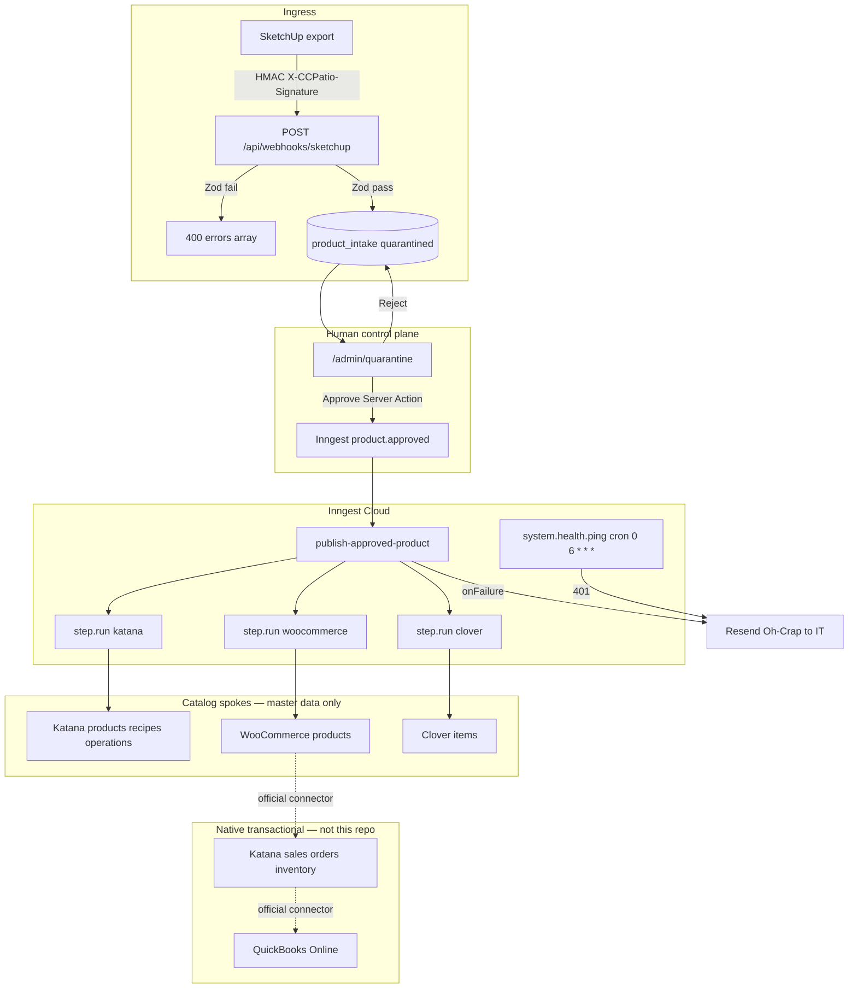
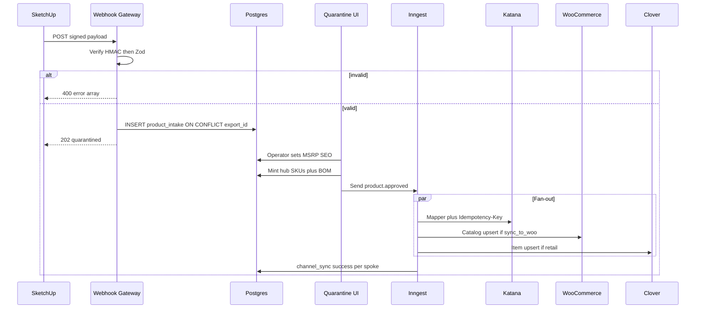

# CC Patio — MDM Master Blueprint

**Document ID:** `MDM_MASTER_BLUEPRINT`  
**Path:** `docs/MDM_MASTER_BLUEPRINT.md`  
**Status:** ACTIVE — Absolute single source of truth  
**Effective:** 2026-09-02  
**Owner:** Lead Systems Architect  
**Audience:** Coding agents, client IT, successor developers  

---

## 0. Authority and supersession

This file is the **binding source of truth** for all product, schema, API, UI, and orchestration work on the CC Patio middleware from this date forward.

When any older blueprint, sprint plan, SOP matrix, topology story, or `PROGRESS.md` entry disagrees with this file, **this file wins**.

### 0.1 Superseded documents (do not implement)

The following artifacts describe a **transactional V8 integration bus** (GHL/Woo orders → Katana sales orders / make-to-order → QBO invoices → Clover deposit matching, custom outbox, custom DLQ, Redis CCR). That product is cancelled.

Coding agents **must not** implement, extend, or “complete” those plans. Phase 0 requires a historical banner on each file (see §8).

| Legacy document | Why it is void |
|---|---|
| `docs/MASTER_ARCHITECTURE_BLUEPRINT.md` | Binding V8 SoT: GHL Won → Katana SO + MTO |
| `docs/data_sheets/CCPATIO MASTER BUILD PLAN.md` | Sprints 0–5: outbox, three DLQs, QBO mutex, Clover matcher |
| `docs/data_sheets/V8_MIDDLEWARE_ARCHITECTURE_RULES.md` | Redis + `outbox_events` + CCR leases (never built; must not be) |
| `docs/data_sheets/Sprint_0_1implementation_plan.md` | Gate 1 ingress / MO create |
| `docs/data_sheets/CCPatio_E2E_Customer_Lifecycle.md` | Gate 1 factory dispatch / Gate 2 invoice |
| `docs/data_sheets/CCPATIO_ENTERPRISE_OPERATING_LIFECYCLE.md` | Middleware as order/treasury OS |
| `docs/data_sheets/CCPatio_SOP_Master_Matrix.md` | Generated SOP encoding transactional middleware |
| `docs/data_sheets/Workflow_Sequence_Audit_Report.md` | Topology exception playlists (Clover miss, QBO mutex, CCR) |
| `PROGRESS.md` (pre-MDM entries) | Celebrates Woo/GHL → Katana SO as complete |

**Keep as evidence, not as architecture:** `docs/katana_live_state/GAP_ANALYSIS_REPORT.md` (SKU namespace mismatch). Topology (`/topology`) and Presentation (`/presentation`) are **demo surfaces**, not ingress, not operating procedure.

### 0.2 Required historical banner

Every superseded document listed above must begin with:

```markdown
> HISTORICAL — V8 TRANSACTIONAL BUS. DO NOT IMPLEMENT.
>
> Binding SoT: `docs/MDM_MASTER_BLUEPRINT.md`
```

(Agents may include the alert emoji in the banner if matching the Phase 0 directive verbatim.)

### 0.3 Related companion — vendor capital-stack handoff

The VividWorks / PrimeView contract (Master SKU dictionary, Katana `POST /sales_orders` target, and internal Katana↔QBO / GHL / Clover / SketchUp map) lives in:

- [`docs/CAPITAL_STACK_VENDOR_HANDOFF.md`](./CAPITAL_STACK_VENDOR_HANDOFF.md)
- [`docs/CAPITAL_STACK_VENDOR_HANDOFF.pdf`](./CAPITAL_STACK_VENDOR_HANDOFF.pdf)

That packet does **not** authorize order ingress, GHL→Katana manufacturing, or a custom QBO mutex in this repository. Vendors hit Katana directly. This hub remains catalog + BOM only.

### 0.4 Repository location (do not recreate `/middleware`)

The Next.js App Router application lives at the **repository root** (`src/`, `package.json`, `drizzle.config.ts`). There is no `middleware/` package. Deploy to Vercel from repo root. Do not scaffold a second Next.js app.

---

## 1. Executive summary

CC Patio manufactures custom, fully-welded luxury outdoor furniture (wood-grain sublimated aluminum). Product definition is a **nested manufacturing graph**: extrusions, cut/weld routing, powder coat, sub-assemblies (frame / cushion), and finished goods.

This application is a **headless Master Data Management (MDM) hub**:

1. SketchUp exports spatial / material / routing data.  
2. The hub **rejects** malformed payloads at the edge (Zod `400`) or **quarantines** valid drafts.  
3. A human enriches MSRP, cost, and SEO, then clicks **Approve**.  
4. Inngest fans out **catalog creation** to Katana MRP, WooCommerce, and Clover POS.  
5. Daily operations (orders, inventory, COGS, invoicing) stay on **native vendor connectors**. The hub never sees a live sales order.

The exit criterion is fire-and-forget: client IT can rotate tokens, retry failed Inngest runs, and page a contractor only when a third-party API contract changes (a mapper file edit). No developer is required for 429s, partial channel failures, or Zod-rejected CAD exports.

---

## 2. Core paradigm — Master vs transactional

### 2.1 The Hub (IN SCOPE)

This Next.js application is strictly **PIM + BOM translation + catalog fan-out**.

| Capability | Hub responsibility |
|---|---|
| SketchUp ingest | HMAC + Zod gateway; persist `product_intake` |
| Nested BOM | Relational adjacency (`parent_sku` / `child_sku`); recursive explosion for mappers |
| Human quarantine | MSRP, cost, SEO, images, channel flags; Approve |
| Katana | Create/update **products, materials, recipes, operations** (master data only) |
| WooCommerce | Create/update **catalog products** (not orders) |
| Clover | Create/update **POS items** (not payments) |

### 2.2 The Spokes (OUT OF SCOPE — native connectors)

**The Hub MUST NOT intercept or process live transactional orders.**

| Flow | Owner | Hub rule |
|---|---|---|
| WooCommerce sales orders → Katana | Katana native Woo connector | No `/api/webhooks/woocommerce` order consumers |
| GHL Won → Katana sales order / MTO | Not this product | Unregister Inngest order functions; do not rebuild |
| Live inventory deductions | Katana / Woo native | No custom stock writers |
| Katana COGS / inventory → QuickBooks Online | Katana native QBO connector | No QBO invoice/mutex/Clover-match code |
| Clover tender → accounting | Clover / QBO native | No fuzzy deposit matcher, no custom recon DLQ |

GoHighLevel remains the staff CRM. The hub does not write manufacturing orders, sales orders, invoices, or pipeline stages.

### 2.3 Why not WordPress middleware

Fully-welded multi-level BOMs cannot be stored in WooCommerce’s flat EAV (`wp_postmeta`). Nested parent/child recipes, scrap factors, and routing operations require PostgreSQL. WordPress is a **spoke** (REST catalog API), never the orchestration layer. There are **zero PHP plugins** in this repository; do not add any.

---

## 3. Locked tech stack and defensive architecture

These choices are closed. Do not substitute without an explicit architect change to this file.

| Layer | Choice | Notes |
|---|---|---|
| Runtime | Next.js App Router (repo root) | TypeScript strict |
| Database | Supabase PostgreSQL via `POSTGRES_URL` | Drizzle ORM — not Prisma, not Supabase REST for CRUD |
| Validation | Zod | Gateway + PIM attribute patches |
| Durable execution | **Inngest** (already installed `inngest@^4`) | App id `ccpatio-middleware` |
| Email alerts | Resend + existing Oh-Crap module | Token 401 and saga `onFailure` |
| Hosting | Vercel | Root Directory empty |
| Auth (ops UI) | HMAC cookie, `*@ccpatio.com` | Same gate as `/admin/dictionary` |

### 3.1 Explicitly forbidden

- **Trigger.dev** — do not install; Inngest is the durable runner.  
- **Custom background cron processes** (node-cron, Vercel cron hitting business logic, `pg_cron` workers for fan-out). The only scheduled work is an **Inngest cron** for token health (`system.health.ping`).  
- **Custom Dead Letter Queue UI** and **`/api/admin/redrive`**. IT retries from the Inngest Cloud dashboard.  
- **Visual Zapier-style field mapper UIs.** Mappers are hardcoded TypeScript.  
- **JSONB BOM trees** as the system of record. Adjacency list only.  
- **Rebuilding `/middleware` as a second app.**  
- **Custom outbox / Redis CCR / `effect_claims`** from V8.

### 3.2 Defensive guarantees (exit strategy)

1. **Strict edge validation.** SketchUp malformation → `400` + error array. No insert. Designer liability ends at the gateway.  
2. **Hardcoded mappers.** A 2029 API rename is a pull request to `src/mappers/*.ts`, not an unmaintainable visual tool.  
3. **Inngest saga.** Partial failure (Katana 200, Clover 504) retries **only** the failed step. `channel_sync` prevents duplicate Katana products.  
4. **Provider idempotency.** Mutating Katana calls send `Idempotency-Key`. Intake uniqueness is `export_id`.  
5. **Token-rot ping.** Daily authenticated GETs; `401` emails IT **before** a designer Approve fails in production.

---

## 4. Target architecture



### 4.1 Runtime sequence (happy path)



---

## 5. Current repository state (as of 2026-09-02)

Agents must start from **what exists**, not from V8 fiction.

### 5.1 Already built (reuse)

- Next.js 16 App Router PIM at repo root: `/admin/dictionary`, `/admin/raw-materials`, `/admin/audit`.  
- Drizzle schema: `sku_mappings` (universal SKU hub), `finished_goods_catalog`, `product_bom` (adjacency after migration `0009`), `item_operations`, `sku_aliases`, `pim_operators`, `pim_audit_log`.  
- Katana HTTP client and **master-data** sync (materials, products, recipes, operations) in `src/lib/katana.ts` and `src/lib/katana/client.ts`.  
- Inngest serve route `src/app/api/inngest/route.ts`, client `src/inngest/client.ts`.  
- Oh-Crap Resend alerts `src/server/alerts/oh-crap.ts`.  
- Operator session HMAC `src/lib/pim-session.ts`; middleware protects `/admin`.  
- Zod already a dependency. Recursive TypeScript BOM walk exists (`getBomTree`); SQL explosion does **not**.

### 5.2 Built but out of MDM scope (exorcise from runtime)

- Inngest `processWooCommerceOrder` and `sync-ghl-opportunity` → Katana **sales orders + MTO**.  
- `src/app/api/webhooks/woocommerce/route.ts` and `src/app/api/webhooks/ghl/route.ts` as **order** ingress.  
- `quarantined_orders` table = Woo **order** Zod-fail, **not** product quarantine. Do not reuse it for SketchUp.  
- Dual `syncBOMToKatana` implementations (`src/lib/katana.ts` vs `src/lib/katana/orchestrator.ts`). Collapse into `src/mappers/katana.ts`.  
- `ORDER_PIPELINE_MODE` gates **order** POSTs; do not use it as the catalog publish flag.

### 5.3 Missing vs this blueprint

- `docs/MDM_MASTER_BLUEPRINT.md` (this file).  
- SketchUp webhook, `product_intake`, quarantine UI, `src/mappers/*`, `product.approved` Inngest function, `channel_sync`, `bom_explosion` / `src/server/db/queries/bom.ts`, token-health cron, `docs/IT_RUNBOOK.md`.  
- Woo catalog writer and Clover client.  
- Zero SKU string overlap with live Katana (`BRA-*` / `OCE-*` vs hub `FIN-*` / `FAB-*`). Fan-out **creates hub SKUs as new Katana records**; do not overwrite unmatched legacy variants.

---

## 6. Conceptual data model

No DDL in this document. Schema work happens in Drizzle (`src/server/db/schema.ts`) plus SQL migrations. Coding agents implement the following **concepts**.

### 6.1 Live catalog (already present — extend, do not replace)

- **`sku_mappings`**: canonical `global_sku`, `item_type` (`raw_material` | `sub_assembly` | `finished_good` | `service`), Katana ids, `sync_to_woo`, `attributes` JSONB (category facts — **not** the BOM tree), OCC `version`.  
- **`finished_goods_catalog`**: commerce fields (MSRP, dims, image). Add SEO (`slug`, `seo_title`, `seo_description`) in Phase 1.  
- **`product_bom`**: **relational adjacency** — `parent_sku`, `child_sku`, `quantity`, `scrap_factor`, `unit_of_measure`. Unique `(parent_sku, child_sku)`.  
- **`item_operations`**: work center, sequence, setup/run minutes.  
- **`sku_aliases`**: deprecated or factory SKU → canonical hub SKU (crosswalk for the Katana gap report).

**Law:** BOM structure is never stored as a JSONB tree. JSONB is allowed for raw webhook payloads, Zod issue lists, and category attributes only.

### 6.2 Intake and publish (create)

- **`product_intake`**: one row per SketchUp `export_id` (unique). Status: `quarantined` | `approved` | `rejected` | `superseded`. Holds `raw_payload`, optional `zod_issues` (empty on success path), `proposed_sku`. Invalid payloads **never** insert.  
- **Draft BOM lines** attached to intake (relational, same parent/child shape) so unapproved CAD does not pollute live `product_bom`. Approve copies draft → live hub tables.  
- **`channel_sync`**: unique `(global_sku, channel)` where channel is `katana` | `woocommerce` | `clover`. Stores `external_id`, `status` (`pending` | `success` | `failed`), `last_error`, `payload_hash`. Inngest steps no-op when status is `success` for the current hash.

### 6.3 Recursive explosion

Drizzle relation queries will not efficiently walk 12-level welded trees. Phase 1 requires:

- Postgres view **`bom_explosion`** (`WITH RECURSIVE`).  
- Query module **`src/server/db/queries/bom.ts`** using Drizzle `sql` fragments to read that view (and/or run the same CTE inline).  
- Application cycle guard remains; unique parent/child does not prevent A→B→A.

### 6.4 Dual raw-material catalogs (known defect)

`raw_materials_catalog` is not FK-linked to `sku_mappings`, but BOM children **must** be hub SKUs. Phase 1 unifies: every RM used in a BOM exists on `sku_mappings`; the extra table is a 1:1 extension or view. Do not leave two sources of truth.

---

## 7. Security and identity

Writes use `POSTGRES_URL` (Drizzle), which **bypasses Row Level Security**. Edge security is therefore mandatory.

| Surface | Control |
|---|---|
| SketchUp webhook | HMAC header `X-CCPatio-Signature`; timing-safe compare; secret `SKETCHUP_WEBHOOK_SECRET`. Missing/invalid → `401`. |
| Quarantine / dictionary | Existing `pim_session` cookie; `*@ccpatio.com` (plus existing exception emails). Protect `/admin/quarantine` in `src/middleware.ts`. |
| Inngest | Platform signatures on `/api/inngest`. |
| `/api/qa-test` | Must not remain a public dictionary writer in production; gate with a secret or disable outside QA. |
| Katana stub webhook | No HMAC today. Do not use as a transactional listener. HMAC or `410` if kept. |
| Public schema | Enable RLS; grant nothing to `anon` / `authenticated` for hub tables. Service role / connection string only. |
| Secrets | Never `NEXT_PUBLIC_` for Katana, Woo, Clover, SketchUp, or `SUPABASE_SERVICE_ROLE_KEY`. |

Approve is a **Server Action** (cookie session), not a public API.

---

## 8. Phase 0 — Repo governance and exorcism

**Goal:** Stop agents from hallucinating the V8 order bus before any new MDM features ship.

### 8.1 Tasks

1. Add the historical banner (§0.2) to every superseded document in §0.1.  
2. Unregister transactional Inngest consumers: remove `processWooCommerceOrder` and `syncGhlOpportunity` from the array served in `src/app/api/inngest/route.ts` / `src/inngest/functions.ts` (`inngestFunctions`). Keep non-order jobs (e.g. staff digest, variant archive) until separately reviewed.  
3. Treat Woo/GHL **order** webhook routes as dormant: do not enqueue Katana SO/MTO. Returning `410` or a documented no-op is acceptable; do not keep a silent live path.  
4. Point `PROGRESS.md` and agent rules at **this** blueprint.  
5. Launchpad copy: Topology / Presentation are demos, not ingress.

### 8.2 Files to modify

- `docs/MASTER_ARCHITECTURE_BLUEPRINT.md`  
- `docs/data_sheets/CCPATIO MASTER BUILD PLAN.md`  
- Other §0.1 legacy docs  
- `src/inngest/functions.ts`  
- `src/app/api/inngest/route.ts` (if it lists functions inline; today it imports `inngestFunctions`)  
- `PROGRESS.md`  
- `src/lib/launchpad-modules.ts`  

### 8.3 Files to create

- None required beyond this blueprint (already created).

### 8.4 Success criteria

- A new coding agent that reads the repo cannot justify implementing GHL → Katana manufacturing orders.  
- Inngest Cloud no longer receives `woo.order.validated` or `ghl/opportunity.won` **consumers** from this app.  
- Historical docs display the do-not-implement banner above the fold.

---

## 9. Phase 1 — SketchUp gateway and recursive database schema

**Goal:** Valid CAD becomes a quarantined draft. Invalid CAD never touches Postgres. Nested BOMs are queryable via recursive SQL.

### 9.1 Tasks

1. Extend Drizzle schema + generate/apply migrations for `product_intake`, intake BOM lines, `channel_sync`, SEO columns, RM FK unification, `staff_notes` if missing on remote, RLS.  
2. Create Postgres view `bom_explosion` and `src/server/db/queries/bom.ts` (`sql` + `WITH RECURSIVE`).  
3. Implement Zod contract `src/server/sketchup/ingest.schema.ts` (recursive subassemblies, max depth 12, qty > 0, UOM, operations, dimensions, `export_id` UUID).  
4. Implement `POST /api/webhooks/sketchup`:  
   - Verify `X-CCPatio-Signature`.  
   - Parse + Zod. Fail → **`400`** `{ errors: [{ path, message }] }` — **no insert**.  
   - Pass → insert `product_intake` status `quarantined`, **`202`**.  
   - Same `export_id` replay → **`200`** already accepted (idempotent).  
5. Document SketchUp v1 JSON field names in a short companion note or README section **without** embedding production handler source in this blueprint. Designers and the plugin author share that contract.

### 9.2 Files to create

- `src/server/sketchup/ingest.schema.ts`  
- `src/app/api/webhooks/sketchup/route.ts`  
- `src/server/db/queries/bom.ts`  
- Drizzle migration(s) under `src/server/db/migrations/`  

### 9.3 Files to modify

- `src/server/db/schema.ts`  
- `.env.example` — `SKETCHUP_WEBHOOK_SECRET`  
- `src/middleware.ts` — webhook remains public (HMAC), not cookie-gated  

### 9.4 Success criteria

- Malformed payload: HTTP 400, zero new `product_intake` rows.  
- Valid payload: HTTP 202, row `quarantined`, unique `export_id`.  
- Replay of the same `export_id`: HTTP 200, still one row.  
- `bom_explosion` returns multi-level paths for a seeded welded fixture (depth ≥ 3).  
- `npm run qa:lifecycle` passes (adjust tests that assumed Woo/GHL order processing).

---

## 10. Phase 2 — Data quarantine UI

**Goal:** Raw SketchUp data is never published. Humans enrich and approve.

### 10.1 Tasks

1. Build `/admin/quarantine` (list of `quarantined` intakes + detail).  
2. Visualize the draft BOM; **flag child SKUs missing from `sku_mappings`**.  
3. Operator inputs: MSRP, cost, SEO, image (existing Storage), `sync_to_woo`, Clover/retail flag, canonical SKU if `proposed_sku` is empty or colliding.  
4. **Approve** Server Action:  
   - OCC via `version` (conflict → 409 / UI error).  
   - Require MSRP (and price-ready image policy as specified in implementation) when Woo or Clover is enabled. Factory-only SKUs (`sync_to_woo` false, Clover off) may allow empty MSRP.  
   - Mint live hub SKUs, copy BOM + operations into `product_bom` / `item_operations`.  
   - Enqueue Inngest event **`product.approved`**.  
   - **Must not** call Katana, Woo, or Clover APIs synchronously.  
5. Reject path with reason; superseded intakes when a newer export replaces a pending draft for the same proposed SKU.  
6. Dictionary remains the editor for **already-approved** catalog rows. Dictionary **Save does not fan out**. Republish is a later explicit action reusing the same Inngest event.

### 10.2 Files to create

- `src/app/admin/quarantine/page.tsx` and colocated components / `actions.ts`  

### 10.3 Files to modify

- `src/middleware.ts` — protect `/admin/quarantine`  
- `src/lib/launchpad-modules.ts` — add Quarantine module  
- Oh-Crap resolution URLs — deep-link quarantine, not a fictional UI  

### 10.4 Success criteria

- Cookie-less visit redirects to `/`.  
- Playwright (or qa Phase 3): fixture intake appears → operator sets MSRP → Approve → status `approved` → Inngest event emitted (can be asserted via test double / log) with **no** outbound Katana HTTP in the Server Action.  
- Approve without MSRP while `sync_to_woo` true is blocked.

---

## 11. Phase 3 — Hardcoded translation mappers

**Goal:** Code is the mapping UI. No visual mapper.

### 11.1 Tasks

1. Create pure (or I/O-thin) mappers that accept **approved hub state** (SKU graph + explosion + operations + commerce fields) and return provider payloads.  
2. **Katana:** bottom-up — raw materials → sub-assemblies → finished good → recipe rows (`quantity * scrap_factor`) → operation rows. Send `Idempotency-Key` on mutating calls. Persist `katana_variant_id` / `katana_material_id`. Do not DELETE production recipes; upsert. Do not remap unmatched `BRA-*` legacy SKUs.  
3. **WooCommerce:** catalog product create/update by SKU; skip when `sync_to_woo` is false.  
4. **Clover:** item create/update; skip when not retail. Respect provider field limits.  
5. Merge/delete `src/lib/katana/orchestrator.ts` into the Katana mapper so only one BOM writer exists.  
6. Snapshot/unit tests of mapper output from a frozen Ocean-sofa-style fixture. **No** live HTTP in unit tests.

### 11.2 Files to create

- `src/mappers/katana.ts`  
- `src/mappers/woocommerce.ts`  
- `src/mappers/clover.ts`  
- Mapper tests under `tests/`  

### 11.3 Files to modify

- `src/lib/katana.ts` / `src/lib/katana/client.ts` — shared HTTP + `Idempotency-Key`; order-mapping functions remain unused or are deleted in a follow-up cleanup, not called from MDM paths  
- `.env.example` — Woo consumer key/secret, Clover token + merchant id  

### 11.4 Success criteria

- One code path from approved BOM → Katana recipe.  
- Unit snapshots stable.  
- No React Flow / topology panel writes mapping config.

---

## 12. Phase 4 — Durable orchestration (Inngest fan-out)

**Goal:** Approve is fire-and-forget. Partial failures retry per spoke. IT uses Inngest, not a custom DLQ.

### 12.1 Tasks

1. Inngest function (e.g. `publish-approved-product`) triggered by event name **`product.approved`**.  
2. **Saga:** `step.run` for Katana, WooCommerce, and Clover **in parallel**. Each step:  
   - Read `channel_sync`; if `success` and hash matches, return early.  
   - Call mapper + provider.  
   - Write `channel_sync` success/failure.  
3. Concurrency: limit 1 per `global_sku` so double-Approve cannot double-create.  
4. Retry 429 / 5xx per Inngest defaults. **Do not retry** 401/403 — fail the step, Oh-Crap, wait for token rotation + dashboard Retry.  
5. Function `onFailure` → existing Oh-Crap email with deep link `/admin/quarantine`.  
6. **Do not** build `/api/admin/redrive`, `quarantined_orders` UI, or Presentation “DLQ Terminal” as a real ops tool.

### 12.2 Files to create / modify

- `src/inngest/functions.ts` (add publish function; keep order functions **unregistered**)  
- `src/app/api/inngest/route.ts` (registry via `inngestFunctions`)  
- `src/server/alerts/oh-crap.ts` (copy/links only if needed)  

### 12.3 Success criteria

- Simulated Clover 504 after Katana 200: Katana `channel_sync` stays `success`; Clover step retries; **no** second Katana product.  
- Inngest dashboard shows the failed Clover run; Retry completes the spoke.  
- No custom redrive HTTP route exists.

---

## 13. Phase 5 — Exit protocol (token rot and runbook)

**Goal:** Client IT owns daily failure modes. Developers own mapper contract changes only.

### 13.1 Tasks

1. Inngest function **`system.health.ping`**, cron **`0 6 * * *`** (daily 06:00). Lightweight **authenticated GET** to Katana, WooCommerce, and Clover.  
2. Any spoke returning **`401 Unauthorized`** → Resend Oh-Crap to IT immediately (use `OH_CRAP_ADMIN_EMAIL`).  
3. Optional: extend `GET /api/health` with non-secret liveness (`db`, `inngest` configured) — **no** token leak, not a substitute for the cron.  
4. Write **`docs/IT_RUNBOOK.md`** covering:  
   - Where secrets live (Vercel / Supabase).  
   - How to rotate Katana, Woo, Clover, SketchUp HMAC, Resend.  
   - How to open Inngest Cloud, find `publish-approved-product` / `system.health.ping`, click **Retry**.  
   - When to escalate to a developer (schema/mapper/API contract change vs token vs 429).  
   - Native connector checklist: enable/verify **Katana ↔ Woo orders/inventory** and **Katana ↔ QBO COGS** — not this repo.  
   - SKU policy: hub `FIN-*` / `SA-*` / `RM-*`; do not collide with unmanaged legacy Katana SKUs.  
   - Do not expose Supabase Data API on hub tables.  
5. Handoff: Vercel, Supabase, Inngest Cloud seats for client IT.

### 13.2 Files to create

- `docs/IT_RUNBOOK.md`  

### 13.3 Files to modify

- `src/inngest/functions.ts`  
- `src/app/api/health/route.ts` (optional liveness)  
- `.env.example`  

### 13.4 Success criteria

- Revoking a sandbox token produces an Oh-Crap email at the next 06:00 ping (or on a manual Inngest invoke) **without** any Approve click.  
- A 30-minute IT read-through of `docs/IT_RUNBOOK.md` is sufficient to rotate a key and retry a failed publish.  
- Architect walk-away: no custom DLQ, no WordPress plugin, no on-call for Zod 400s.

---

## 14. Environment variables (MDM)

Required for a complete hub (in addition to existing `POSTGRES_URL`, `PIM_SESSION_SECRET`, Supabase keys, `RESEND_*`, `INNGEST_EVENT_KEY`, `KATANA_*`):

| Variable | Purpose |
|---|---|
| `SKETCHUP_WEBHOOK_SECRET` | HMAC for `X-CCPatio-Signature` |
| `WOOCOMMERCE_CONSUMER_KEY` / `WOOCOMMERCE_CONSUMER_SECRET` | Catalog REST (not order webhooks) |
| `CLOVER_API_TOKEN` / `CLOVER_MERCHANT_ID` | Item upsert |
| `OH_CRAP_ADMIN_EMAIL` | IT token-rot and saga failure |

`DOWNSTREAM_MUTATIONS` and `ORDER_PIPELINE_MODE` are V8/order-era flags. Catalog publish is **Approve → Inngest**, not those flags. Do not reintroduce order POSTs behind `ORDER_PIPELINE_MODE=live`.

---

## 15. Quality gate

Workspace protocol: any change to App Router routes, Server Actions, Drizzle schema, or UI **must** autonomously run `npm run qa:lifecycle` and iterate until exit code 0. Do not mock Phase 2 database proof. Do not swallow mapper/provider errors — structured failure so Inngest and Oh-Crap can see them.

This blueprint itself is documentation; implementing Phases 0–5 is code and **is** subject to that gauntlet.

---

## 16. Agent conduct

1. Read **this file** before generating MDM code.  
2. Do not implement V8 outbox, Redis CCR, QBO mutex, Clover deposit matching, GHL Gate 1, or Woo **order** pipelines.  
3. Do not invent Katana variant/material IDs; persist ids returned by the API onto `sku_mappings`.  
4. Do not build a visual mapper or custom DLQ.  
5. Do not store BOMs as JSONB trees.  
6. Do not call Katana/Woo/Clover from the Approve Server Action.  
7. Prefer updating this blueprint when architecture changes — do not spawn a parallel “V9” or revive `MASTER_ARCHITECTURE_BLUEPRINT.md` as SoT.

---

**End of MDM Master Blueprint**  
*Phases 0–5 are authorized against this document only.*
