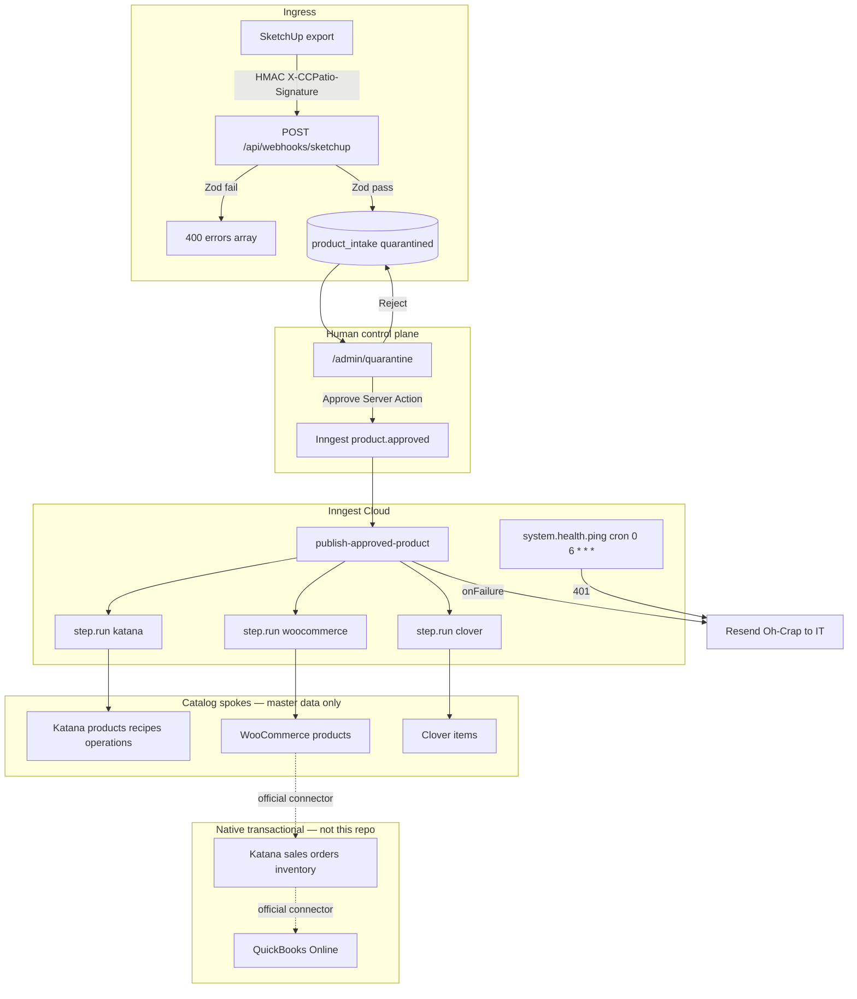
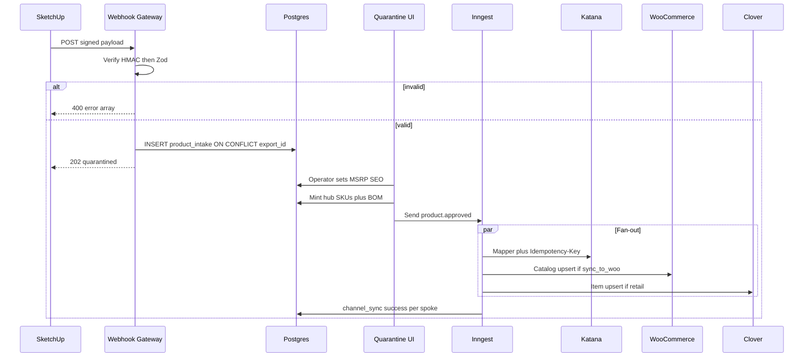
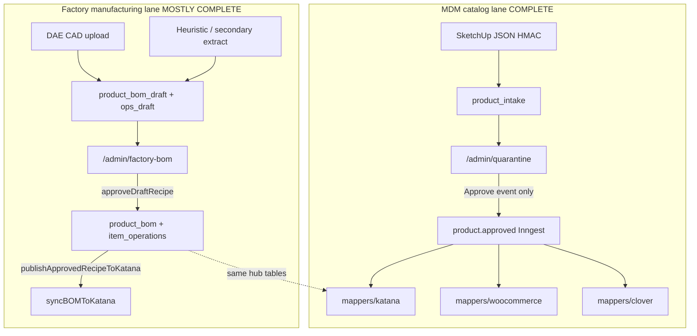

# CC Patio — MDM Master Blueprint

**Document ID:** `MDM_MASTER_BLUEPRINT`  
**Path:** `docs/MDM_MASTER_BLUEPRINT.md`  
**Status:** ACTIVE — Absolute single source of truth  
**Effective:** 2026-09-13  
**Owner:** Lead Systems Architect  
**Audience:** Coding agents, client IT, successor developers  

**Companion lanes:** MDM Phases 0–5 (catalog quarantine → Inngest fan-out) are **COMPLETE**. The Factory BOM workbench (CAD/DAE → draft recipe → Approve → Katana Publish) is a **first-class companion lane** documented in §5 / §5A–§5C and [`docs/FACTORY_BOM_KATANA_UX_PLAN.md`](./FACTORY_BOM_KATANA_UX_PLAN.md). Do not treat Factory BOM as optional side work.

---

## 0. Authority and supersession

This file is the **binding source of truth** for all product, schema, API, UI, and orchestration work on the CC Patio middleware from this date forward.

When any older blueprint, sprint plan, SOP matrix, topology story, or `PROGRESS.md` entry disagrees with this file, **this file wins**.

### 0.1 Superseded documents (do not implement)

The following artifacts describe a **transactional V8 integration bus** (GHL/Woo orders → Katana sales orders / make-to-order → QBO invoices → Clover deposit matching, custom outbox, custom DLQ, Redis CCR). That product is cancelled.

Coding agents **must not** implement, extend, or “complete” those plans. Phase 0 requires a historical banner on each file (see §8).

| Legacy document | Why it is void |
|---|---|
| `docs/MASTER_ARCHITECTURE_BLUEPRINT.md` | Binding V8 SoT: GHL Won → Katana SO + MTO |
| `docs/data_sheets/CCPATIO MASTER BUILD PLAN.md` | Sprints 0–5: outbox, three DLQs, QBO mutex, Clover matcher |
| `docs/data_sheets/V8_MIDDLEWARE_ARCHITECTURE_RULES.md` | Redis + `outbox_events` + CCR leases (never built; must not be) |
| `docs/data_sheets/Sprint_0_1implementation_plan.md` | Gate 1 ingress / MO create |
| `docs/data_sheets/CCPatio_E2E_Customer_Lifecycle.md` | Gate 1 factory dispatch / Gate 2 invoice |
| `docs/data_sheets/CCPATIO_ENTERPRISE_OPERATING_LIFECYCLE.md` | Middleware as order/treasury OS |
| `docs/data_sheets/CCPatio_SOP_Master_Matrix.md` | Generated SOP encoding transactional middleware |
| `docs/data_sheets/Workflow_Sequence_Audit_Report.md` | Topology exception playlists (Clover miss, QBO mutex, CCR) |
| `PROGRESS.md` (pre-MDM entries) | Celebrates Woo/GHL → Katana SO as complete |

**Keep as evidence, not as architecture:** `docs/katana_live_state/GAP_ANALYSIS_REPORT.md` (SKU namespace mismatch). Topology (`/topology`) and Presentation (`/presentation`) are **demo surfaces**, not ingress, not operating procedure.

### 0.2 Required historical banner

Every superseded document listed above must begin with:

```markdown
> HISTORICAL — V8 TRANSACTIONAL BUS. DO NOT IMPLEMENT.
>
> Binding SoT: `docs/MDM_MASTER_BLUEPRINT.md`
```

(Agents may include the alert emoji in the banner if matching the Phase 0 directive verbatim.)

### 0.3 Related companion — vendor capital-stack handoff

The VividWorks / PrimeView contract (Master SKU dictionary, Katana `POST /sales_orders` target, and internal Katana↔QBO / GHL / Clover / SketchUp map) lives in:

- [`docs/CAPITAL_STACK_VENDOR_HANDOFF.md`](./CAPITAL_STACK_VENDOR_HANDOFF.md)
- [`docs/CAPITAL_STACK_VENDOR_HANDOFF.pdf`](./CAPITAL_STACK_VENDOR_HANDOFF.pdf)

That packet does **not** authorize a custom QBO mutex, Clover deposit matching, or WooCommerce order ingress. The only order path this repository may implement is the scoped GHL factory pipeline in §2.4. Every other commercial flow still hits Katana through native connectors. Catalog and BOM remain the hub's primary job.

### 0.4 Repository location (do not recreate `/middleware`)

The Next.js App Router application lives at the **repository root** (`src/`, `package.json`, `drizzle.config.ts`). There is no `middleware/` package. Deploy to Vercel from repo root. Do not scaffold a second Next.js app.

---

## 1. Executive summary

CC Patio manufactures custom, fully-welded luxury outdoor furniture (wood-grain sublimated aluminum). Product definition is a **nested manufacturing graph**: extrusions, cut/weld routing, powder coat, sub-assemblies (frame / cushion), and finished goods.

This application is a **headless Master Data Management (MDM) hub**:

1. SketchUp exports spatial / material / routing data.  
2. The hub **rejects** malformed payloads at the edge (Zod `400`) or **quarantines** valid drafts.  
3. A human enriches MSRP, cost, and SEO, then clicks **Approve**.  
4. Inngest fans out **catalog creation** to Katana MRP, WooCommerce, and Clover POS.  
5. Daily operations (Woo orders, inventory ownership, COGS, invoicing) stay on **native vendor connectors**. The one exception is §2.4: a GHL opportunity in **Produce Factory Order** may be triaged by a person and written to Katana as a sales order plus Make-to-Order run.

The exit criterion is fire-and-forget: client IT can rotate tokens, retry failed Inngest runs, and page a contractor only when a third-party API contract changes (a mapper file edit). No developer is required for 429s, partial channel failures, or Zod-rejected CAD exports.

---

## 2. Core paradigm — Master vs transactional

### 2.1 The Hub (IN SCOPE)

This Next.js application is strictly **PIM + BOM translation + catalog fan-out**.

| Capability | Hub responsibility |
|---|---|
| SketchUp ingest | HMAC + Zod gateway; persist `product_intake` |
| Nested BOM | Relational adjacency (`parent_sku` / `child_sku`); recursive explosion for mappers |
| Human quarantine | MSRP, cost, SEO, images, channel flags; Approve |
| Katana | Create/update **products, materials, recipes, operations** (master data only) |
| WooCommerce | Create/update **catalog products** (not orders) |
| Clover | Create/update **POS items** (not payments) |

### 2.2 The Spokes (OUT OF SCOPE — native connectors)

**The Hub does not intercept Woo, QuickBooks, or Clover transactions.** GHL factory orders are the only exception (§2.4).

| Flow | Owner | Hub rule |
|---|---|---|
| WooCommerce sales orders → Katana | Katana native Woo connector | No `/api/webhooks/woocommerce` order consumers. Stay `410`. |
| GHL **Produce Factory Order** → Katana sales order / MTO | This hub, after human triage | `POST /api/webhooks/ghl` → `order_intake` → `/admin/order-triage` → Inngest `order.approved`. Gate: `GHL_FACTORY_ORDERS`. |
| GHL Won auto-push (legacy V8) | Not this product | `syncGhlOpportunity` stays unregistered. Do not rebuild it. |
| Live inventory deductions | Katana | No `POST /stock_adjustments`. Fabric relief is a line PATCH on the legacy hold (§2.4). |
| Katana COGS / inventory → QuickBooks Online | Katana native QBO connector | No QBO invoice/mutex/Clover-match code |
| Clover tender → accounting | Clover / QBO native | No fuzzy deposit matcher, no custom recon DLQ |

GoHighLevel remains the staff CRM. The hub does not write invoices or move GHL pipeline stages. It writes a Katana sales order and Make-to-Order manufacturing order only after a person maps `FIN-*` and `FAB-*` SKUs.

### 2.3 Why not WordPress middleware

Fully-welded multi-level BOMs cannot be stored in WooCommerce’s flat EAV (`wp_postmeta`). Nested parent/child recipes, scrap factors, and routing operations require PostgreSQL. WordPress is a **spoke** (REST catalog API), never the orchestration layer. There are **zero PHP plugins** in this repository; do not add any.

### 2.4 Scoped exception — GHL factory orders

`GHL_FACTORY_ORDERS` defaults to **`log`**. `log` persists `order_intake` and stops. **`live`** is the only mode in which Approve & Push may call Katana.

| Identity | Value |
|---|---|
| Hold sales order | `MIG-HOLD-FABRIC-20260811` |
| Hold sales order id | `52594042` |
| Warehouse | CC Manufacturing `98179` |
| Trigger stage | `Produce Factory Order` (or `pipeline_stage_id` listed in `GHL_FACTORY_STAGE_IDS`) |
| Customer order lines | `FIN-*` only |
| Fabric | MO recipe swap to the chosen `FAB-*`, then reduce that fabric's quantity on the hold |
| Forbidden | `POST /stock_adjustments`, shipping, invoicing, or fulfilling either order from this pipeline |

The hold already commits legacy reserved yards. The new manufacturing order also commits its fabric ingredient. The burn-down PATCHes (or DELETEs, when the remainder is zero) the matching hold line by the Hub BOM yardage so committed stock is not double-reserved. A retry reads `order_intake.hold_relief` and does not deduct twice.

---

## 3. Locked tech stack and defensive architecture

These choices are closed. Do not substitute without an explicit architect change to this file.

| Layer | Choice | Notes |
|---|---|---|
| Runtime | Next.js App Router (repo root) | TypeScript strict |
| Database | Supabase PostgreSQL via `POSTGRES_URL` | Drizzle ORM — not Prisma, not Supabase REST for CRUD |
| Validation | Zod | Gateway + PIM attribute patches |
| Durable execution | **Inngest** (already installed `inngest@^4`) | App id `ccpatio-middleware` |
| Email alerts | Resend + existing Oh-Crap module | Token 401 and saga `onFailure` |
| Hosting | Vercel | Root Directory empty |
| Auth (ops UI) | HMAC cookie, `*@ccpatio.com` | Same gate as `/admin/dictionary` |

### 3.1 Explicitly forbidden

- **Trigger.dev** — do not install; Inngest is the durable runner.  
- **Custom background cron processes** (node-cron, Vercel cron hitting business logic, `pg_cron` workers for fan-out). The only scheduled work is an **Inngest cron** for token health (`system.health.ping`).  
- **Custom Dead Letter Queue UI** and **`/api/admin/redrive`**. IT retries from the Inngest Cloud dashboard.  
- **Visual Zapier-style field mapper UIs.** Mappers are hardcoded TypeScript.  
- **JSONB BOM trees** as the system of record. Adjacency list only.  
- **Rebuilding `/middleware` as a second app.**  
- **Custom outbox / Redis CCR / `effect_claims`** from V8.

### 3.2 Defensive guarantees (exit strategy)

1. **Strict edge validation.** SketchUp malformation → `400` + error array. No insert. GHL factory ingress is the same: Zod failure is `400` and no `order_intake` row. A payload that is valid but not in **Produce Factory Order** is `200` ignored. Designer and CRM liability end at the gateway.  
2. **Hardcoded mappers.** A 2029 API rename is a pull request to `src/mappers/*.ts`, not an unmaintainable visual tool.  
3. **Inngest saga.** Partial failure (Katana 200, Clover 504) retries **only** the failed step. `channel_sync` prevents duplicate Katana products.  
4. **Provider idempotency.** Mutating Katana calls send `Idempotency-Key`. SketchUp intake uniqueness is `export_id`. GHL factory intake uniqueness is `ghl_opportunity_id`. A replay does not reset a `pushed` row.  
5. **Token-rot ping.** Daily authenticated GETs; `401` emails IT **before** a designer Approve fails in production.

---

## 4. Target architecture


```mermaid
flowchart TB
  subgraph ingress [Ingress]
    SU[SketchUp export]
    GW["POST /api/webhooks/sketchup"]
    SU -->|"HMAC X-CCPatio-Signature"| GW
    GW -->|Zod fail| E400["400 errors array"]
    GW -->|Zod pass| PI[(product_intake quarantined)]
  end

  subgraph human [Human control plane]
    Q["/admin/quarantine"]
    PI --> Q
    Q -->|Reject| PI
    Q -->|Approve Server Action| EVT["Inngest product.approved"]
  end

  subgraph durable [Inngest Cloud]
    EVT --> SAGA["publish-approved-product"]
    SAGA --> KSTEP["step.run katana"]
    SAGA --> WSTEP["step.run woocommerce"]
    SAGA --> CSTEP["step.run clover"]
    HEALTH["system.health.ping cron 0 6 * * *"]
  end

  subgraph spokes [Catalog spokes — master data only]
    KSTEP --> Katana[Katana products recipes operations]
    WSTEP --> Woo[WooCommerce products]
    CSTEP --> Clover[Clover items]
  end

  subgraph native [Native transactional — not this repo]
    Woo -.->|"official connector"| KatanaSO[Katana sales orders inventory]
    KatanaSO -.->|"official connector"| QBO[QuickBooks Online]
  end

  HEALTH -->|401| Alert[Resend Oh-Crap to IT]
  SAGA -->|onFailure| Alert
```

### 4.1 Runtime sequence (happy path)


```mermaid
sequenceDiagram
  participant SU as SketchUp
  participant GW as Webhook Gateway
  participant DB as Postgres
  participant UI as Quarantine UI
  participant IN as Inngest
  participant K as Katana
  participant W as WooCommerce
  participant C as Clover

  SU->>GW: POST signed payload
  GW->>GW: Verify HMAC then Zod
  alt invalid
    GW-->>SU: 400 error array
  else valid
    GW->>DB: INSERT product_intake ON CONFLICT export_id
    GW-->>SU: 202 quarantined
    UI->>DB: Operator sets MSRP SEO
    UI->>DB: Mint hub SKUs plus BOM
    UI->>IN: Send product.approved
    par Fan-out
      IN->>K: Mapper plus Idempotency-Key
      IN->>W: Catalog upsert if sync_to_woo
      IN->>C: Item upsert if retail
    end
    IN->>DB: channel_sync success per spoke
  end
```

---

## 5. Current repository state (as of 2026-09-13)

Agents must start from **what exists**, not from V8 fiction and not from the stale 2026-09-02 snapshot.

### 5.1 Dual-lane architecture (shipped)


```mermaid
flowchart TB
  subgraph mdmLane [MDM catalog lane COMPLETE]
    SU[SketchUp JSON HMAC] --> QI[product_intake]
    QI --> QUI["/admin/quarantine"]
    QUI -->|Approve event only| IN[product.approved Inngest]
    IN --> K1[mappers/katana]
    IN --> W[mappers/woocommerce]
    IN --> C[mappers/clover]
  end

  subgraph factoryLane [Factory manufacturing lane MOSTLY COMPLETE]
    CAD[DAE CAD upload] --> DRAFT[product_bom_draft + ops_draft]
    HEUR[Heuristic / secondary extract] --> DRAFT
    DRAFT --> FB["/admin/factory-bom"]
    FB -->|approveDraftRecipe| LIVE[product_bom + item_operations]
    LIVE -->|publishApprovedRecipeToKatana| K2[syncBOMToKatana]
  end

  LIVE -.->|same hub tables| K1
```

| Lane | Purpose | Status |
|---|---|---|
| **MDM catalog** | SketchUp → quarantine → Approve → Inngest fan-out (Katana / Woo / Clover catalog) | **COMPLETE** (Phases 0–5) |
| **Factory manufacturing** | CAD/heuristic → draft BOM/ops → Approve → optional Katana recipe/ops Publish | **MOSTLY COMPLETE** (PR-A/B/C shipped; Tier 1 convergence remains — §5B) |

### 5.2 Built (reuse — do not rebuild)

- Next.js 16 App Router at repo root: `/admin/dictionary`, `/admin/dictionary/bom/[sku]`, `/admin/raw-materials`, `/admin/audit`, `/admin/quarantine`, `/admin/factory-bom`, `/mission-control`.  
- Demo-only: `/topology`, `/presentation`.  
- Drizzle hub: `sku_mappings`, `finished_goods_catalog` (incl. SEO), `raw_materials_catalog` (FK → hub SKU), `product_bom` + `cut_list`, `item_operations` (unique `(item_sku, work_center, sequence)` via migration `0022`), `sku_aliases`, `pim_*`.  
- Intake / sync: `product_intake`, `channel_sync`, `bom_explosion` view + `src/server/db/queries/bom.ts`.  
- Factory drafts: `product_bom_draft` (+ `cut_list`), `item_operations_draft`, `recipe_estimates_draft`, `material_physics_factors`, `cad_uploads`.  
- SketchUp: Zod `src/server/sketchup/ingest.schema.ts`, `POST /api/webhooks/sketchup` (HMAC → 400/202/200).  
- Mappers: `src/mappers/{katana,woocommerce,clover}.ts` + `katana-catalog-guard.ts`.  
- Inngest registered: `publishApprovedProduct`, `systemHealthPing`, `processCadUpload`, staff digest, variant archive. Order functions **unregistered**.  
- Factory Cut Cards + notes-codec; PR-C ops Resource select + aluminum Standard Track (`src/lib/factory-routing/resources.ts`).  
- Katana HTTP: `src/lib/katana.ts` / `src/lib/katana/client.ts`; Factory Publish via `syncBOMToKatana`.  
- Auth: Supabase session via `src/proxy.ts`; E2E God Mode helpers. Oh-Crap: `src/server/alerts/oh-crap.ts`. IT runbook: `docs/IT_RUNBOOK.md`.  
- Quality gate: `npm run qa:lifecycle`.

### 5.3 Built but out of MDM scope (remain dormant)

- Inngest `processWooCommerceOrder` / `syncGhlOpportunity` — defined, **not** in `inngestFunctions`. The registered order writer is `order.approved` only, and only when `GHL_FACTORY_ORDERS=live`.  
- Woo order webhooks stay **`410`**. GHL `POST /api/webhooks/ghl` accepts **Produce Factory Order** into `order_intake`.  
- `quarantined_orders` = legacy Woo **order** Zod-fail — **not** product quarantine.  
- `orchestrator.ts` deleted; **dual Katana manufacturing writers remain** (mapper Path A vs `syncBOMToKatana` Path B) — see §5B Tier 1.  
- `ORDER_PIPELINE_MODE` still gates Factory Publish — rename/replace required (§5B). It must **not** be the switch for GHL order POSTs. That switch is `GHL_FACTORY_ORDERS`.

### 5.4 Partial / known gaps (not “missing Phase 1”)

| Gap | Severity | Backlog |
|---|---|---|
| Resource string drift: PR-C catalog vs `labor.ts` / `heuristic-bom.ts` / `collection-bom.ts` / CAD instantiate | **High** | §5B Tier 1.1 |
| Dual Katana publish paths (notes / ops / colorway may diverge) | **High** | §5B Tier 1.2 |
| `channel_sync` lacks `payload_hash` idempotency | **Medium** | §5B Tier 1.3 |
| Factory Publish still uses `ORDER_PIPELINE_MODE` | **Medium** | §5B Tier 1.2 |
| Cushion Standard Track not in `STANDARD_TRACKS` | **Medium** | §5B Tier 1.1 |
| Katana stub webhook unauthenticated | **Medium** | §5B Tier 2 |
| Hub-table RLS incomplete (`sku_mappings`, `product_bom`, `product_intake`, …) | **Medium** | §5B Tier 2 |
| Intake draft BOM lives in `raw_payload` JSON (not separate relational draft table) | **Low** | §5C |
| Live Katana legacy SKU namespace (`BRA-*`/`OCE-*`) vs hub `FIN-*`/`SA-*`/`RM-*` | **Ops** | `sku_aliases` + gap report |

### 5.5 Explicitly not built (and must stay unbuilt)

V8 transactional bus; Woo/GHL → Katana SO/MTO; QBO mutex; Clover deposit matcher; custom DLQ / `/api/admin/redrive`; visual Zapier mappers; Trigger.dev; JSONB BOM trees; auto-Approve / auto-Katana from CAD; full `.skp` geometry in Node; R3F configurator as MDM dependency.

---

## 5A. Built inventory (granular)

### 5A.1 Platform / governance

| Item | Location |
|---|---|
| Binding SoT | This file |
| V8 ban | §0 + historical banners on superseded docs |
| App runtime | Repo-root Next.js 16 App Router |
| ORM / DB | Drizzle + `POSTGRES_URL` (bypasses RLS) |
| Durable jobs | Inngest app id `ccpatio-middleware` |
| Alerts | Resend Oh-Crap |
| QA | `npm run qa:lifecycle` |

### 5A.2 MDM Phases 0–5 (COMPLETE)

| Phase | Live artifacts |
|---|---|
| **0** | Historical banners; Woo/GHL `410`; order Inngest unregistered; launchpad demos marked |
| **1** | `product_intake`, `channel_sync`, SEO cols, RM FK, `bom_explosion` + `src/server/db/queries/bom.ts`, Zod ingest, `POST /api/webhooks/sketchup` |
| **2** | `/admin/quarantine` Approve/Reject; `product.approved` enqueue; **no** channel HTTP in Server Action |
| **3** | `src/mappers/{katana,woocommerce,clover}.ts`; orchestrator deleted; Ocean fixture unit tests |
| **4** | `publishApprovedProduct` saga; parallel spokes; `channel_sync`; concurrency 1/`globalSku`; `onFailure` Oh-Crap |
| **5** | `system.health.ping` cron `0 6 * * *`; `/api/health` liveness; `docs/IT_RUNBOOK.md` |

### 5A.3 PIM / dictionary hub

| Surface | Detail |
|---|---|
| Routes | `/admin/dictionary`, `/admin/dictionary/bom/[sku]`, `/admin/raw-materials`, `/admin/audit` |
| Tables | `sku_mappings`, `finished_goods_catalog`, `raw_materials_catalog`, `sku_aliases`, live `product_bom` / `item_operations`, `pim_operators`, `pim_audit_log` |
| Rule | Dictionary **Save does not fan out** |

### 5A.4 Factory BOM lane

| Capability | Detail |
|---|---|
| UI | `/admin/factory-bom` — `FactoryBomWorkbench`, `BomAssemblyCard`, `BomMaterialRow`, `BomOperationsPanel`, `EstimatePanel`, `CadUploadDropzone` |
| Draft → live | `approveDraftRecipe` copies drafts into live adjacency + ops (ops **upsert** on conflict) |
| Cut Cards | `notes-codec`; draft/live `cut_list` jsonb (migration `0021`); tablet dialect on Approve/sync |
| Ops PR-C | Locked physical Resources in `src/lib/factory-routing/resources.ts`; Katana-mirrored grid; `applyStandardTrack` `aluminum_frame` (14 steps); migration `0022` unique index |
| Secondary extraction | `src/lib/secondary-extraction/*` → `recipe_estimates_draft` + draft ops |
| CAD | `cad_uploads` + Inngest `processCadUpload`; DAE weldment → drafts; `.skp` thumb only |
| Publish | `publishApprovedRecipeToKatana` → `syncBOMToKatana` (`/recipes` + `/product_operation_rows`) |

**Locked Phase 0 Resources (physical workstations — do not invent action-named duplicates):**  
`Material Handling`, `Metal Cutting`, `Welding Station`, `Grinding Station`, `Sandblasting`, `Powder Coating Booth`, `Curing Oven`, `Quality Control`, `Assembly & Packaging`.

### 5A.5 Katana / spoke publish paths

| Path | Trigger | Writer |
|---|---|---|
| **A — MDM fan-out** | Quarantine Approve → `product.approved` | `src/mappers/katana.ts` + `publish-channels` + `channel_sync` |
| **B — Factory Publish** | Explicit Factory Publish button | `syncBOMToKatana` in `src/lib/katana.ts` |

Woo/Clover catalog writers exist for Path A only.

### 5A.6 Inngest registry

| Registered | Role |
|---|---|
| `publishApprovedProduct` | Catalog fan-out |
| `systemHealthPing` | Daily token ping |
| `processCadUpload` | CAD → drafts |
| Staff digest / variant archive | Non-order utility |

| Unregistered (do not re-enable) | Role |
|---|---|
| `processWooCommerceOrder` | V8 order → Katana SO/MTO |
| `syncGhlOpportunity` | V8 GHL → Katana SO/MTO |

### 5A.7 Tests (representative)

- Unit: `notes-codec`, `katana-recipe-notes`, `factory-routing-resources`, `secondary-extraction`, `cad-upload-pipeline`, `mappers`, dictionary/heuristic/collection suites.  
- E2E: `factory-bom-lifecycle`, `auth`, `optimistic-ui`.  
- Scripts: `qa:phase2-db`, `qa:phase4-webhooks`.

### 5A.8 Side lanes (not hub completeness)

- E-com / Vividworks handoff: `docs/CAPITAL_STACK_VENDOR_HANDOFF.md` + `scripts/` npm ecom/vendor tasks.  
- Heuristic/collection seed CLIs.  
- Mission Control IT UI (`/mission-control`).

---

## 5B. Remaining work — middleware “fully complete”

**Definition of done:** MDM Phases 0–5 stay green under `qa:lifecycle`; Factory draft → Approve → Publish uses **locked physical Resources only**; one documented Katana manufacturing writer; no Resource vocabulary drift; catalog publish gate is not confused with order pipeline; `channel_sync` includes payload identity; Katana webhook is HMAC or retired; hub RLS posture applied/documented; blueprint §5 matches the tree.

### Tier 1 — Convergence (required)

| ID | Work | Why |
|---|---|---|
| **1.1** | **Resource SSOT unification** — migrate `labor.ts`, `heuristic-bom.ts`, `collection-bom.ts`, CAD instantiate, E2E seeds onto `KATANA_RESOURCES`; add **cushion** Standard Track | Prevents duplicate Katana cells / capacity split |
| **1.2** | **Single Katana manufacturing publish contract** — fold Path A/B onto one writer; replace `ORDER_PIPELINE_MODE` as Factory catalog gate with an explicit catalog flag; align notes, scrap×qty, colorway stripping | Stops silent divergence |
| **1.3** | **`channel_sync.payload_hash`** (or equivalent) so republish no-ops when payload unchanged | Completes §6.2 idempotency |
| **1.4** | **Docs truth** — keep this §5 / companions accurate; do not re-open PR-C as pending | Stops agent rebuild loops |

**Next authorized code PR after this documentation update:** Tier **1.1** (Resource SSOT + cushion track). Separate explicit authorization required before coding 1.2–1.3.

### Tier 2 — Security / ops polish

| ID | Work |
|---|---|
| **2.1** | Katana stub webhook → HMAC or `410` |
| **2.2** | RLS enable + revoke on remaining hub tables (defense if Data API exposed) |
| **2.3** | Soft-migrate `/recipes` → `/bom_rows` behind the single writer once Katana contract confirmed |
| **2.4** | Optional Cut Cards polish (Conv column, part# regen, free-text → cards) |

### Tier 3 — Not required for hub completeness

| ID | Work | Constraint |
|---|---|---|
| **3.1** | E-com / Vividworks / PrimeView vendor packet | Scripts only; no order POSTs into hub |
| **3.2** | R3F / 3d-sandbox configurator | Separate product |
| **3.3** | Legacy Katana SKU crosswalk ops | `sku_aliases` + gap report; not new architecture |

---

## 5C. Future advancement (post-complete planning)

| Theme | Why consider | Constraint |
|---|---|---|
| Unified Publish UX | One status from Dictionary + Factory + Quarantine over `channel_sync` | Still no sync HTTP inside Approve |
| Resource governance UI | Mission Control: locked Resources vs live Katana drift | Do not invent Resources in UI |
| Intake relational draft BOM | Blueprint imagined draft lines table; today BOM in `raw_payload` until Approve | Harden only if SketchUp volume rises |
| Physics / labor calibration | Feed real MO times into Standard Track defaults | Read-only from Katana; no order bus |
| Configurator → hub SKU contract | Vendors emit hub `FIN-*` / `SA-*` / `RM-*` only | Transactions stay on native Katana connectors |
| Mission Control publish ledger | Per-SKU spoke status | No custom DLQ |

---

## 6. Conceptual data model

No DDL in this document. Schema work happens in Drizzle (`src/server/db/schema.ts`) plus SQL migrations. Coding agents implement the following **concepts**.

### 6.1 Live catalog (present — extend, do not replace)

- **`sku_mappings`**: canonical `global_sku`, `item_type` (`raw_material` | `sub_assembly` | `finished_good` | `service`), Katana ids, `sync_to_woo`, `attributes` JSONB (category facts — **not** the BOM tree), OCC `version`.  
- **`finished_goods_catalog`**: commerce fields (MSRP, dims, image) + SEO (`slug`, `seo_title`, `seo_description`) — **shipped**.  
- **`product_bom`**: **relational adjacency** — `parent_sku`, `child_sku`, `quantity`, `scrap_factor`, `unit_of_measure`, `notes`, `cut_list` jsonb. Unique `(parent_sku, child_sku)`.  
- **`item_operations`**: work center (= Katana `resource_name`), sequence, setup/run minutes. Unique `(item_sku, work_center, sequence)` — migration `0022`.  
- **`sku_aliases`**: deprecated or factory SKU → canonical hub SKU (crosswalk for the Katana gap report).

**Law:** BOM structure is never stored as a JSONB tree. JSONB is allowed for raw webhook payloads, Zod issue lists, category attributes, and **structured cut lists** (`cut_list`) only — never the parent/child graph.

### 6.2 Intake and publish

- **`product_intake`**: one row per SketchUp `export_id` (unique). Status: `quarantined` | `approved` | `rejected` | `superseded`. Holds `raw_payload`, optional `zod_issues`, `proposed_sku`. Invalid payloads **never** insert.  
- **Draft BOM on intake:** today the nested BOM lives inside `raw_payload` and is flattened on Approve (no separate `product_intake_bom` table). Factory CAD uses **`product_bom_draft`** instead. Optional relational intake draft table is §5C advancement.  
- **`channel_sync`**: unique `(global_sku, channel)` where channel is `katana` | `woocommerce` | `clover`. Stores `external_id`, `status` (`pending` | `success` | `failed`), `last_error`. **`payload_hash` still missing** — Tier 1.3.  
- **Factory drafts:** `product_bom_draft`, `item_operations_draft`, `recipe_estimates_draft`, `cad_uploads` — first-class manufacturing authoring path (§5A.4).

### 6.3 Recursive explosion

**Shipped.** Postgres view **`bom_explosion`** (`WITH RECURSIVE`) and query module **`src/server/db/queries/bom.ts`**. Application cycle guard remains; unique parent/child does not prevent A→B→A.

### 6.4 Dual raw-material catalogs

**Mostly resolved.** `raw_materials_catalog` is FK-linked to `sku_mappings`. Every RM used in a BOM must exist on `sku_mappings`; the RM table is a 1:1 commerce/physics extension. Do not reintroduce a second SKU authority.

---

## 7. Security and identity

Writes use `POSTGRES_URL` (Drizzle), which **bypasses Row Level Security**. Edge security is therefore mandatory.

| Surface | Control |
|---|---|
| SketchUp webhook | HMAC header `X-CCPatio-Signature`; timing-safe compare; secret `SKETCHUP_WEBHOOK_SECRET`. Missing/invalid → `401`. |
| Quarantine / dictionary / factory-bom | Supabase session via `src/proxy.ts`; `*@ccpatio.com` (plus existing exception emails). Protect `/admin/*`. |
| Inngest | Platform signatures on `/api/inngest`. |
| `/api/qa-test` | Must not remain a public dictionary writer in production; gate with a secret or disable outside QA. |
| Katana stub webhook | No HMAC today. Do not use as a transactional listener. HMAC or `410` if kept. |
| Public schema | Enable RLS; grant nothing to `anon` / `authenticated` for hub tables. Service role / connection string only. |
| Secrets | Never `NEXT_PUBLIC_` for Katana, Woo, Clover, SketchUp, or `SUPABASE_SERVICE_ROLE_KEY`. |

Approve is a **Server Action** (cookie session), not a public API.

---

## 8. Phase 0 — Repo governance and exorcism — **COMPLETE**

**Goal:** Stop agents from hallucinating the V8 order bus before any new MDM features ship.  
**Status:** COMPLETE. Live pointers: historical banners on §0.1 docs; `src/inngest/functions.ts` (`inngestFunctions` excludes order consumers); Woo/GHL routes `410`; `PROGRESS.md` + launchpad demos.

### 8.1 Tasks

1. Add the historical banner (§0.2) to every superseded document in §0.1.  
2. Unregister transactional Inngest consumers: remove `processWooCommerceOrder` and `syncGhlOpportunity` from the array served in `src/app/api/inngest/route.ts` / `src/inngest/functions.ts` (`inngestFunctions`). Keep non-order jobs (e.g. staff digest, variant archive) until separately reviewed.  
3. Treat Woo/GHL **order** webhook routes as dormant: do not enqueue Katana SO/MTO. Returning `410` or a documented no-op is acceptable; do not keep a silent live path.  
4. Point `PROGRESS.md` and agent rules at **this** blueprint.  
5. Launchpad copy: Topology / Presentation are demos, not ingress.

### 8.2 Files to modify

- `docs/MASTER_ARCHITECTURE_BLUEPRINT.md`  
- `docs/data_sheets/CCPATIO MASTER BUILD PLAN.md`  
- Other §0.1 legacy docs  
- `src/inngest/functions.ts`  
- `src/app/api/inngest/route.ts` (if it lists functions inline; today it imports `inngestFunctions`)  
- `PROGRESS.md`  
- `src/lib/launchpad-modules.ts`  

### 8.3 Files to create

- None required beyond this blueprint (already created).

### 8.4 Success criteria — **met**

- A new coding agent that reads the repo cannot justify Woo → Katana orders, QBO, Clover matching, or the unregistered `ghl/opportunity.won` auto-push. The only authorized GHL → Katana path is §2.4 (`order.approved`).  
- Inngest Cloud does not receive `woo.order.validated` or `ghl/opportunity.won` **consumers** from this app.  
- Historical docs display the do-not-implement banner above the fold.

---

## 9. Phase 1 — SketchUp gateway and recursive database schema — **COMPLETE**

**Goal:** Valid CAD becomes a quarantined draft. Invalid CAD never touches Postgres. Nested BOMs are queryable via recursive SQL.  
**Status:** COMPLETE. Live pointers: `src/server/sketchup/ingest.schema.ts`, `src/app/api/webhooks/sketchup/route.ts`, `src/server/db/queries/bom.ts`, `product_intake` / `channel_sync` in `schema.ts`.

### 9.1 Tasks

1. Extend Drizzle schema + generate/apply migrations for `product_intake`, intake BOM lines, `channel_sync`, SEO columns, RM FK unification, `staff_notes` if missing on remote, RLS.  
2. Create Postgres view `bom_explosion` and `src/server/db/queries/bom.ts` (`sql` + `WITH RECURSIVE`).  
3. Implement Zod contract `src/server/sketchup/ingest.schema.ts` (recursive subassemblies, max depth 12, qty > 0, UOM, operations, dimensions, `export_id` UUID).  
4. Implement `POST /api/webhooks/sketchup`:  
   - Verify `X-CCPatio-Signature`.  
   - Parse + Zod. Fail → **`400`** `{ errors: [{ path, message }] }` — **no insert**.  
   - Pass → insert `product_intake` status `quarantined`, **`202`**.  
   - Same `export_id` replay → **`200`** already accepted (idempotent).  
5. Document SketchUp v1 JSON field names in a short companion note or README section **without** embedding production handler source in this blueprint. Designers and the plugin author share that contract.

### 9.2 Files to create

- `src/server/sketchup/ingest.schema.ts`  
- `src/app/api/webhooks/sketchup/route.ts`  
- `src/server/db/queries/bom.ts`  
- Drizzle migration(s) under `src/server/db/migrations/`  

### 9.3 Files to modify

- `src/server/db/schema.ts`  
- `.env.example` — `SKETCHUP_WEBHOOK_SECRET`  
- `src/middleware.ts` / `src/proxy.ts` — webhook remains public (HMAC), not cookie-gated  

### 9.4 Success criteria — **met**

- Malformed payload: HTTP 400, zero new `product_intake` rows.  
- Valid payload: HTTP 202, row `quarantined`, unique `export_id`.  
- Replay of the same `export_id`: HTTP 200, still one row.  
- `bom_explosion` returns multi-level paths for a seeded welded fixture (depth ≥ 3).  
- `npm run qa:lifecycle` passes (adjust tests that assumed Woo/GHL order processing).

---

## 10. Phase 2 — Data quarantine UI — **COMPLETE**

**Goal:** Raw SketchUp data is never published. Humans enrich and approve.  
**Status:** COMPLETE. Live pointers: `src/app/admin/quarantine/*`.

### 10.1 Tasks

1. Build `/admin/quarantine` (list of `quarantined` intakes + detail).  
2. Visualize the draft BOM; **flag child SKUs missing from `sku_mappings`**.  
3. Operator inputs: MSRP, cost, SEO, image (existing Storage), `sync_to_woo`, Clover/retail flag, canonical SKU if `proposed_sku` is empty or colliding.  
4. **Approve** Server Action:  
   - OCC via `version` (conflict → 409 / UI error).  
   - Require MSRP (and price-ready image policy as specified in implementation) when Woo or Clover is enabled. Factory-only SKUs (`sync_to_woo` false, Clover off) may allow empty MSRP.  
   - Mint live hub SKUs, copy BOM + operations into `product_bom` / `item_operations`.  
   - Enqueue Inngest event **`product.approved`**.  
   - **Must not** call Katana, Woo, or Clover APIs synchronously.  
5. Reject path with reason; superseded intakes when a newer export replaces a pending draft for the same proposed SKU.  
6. Dictionary remains the editor for **already-approved** catalog rows. Dictionary **Save does not fan out**. Republish is a later explicit action reusing the same Inngest event.

### 10.2 Files to create

- `src/app/admin/quarantine/page.tsx` and colocated components / `actions.ts`  

### 10.3 Files to modify

- `src/middleware.ts` / `src/proxy.ts` — protect `/admin/quarantine`  
- `src/lib/launchpad-modules.ts` — add Quarantine module  
- Oh-Crap resolution URLs — deep-link quarantine, not a fictional UI  

### 10.4 Success criteria — **met**

- Cookie-less visit redirects to `/`.  
- Playwright (or qa Phase 3): fixture intake appears → operator sets MSRP → Approve → status `approved` → Inngest event emitted (can be asserted via test double / log) with **no** outbound Katana HTTP in the Server Action.  
- Approve without MSRP while `sync_to_woo` true is blocked.

---

## 11. Phase 3 — Hardcoded translation mappers — **COMPLETE (with dual-writer caveat)**

**Goal:** Code is the mapping UI. No visual mapper.  
**Status:** COMPLETE for MDM Path A. **Caveat:** Factory Path B still uses `syncBOMToKatana` separately — unify under §5B Tier 1.2. Orchestrator deleted.

### 11.1 Tasks

1. Create pure (or I/O-thin) mappers that accept **approved hub state** (SKU graph + explosion + operations + commerce fields) and return provider payloads.  
2. **Katana:** bottom-up — raw materials → sub-assemblies → finished good → recipe rows (`quantity * scrap_factor`) → operation rows. Send `Idempotency-Key` on mutating calls. Persist `katana_variant_id` / `katana_material_id`. Do not DELETE production recipes; upsert. Do not remap unmatched `BRA-*` legacy SKUs.  
3. **WooCommerce:** catalog product create/update by SKU; skip when `sync_to_woo` is false.  
4. **Clover:** item create/update; skip when not retail. Respect provider field limits.  
5. Merge/delete `src/lib/katana/orchestrator.ts` into the Katana mapper so only one BOM writer exists.  
6. Snapshot/unit tests of mapper output from a frozen Ocean-sofa-style fixture. **No** live HTTP in unit tests.

### 11.2 Files to create

- `src/mappers/katana.ts`  
- `src/mappers/woocommerce.ts`  
- `src/mappers/clover.ts`  
- Mapper tests under `tests/`  

### 11.3 Files to modify

- `src/lib/katana.ts` / `src/lib/katana/client.ts` — shared HTTP + `Idempotency-Key`; order-mapping functions remain unused or are deleted in a follow-up cleanup, not called from MDM paths  
- `.env.example` — Woo consumer key/secret, Clover token + merchant id  

### 11.4 Success criteria — **met for Path A; Path B convergence open**

- MDM path from approved BOM → Katana recipe via mapper.  
- Unit snapshots stable.  
- No React Flow / topology panel writes mapping config.  
- **Open:** single manufacturing writer across Factory Publish (§5B Tier 1.2).

---

## 12. Phase 4 — Durable orchestration (Inngest fan-out) — **COMPLETE**

**Goal:** Approve is fire-and-forget. Partial failures retry per spoke. IT uses Inngest, not a custom DLQ.  
**Status:** COMPLETE. Live pointers: `publishApprovedProduct` in `src/inngest/functions.ts`. **Open residual:** `payload_hash` on `channel_sync` (§5B Tier 1.3).

### 12.1 Tasks

1. Inngest function (e.g. `publish-approved-product`) triggered by event name **`product.approved`**.  
2. **Saga:** `step.run` for Katana, WooCommerce, and Clover **in parallel**. Each step:  
   - Read `channel_sync`; if `success` and hash matches, return early.  
   - Call mapper + provider.  
   - Write `channel_sync` success/failure.  
3. Concurrency: limit 1 per `global_sku` so double-Approve cannot double-create.  
4. Retry 429 / 5xx per Inngest defaults. **Do not retry** 401/403 — fail the step, Oh-Crap, wait for token rotation + dashboard Retry.  
5. Function `onFailure` → existing Oh-Crap email with deep link `/admin/quarantine`.  
6. **Do not** build `/api/admin/redrive`, `quarantined_orders` UI, or Presentation “DLQ Terminal” as a real ops tool.

### 12.2 Files to create / modify

- `src/inngest/functions.ts` (add publish function; keep order functions **unregistered**)  
- `src/app/api/inngest/route.ts` (registry via `inngestFunctions`)  
- `src/server/alerts/oh-crap.ts` (copy/links only if needed)  

### 12.3 Success criteria — **met** (hash residual in Tier 1.3)

- Simulated Clover 504 after Katana 200: Katana `channel_sync` stays `success`; Clover step retries; **no** second Katana product.  
- Inngest dashboard shows the failed Clover run; Retry completes the spoke.  
- No custom redrive HTTP route exists.

---

## 13. Phase 5 — Exit protocol (token rot and runbook) — **COMPLETE**

**Goal:** Client IT owns daily failure modes. Developers own mapper contract changes only.  
**Status:** COMPLETE. Live pointers: `systemHealthPing`, `src/app/api/health/route.ts`, `docs/IT_RUNBOOK.md`.

### 13.1 Tasks

1. Inngest function **`system.health.ping`**, cron **`0 6 * * *`** (daily 06:00). Lightweight **authenticated GET** to Katana, WooCommerce, and Clover.  
2. Any spoke returning **`401 Unauthorized`** → Resend Oh-Crap to IT immediately (use `OH_CRAP_ADMIN_EMAIL`).  
3. Optional: extend `GET /api/health` with non-secret liveness (`db`, `inngest` configured) — **no** token leak, not a substitute for the cron.  
4. Write **`docs/IT_RUNBOOK.md`** covering:  
   - Where secrets live (Vercel / Supabase).  
   - How to rotate Katana, Woo, Clover, SketchUp HMAC, Resend.  
   - How to open Inngest Cloud, find `publish-approved-product` / `system.health.ping`, click **Retry**.  
   - When to escalate to a developer (schema/mapper/API contract change vs token vs 429).  
   - Native connector checklist: enable/verify **Katana ↔ Woo orders/inventory** and **Katana ↔ QBO COGS** — not this repo.  
   - SKU policy: hub `FIN-*` / `SA-*` / `RM-*`; do not collide with unmanaged legacy Katana SKUs.  
   - Do not expose Supabase Data API on hub tables.  
5. Handoff: Vercel, Supabase, Inngest Cloud seats for client IT.

### 13.2 Files to create

- `docs/IT_RUNBOOK.md`  

### 13.3 Files to modify

- `src/inngest/functions.ts`  
- `src/app/api/health/route.ts` (optional liveness)  
- `.env.example`  

### 13.4 Success criteria — **met**

- Revoking a sandbox token produces an Oh-Crap email at the next 06:00 ping (or on a manual Inngest invoke) **without** any Approve click.  
- A 30-minute IT read-through of `docs/IT_RUNBOOK.md` is sufficient to rotate a key and retry a failed publish.  
- Architect walk-away: no custom DLQ, no WordPress plugin, no on-call for Zod 400s.

---

## 14. Environment variables (MDM + Factory)

Required for a complete hub (in addition to existing `POSTGRES_URL`, Supabase keys, `RESEND_*`, `INNGEST_EVENT_KEY`, `KATANA_*`):

| Variable | Purpose |
|---|---|
| `SKETCHUP_WEBHOOK_SECRET` | HMAC for `X-CCPatio-Signature` |
| `GHL_WEBHOOK_SECRET` | HMAC or bearer for `POST /api/webhooks/ghl` |
| `GHL_FACTORY_ORDERS` | `log` (default) or `live`. Only `live` POSTs Katana from `order.approved` |
| `GHL_FACTORY_STAGE_IDS` | Optional comma-separated GHL `pipeline_stage_id` values that mean Produce Factory Order |
| `WOOCOMMERCE_CONSUMER_KEY` / `WOOCOMMERCE_CONSUMER_SECRET` | Catalog REST (not order webhooks) |
| `CLOVER_API_TOKEN` / `CLOVER_MERCHANT_ID` | Item upsert |
| `OH_CRAP_ADMIN_EMAIL` | IT token-rot and saga failure |
| Supabase Storage / CAD secrets | Factory CAD upload (`cad_uploads` / `cad-models` bucket) as configured in env |

**Catalog publish gates (current vs target):**

- MDM Path A: **Approve → Inngest** (`product.approved`) — correct.  
- Factory Path B: still gated by **`ORDER_PIPELINE_MODE`** / `KATANA_E2E_MIRROR` — **legacy naming**. Replace with an explicit catalog flag under §5B Tier 1.2 (e.g. `CATALOG_PUBLISH_MODE` / `DOWNSTREAM_CATALOG_MUTATIONS`).  
- `DOWNSTREAM_MUTATIONS` and `ORDER_PIPELINE_MODE` must **never** re-enable Woo → Katana **order** POSTs, and must not be the gate for GHL factory orders.
- `GHL_FACTORY_ORDERS=log` (default) persists `order_intake` and does not POST Katana. `GHL_FACTORY_ORDERS=live` is what **Approve & Push** on `/admin/order-triage` is allowed to call. Woo stays `410`.

---

## 15. Quality gate

Workspace protocol: any change to App Router routes, Server Actions, Drizzle schema, or UI **must** autonomously run `npm run qa:lifecycle` and iterate until exit code 0. Do not mock Phase 2 database proof. Do not swallow mapper/provider errors — structured failure so Inngest and Oh-Crap can see them.

This blueprint is documentation. Implementing remaining §5B Tier 1–2 work **is** subject to that gauntlet. Documentation-only updates (this §5 refresh) are not.

---

## 16. Agent conduct

1. Read **this file** (especially §5 / §5A–§5C) before generating MDM or Factory BOM code.  
2. Do not implement V8 outbox, Redis CCR, QBO mutex, Clover deposit matching, GHL Gate 1, or Woo **order** pipelines.  
3. Do not invent Katana variant/material IDs; persist ids returned by the API onto `sku_mappings`.  
4. Do not build a visual mapper or custom DLQ.  
5. Do not store BOMs as JSONB trees (structured `cut_list` jsonb on lines is allowed).  
6. Do not call Katana/Woo/Clover from the **quarantine** Approve Server Action (Factory Publish remains an explicit separate action).  
7. Prefer updating this blueprint when architecture changes — do not spawn a parallel “V9” or revive `MASTER_ARCHITECTURE_BLUEPRINT.md` as SoT.  
8. **Do not re-implement** Cut Cards, notes-codec, quarantine UI, MDM Phases 0–5, or PR-C ops/Standard Track. Extend **Resource SSOT** (§5B Tier 1.1) and unify Katana writers (§5B Tier 1.2) instead.  
9. Never invent Katana Resource names outside `src/lib/factory-routing/resources.ts`. Physical workstations only (no “Heat Primer” / “Heat Powder” duplicates).

---

**End of MDM Master Blueprint**  
*Phases 0–5 are COMPLETE historical delivery. Remaining completeness work is §5B. Next code PR: Tier 1.1 Resource SSOT + cushion track (requires separate authorization).*
