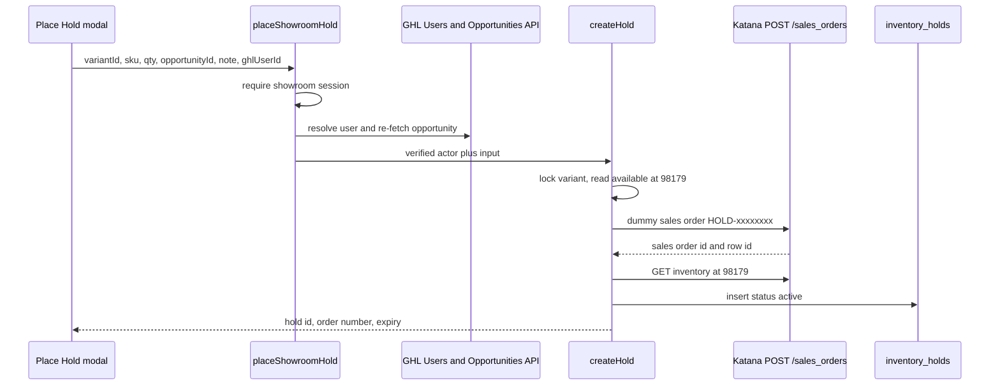
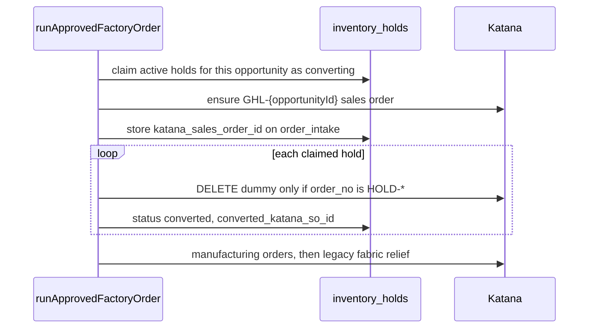

# Soft Allocation (Hold) — Architecture

**Status:** Proposed for approval. No schema, server action, webhook branch, or sweeper is implemented.  
**Audience:** Showroom, factory floor, PIM  
**Binding SoT:** [`docs/MDM_MASTER_BLUEPRINT.md`](MDM_MASTER_BLUEPRINT.md) §2.4 and §3  
**Date:** 2026-10-02  
**Supersedes:** the earlier 48-hour walk-in brief in this file (typed customer name, no opportunity id).

The Place Hold button on `InventoryCard` logs the Katana variant id and stops. This document is the reservation system that button will call once approved.

Supabase is the reservation ledger and the clock. Katana is the inventory engine. Katana has no temporary hold and no expiry, so a short-lived sales order is the commitment. The ledger says who placed it, which GoHighLevel opportunity it belongs to, and when it must die.

This path is a showroom promise. It is a different document from the legacy fabric freeze `MIG-HOLD-FABRIC-20260811` (`52594042`).

---

## 1. Decisions to approve

| # | Decision | Plan |
|---|---|---|
| 1 | How long a hold lives | 14 days from creation. A rep can extend it by another 14 days, which clears `warning_sent_at`. |
| 2 | What the rep must attach | An existing GHL **opportunity**. Contact search is how they find it. A contact with no opportunity cannot be submitted. |
| 3 | Who the row blames | The GHL user returned by the Users API. The iframe may pass `ghlUserId`. The browser may not pass the display name that gets stored. |
| 4 | Katana order number | `HOLD-` plus 8 hex characters from the hold id. The opportunity name is written on the order for the floor to read. It is not the order number. |
| 5 | What "Won" does | Nothing to inventory. Won does not create a sales order and does not delete the hold. |
| 6 | When the dummy order is deleted because the deal is real | Inside the existing factory push, in the Inngest step immediately after the real `GHL-{opportunityId}` sales order id is stored, and only when `GHL_FACTORY_ORDERS=live`. |
| 7 | Which holds that step deletes | Every active showroom hold on that opportunity. The triage screen lists them before Approve & Push. |
| 8 | Double-commit window | The real sales order is created first, then each dummy is deleted. The window is one Katana round trip, retried until the dummy is gone. |
| 9 | Lost / Abandoned | The existing `POST /api/webhooks/ghl` releases holds. It still does not create a Katana order. |
| 10 | Ledger statuses | Business terminals are `released` and `converted`. `releasing` and `converting` exist so two workers cannot both own the row. |

Section 9 is the conversion analysis behind decisions 5–8. If any row in this table is rejected, the rest of the plan changes with it.

---

## 2. What the floor and the card see today

`searchKatanaStock` reads Katana inventory and, when a row exists at CC Manufacturing (`98179`), uses only that location. Available on the card is in-stock minus committed. A sales-order line at that location is already how this codebase moves quantity into Committed. `createKatanaSalesOrder` posts `POST /sales_orders` with a variant resolved from SKU, a quantity, a location, and an `Idempotency-Key`.

A hold sales order must not be delivered, invoiced, or turned into a manufacturing order. Delivery consumes on-hand stock. A manufacturing order starts factory work and commits recipe ingredients. `createMakeToOrderManufacturingOrders` is a separate call. The hold path does not call it.

`POST /stock_adjustments` stays forbidden. Adjusting on-hand would hide units from the floor instead of showing them as committed, and it would fight the next stocktake.

The legacy fabric freeze stays on its own order. Showroom holds are many small orders, one line each, deleted in full when they end. Any delete in this system loads the sales order first and continues only when `order_no` starts with `HOLD-` and equals the ledger value. `52594042` and `GHL-{opportunityId}` fail that test.

---

## 3. Salesperson identity

### 3.1 What the embed is today

`/embed/showroom` is the GHL iframe. `src/proxy.ts` accepts `embedKey` and compares it to `GHL_EMBED_SECRET`. That secret is shared by every rep who can open the menu. `getPimSession()` then returns one synthetic principal:

- email `ghl-embed@ccpatio.com`
- name `GHL Embed`

That principal proves the frame was launched with our key. It does not name the salesperson. A direct visit to `/showroom` with a Supabase session does name a person, by their login email.

GHL custom-menu URLs can substitute merge fields before the iframe request is made, for example `{{user.id}}` and `{{user.email}}`. Those values arrive as query parameters. They are not signed. Anyone who can see the iframe URL can change them.

### 3.2 Rule

The stored salesperson is whatever the GHL Users API returns for the user id. The modal shows that name as read-only. The place-hold action sends the user id again and looks it up again. A display name in the request body is ignored.

| Session | Actor stored on the row |
|---|---|
| Supabase user whose email is a real operator, not the embed principal | That email and name. Query-string `ghlUserId` is ignored. |
| Embed principal plus a `ghlUserId` that GHL resolves inside `GHL_LOCATION_ID` | `ghl_user_id`, `ghl_user_name`, and `ghl_user_email` from the Users API response. |
| Embed principal with a missing, unknown, or other-location user id | Place Hold stays disabled. The action rejects the call. |

The lookup fails closed. If GHL is down, the hold is not created and the query-string name is not used as a fallback.

Proposed menu URL, with the existing shared key unchanged:

```text
/embed/showroom?embedKey=<GHL_EMBED_SECRET>&ghlUserId={{user.id}}&ghlUserEmail={{user.email}}
```

`ghlUserEmail` is only a hint so the server can reject a response whose email does not match. The persisted name still comes from the API.

This is residual risk, stated plainly: a person who knows another rep's GHL user id and email can attribute a hold to that rep. Signing the query string would require a step GHL's custom menu does not run. A marketplace iframe `postMessage` identity is a later upgrade. The first slice does not depend on it.

`getPimSession()` remains the gate that the caller may use the showroom at all. It is not the name written on the hold when the caller is the embed principal.

### 3.3 GHL token

User lookup and opportunity search both need a location private-integration token. These are new when implementation starts:

| Variable | Use |
|---|---|
| `GHL_PRIVATE_INTEGRATION_TOKEN` | `Authorization: Bearer` on `https://services.leadconnectorhq.com` |
| `GHL_LOCATION_ID` | Location scope for user, contact, and opportunity reads |

Header `Version: 2021-07-28`. Scopes: users read, contacts read, opportunities read. The token stays on the server. The browser never searches GHL directly.

---

## 4. The modal

Place Hold opens a modal. The button stays disabled while available is 0 or the actor in §3.2 cannot be resolved.

| Field | Required | Source |
|---|---|---|
| Salesperson | Yes, read-only | §3.2 |
| Opportunity | Yes | Server search. The rep types a contact or opportunity name. Results are open and won opportunities in this location. Lost and abandoned opportunities are not selectable. |
| Quantity | Yes | Greater than 0. Decimals are allowed (`numeric(12, 4)`) because fabric and slab units are not always whole pieces. The server repeats the availability check. |
| Note | Yes | Trimmed, 1–500 characters. Example: "Client deciding between Ash and Stone". |

The modal states the two automatic endings: the hold ends at the displayed timestamp (14 days), and it ends if the opportunity is marked Lost or Abandoned. A daily warning reaches the owning rep 48 hours before expiry.

Submit calls the place-hold server action. The browser does not call Katana.

After success, `revalidatePath` runs for `/showroom` and `/embed/showroom`. The grid keeps rows in client state, so the success path also refetches the current category. Otherwise Committed and Available stay stale until the next category change.

Release Hold is the same card, second view: active holds for this variant, each with rep, opportunity name, quantity, note, and expiry. Release is one hold at a time and releases the full quantity on that row. Extend adds 14 days from the moment it is clicked and clears the 48-hour warning so it can fire again. Partial quantity edits stay out. A rep who needs a smaller hold releases and places a new one.

Any showroom session may release, including a rep who did not place the hold. The original salesperson stays on the row. `released_by` records who cleared it. Restricting release to the original rep leaves stock locked when that person is out.

---

## 5. Ledger

Table: `inventory_holds`.  
Drizzle definition goes in `src/server/db/schema.ts`. Apply later with `npm run db:generate` and `npm run db:migrate`. Do not hand-write a Supabase SQL migration. The browser never queries the table. Showroom server code uses `getDb()` on `POSTGRES_URL`.

### 5.1 Enums

`inventory_hold_status`: `active`, `releasing`, `released`, `converting`, `converted`.

`inventory_hold_release_reason`: `expired`, `lost`, `abandoned`, `manual`. Null while the row is `active`, `converting`, or `converted`.

`releasing` and `converting` are claims. The sweeper, the Lost webhook, the Release button, and the factory push all update with a conditional `where status = 'active'` (or, for the factory retry, `where status = 'converting' and conversion_order_intake_id = this intake`). A second worker that loses the compare-and-swap does not delete a sales order it no longer owns.

### 5.2 Columns

| Column | Type | Rule |
|---|---|---|
| `id` | `uuid` primary key, `defaultRandom()` | Minted in the action before the Katana call. The same id is the idempotency key. |
| `katana_variant_id` | `integer` not null | From the card. Must match the variant Katana resolves from `sku`. |
| `sku` | `text` not null | Global SKU, stored uppercase. |
| `qty` | `numeric(12, 4)` not null | Greater than 0. |
| `ghl_user_id` | `text` not null | GHL user id, or the Supabase user id when the actor is a direct login. |
| `ghl_user_name` | `text` not null | From the Users API, or the Supabase session name for a direct login. Never from the modal body. |
| `ghl_user_email` | `text` | Same source as the name. |
| `ghl_contact_id` | `text` not null | From the opportunity the server re-fetched at submit time. |
| `ghl_opportunity_id` | `text` not null | Required. This is the join key for Lost, Abandoned, and factory conversion. |
| `ghl_opportunity_name` | `text` not null | Snapshot at submit time, for the floor and the modal. Renames in GHL do not rewrite Katana. |
| `note` | `text` not null | The rep's reason. |
| `expires_at` | `timestamptz` not null | `now()` plus 14 days, set in the action. Column default is the same interval. |
| `warning_sent_at` | `timestamptz` | Null until the 48-hour warning task or note is created. Cleared on extend. |
| `status` | `inventory_hold_status` not null, default `active` | |
| `release_reason` | `inventory_hold_release_reason` | Set when status becomes `released`. |
| `released_by` | `text` | User id or email for `manual`. `sweeper` or `ghl-webhook` for the automatic reasons. |
| `released_at` | `timestamptz` | |
| `katana_dummy_so_id` | `integer` not null, unique | Sales order id. The row is inserted only after Katana returns it. |
| `katana_sales_order_row_id` | `integer` | Line id from `createKatanaSalesOrder`. |
| `order_no` | `text` not null, unique | `HOLD-` plus the first 8 hex characters of `id` with hyphens removed, lowercase. Example shape: `HOLD-8f2a1c3d`. |
| `conversion_order_intake_id` | `uuid` | Set when the factory push claims the row. References the intake that owns the claim. |
| `converted_katana_so_id` | `integer` | The real `GHL-*` sales order id. |
| `converted_order_no` | `text` | Copy of that order number. |
| `last_error` | `text` | Last Katana failure on release or conversion. Cleared on success. |
| `created_at` / `updated_at` | `timestamptz` not null, default `now()` | `updated_at` changes on every status write. |

`order_no` is what stops a bad ledger row from deleting a customer order. The opportunity name is stored beside it because Katana order numbers must stay unique, short, and free of slashes and quotes. Two holds on one opportunity (Ash and Stone, or the same SKU twice) would collide if both were named `HOLD-{opportunity name}`. A renamed opportunity would leave the factory looking at a stale number. The name is still visible: it is written to `customer_ref` and `additional_info` on the dummy sales order.

### 5.3 Indexes

| Index | Purpose |
|---|---|
| Unique `katana_dummy_so_id` | One ledger row per dummy order |
| Unique `order_no` | Order numbers cannot collide |
| `(status, expires_at)` | Sweeper scan |
| `(ghl_opportunity_id, status)` | Lost webhook and factory claim |
| `(katana_variant_id, status)` | Active quantity for a variant during the availability check |

### 5.4 Transitions

| From | To | Who | `release_reason` |
|---|---|---|---|
| `active` | `releasing` | Sweeper, Lost/Abandoned webhook, or Release Hold | chosen, then held through the Katana delete |
| `releasing` | `released` | Same worker, after Katana delete returns 200 or 404 | unchanged |
| `active` | `converting` | Factory push claim, live mode only | null |
| `converting` | `converted` | Factory push, after the real sales order id is stored and the dummy is deleted | null |
| `converting` | `active` | Factory push failed before a real sales order id existed, or intake was rejected | null |

`released` and `converted` are terminal. A retry that finds the row already terminal returns success and does not call Katana again, except the conversion retry described in §9.4.

---

## 6. Create hold

Module: `src/server/stock/create-hold.ts`.  
Function: `createHold`.  
Caller: server action `placeShowroomHold` in `src/app/showroom/actions.ts`, the same split as `searchShowroomStock` wrapping `searchKatanaStock`.

### 6.1 Sequence



### 6.2 Checks

1. Reject a missing note, a non-finite variant id, a quantity that is not greater than 0, or a missing opportunity id.
2. Re-fetch the opportunity. Persist `ghl_contact_id`, `ghl_opportunity_id`, and `ghl_opportunity_name` from that response. Reject lost and abandoned opportunities.
3. Take a session-level Postgres advisory lock on the variant id for the rest of the create, including the Katana calls, and release it in a `finally`. Two reps submitting the last unit serialize here. Woo's native connector does not take this lock. That race is in §7.4.
4. Mint `id`. `order_no` is `HOLD-` plus 8 hex characters. `expires_at` is now plus 14 days.
5. Read available the way the card does: in-stock minus committed at location `98179` (`CC_MANUFACTURING_LOCATION_ID` in `src/server/ghl/hold-order.ts`). Reject when the requested quantity is greater than that available figure. Katana will accept a sales order that drives available negative. The card already shows negative available for other reasons. A hold must not be one of them.
6. Under the same lock, if the sum of `active` and `converting` quantities for this variant is greater than Katana's committed quantity, treat the difference as commitments Katana has not reflected yet and subtract it as well. Once Katana's committed figure already includes those rows, the extra term is zero. This avoids both oversell during lag and a permanent double subtraction.
7. Call `createKatanaSalesOrder` with the payload in §7.1. Idempotency key: `soft-hold:{id}`.
8. Compare the resolved variant with the card's `variantId`. On a mismatch, delete that sales order and return an error. Do not insert the ledger row.
9. Read inventory again at `98179`. The committed quantity for this variant must have increased by `qty`. If it did not, delete the sales order and return an error. An order that does not move the column the card reads is not a lock. See §7.2.
10. Insert the ledger row with `status: "active"` and the Katana ids.
11. If the insert fails, `DELETE /sales_orders/{id}` and surface the database error. A retry of the same hold id uses the same idempotency key, so Katana returns the original order instead of committing the quantity twice. The insert can then be retried.

The ledger row is inserted only after Katana has both returned an id and moved Committed. A row with no sales order would make the sweeper delete nothing while the floor still sees free stock. A sales order with no row is an orphan; §7.5 covers that failure.

### 6.3 Result

Success:

```text
{ ok: true, holdId, orderNo, katanaDummySoId, expiresAt }
```

Failure is `{ ok: false, error }` for a missing session, matching the other showroom actions. `createHold` returns a structured error for validation and Katana failures. It does not swallow them.

---

## 7. The Katana lock

### 7.1 Dummy sales order

| Field | Value |
|---|---|
| `order_no` | `HOLD-` + 8 hex |
| `location_id` | `98179` |
| Line | One row: the card SKU, the requested quantity, `price_per_unit: 0` |
| Customer | One shared customer, name `CC Patio Showroom Hold`, email `showroom-holds@ccpatio.com`. `resolveKatanaCustomerId` looks up by email, so the first hold creates it and every later hold reuses it. |
| `customer_ref` | Opportunity name, truncated to a safe length |
| `additional_info` | Rep name, rep email, opportunity id, opportunity name, hold id, expiry timestamp, note. Truncate to stay inside Katana's field limit. |
| Ecommerce type, store, ecommerce order id | Omit. This order must stay out of the Woo connector. |
| Idempotency-Key | `soft-hold:{holdId}` |

The shared customer is deliberate. A Katana customer per walk-in would fan out through the native QuickBooks connector as a new customer per hold.

Price is zero so the document is not revenue. The hub does not invoice it. Whether Katana's own QuickBooks sync creates a document from a zero-dollar sales order is a go-live check in §14. The hub has no QBO code on this path.

### 7.2 Location proof

`createKatanaSalesOrder` sets `location_id` on the sales order body. The card ignores other locations whenever a `98179` inventory row exists. If Katana commits the line at a different location, the floor's default location may still move while the showroom card does not. Step 9 of create exists for that case.

If the proof read fails in implementation, the fix is to send `location_id` on the sales-order row as well, then repeat the proof. The hold is not considered placed until the proof passes.

### 7.3 What must never happen to a dummy

| Action | Why it breaks the lock |
|---|---|
| Deliver or partially deliver the dummy | On-hand drops. Deleting the order later may be refused, and the units are gone. |
| Invoice it | Accounting sees a sale that was only a conversation. |
| Create a manufacturing order from it | The floor starts cutting for a client who has not decided. Recipe ingredients become committed on top of the finished-good line. |
| Stock-adjust the variant | Fights the sales-order commitment and the next stocktake. |
| Call `relieveFabricHold` | That function edits `52594042` only. Showroom release is a full delete of a `HOLD-*` order. |

Before every delete, the worker fetches the order. Delete proceeds only when all of the following are true:

- `order_no` equals the ledger `order_no`
- `order_no` starts with `HOLD-`
- the id is not `52594042`
- the order has no manufacturing orders
- delivered quantity is zero

Any other shape leaves the row in its current claim status (`releasing` or `converting`), writes `last_error`, and waits for a person. The sweeper does not cancel a delivered order through a second endpoint.

### 7.4 Reconciliation edge cases

| Case | What happens |
|---|---|
| Two reps, one unit | The advisory lock plus the fresh inventory read allows one `POST /sales_orders`. The other receives an insufficient-available error and posts nothing. |
| Katana committed lags behind a hold we just inserted | The availability formula in §6.2 step 6 subtracts ledger quantity that is not yet inside Katana's committed number. |
| Katana committed already includes our holds | The extra term is zero. Available stays in-stock minus committed, which is what the card shows. |
| Woo sells the same unit between our read and our post | The native Woo connector does not take the Postgres lock. Our post can still succeed and drive available negative. The proof read will see the increase and keep the hold. The oversell against Woo is outside this hub, same as any other Katana sales order. The modal cannot promise a lock against Woo. |
| Same opportunity, two variants | Two ledger rows, two `HOLD-*` orders. Lost releases both. Conversion releases both (§9). |
| Same opportunity, same variant, twice | Allowed. Each row has its own order number, quantity, and expiry. |
| Rep holds `FAB-*` yards that the legacy freeze also commits | Both commitments are real until each is released by its own path. Factory push still relieves `52594042` by BOM yardage. Conversion deletes the showroom dummy separately. The manufacturing order remains the production commitment. This path does not change `hold_relief`. |
| Dummy order number collides with a future 8-hex value | `order_no` is unique in Postgres. A collision fails the insert, the new sales order is deleted, and the action returns the error. |
| Someone builds an MO from the dummy in the Katana UI | Delete is refused. `last_error` is set. The hold stays claimed until a person removes the MO. |
| `GHL_FACTORY_ORDERS=log` | Approve & Push does not create a Katana sales order. It also does not claim or delete showroom holds. They end on the timer, on Lost, or on Release Hold. |
| Opportunity renamed after the hold | Ledger and Katana keep the snapshot. Release keys use the opportunity id. |
| GHL contact merged | The opportunity id remains the key. Contact id is a snapshot. |
| Idempotent replay of create | Same hold id and same `Idempotency-Key` return the original sales order. The insert is retried. A second committed quantity is not created. |

### 7.5 Orphan dummy

If the sales order is created and the compensating delete also fails, there is no ledger row to retry from. The action returns the Katana error and the order id in the server log. The first slice does not scan Katana for unknown `HOLD-*` orders. If orphans show up, a later pass can list `HOLD-*` sales orders and delete those with no ledger row. That pass is not part of approval for the first slice.

---

## 8. Endings other than conversion

Three endings share one function, `releaseHold` in `src/server/stock/release-hold.ts`.

1. Conditional update `active` → `releasing`, setting `release_reason` and `released_by`.
2. Fetch and delete under the rules in §7.3.
3. On 200 or 404, set `released`, `released_at`, and clear `last_error`, with `where status = 'releasing'`.
4. On any other Katana error, leave `releasing`, store `last_error`, and stop. The next sweeper tick retries rows already in `releasing` as well as newly expired `active` rows. The row is not marked `released` while Katana still has the order.

A crash after the delete and before the ledger update leaves `releasing` with a missing sales order. The next tick gets 404 and marks `released`.

### 8.1 Timer

Module: `src/server/stock/sweep-expired-holds.ts`.  
Runner: Inngest function `sweep-expired-inventory-holds` in `src/inngest/functions.ts`, added to the `inngestFunctions` array that `/api/inngest` already serves.

| Field | Value |
|---|---|
| Trigger | cron `*/15 * * * *` |
| Concurrency | 1 |
| Reason | `expired` |
| `released_by` | `sweeper` |

Scheduled work stays an Inngest function. No Vercel cron, `pg_cron`, or node-cron process. This function is not `syncGhlOpportunity` and is not registered beside it. `syncGhlOpportunity` stays in `unregisteredTransactionalFunctions`.

Two more functions sit beside this sweeper. `sendHoldExpirationWarnings` runs daily at 08:00 (`0 8 * * *`) and creates a GoHighLevel task, or a contact note if tasks are refused, for active holds with `expires_at` between 24 and 48 hours out and `warning_sent_at` null. `autoReleaseExpiredHolds` runs hourly (`0 * * * *`) and calls the same sweep, so an expired hold still deletes its `HOLD-` sales order. Both are exported from `src/server/inngest/inventory-holds.ts` and registered in `inngestFunctions`.

The batch is rows with `status = 'active'` and `expires_at <= now()`, oldest first, cap 50, plus rows already stuck in `releasing`. Fifteen minutes is the longest a hold stays committed after `expires_at`.

Won does not move `expires_at`. A deal that sits in GHL does not keep factory stock locked past the hold clock. When the 14 days end, the piece is available again unless the rep extended it. The rep may place a new hold if the piece is still there and the opportunity is still open or won.

### 8.2 Lost and Abandoned

GHL opportunity statuses `lost` and `abandoned` release every `active` hold with that `ghl_opportunity_id`. Reason is `lost` or `abandoned`. `released_by` is `ghl-webhook`.

Rows already `converting` are left alone. The factory push owns them. A deal marked lost while Approve & Push is in flight still gets its real sales order if that push succeeds. Cancelling a `GHL-*` order is a person's action in Katana. This webhook does not delete `GHL-*` orders.

`open` and `won` do not release.

### 8.3 Manual

`releaseShowroomHold(holdId)` and `releaseHold(holdId)` claim the row with reason `manual` and `released_by` set to the actor from §3.2. `extendHold(holdId)` sets `expires_at` to now plus 14 days and clears `warning_sent_at`. A row in `converting` returns a structured error: the factory push owns it. A row already `released` or `converted` is not extended. Factory code with no browser session calls `releaseHoldById(holdId, releasedBy)` in `src/server/stock/release-hold.ts`.

---

## 9. Deal Won and the double-commit window

### 9.1 The two clocks

"The deal is Won" and "a real sales order exists in Katana" are not the same moment in this repository.

| Moment | What the hub does today |
|---|---|
| Opportunity status becomes Won | Nothing. `syncGhlOpportunity` listens for `ghl/opportunity.won` and is **not** registered. The blueprint forbids rebuilding that auto-push. |
| Stage becomes Produce Factory Order | `POST /api/webhooks/ghl` inserts `order_intake`. No Katana write. |
| A person maps `FIN-*` and `FAB-*` and Approve & Push runs with `GHL_FACTORY_ORDERS=live` | Inngest `order.approved` runs `runApprovedFactoryOrder`. `ensureSalesOrder` creates or reuses `GHL-{opportunityId}` at location `98179`. Manufacturing orders come after that. Fabric relief edits `52594042` after the manufacturing orders exist. |

A Won webhook that created a sales order would be a second writer next to `order.approved`. A Won webhook that deleted the dummy would open a hole from the moment of Won until Approve & Push. During triage the card would show the piece as available. Another rep could hold it. Woo could sell it. The factory order would then commit it again, or the shop would build a piece that was already resold.

So Won is recorded in GHL and ignored by inventory. The dummy stays until the timer, a Lost/Abandoned status, a manual release, or the conversion step below.

### 9.2 Why the dummy is not edited into the real order

Editing the `HOLD-*` document so that it becomes `GHL-{opportunityId}` would avoid a second committed quantity only when the SKU and the quantity are unchanged and Katana applies the customer, the order number, and the lines in one request. That is not the factory push we have.

- `ensureSalesOrder` finds the real order by `GHL-{opportunityId}`. A document that is still numbered `HOLD-*` is invisible to that lookup, so the push would create another order beside it.
- The dummy customer is the shared showroom customer. The factory order customer is the GHL contact. QuickBooks and the floor paperwork follow the customer on `GHL-*`.
- The hold is often the wrong variant. The note on the modal is the Ash-versus-Stone case. An in-place edit would be a different algorithm for "same SKU", "smaller quantity", and "different SKU", and the audit trail of the reservation would disappear into the production order.
- The real push creates manufacturing orders per sales-order row. A hold must not have those. Converting the document in place would attach production to a reservation. A failed conversion would leave an MO on a hold.
- Line price on the factory order is also zero today, so price is not the difference. Identity, order number, and manufacturing are.

The real order is created by the existing function. The dummy is deleted beside it.

### 9.3 The window, and which side of it we accept

Katana has no single call that creates one sales order and deletes another. There is always a gap.

Let H be the held quantity and R the real line quantity for the same variant.

| Order of calls | Committed, same variant | What the floor can do in the gap |
|---|---|---|
| Delete dummy, then create `GHL-*` | H, then 0, then R | The piece looks free. Another hold or a Woo order can take it before the factory order exists. |
| Create `GHL-*`, then delete dummy | H, then H+R, then R | The piece looks reserved twice. Nothing new can take those units. The extra reservation is a `HOLD-*` order with a zero price and the showroom customer. |

The plan uses the second order. A short double reservation cannot ship the same unit twice. A gap can. The factory can tell the two documents apart by the `HOLD-` prefix if they happen to refresh during the gap.

When the real line is a different variant, there is no double count on one SKU. Ash stays committed until its dummy is deleted. Stone becomes committed when `GHL-*` is created. Deleting Ash in the next step is what returns Ash to available.

When R is less than H, the end state is R, not H. The whole dummy is deleted. The leftover quantity is available again. The first slice does not leave a remainder hold.

### 9.4 Where the calls sit

Both steps are added to `runApprovedFactoryOrder` in `src/server/ghl/push-factory-order.ts`. They run only after the dry-run return (`GHL_FACTORY_ORDERS` is not `live`). They do not run in log mode.



1. **`claim-showroom-holds`**, before `ensure-sales-order`.  
   `update ... set status = 'converting', conversion_order_intake_id = :intake where ghl_opportunity_id = :opp and status = 'active' returning *`.  
   The sweeper and the Lost webhook stop selecting these rows, so they cannot free the stock in the middle of the push. The dummy sales orders are still in Katana. Committed is still H.

2. **`ensure-sales-order`**, unchanged. On success the intake row has `katana_sales_order_id` and `katana_order_no` (`GHL-{opportunityId}`). Committed is H+R for overlapping variants.

3. **`release-showroom-holds`**, immediately after that step and before `ensure-manufacturing-orders`.  
   For each claimed row, delete under §7.3 and set `converted`, `converted_katana_so_id`, and `converted_order_no`.  
   HTTP 404 on the dummy is treated as already gone: still mark `converted`, and set `last_error` to a note that the dummy was already absent so the gap is visible.  
   Committed returns to R.

4. Manufacturing orders and `relieve-hold` stay in their current order. Showroom release does not call `relieveFabricHold`. Fabric relief does not delete `HOLD-*` orders.

If `ensure-sales-order` throws before an id is stored, a following step sets the claimed rows back to `active` and clears `conversion_order_intake_id`. The dummies stay. The push retry claims with:

```text
status = 'active'
OR (status = 'converting' AND conversion_order_intake_id = this intake)
```

If the sales order id is already stored and `release-showroom-holds` fails, the retry does not create a second `GHL-*` order (`ensureSalesOrder` already returns the stored id). It only retries the deletes. Rows remain `converting` until those deletes succeed. That is the stuck double-commit, and it is the sweeper's second job (§9.5).

If there are no holds, the claim returns an empty set and the push behaves as it does today.

### 9.5 Stuck `converting`

The same Inngest cron handles claims that outlive the push.

| Intake state | Sweeper action |
|---|---|
| `katana_sales_order_id` is set | Retry the dummy deletes and mark `converted`. This closes a double commit the push did not finish. |
| Intake `failed` or `rejected`, and no sales order id | Set the rows back to `active`. The next tick can expire them if `expires_at` has passed. |
| Intake still `approved` and the push is younger than 15 minutes | Leave the rows. The push is still working. |
| Intake still `approved`, no sales order id, and the claim is older than 15 minutes | Set the rows back to `active` and write `last_error`. |

The sweeper never creates a sales order. It only deletes an order whose number starts with `HOLD-`, or it returns a claim to `active`.

### 9.6 What the operator sees before the push

`/admin/order-triage` loads active and converting holds for the opportunity and lists variant, quantity, rep, and note on the detail the person approves. Approve & Push means those holds will be deleted once the real sales order id exists, including holds for variants that are not on the mapped lines.

That last clause is the Ash-and-Stone rule. If the order is Stone and the hold is Ash, Ash is not a double count. It is still released, because the factory order is the decision for that opportunity. The list is on the screen so the release is visible before the click. A hold the client still wants has to be placed again, on the variant they still want, under a new 72-hour clock.

Won, by itself, does not show this list and does not release anything.

### 9.7 Races against the claim

| Race | Result |
|---|---|
| Sweeper expiry and claim | One compare-and-swap wins. If the sweeper already moved the row to `releasing`, the claim misses it. The real sales order is still created. The triage list is the warning that the hold might already be gone by the time of the push. |
| Lost webhook and claim | Lost updates `active` only. After the claim, Lost leaves the row in `converting`. |
| Manual release and claim | Release updates `active` only. During `converting` the button returns an error. |
| Second push for the same intake | `order_intake` is unique on opportunity id, and a `pushed` intake returns already-pushed. The claim targets `active` or this intake's `converting` rows. |
| Push for opportunity A, hold for opportunity B | No overlap. B stays active until its own ending. |

---

## 10. GHL webhook

Route: existing `POST /api/webhooks/ghl`. No second public URL. Same `GHL_WEBHOOK_SECRET` and `verifyGhlWebhookRequest`. A bad signature is still 401.

Today a payload that is valid but not in Produce Factory Order returns 200 ignored, and a payload without a stage fails Zod with 400. A Lost status update often has a status and an opportunity id without the stage shape the factory parser requires. If those requests 400, the hold lives until the timer.

The route gains a smaller branch, before the factory-stage check:

1. Verify the signature and parse JSON, as today.
2. Read opportunity id and status from the same envelope `normalizeGhlFactoryPayload` already walks (`opportunity`, `data`, root).
3. When status is `lost` or `abandoned` and the id is present:
   - Call `releaseHold` for each `active` row with that opportunity id.
   - Log the webhook with event name `opportunity.lost` or `opportunity.abandoned`.
   - Return 200 with the count released and the count already terminal.
   - Do not insert `order_intake`.
   - Do not enqueue `order.approved` or `ghl/opportunity.won`.
4. When status is `lost` or `abandoned` and the stage is also Produce Factory Order, the release branch still wins. A lost deal does not enter triage from this request. An intake row that already exists is left for a person.
5. When status is `won` or `open`, fall through to today's stage check. Won plus Produce Factory Order still inserts `order_intake`. Won alone stays 200 ignored.
6. Factory Zod failures on requests that are not a release status stay 400 with no insert.

Release is idempotent. A replayed Lost webhook finds `released` rows and returns 200.

The webhook returns 200 even when a Katana delete fails, after `last_error` is stored, so GHL does not retry-storm a deterministic Katana refusal. The sweeper retries `releasing` rows. A thrown database error still fails the request so GHL can retry a ledger outage.

---

## 11. Entry points

UI calls are server actions. They carry the showroom session cookie and the embed key. A parallel anonymous REST API for place and release would be a second way to create Katana sales orders.

| Operation | Entry | Module |
|---|---|---|
| Search contacts and opportunities | `searchGhlHoldTargets` in `src/app/showroom/actions.ts` | `src/server/ghl/search-hold-targets.ts` |
| Place hold | `placeShowroomHold` | `src/server/stock/create-hold.ts` |
| Release hold | `releaseShowroomHold` | `src/server/stock/release-hold.ts` |
| List holds for a variant | `listShowroomHolds` | `src/server/stock/list-holds.ts` |
| Lost / Abandoned | `POST /api/webhooks/ghl` | `releaseHold` |
| 72-hour sweep and stuck claims | Inngest `sweep-expired-inventory-holds` | `src/server/stock/sweep-expired-holds.ts` |
| Conversion | Inngest `order.approved` steps inside `runApprovedFactoryOrder` | `src/server/stock/convert-holds.ts` |

Search requires a showroom session, at least two characters, and returns at most 20 opportunities with id, name, contact id, contact name, and status. The action talks to GHL. The client receives the search result only.

Place-hold input from the client:

```text
{ variantId, sku, qty, ghlOpportunityId, note, ghlUserId? }
```

`ghlUserName` is not part of the input. The action overwrites identity from §3.2 and overwrites opportunity fields from the GHL refetch.

There is no new `/api/showroom/holds` route in the first slice.

---

## 12. Failure matrix

| Failure | Ledger | Katana | Next step |
|---|---|---|---|
| No session, unverified rep, validation, lost opportunity, or insufficient available | No row | No order | Error on the modal |
| `POST /sales_orders` fails | No row | No order | Show the Katana error |
| POST succeeds, variant mismatch or committed did not move at `98179` | No row | Delete that order | Show the mismatch or the proof failure |
| POST succeeds, insert fails, compensating delete succeeds | No row | No order | Retry. Same idempotency key |
| POST succeeds, insert fails, compensating delete fails | No row | Orphan `HOLD-*` | Log the order id. No automatic scanner in the first slice |
| Release delete fails | Stays `releasing` | Order remains | Next cron retries |
| Release delete 404 | `released` | Already gone | Done |
| Lost webhook while status is `converting` | Stays `converting` | Dummy remains until conversion or revert | Factory push owns the row |
| Real SO created, dummy delete fails | Stays `converting` | Both orders exist. Committed is H+R | Inngest retries the delete step. Sweeper retries after the intake has a sales order id |
| Real SO fails, revert succeeds | Back to `active` | Dummy remains. Committed is H | Rep still has the hold |
| Sweeper sees `converted` | No write | No delete | Conditional update misses |

---

## 13. Boundaries

In scope when implementation is approved:

- Drizzle table and enums
- Place, release, list, and search server actions
- Modal on `InventoryCard`, including Release Hold
- Holds listed on the order-triage detail
- Lost and Abandoned branch on `POST /api/webhooks/ghl`
- Inngest sweeper
- Claim and release steps inside `runApprovedFactoryOrder`
- `.env.example` entries for the GHL private token and location id

Out of scope:

- Registering `syncGhlOpportunity` or creating a Katana sales order from Won
- Deleting or cancelling `GHL-*` orders from the Lost webhook
- Any change to `MIG-HOLD-FABRIC-20260811` or `relieveFabricHold`
- Editing hold quantity, extending the 72-hour timer, or partial release
- Make-to-order, shipping, invoicing, or stock adjustments on the hold path
- Woo, Clover, or QuickBooks code
- A browser Supabase client or an RLS policy for `inventory_holds`
- A scanner that deletes `HOLD-*` orders with no ledger row
- Moving GHL pipeline stages from the hub

---

## 14. Go-live checks outside this repo

These are configuration facts the first coded slice cannot prove by itself.

1. Katana has no automation that creates a manufacturing order for every new sales order. If it does, `HOLD-*` has to be excluded before this ships.
2. The native QuickBooks sync does not post a zero-dollar, uninvoiced sales order for customer `CC Patio Showroom Hold`. If it does, exclude `HOLD-*` in that sync before this ships.
3. The GHL workflow that marks Lost and Abandoned actually posts to `POST /api/webhooks/ghl` with the existing secret. A stage rename inside GHL that never sends status `lost` will leave release to the 72-hour timer.
4. The custom-menu URL includes `{{user.id}}`. Without it, the embed cannot place a hold.

---

## 15. Acceptance checks for the implementation pass

These are the checks to write when the code exists. They are not part of this document's deliverable.

1. A hold for available 5 and quantity 2 posts one sales order at location `98179`, inserts one `active` row, and does not call the manufacturing-order endpoint.
2. The committed quantity at `98179` for that variant increases by 2. If a test double shows it did not, the sales order is deleted and no row is inserted.
3. A second hold that would exceed available is rejected and does not post.
4. `ghl_user_name` on the row is the Users API name when the client sends a different name.
5. The embed principal without a resolvable `ghlUserId` cannot place a hold.
6. A row with `expires_at` in the past is deleted in Katana and becomes `released` with reason `expired`.
7. A Lost webhook for the opportunity releases active holds and does not insert `order_intake`.
8. A Won webhook does not delete holds and does not create a sales order.
9. A sweeper tick does not delete `MIG-HOLD-FABRIC-20260811` or any order number that does not start with `HOLD-`.
10. With `GHL_FACTORY_ORDERS=live`, a pushed intake stores `GHL-{opportunityId}`, then every claimed hold for that opportunity is `converted`, and the dummy orders are gone. A retried run does not create a second `GHL-*` order.
11. If the dummy delete fails after the real sales order exists, the row stays `converting` and a later tick deletes the dummy.
12. With `GHL_FACTORY_ORDERS=log`, Approve & Push leaves active holds in place.
13. Repeating create with the same hold id does not create a second sales order.
