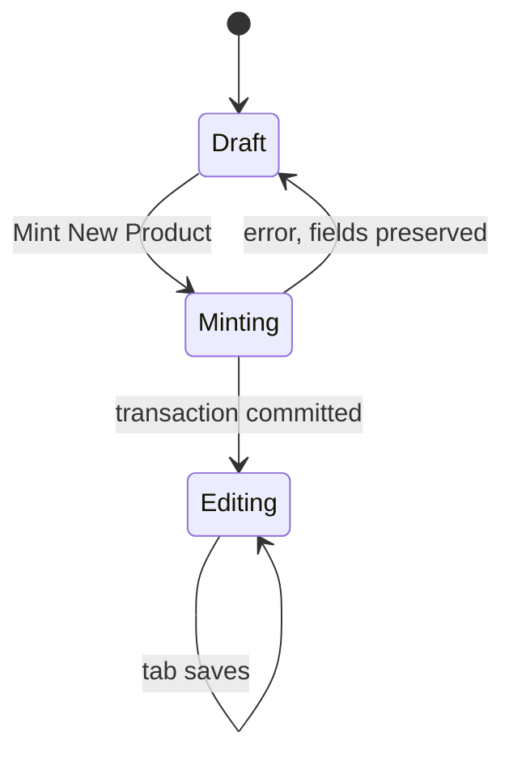

# Ultimate PIM God Mode Blueprint

Status: Approved. This document is the build spec.

The business owner approved all eight architectural recommendations on 2026-10-04, plus the Enterprise AI SEO amendment in §6.3. Those decisions are locked in §14. This file is the handoff to the execution engine.

Authority: `docs/MDM_MASTER_BLUEPRINT.md` remains the binding source of truth. This blueprint extends the Master Catalog drawer described in `data_migration/Pricing/MASTER_CATALOG_GOD_MODE_PIM_BLUEPRINT.md`. Where the two PIM documents disagree, this document wins on nomenclature, origin, assets, completeness, the tear sheet, and listing SEO. Where either PIM document would write Woo, Katana, Clover, or QuickBooks, or would revive the V8 transactional bus, the MDM blueprint wins and the write stays out.

The Master Catalog becomes the product lifecycle hub for a luxury made-to-order outdoor line. Staff define the product once. Factory, storefront, showroom POS, white-glove delivery, and the post-purchase packet all read that definition. The drawer is the place they finish the definition. It is not the cash register, the rater, or the mailroom.

---

## 1. Working backwards from the customer

A CC Patio customer does not buy a row in `ecommerce_listings`. They buy a welded frame in a collection, in an alloy, with a powder or wood-grain finish and a fabric chosen at the proposal, or they buy a third-party shade or accessory that never saw the weld shop. Weeks later the receipt, the care guide, the warranty, and the assembly sheet have to describe that same thing.

Restoration Hardware’s back office is not a prettier grid. It is a single product identity with a controlled vocabulary, a document packet pinned to the sale, a freight cube that is distinct from the beauty dimensions, and a merchandising graph that knows a sectional is a grammar of modules. CC Patio’s equivalent has to respect three facts the generic PIM checklist ignores:

1. **The hero SKU is a frame geometry, not a configured chair.** `FIN-BRV-ARM-SOF-34X34` is the armless sofa. Alloy price, powder color, and `FAB-*` yardage are decided on the quote and swapped onto the manufacturing order. Baking finish or fabric into the hub SKU would explode the catalog and fight the factory path already locked in the MDM blueprint.
2. **Two origins share one drawer and must not share one rule set.** Manufactured goods (`FIN-*`) owe the factory a CAD file and a BOM. Third-party goods (`3P-*`, Scolaro, FIM, Tenjam, and whatever comes next) are purchasable, not producible. Their CAD gate is structurally not applicable. Their vendor, vendor SKU, and wholesale cost are structurally required.
3. **The post-purchase packet is a contract with a future spoke, not an email feature.** A later job may attach the care guide and warranty PDF to a Clover receipt. This hub’s job is to make that lookup exact: one current document per packet kind, versioned so a March receipt does not silently pick up October’s rewritten warranty, scoped to the hub SKU because several listings already share one Clover item.

Everything below is that contract.

---

## 2. What already exists and stays

Reuse these. Do not replace them with a parallel product model.

| Concern | Current home | Rule this blueprint keeps |
|---|---|---|
| Hub identity | `sku_mappings.global_sku` | Primary key. Immutable after mint. Dictionary rename remains the only renamer, and the drawer does not call it. |
| Listing identity | `ecommerce_listings.id` | The grid row. Several listings may share one hub SKU (`FIN-TJM-MIS`). Listing copy saves one row. Hub edits announce that they apply to every sibling. |
| Commerce attributes | `finished_goods_catalog` | Display dimensions, primary `image_url`, slug, SEO, `na_fields`, web visibility. |
| Factory truth | `cad_uploads`, `product_bom`, factory readiness pill | CAD bytes stay on the existing upload and Inngest draft extract. Completeness does not repaint the factory pill. |
| Channel ids | `woo_product_id`, `clover_item_id`, `katana_variant_id`, `qbo_*` | Visible and read-only. Flags `sync_to_woo` and `sync_to_clover` mean eligible, not published. |
| Freight rating | Commercial document lane | Priority1, fleet, and white-glove stay there. The PIM stores the cube and the class. It does not rate. |
| Fabric at order time | `FAB-*` on the manufacturing order | The drawer documents the relationship. It does not create a finished good per colorway. |
| Audit | `pim_audit_log` | Field changes, N/A toggles, asset replacements, and rejected sync attempts all write here. |
| Optimistic lock | `sku_mappings.version`, `ecommerce_listings.version` | Stale save throws `This product was saved by someone else. Reload.` |
| PDF engine | `jspdf`, already used by the quote estimate | The tear sheet uses the same server-side engine. |

The nomenclature engine in `src/lib/sku-engine.ts` is a seed, not a runtime authority. `COLLECTION_CODES` and `CATEGORY_RULES` are loaded into dictionary tables once. After that, a new collection is a row, not a pull request.

---

## 3. Locked invariants

- A live `global_sku` does not change because a dimension, a label, or a price changed.
- A different geometry is a successor: new hub row, new listing, old listing left for archive. No automatic alias and no automatic Katana rename.
- Mint writes `sku_mappings`, `finished_goods_catalog`, and one `ecommerce_listings` row in one transaction. Mint does not call Katana, Woo, Clover, or QuickBooks.
- Archive is per listing (`archived_at`). Retire hub (`is_active = false`) only when every listing on that SKU is archived, and it forces both sync flags off.
- Marketing HTML is sanitized on write. Allow `p`, `br`, `strong`, `em`, `ul`, `ol`, `li`, and `a` with an `http` or `https` href. Strip style, class, src, and data URIs. The tear sheet and the grid excerpt use that same sanitized output.
- The browser never chooses an object storage key.
- Completeness is a pure function of a product snapshot. The drawer and the server action call the same function. The client copy of the gates that exists today is a defect this work removes.
- Setting a sync flag when the score is below 100, or when the listing is archived, throws a structured error that names the failing gates. The action does not coerce the flag to false and return success. A silent coerce hides the operator’s intent.

---

## 4. Two origins, one drawer

Origin is a real column on `sku_mappings`, not a note in `attributes`.

| | `manufactured` | `third_party` |
|---|---|---|
| Prefix | `FIN-` | `3P-` |
| Who makes it | CC Patio weld shop | A named vendor |
| CAD / BOM | Required for factory readiness | Forced not applicable. The checkbox is on and disabled. |
| Katana intent, later | Sellable and producible | Sellable and purchasable, not producible. Matches the third-party importer. |
| Required commercial extras | Steel MSRP and aluminum MSRP, each present or explicitly not applicable | Vendor name, vendor SKU, wholesale cost, and one retail MSRP |
| Factory pill | Unchanged | Stays a factory fact. Completeness treats manufacturing as not applicable automatically. |

Check constraints:

- `manufactured` rows use a `global_sku` that starts with `FIN-`. Vendor columns are null.
- `third_party` rows use a `global_sku` that starts with `3P-`. Vendor name, vendor SKU, and wholesale cost are not null.
- Origin is chosen before the first save and is immutable afterwards. Changing origin is a successor product.
- Staff cannot type a prefix. The origin picker selects it.

Vendor data lives on `third_party_sources`, one row per hub SKU: `vendor_name`, `vendor_sku`, `wholesale_cost` (numeric 12,4), `country_of_origin`, `fulfillment` (`showroom_stock` or `special_order`). Wholesale cost is internal. It is labeled `Wholesale cost. Not a retail price. Not posted to Woo or Clover.` Retail MSRP for a third-party item is the listing price the POS and the site may show.

`3P-` stays off the in-house recipe block list, as the importer already requires. Manufactured umbrellas remain `FIN-UMB-*`. A Scolaro umbrella remains `3P-UMB-*`. The collection code `UMB` may appear in both prefixes; the prefix is the origin.

---

## 5. Dynamic nomenclature

### 5.1 Dictionary tables

`nomenclature_collections`

| Column | Rule |
|---|---|
| `code` | Primary key. `^[A-Z0-9]{2,4}$`. Example: `MAL`. |
| `label` | Unique, operator-facing. Example: `Malibu`. |
| `is_active` | False retires the code for new mints. Existing SKUs still resolve. |
| `created_by`, `created_at` | Audit. |

`nomenclature_categories`

| Column | Rule |
|---|---|
| `code` | Primary key. `^[A-Z0-9]+(-[A-Z0-9]+)*$`, max 24 characters. Examples: `ARM-SOF`, `COF-TAB`, `UMB`. |
| `label` | Unique. Example: `Armless Sofa`. |
| `is_active` | Same retire rule. |

Reserved codes, rejected on insert: `FIN`, `FAB`, `MIS`, and any code equal to a SKU prefix (`RM`, `PWD`, `3P`). `MIS` remains the historical fallback already burned into old SKUs. It is not offered for new mints.

Creating or retiring a code requires `Ops_Manager` or `SuperAdmin`. Designers may pick active codes. They may not invent one inside the product drawer. The drawer’s “add collection” affordance is a short nested form that calls the dictionary action, then selects the new code. It is the same table either way.

A code that any `global_sku` already contains is immutable. Staff may rename `Malibu` to `Malibu Deep Seating`. They may not rename `MAL` to `MLB`. A new code is a new row.

### 5.2 Preview and mint

New products only:

```
manufactured: FIN-{collection}-{category}-{length}X{width}
third_party:  3P-{collection}-{category}-{token}
```

Height is stored and is not part of the SKU, matching `FIN-BRV-ARM-SOF-34X34`. Dimensions are positive integers in inches. Third-party tokens are the vendor’s size or color slug, uppercase, `[A-Z0-9-]`, because a Tenjam riser has no 34×34 frame (`3P-TJM-RISER8-SOLIDWHITE` is the existing shape). If the preview SKU exists, Save is blocked and the drawer names the existing product.

Before the first save, nothing is written. After mint, the SKU is permanent. Collection label and category label remain editable as human text on the listing. They do not recompute the SKU.

Existing roster SKUs are never regenerated. `FIN-TJM-MIS` stays `FIN-TJM-MIS`.

Seed migration copies today’s `COLLECTION_CODES` and `CATEGORY_RULES` into the tables, including the collisions already encoded (`MARINA` and `MILAN` both `MLN`, `FLEXY` and `EASY` both `ESY`). The seed does not “fix” those. A reviewer who wants Marina to stop sharing Milan’s code does that as an explicit dictionary edit, knowing it only affects future mints.

---

## 6. The drawer as a lifecycle, not a form

### 6.1 Sections and who owns them

| Section | Writes | Notes |
|---|---|---|
| Identity | Mint transaction, then labels only | Origin, collection, category, name, preview SKU. |
| Commerce | Listing | Steel MSRP, aluminum MSRP, or third-party retail MSRP. Local cost on the hub, labeled as not posted to QuickBooks. |
| Story | Listing | Marketing copy and construction details, sanitized HTML. |
| SEO | Listing, with hub defaults | Title, meta description, tags, slug. `[Optimize with AI]` suggests; the operator saves. See §6.3. |
| Specs | Hub catalog | Display length, depth, height, arm height, sit height. These print on the tear sheet. |
| Freight cube | `catalog_ship_profiles` | Packaged cube, actual weight, class. Distinct from display specs. See §8. |
| Asset vault | Existing CAD writer, image writer, `product_assets` | Unlocks after mint. See §7. |
| Customer packet data | Hub | Warranty term and assembly-required flag beside the PDFs. See §7.4. |
| Merchandising graph | `product_relations` | Compose, accessory, successor. See §9. |
| Channels | Flags on the hub, ids read-only | Toggles obey §10. |
| Siblings | Read-only banner | `Shared by N listings. Hub edits apply to all of them.` |

### 6.2 Fluid mint

`Mint New Product` is a state in the same drawer instance, not a trip back to the grid.



On success the action returns `listingId`, `globalSku`, listing version, and hub version. The drawer:

- stays open on the same component instance
- replaces the embed URL with `?listing={id}` without a navigation that unmounts it
- moves the header from `Preview` to the permanent SKU and the line `This SKU is permanent.`
- unlocks Asset Vault, Story, SEO, Freight, and Channels
- focuses the first failing gate

Asset dropzones stay disabled until that return. A failed mint leaves the operator in Draft with the error and the typed fields. Closing the drawer is an explicit dismiss.

### 6.3 Where SEO lives

`product_url`, marketing copy, and the storefront slug are listing facts, because two listings can share a hub SKU and still be different pages. `finished_goods_catalog.slug`, `seo_title`, and `seo_description` remain the hub defaults copied onto the listing at mint.

The drawer edits the listing SEO fields: title, meta description, tags, slug. Tags are a normalized string array, lowercase, no commas inside a tag. Slug is unique among non-archived listings. The hub columns stay as the fallback a future Woo mapper reads when a listing slug is empty. They are not a second editor.

Field limits, enforced in the client and again by Zod on save:

| Field | Limit | Slug rule |
|---|---|---|
| SEO title | 60 characters |  |
| Meta description | 160 characters |  |
| URL slug | 80 characters | `^[a-z0-9]+(?:-[a-z0-9]+)*$` |

A save over either character limit is rejected. The SEO gate (§10) passes only when title, meta description, and a unique slug are present and inside these limits.

#### Enterprise AI SEO assistant

The SEO tab includes an `[Optimize with AI]` button. It is a suggestion. It does not write the database.

`suggestListingSeo(listingId)` is a server action behind the same `*@ccpatio.com` operator gate as the other PIM mutations. The embed key cannot call it. The action loads the committed listing and hub row. It does not trust copy pasted from the browser, so the operator saves the Story tab before optimizing. If marketing copy is empty, the action throws `Save a marketing description before optimizing SEO.` and the button stays disabled until that save exists.

The prompt receives only:

- product name
- collection label
- category label
- display length, depth, and height (inches; omit a dimension that is N/A)
- origin (`manufactured` or `third_party`)
- marketing copy with HTML stripped to plain text

The prompt does not receive wholesale cost, local cost, vendor SKU, MSRP, CAD, or any channel secret. The model is instructed to write luxury outdoor-furniture commerce copy: specific, calm, and free of keyword stuffing. It must not claim a finish, a fabric, a lead time, or a price. Those are order-time or commercial facts, not SEO facts. The title names the collection and the product. The slug is readable words, not the hub SKU.

The model returns structured output validated by Zod before it reaches the drawer:

- `seoTitle` string, 1–60 characters
- `metaDescription` string, 1–160 characters
- `slug` string matching the slug rule, max 80 characters

A response that fails the schema is discarded. The action throws `The assistant returned an unusable suggestion. Try again.` The fields already on screen stay as they were. There is no silent truncation.

On success the drawer writes the three strings into the input state only. The tab shows `Suggestion. Review before saving.` The operator may edit every field. Nothing is persisted until the normal listing save, which still bumps `ecommerce_listings.version` and rechecks slug uniqueness. If the suggested slug collides with another non-archived listing, the field shows the collision and Save is blocked on that tab until the operator changes it.

There is one adapter, `src/server/pim/seo-assistant.ts`. The model id is `SEO_ASSISTANT_MODEL`. The key is `SEO_ASSISTANT_API_KEY`. Both are server-only. If either is missing, the button is disabled with `SEO assistant is not configured.` and the action throws the same sentence. The client never sees the key, the prompt, or the raw model payload.

One request may be in flight per open drawer. The button shows `Optimizing…` and ignores a second click. The action writes `pim_audit_log` with action `seo_suggest`, the listing id, and the hub SKU. It does not store the model output in the audit row; the listing save is the record of what the operator accepted.

#### Character counters

Each of the title and meta description inputs shows `n / limit` beside the field.

| Count | Title (limit 60) | Meta description (limit 160) |
|---|---|---|
| Empty | muted `0 / limit` | muted `0 / limit` |
| Short of the useful band | amber, under 50 | amber, under 120 |
| Inside the band | green, 50–60 | green, 120–160 |
| Over the limit | red, and the field error `Shorten to 60 characters.` or `Shorten to 160 characters.` | red, same pattern |

The slug field shows its normalized preview and `n / 80`, red over 80. Counters update as the operator types, including after a suggestion lands. Green means the length is in the band search results actually display. It is not a substitute for the operator reading the sentence.

### 6.4 Alloy price books

Manufactured outdoor frames are quoted in steel and in aluminum. Those stay two listing columns, `steel_msrp` and `aluminum_msrp`, because the grid, the seed, and the ghost editors already speak that language.

A later `frame_offers` table (alloy, MSRP, packaged weight, lead time) waits until the two alloys ship as different cubes. This build does not create it. The freight profile stores one cube, and the field help says which alloy that weight represents. A third-party listing uses one retail MSRP and leaves both alloy columns null.

Trade net and MAP are not in this phase. If they arrive, they are additional price roles. They are never written into the Woo or Clover payload from this drawer. Cost and wholesale cost stay internal.

---

## 7. Omnichannel asset vault

### 7.1 Kinds

Do not add a second CAD pipeline. `.dae` and `.skp` call the existing Factory BOM upload, must match the hub SKU, and the drawer shows the latest `cad_uploads` status.

Everything else is `product_assets` plus the primary image, which remains `finished_goods_catalog.image_url` so seeders and the storefront keep their current column. A primary-image upload writes that column and a `product_assets` row of kind `primary_image` in the same action.

| Kind | Cardinality | Bucket | Extensions | Scope |
|---|---|---|---|---|
| `primary_image` | one current | `product-images` | png, jpg, jpeg, webp | Hub |
| `gallery` | many, ordered | `product-images` | png, jpg, jpeg, webp | Hub |
| `tear_sheet` | one current | `product-documents` | pdf | Hub |
| `assembly` | one current | `product-documents` | pdf | Hub |
| `care_guide` | one current | `product-documents` | pdf | Hub |
| `warranty` | one current | `product-documents` | pdf | Hub |

Customer-packet kinds (`care_guide`, `warranty`, `assembly`) are hub-scoped on purpose. Clover’s item id hangs on the hub SKU. Listings that share `FIN-TJM-MIS` share one POS item, so a listing-scoped care guide could not be chosen from a receipt. Marketing copy can differ by listing. The packet the customer is emailed cannot.

Gallery rows carry `sort_order` and `alt_text`.

### 7.2 Versions, because receipts are historical

Replacing a warranty PDF must not erase the file a past receipt promised. Each asset row is a revision:

- `revision` integer, starts at 1
- `sha256` of the bytes
- `effective_on` date, default today
- `is_current` boolean
- `superseded_at` timestamp, null while current

Partial unique index: one `is_current` row per `(global_sku, kind)` for every kind except `gallery`. Uploading a new care guide inserts the next revision, clears `is_current` on the previous row, and does not delete the previous object. Delete of a current gallery image removes that object and that row. Delete of a packet revision is forbidden while any revision is the only copy; staff supersede instead.

The future receipt spoke resolves:

```
clover_item_id → sku_mappings.global_sku
→ product_assets where kind in (care_guide, warranty, assembly)
  and effective_on <= receipt_date
  order by effective_on desc, revision desc
  limit 1 per kind
```

This blueprint stores the history and documents that lookup. It does not send email, read Clover payments, or pin assets onto quotes. Pinning a revision id onto a commercial document is the right follow-on once this table exists. Until that pin exists, `effective_on` is the accuracy mechanism.

### 7.3 Upload security

`requestAssetUpload` today accepts a bucket and a filename and signs a path of `{sku}/{filename}`. The replacement contract:

1. The client sends `globalSku`, `kind`, and the original filename. It does not send a bucket or a path.
2. The server maps `kind` to exactly one bucket. The allowlist is `product-images`, `product-documents`, `cad-models`. Any other bucket throws before a signed URL exists.
3. The SKU segment must match `^[A-Z0-9][A-Z0-9._-]{0,63}$` after trim and uppercase. `..`, slashes, backslashes, and null bytes fail.
4. The extension is taken from the final segment only. `manual.pdf.exe` fails. The extension must be in that kind’s list. CAD extensions are legal only for the CAD kind, which never uses this generic signer.
5. The server generates the object key: `{sku}/{kind}/{revision}-{random}.{ext}`. Upsert onto a previous key is forbidden.
6. Size caps: images 15 MB, PDFs 25 MB, CAD stays on its existing 25 MB gate.
7. The signed URL is only half the write. `confirmAsset` runs after the browser upload. It reads the object, checks byte size, checks the magic bytes (JPEG, PNG, WEBP, `%PDF-`), rejects a content type that disagrees with the extension, stores `sha256`, inserts the row, and deletes the object if any check fails. A row does not exist for a file that failed the sniff.
8. Storage uploads use the service role on the server. Anon and authenticated Data API roles do not receive a policy that writes these buckets from the browser with a user-supplied path.
9. Every confirm and every supersede writes `pim_audit_log`.

### 7.4 Warranty and care as data plus a PDF

The PDF is what the customer receives. The claim pipeline and the tear sheet need structured fields so nobody parses a PDF:

On the hub, for this phase:

- `assembly_required` boolean. When true, the assembly gate needs a PDF. When false, the operator may mark assembly not applicable, and that is the only honest N/A for that gate.
- `warranty_term_months` integer, null until known. The warranty gate passes when a current warranty PDF exists and the term is set, or when warranty is explicitly not applicable (replacement parts and some third-party goods).
- `warranty_covers` text, short, operator-written (`Frame and finish` / `Vendor limited`). Not HTML.

Fabric care is not a column on the frame. The frame care guide covers the powder-coated or sublimated frame. A sentence in the construction details says cushion and sling care follow the fabric chosen at order. A fabric-grade care library, keyed by `FAB-*` rather than by the frame, is the correct second scope. It is deferred (§14.6). The receipt spoke cannot attach it until the order line records the fabric SKU. Packet PDFs on the frame are versioned in this build.

Finish swatches belong to a finish library shared by a collection, not duplicated onto forty SKUs. That library is deferred with the fabric allowlist. This build’s drawer shows a read-only empty state (`Finish imagery is collection-scoped and is not on this SKU yet`) so staff do not dump swatches into the hero gallery and call it done.

---

## 8. Freight cube, dimensional weight, and why the Katana profile is the wrong place to type it

`logistics_profiles` is keyed by `katana_variant_id`. A product that has not been published to Katana cannot have a row there. Completeness, quotes, and the tear sheet all need weight and cube before that publish. The commercial lane already refuses to invent a 90×40 pallet, and send is blocked without weight, a known NMFC class, and length and width.

New table `catalog_ship_profiles`, one row per `global_sku`, writable from the drawer with no Katana id:

| Column | Meaning |
|---|---|
| `length_in`, `width_in`, `height_in` | Packaged dimensions, not the beauty dimensions on the tear sheet. |
| `weight_lb` | Actual packaged weight. |
| `dim_weight_lb` | Generated `(length_in * width_in * height_in) / 139` for domestic parcel comparison. Null when any edge is null. |
| `billable_weight_lb` | Generated greatest of actual and dimensional weight. |
| `ltl_class` | The same allowlist already enforced on `logistics_profiles` (`50` through `500`, including `77.5` and `92.5`). |
| `nmfc_item` | Optional item code. Class remains the required rating input. |
| `ship_mode` | `ltl`, `parcel`, `white_glove_only`, `not_shipped`. |
| `stackable` | Boolean, default false for fully welded frames. |
| `assembly_required` | Mirrored from the packet flag so the delivery board can read one row later. |

Display dimensions and packaged dimensions are different numbers. A 34×34 armless sofa does not ship as a 34×34×seat-height carton. The tear sheet prints display dimensions and MSRP. The rater reads the ship profile. The drawer shows both, labeled.

`not_shipped` is the only mode that makes weight and class not applicable (a digital care-only service, or a fee). A physical frame and a physical umbrella do not get `Weight: N/A`.

This phase does not copy the profile into `logistics_profiles` and does not call Priority1. When a later publish creates a Katana variant, that job copies this row. Until then, Order Desk continues to read `logistics_profiles`. The gap is explicit: a newly minted SKU can be internally complete and still be absent from quoting until the variant exists. The drawer says so. It does not pretend the quote rater can see `catalog_ship_profiles` yet.

White-glove flags the delivery board will eventually need, stored now so they are not rediscovered: `threshold_delivery` (default true for seating), `two_person` (default true when billable weight is at least 70 lb or ship mode is `white_glove_only`). These do not affect the completeness score.

---

## 9. Relationships the grid does not have

### 9.1 Sectional grammar

Cross-sell and upsell IDs are the wrong shape for this catalog. An armless sofa, a corner, and a chaise are modules that compose. An umbrella requires a base. A cover is an accessory. A revised geometry is a successor.

`product_relations`

| Column | Rule |
|---|---|
| `from_sku`, `to_sku` | Both reference `sku_mappings.global_sku`. Different SKUs. |
| `role` | `composes_with`, `requires`, `accessory`, `successor`. |
| `note` | Optional, plain text, 200 characters. |

`successor` is single-valued from the old SKU. Archive does not auto-create it. `requires` is directional (umbrella requires base). `composes_with` is stored once; the UI queries both directions. `accessory` is directional (frame points at its cover).

The drawer edits this list. Woo category mapping and the GHL configurator are consumers later. This phase only stores the edges and shows them.

### 9.2 What is intentionally not a SKU relationship

- **Fabric.** Allowed fabrics are `FAB-*` materials chosen on the quote. A collection-level allowlist can come later. A required edge from every frame to every fabric is noise.
- **Factory BOM.** `product_bom` stays the manufacturing adjacency list. Customer-visible replacement parts are `accessory` relations (glides, sling seat, cover), not extrusion cut lines. Staff do not publish the weld recipe as a “you may also like.”
- **Finish.** Shared by collection, §7.4.

### 9.3 Service and parts

`item_type` already includes `service`. Replacement parts and freight fees are not finished goods and do not enter this drawer’s mint path. If a cover is sellable, it is a `third_party` or `manufactured` hub SKU of its own and an `accessory` edge. It is not a free-text line on the parent.

---

## 10. Completeness: ten gates, origin-aware, server-enforced

### 10.1 The function

One module, `scoreProduct(snapshot) -> { score, gates }`. `score` is `passed / 10` as an integer percent. A gate passes when its data is present or its N/A is allowed and set. The drawer renders that result. The server action recomputes it from the database inside the same transaction as a sync-flag write. The two never diverge.

N/A values continue to live in `finished_goods_catalog.na_fields`, extended with the keys below. Unknown keys are rejected.

### 10.2 Gates

| # | Gate | Manufactured pass | Third-party pass | N/A allowed |
|---|---|---|---|---|
| 1 | Identity | Minted SKU, name, active collection code, active category code | Same, with `3P-` | Never |
| 2 | Origin contract | Origin `manufactured` | Vendor name, vendor SKU, wholesale cost | Never |
| 3 | Retail price | Steel MSRP or N/A, and aluminum MSRP or N/A. At least one alloy priced. | Retail MSRP present | Alloy N/A only. Retail MSRP never N/A. |
| 4 | Story | Marketing copy non-empty after sanitizing | Same | Never when a sync flag is requested. N/A exists only to save a draft that is not being synced, and it still fails this gate. There is no N/A checkbox. |
| 5 | SEO | Listing title (1–60), meta description (1–160), and a unique slug | Same | Never. The assistant may fill the fields. Only a human save counts. |
| 6 | Hero | Primary image, minimum 1200 px on the long edge, or see channel mask | Same | See §10.3 |
| 7 | Display specs | Length and depth present (they are in the SKU). Height present or N/A. Arm and sit present or N/A. | Length, depth, height present or each N/A | Arm and sit for tables and umbrellas. Height N/A for nothing that has a tear sheet. |
| 8 | Freight | Ship profile with weight, class, packaged L/W/H, mode `ltl`, `parcel`, or `white_glove_only` | Same | Only `ship_mode = not_shipped` |
| 9 | Factory | Readiness is draft pending, factory approved, or published | Automatically passed. CAD N/A is forced, not operator-toggleable. | `factory_readiness` N/A is rejected on `manufactured` |
| 10 | Customer packet | Care PDF current. Warranty PDF plus `warranty_term_months`, or warranty N/A. Assembly PDF when `assembly_required`, otherwise assembly N/A. | Same | Warranty N/A and assembly N/A only as above. Care N/A is rejected for any physical ship mode. |

Gate 9 reads the factory pill. It does not invent a percent inside the pill. A manufactured product at “Missing CAD” is short exactly this gate and whatever else is empty. It is not “75% because CAD is missing.”

### 10.3 Channel mask

Both toggles are disabled, and the server rejects them, unless the score is 100 and the listing is not archived.

Hero N/A is locked as follows:

- Hero N/A is available only when origin is `third_party` and `is_web_visible` is false.
- With hero N/A, the score can reach 100 and **Sync to Clover** can be enabled.
- **Sync to Woo** stays disabled while hero is N/A or `is_web_visible` is false, even at 100. The server throws `Woo requires a primary image and web visibility.`
- Manufactured goods have no hero N/A. A frame without a photograph does not reach 100.

### 10.4 Rejection shape

```
{ ok: false, error: "sync_blocked", score: 80, failing: ["freight", "customer_packet"] }
```

The UI lists those gates. The audit log records the attempt, the operator, the score, and the failing keys.

Unsaved local edits keep the toggles disabled on the client. The server does not know about keystrokes; it trusts the committed snapshot only. The operator saves, the score recomputes, then the toggle arms.

---

## 11. Tear-sheet catalog

The current catalog export is not a client leave-behind. The replacement is a server action, `jspdf`, same delivery pattern as the quote estimate (base64, filename, content type `application/pdf`).

One product per letter page, in `sheet_order`, grouped by collection label. A single-SKU download from the drawer is the same template with one page.

Each page pulls only committed data:

- Collection label and product name
- Permanent SKU
- Primary image, fitted, not stretched
- Sanitized marketing copy, tags stripped to paragraphs and lists
- Display dimensions: length, depth, height, arm, sit, omitting keys that are N/A
- Price block: `Steel` and `Aluminum` for manufactured, `MSRP` for third party
- Footer: `Finish and fabric shown are representative. Specification is confirmed at order.` Plus the warranty term in months when set.

A page is skipped when the hero or the marketing copy is missing. The action returns `{ pdf, omitted: [{ sku, reason }] }` so staff see the holes instead of a blank luxury page. The generator does not call Woo and does not embed CAD.

Images are fetched server-side from the known image host, with a timeout, and rejected if the long edge is under 1200 px. Construction details stay off the leave-behind; they are the spec tab, not the romance page. A future “spec sheet” can be a second template. This one is the client tear sheet.

---

## 12. Security and tenancy beyond the upload

- PIM mutations stay on server actions behind the existing `*@ccpatio.com` HMAC gate used by the dictionary. The embed key is not an operator session and cannot mint codes, mark N/A, flip sync flags, or call the SEO assistant.
- Dictionary-code creation is `Ops_Manager` or `SuperAdmin`, matching the commercial lane’s override roles.
- `SEO_ASSISTANT_API_KEY` is read on the server. It is never a `NEXT_PUBLIC_` variable, never returned to the drawer, and never written to `pim_audit_log`.
- `SECURITY INVOKER` for any view that might later expose assets. No `SECURITY DEFINER` to paper over RLS.
- New tables are not granted to `anon`. The browser does not query them through the Data API. App access is `POSTGRES_URL`, the same posture as `logistics_profiles`.
- Optimistic version checks stay in the transaction that writes.
- Sync-flag rejection, N/A changes, origin (at mint), asset confirms, and code retirement write `pim_audit_log`.
- Rich text is sanitized before insert, and the PDF renderer escapes text rather than trusting stored HTML as a layout language.

---

## 13. Explicitly out of scope

- Woo, Katana, Clover, QuickBooks, and GHL writes. Flags and read-only ids only.
- Email of care guides or warranties. The lookup contract in §7.2 is the handoff.
- Freight rating, Priority1, promise dates, deposits, and the V8 transactional bus.
- A second CAD pipeline, in-place SKU mutation, and dictionary rename from this drawer.
- Copying `catalog_ship_profiles` into `logistics_profiles` before a Katana variant exists.
- Finish library authoring, fabric allowlists, trade price, and MAP. The seams are named so the next phase does not shove them into `attributes` JSON.
- Deleting a live Woo product, Katana variant, or Clover item on archive.
- The SEO assistant persisting a suggestion on its own, choosing a model in the browser, or sending cost, wholesale, or vendor identifiers to the model.

---

## 14. Locked decisions

Approved 2026-10-04. The execution engine implements these as written.

| # | Decision | Locked behavior |
|---|---|---|
| 1 | Hero N/A enables Clover. Woo stays blocked. | Third-party only, and only when web visibility is off. Manufactured goods need a hero to reach 100%. |
| 2 | Version every packet PDF. | Care, warranty, and assembly revisions stay in storage. Supersede does not delete the previous object. |
| 3 | Freight cube is isolated on `global_sku`. | `catalog_ship_profiles` is writable before a Katana variant exists. Quoting still reads `logistics_profiles` until a later publish copies the row. |
| 4 | SEO is edited on the listing, with an AI assistant. | Hub SEO columns are mint-time defaults. The drawer edits listing title (60), meta description (160), tags, and slug. `[Optimize with AI]` fills those inputs for human review and does not save. Counters mark the short, optimal, and over-limit bands in §6.3. |
| 5 | Alloy split stays two MSRP columns. | `steel_msrp` and `aluminum_msrp`. `frame_offers` is not in this build. |
| 6 | Finish and fabric libraries are deferred. | The drawer shows the empty state. No `finishes` table and no fabric allowlist in this build. |
| 7 | Sectional grammar ships. | `product_relations` roles: `composes_with`, `requires`, `accessory`, `successor`. |
| 8 | New dictionary codes are locked down. | Create and retire require `Ops_Manager` or `SuperAdmin`. Designers pick active codes only. |

---

## 15. Execution sequence

This order is the handoff. Implement it as specified above.

1. Dictionary tables, seed from `sku-engine.ts`, preview that reads the tables, collision tests, refusal to recompute a saved SKU. Code create and retire check `Ops_Manager` or `SuperAdmin`.
2. `product_origin` and `third_party_sources` with the check constraints. Mint state machine that stays open and unlocks tabs.
3. `scoreProduct` with the ten gates, N/A allowlist, channel mask, and server rejection. Delete the duplicated gate lists.
4. Listing SEO columns, character counters, and `suggestListingSeo`. The suggestion path stays disabled until `SEO_ASSISTANT_MODEL` and `SEO_ASSISTANT_API_KEY` are set. A suggestion never writes the listing.
5. Asset kinds, revision rows, `confirmAsset` magic-byte gate, path generation.
6. `catalog_ship_profiles` including generated dimensional weight.
7. `product_relations`.
8. Tear-sheet action and the omitted-page report.
9. `npm run qa:lifecycle` until exit 0, then a browser pass: mint a manufactured preview without closing the drawer, mint a third-party item with CAD forced N/A, reject Woo below 100, supersede a warranty PDF and show the previous revision still stored, run Optimize with AI and confirm the fields are dirty and unsaved until the operator saves, print a tear sheet that contains the hero, the copy, the dimensions, and both alloy prices.

---

## 16. Sketch of the new tables

Names are the proposal. Columns match the rules above; types follow the existing Drizzle style (`numeric` for money and weights, `text` for SKUs, `jsonb` only for `na_fields` and SEO tags).

- `nomenclature_collections`
- `nomenclature_categories`
- `sku_mappings.product_origin` plus checks against the SKU prefix
- `third_party_sources`
- `product_assets` extended with `revision`, `sha256`, `effective_on`, `is_current`, `superseded_at`, `sort_order`, `alt_text`, and the wider kind enum
- `catalog_ship_profiles`
- `product_relations`
- listing columns for SEO title, SEO description, slug, and tags, backfilled from the hub where the listing values are null
- hub columns `assembly_required`, `warranty_term_months`, `warranty_covers`

`product_assets.kind` grows from `tear_sheet | assembly | gallery` to include `primary_image | care_guide | warranty`. Existing rows stay valid.
