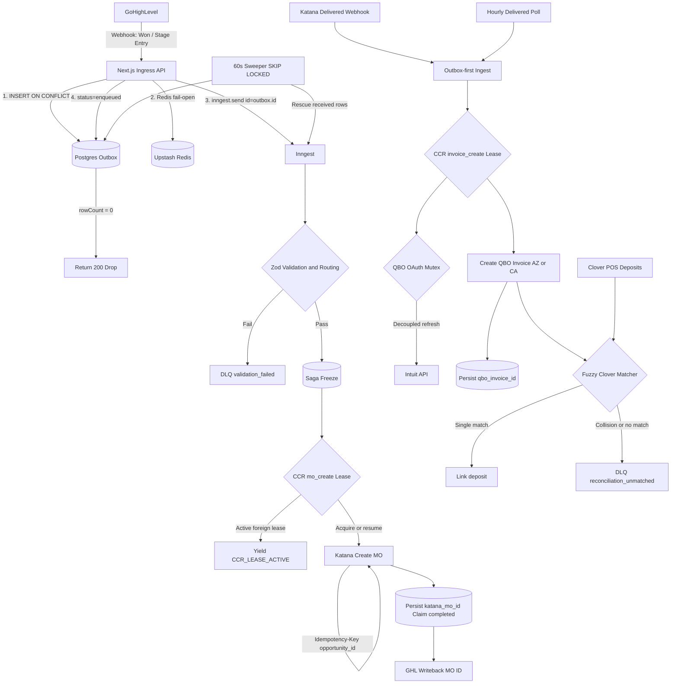
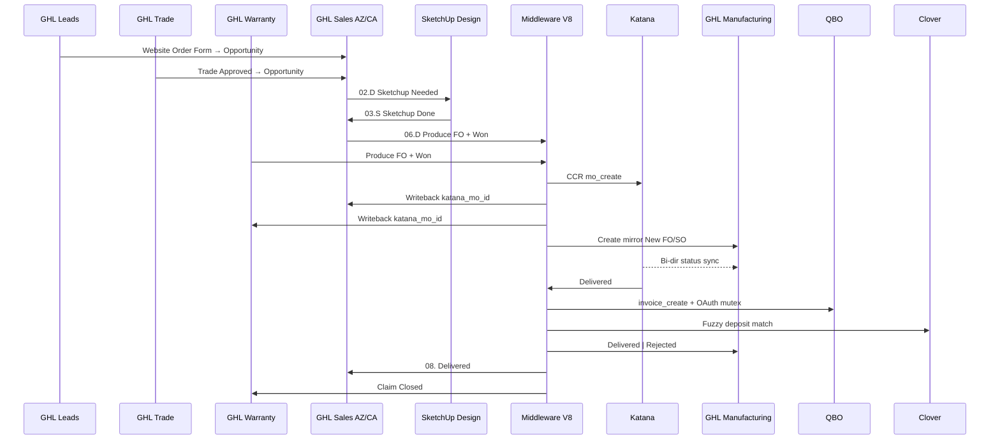

# CCPATIO ENTERPRISE INFRASTRUCTURE & LIFECYCLE — MASTER BUILD PLAN (V8 FINAL COMPLETE)

**Primary System Name:** CCPATIO ENTERPRISE INFRASTRUCTURE & LIFECYCLE  
**Sub-Header:** End-to-End Customer Flow, Design Engineering, Manufacturing & Financial Topology  
**Project:** Phase 1 Autonomous Manufacturing & Financial Reconciliation Middleware  
**Owner:** Robert G. (Lead Systems Architect)  
**Status:** **FROZEN — APPROVED TO BUILD** (architecture debate closed; execute Sprint 0 next)  
**Version:** V8 Final Complete (gap analysis integrated; E2E lifecycle topology synthesis)  
**Tech Stack:** Next.js (Ingress API) + Vercel Postgres / Neon (State/Outbox) + Inngest (Durable Execution) + Upstash Redis (Network Dedupe)  
**Targets:** GoHighLevel (Leads · Trade · Warranty · Sales AZ·CA · Manufacturing) → SketchUp (human) → Katana MRP → QuickBooks Online (Scottsdale AZ / Solana Beach CA) → Clover POS  
**Companion docs:** `CCPatio_E2E_Customer_Lifecycle.md` · Topology dashboard (`topology/`)  

| Scope | Authorization |
| --- | --- |
| Sprint 0–2 | APPROVED TO BUILD now |
| Sprint 3–4 | APPROVED after sandbox gates in this plan |
| Live cutover | Sprint 5 only |

**Reference IDs:**
- Website Order Form (Leads CRM gate — not MO trigger): `4c28fe9e-6983-4acf-ae96-db14d90577f3` (re-validate)
- Gate 1 Sales: `06.D - Produce Factory Order` stage UUID(s) AZ/CA — **confirm in Sprint 0**
- Gate 1 Warranty: `Produce FO` stage UUID — **confirm in Sprint 0**
- Franchise routing field: `2hdnKE1u8kQaQSPSsrLq` → `AZ` | `CA` (fail closed)
- Feature flag: `DOWNSTREAM_MUTATIONS` (OFF through soak; ON only in Sprint 5)

**Provenance:** V6 → V7 Deep Think Hardened → V8 Master Implementation → Blueprint gap patch → Final Complete freeze.

---

## 1. EXECUTIVE SUMMARY & SYSTEM TOPOLOGY

**CCPATIO ENTERPRISE INFRASTRUCTURE & LIFECYCLE** spans the full customer journey: GHL Leads → Sales (AZ/CA) with SketchUp design hand-off → Produce/Won automation → Katana manufacturing (mirrored in GHL Manufacturing) → Delivered → dual QBO invoicing → Clover reconciliation.

The Phase 1 middleware eliminates manual data entry between GoHighLevel, Katana, QuickBooks Online, and Clover. It is engineered with banking-grade resilience: Guaranteed Outbox, Stateful Claim-Check-Resume (CCR) locking, and decoupled OAuth mechanisms to survive concurrent race conditions, mid-flight worker crashes, and network timeouts.

### 1.1 Architecture Flowchart (Correct Handoff Order)

**Handoff invariant:** `mo_create` and `invoice_create` are separate effects. Invoicing runs only after Katana **Delivered** (webhook primary, hourly poll backup)—never immediately after MO create. Clover matching runs **after** the invoice is posted; unmatched/collision never blocks or reverses the invoice.

### 1.2 Enterprise Lifecycle Topology (GHL ↔ Middleware Sync)

Departmental leaders use this section to see **which human stage movements are CRM-only** versus **which movements fire automated middleware**. Source of truth for stage names: `CCPatio_E2E_Customer_Lifecycle.md`. Architecture remains V8; this is the operational contract across **six GHL pipelines**.

| Zone | Owner | GHL / System Surface | Automation? |
| --- | --- | --- | --- |
| 1 · Multi-Funnel Inception | Sales / Trade / Service | **Leads** · **Trade** · **Warranty Claims** | No middleware until Gate 1 |
| 2 · Design & Sales | Sales + Design | **Scottsdale \| Sales** · **Solana Beach \| Sales** | Human SketchUp; Gate 1 at `06.D` |
| 3 · Middleware | Engineering | Next.js · Redis · Postgres · Inngest | Yes — V8 ingress, outbox, CCR |
| 4 · Factory Dual Track | Factory + Ops | **Katana MO** + **Manufacturing** mirror | MO create + bi-dir stage sync |
| 5 · Financial Clearance | Finance | Katana Delivered → QBO → Clover | Yes — invoice + fuzzy match + terminal GHL sync |

#### Zone 1 — Multi-Funnel Inception (three entry paths)

| Funnel | Pipeline | Path | Middleware |
| --- | --- | --- | --- |
| **Retail** | Leads | `New \| Uncontacted` → … → **`Website Order Form`** → Sales | Ignore |
| **B2B** | Trade | `Application Submitted` → **`Approved`** → Sales (`Declined` ends) | Ignore |
| **Service** | Warranty Claims | Discovery → … → Claim Approved → Selecting Colors → **`Produce FO`** | **Gate 1** (bypasses Sales design loop) |

**Ops clarity:** Website Order Form and Trade Approved are **CRM gates** into Sales. They are **not** factory automation triggers. Warranty `Produce FO` **is** a Gate 1 trigger.

#### Zone 2 — Design & Sales (`Scottsdale | Sales` / `Solana Beach | Sales`)

Scottsdale uses `.D` (Design/Field) and `.S` (Sales) ownership prefixes.

| Stage | Actor | Middleware |
| --- | --- | --- |
| `01.D - On-Site Scheduled` | Sales / Field | Ignore |
| `02.D - Sketchup Needed \| Schedule Proposal` | Design | Ignore — human engineering / BOM bridge |
| `03.S - Sketchup Done` | Design → Sales | Ignore |
| `04.S - Proposal Given \| Follow Up` | Sales | Ignore |
| `05.S - Finalize Finishes` | Sales | Ignore — finishes frozen before Produce |
| **`06.D - Produce Factory Order` + `Status = Won`** | Sales / Ops | **Gate 1 — webhook → Ingress** |
| `07.S - Get Client Approval \| Transfer…` | Sales | Post-dispatch Ops (no second MO) |
| `08. Delivered` | System / Ops | **Terminal sync after Gate 2** |
| `09. Lost` | Sales (Solana Beach) | Ignore |

#### GATE 1 — Factory Dispatch (`mo_create`)

**Triggers (either path + Won):**

1. Sales: `06.D - Produce Factory Order`
2. Warranty: `Produce FO`

**Middleware contract:**

1. Signed webhook → HMAC → outbox `ON CONFLICT` → Redis fail-open → `inngest.send(id=outbox.id)` → `enqueued`
2. Zod + franchise (`2hdnKE1u8kQaQSPSsrLq`) + `sku_mappings` freeze on `saga_instances`
3. CCR `mo_create` → Katana Create MO (`Idempotency-Key: opportunity_id`) → persist `katana_mo_id`
4. **GHL writeback** `katana_mo_id` to source Opportunity (Sales or Warranty)
5. **Create Manufacturing mirror card** at `New FO / New SO`

Sprint 0 must confirm live stage UUIDs for both Gate 1 stages (AZ/CA Sales + Warranty). Do **not** treat Website Order Form alone as an MO trigger.

#### Zone 3 — Core Middleware (unchanged V8)

Preserve: Ingress → Postgres Outbox → Redis Layer-1 (fail-open) → Inngest CCR → sweeper. No Katana/QBO HTTP inside Postgres TX. `DOWNSTREAM_MUTATIONS` off until Sprint 5.

#### Zone 4 — Factory Dual Track (Katana + Manufacturing)

| System | Path | Middleware |
| --- | --- | --- |
| Katana | MO → Produced → **Delivered** | Physical source of truth |
| GHL **Manufacturing** | `New FO / New SO` → Purchasing → Receiving → Production in Progress → Ready for Delivery → **`Delivered \| Rejected`** | Bi-directional status mirror from Katana |
| Hold states | `Updated FO`, `Order Paused`, `Collect Payment`, `Schedule Delivery`, `Delivery Scheduled` | Ops holds — do not invoice from these alone |

**Invariant:** Invoice only from Katana **Delivered** (webhook primary, hourly poll backup)—never from Manufacturing stage moves alone.

#### GATE 2 — Financial Clearance & Terminal Sync (`invoice_create`)

| Step | Action |
| --- | --- |
| Katana **Delivered** | Outbox-first ingest → CCR `invoice_create` |
| QBO | OAuth mutex; invoice AZ/CA; persist `qbo_invoice_id` |
| Clover | Fuzzy match after invoice; collision → `reconciliation_unmatched` (invoice stays) |
| **Terminal GHL sync** | Manufacturing → `Delivered \| Rejected`; Sales → `08. Delivered`; Warranty → `Claim Closed` |

---

## 2. NON-NEGOTIABLE ENGINEERING LAWS

1. **Outbox-First Ingress:** No `inngest.send` without a successfully committed Postgres `outbox` row.  
2. **Ghost Queue Annihilation:** `ON CONFLICT DO NOTHING RETURNING id`. If `rowCount === 0`, return `200 OK` and halt.  
3. **Native Deduplication:** Use Inngest SDK native `id: String(outbox.id)`. Do NOT use a custom `idempotency` wrapper.  
4. **Post-Publish State:** After `inngest.send`, immediately `UPDATE outbox SET status = 'enqueued'`.  
5. **Decoupled External I/O:** Never hold a Postgres transaction open across an external HTTP boundary (especially QBO token refresh).  
6. **Hard Provider Idempotency:** Katana and QBO mutating requests MUST send CRM `opportunity_id` as HTTP `Idempotency-Key` (or equivalent provider idempotency field).  
7. **Production Gating:** Live side-effect traffic is the absolute final terminal gate (Sprint 5).  
8. **Redis Fail-Open:** If Redis is unreachable, log and continue; Postgres uniqueness remains source of truth.  
9. **Invoice ≠ Reconciliation:** Clover unmatched/collision never blocks or rolls back a posted QBO invoice.  
10. **Claim-Before-Call + Lease:** No Katana/QBO mutate until CCR lease acquired; never blind-resume on null provider id while another lease is active.

---

## 3. PHASED EXECUTION ROADMAP

### SPRINT 0: Infrastructure & Business Operations (Pre-Requisites)

* **Goal:** Lay the physical and operational foundation. Code cannot start until infrastructure exists.  
* **Predecessors:** None.

**Business / Ops Tasks:**

* [ ] Clean up GHL: Archive dead workflows/calendars.  
* [ ] Replace manual GHL tags with mandatory dropdown fields (Frame Model, Powder Coat Finish, Fabric Grade).  
* [ ] Pause / verify redundant analytics-driven GHL workflows (e.g. duplicate “closed deal” Google sends).  
* [ ] Obtain API credentials for Katana Sandbox, QBO Sandbox (AZ & CA), and Clover Sandbox.  
* [ ] Create / configure GHL private app (or location token) and **webhook signing secret**.  
* [ ] Standardize BOM naming with Factory (Ops/Paula); produce master mapping index for `sku_mappings`.  
* [ ] Document interim Won → Lost → Won policy (defer `mo_cancel` or manual redrive only).

**Engineering Tasks:**

* [ ] Provision Vercel / Neon Postgres.  
* [ ] Provision Upstash Redis.  
* [ ] Provision Inngest Cloud and link to Vercel.  
* [ ] Initialize Next.js repo; scaffold `.env` / secret store (GHL HMAC, Inngest, Redis, DB, provider sandboxes).  
* [ ] Stand up **staging twin** (same architecture, non-prod secrets).  
* [ ] **DDL:** Create `outbox`, `effect_claims`, `saga_instances`, `sku_mappings`, `oauth_tokens` (leases, locks, indexes).  
* [ ] Configure baseline alert hooks: webhook 5xx rate, DLQ depth, `auth_revoked`.

---

### SPRINT 1: Ingress Engine & Outbox

* **Goal:** Catch webhooks, persist durably, hand off to Inngest without data loss.  
* **Predecessors:** Sprint 0.

**Engineering Tasks:**

* [ ] **Build `POST /api/webhooks/ghl`:**  
  * Validate HMAC signature.  
  * **Filter:** Gate 1 only — `06.D - Produce Factory Order` (Sales AZ/CA) **OR** `Produce FO` (Warranty) and/or `Status = Won`. Ignore Leads, Trade, pre-Produce Sales, and Manufacturing stage noise.  
  * Confirm live stage UUIDs in Sprint 0 for both Gate 1 paths. Do **not** treat Website Order Form or Trade Approved as MO triggers.  
  * After successful `mo_create`: writeback `katana_mo_id` + create Manufacturing mirror at `New FO / New SO`.  
  * `INSERT INTO outbox ... ON CONFLICT (ghl_event_id) DO NOTHING RETURNING id`.  
  * If `rowCount === 0` → `200 OK`, do not enqueue.  
  * Redis `ghl_delivery:<event_id>` **after** Postgres commit; try/catch **fail-open**.  
  * `inngest.send({ id: String(outboxId), name: "ghl/deal.qualified", data: { outboxId, ... } })`.  
  * `UPDATE outbox SET status = 'enqueued' WHERE id = outboxId`.  
* [ ] **60s Sweeper:** cron `*/1 * * * *`; `SELECT ... status='received' AND created_at < NOW()-30s FOR UPDATE SKIP LOCKED`; send with same `id`; mark `enqueued`.  
* [ ] Feature flag **`DOWNSTREAM_MUTATIONS=false`** (no Katana/QBO side effects).  
* [ ] **GATE — 48h Production Soak (log-only):** Capture and compare **abandoned vs completed** WooCommerce → GHL payload shapes. Mutations remain OFF.

---

### SPRINT 2: Validation, Saga State & DLQs

* **Goal:** Filter bad data, freeze good data, build recovery.  
* **Predecessors:** Sprint 1.

**Business / Ops Tasks:**

* [ ] Finalize GHL dropdown → canonical SketchUp/Katana BOM SKU map.

**Engineering Tasks:**

* [ ] Zod schemas; franchise traffic cop on `2hdnKE1u8kQaQSPSsrLq` (fail closed).  
* [ ] **Populate `sku_mappings`** with finalized rows.  
* [ ] **Saga freeze:** SKU, qty, franchise / `qbo_entity_id` on `saga_instances` (immutable for retries).  
* [ ] **DLQ scaffold (all three) + Slack/Pager on enqueue:**  
  * `validation_failed` — Zod / franchise / unmapped SKU (zero retries).  
  * `provider_error` — Katana/QBO 5xx/429/timeout after backoff (manual redrive).  
  * `reconciliation_unmatched` — Clover collision/variance (invoice stays posted).  
* [ ] Alert on `auth_revoked`.  
* [ ] **`POST /api/admin/redrive`:** admin/session or signed service token; new `ghl_event_id` (`redrive:{original}:{uuid}`); outbox insert + send + `enqueued`; still subject to CCR.  
* [ ] Mark outbox `processed` after successful non-DLQ completion paths.  
* [ ] **GATE — Failure injection:** dropped send, bad dropdown, missing franchise, Redis down → correct behavior / no data loss.

---

### SPRINT 3: Katana MRP & Stateful CCR

* **Goal:** Exactly-once factory MO under concurrency.  
* **Predecessors:** Sprint 2.

**Engineering Tasks:**

* [ ] Inngest concurrency: `[{ key: "event.data.opportunityId", limit: 1 }]`.  
* [ ] Katana API client from frozen saga state.  
* [ ] **CCR `mo_create` (lease + micro-patch):**  
  * INSERT claim with lease (`pending`, `lease_owner`, `lease_expires_at` ≈ 45s).  
  * On `23505`: `BEGIN`; `SELECT ... saga_instances FOR UPDATE`; `SELECT ... effect_claims FOR UPDATE`.  
  * If `katana_mo_id` present → `duplicate_resolved`.  
  * If lease active and owner ≠ this run → throw `CCR_LEASE_ACTIVE`.  
  * If stale lease → take ownership and resume.  
* [ ] **Hard idempotency:** HTTP `Idempotency-Key: <opportunity_id>` (mandatory).  
* [ ] Persist `katana_mo_id`; mark claim `completed`.  
* [ ] **GHL writeback** of `katana_mo_id` to Opportunity.  
* [ ] Steps: `claim` → `createMo` → `persistMoId` → `writebackGhl`.  
* [ ] **GATE — Sandbox concurrency:** simultaneous Stage+Won / duplicates → exactly one MO; yield/resume correct.

---

### SPRINT 4: QBO Sync, OAuth Mutex & Clover Matcher

* **Goal:** Invoice on Delivered; reconcile deposits without stranding auth or double-billing.  
* **Predecessors:** Sprint 3.

**Engineering Tasks:**

* [ ] **Decoupled QBO mutex:**  
  * Concurrency `[{ key: "event.data.qboEntityId", limit: 1 }]`.  
  * Logical lock `UPDATE oauth_tokens SET lock_status='refreshing'...` (no HTTP in TX).  
  * **Micro-patch:** after lock, re-check `expires_at`; if still fresh, release and skip Intuit call.  
  * HTTP refresh outside TX (≤3s); persist tokens + `token_version+1`; encrypt at rest; never log refresh tokens.  
* [ ] **Version-aware `invalid_grant`:** if `updated_at` newer than worker start → `QBO_TOKEN_ROTATED_RETRY`; else `auth_revoked` + page + hard stop.  
* [ ] **Delivered sync (outbox-first):**  
  * `POST /api/webhooks/katana` (Delivered) with same outbox / `rowCount` / Inngest `id` / `enqueued` pattern.  
  * Hourly poll: 48h lookback, Delivered ∧ missing completed `invoice_create`.  
* [ ] **QBO invoice + `invoice_create` CCR:** same lease + saga `FOR UPDATE`; route AZ/CA from frozen franchise; send `Idempotency-Key: opportunity_id`; persist `qbo_invoice_id`.  
* [ ] **Fuzzy Clover matcher:** amount ± tolerance, location, −24h/+72h; multi-candidate or none → `reconciliation_unmatched` with candidate IDs.  
* [ ] Enforce Law 9 in code: invoice never blocked/reversed by Clover outcome.  
* [ ] **GATE — Financial dry-run:** Delivered → invoice → Clover path in **both** QBO sandboxes.

---

### SPRINT 5: Production Cutover

* **Goal:** Enable live side effects.  
* **Predecessors:** All prior gates + executive sandbox sign-off.

**Business / Ops Tasks:**

* [ ] Executive training sign-off (Kian).  
* [ ] Final cutover alignment with Finance and Operations.

**Engineering Tasks:**

* [ ] Toggle **`DOWNSTREAM_MUTATIONS=true`** per franchise (staged OK).  
* [ ] Monitor Vercel, Inngest, Postgres pools for 48 hours.  
* [ ] Watch DLQ depth, webhook 5xx, `auth_revoked`.  
* [ ] Keep staging twin ready for hotfixes.

---

## 4. ACCEPTANCE TESTS (GATE CRITERIA)

1. Same `ghl_event_id` ×10 → one outbox row; no extra sends after first.  
2. Insert OK / send fails → sweeper enqueues once (`id` stable).  
3. Stage + Won concurrent → one `mo_create`; one Katana MO.  
4. Claim + Katana timeout → resume completes; no second MO.  
5. Active lease + second worker → `CCR_LEASE_ACTIVE`; no parallel HTTP.  
6. Redis down → ingress still persists and processes.  
7. Unknown franchise / unmapped SKU → `validation_failed`; admin redrive with new outbox id succeeds.  
8. Dual workers near QBO expiry → single Intuit refresh.  
9. Stale-token `invalid_grant` after peer refresh → retryable, not `auth_revoked`.  
10. True revoke → `auth_revoked` + page + hard stop.  
11. Delivered webhook drop → hourly poll invoices once (`invoice_create`).  
12. Two Clover candidates → DLQ with both IDs; **invoice remains posted**.  
13. Soak captures distinct abandoned vs completed cart payload shapes.  
14. GHL Opportunity shows `katana_mo_id` after successful Sprint 3 path.

---

## 5. DLQ TAXONOMY

| Queue | Trigger | Retries | Remediation |
| --- | --- | --- | --- |
| `validation_failed` | Unmapped BOM, bad franchise, Zod failure | Zero | Fix data/mapping; `/api/admin/redrive` |
| `provider_error` | Katana/QBO 5xx/429/timeouts | Up to 5 via Inngest | Manual redrive after provider healthy |
| `reconciliation_unmatched` | Clover variance / collision | Zero | Finance reconciles; invoice stays posted |

---

## 6. OUT-OF-MIDDLEWARE TRACKING

* [ ] Collapse duplicate GTM containers / GA4 properties that double-fire CRM automations.  
* [ ] Factory owns BOM naming; middleware consumes `sku_mappings` only (no runtime string-concat SKUs).

---

## 7. FINAL SIGN-OFF

| Ask | Answer |
| --- | --- |
| Architecture complete for Phase 1? | **Yes** |
| Gap analysis must-adds / should-adds integrated? | **Yes** |
| APPROVED TO BUILD? | **Yes — unanimous** |
| Next action | **Execute Sprint 0** |
| Further V9 architecture cycle? | **No — frozen** |

---

*V8 Final Complete + Enterprise Lifecycle synthesis. Supersedes prior Blueprint drafts, incomplete flowcharts, and pre-gap checklists. Build against this document and `CCPatio_E2E_Customer_Lifecycle.md`. Architecture remains frozen — no V9 cycle.*
