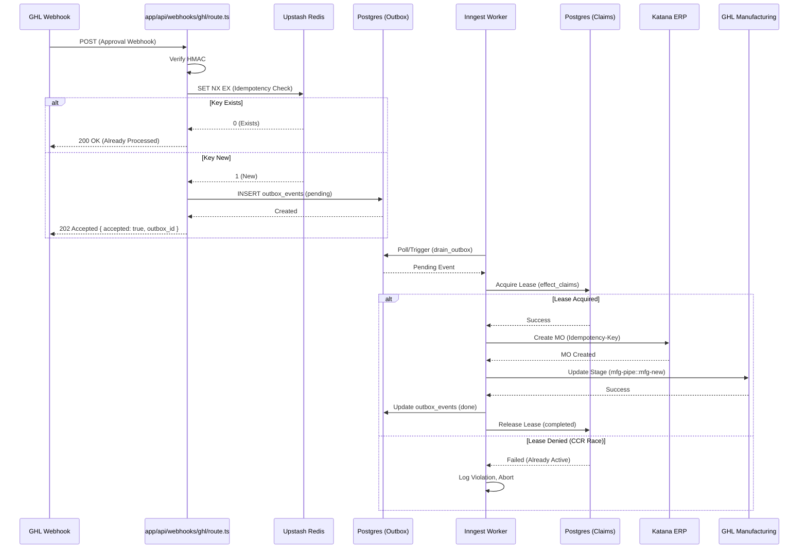

# CCPATIO V8 Middleware — Zero-Data-Loss Ingress & Mirroring

This plan addresses the construction of the V8 Middleware to process GoHighLevel (GHL) webhooks (starting with the Gate 1 Sales AZ Approval) using a Postgres outbox, Upstash Redis for deduplication, and Katana ERP integration under Inngest Concurrent Claim Resolution (CCR) leases.

## User Review Required

> [!IMPORTANT]
> The directive assumes a Next.js App Router setup with raw Postgres DDL. Should we use a specific query builder or ORM (e.g., Drizzle, Prisma, Kysely) for interacting with the database, or strict raw `pg` client?

> [!WARNING]
> Please confirm if the Next.js `app/` structure should be initialized at the root of `c:/Workspace/ccpatio-audit`, or if it should be placed in a dedicated sub-directory (e.g., `middleware/`).

## Open Questions

> [!CAUTION]
> Which testing framework (Vitest or Jest) is preferred for implementing the exception workflow integration tests?

## Proposed Changes

### Sprint 0 — Foundation & scaffolding
- **S0.1 Repo scaffold:** Initialize Next.js App Router project (`app/`, `src/lib/`, `src/server/`) with TypeScript strict, ESLint, and environment validation (using `zod` or `@t3-oss/env-nextjs`).
- **S0.2 Database:** Execute Postgres DDL migrations for core tables (`outbox_events` and `effect_claims`) + create seed script for local dev.
- **S0.3 Redis:** Implement Upstash Redis client wrapper + configure the dedupe key schema (`dedupe:ghl:{webhook_id}`).
- **S0.4 Observability:** Add structured logging, request IDs, and the `/api/health` health check route.
- **S0.5 CI:** Setup GitHub Actions for linting, typechecking, and migration dry-runs.

### Sprint 1 — Gate 1 ingress & zero-data-loss pipeline
- **S1.1 GHL ingress:** Create `app/api/webhooks/ghl/route.ts` to handle HMAC verification, schema validation, Redis dedupe, `outbox_events` insert, and return `202 Accepted`.
- **S1.2 Outbox worker:** Implement an Inngest function (or pg-listen worker) to drain `outbox_events` safely with idempotent handlers.
- **S1.3 CCR leases:** Use the `effect_claims` table to acquire/release/sweep leases preventing concurrent webhook retries from triggering double side effects.
- **S1.4 Produce FO handler:** Map `sales-az::az-approval` / `sales-ca::ca-approval` to Katana MO creation utilizing an `Idempotency-Key`.
- **S1.5 Mirror pulse v1:** Sync the GHL Manufacturing stage to `mfg-pipe::mfg-new` upon successful MO creation.
- **S1.6 Tests:** Replay the `ccr-race-exception` and `redis-failopen-exception` steps as integration tests to prove system resilience.

---

### File Tree

#### [NEW] `app/api/webhooks/ghl/route.ts`
Primary Ingress (Gate 1). Accepts GHL webhook, validates HMAC, dedupes, and writes to Postgres outbox.

#### [NEW] `app/api/health/route.ts`
Standard health check.

#### [NEW] `src/server/db/schema.sql`
Postgres DDL for `outbox_events` and `effect_claims`.

#### [NEW] `src/server/db/outbox.ts`
Database interactions for outbox inserts and updates.

#### [NEW] `src/server/db/effect-claims.ts`
Logic to acquire, release, and sweep CCR leases.

#### [NEW] `src/server/redis/dedupe.ts`
Upstash Redis deduplication logic (`SET NX EX`).

#### [NEW] `src/server/inngest/client.ts`
Inngest client setup.

#### [NEW] `src/server/inngest/functions/drain-outbox.ts`
Inngest function that processes pending outbox events.

#### [NEW] `src/server/inngest/functions/produce-fo.ts`
Handler to safely create the Katana Manufacturing Order (MO) ensuring no duplicates.

#### [NEW] `src/server/inngest/functions/mirror-ghl-mfg.ts`
Handler to mirror the status back to GHL Manufacturing.

#### [NEW] `src/server/ghl/verify-signature.ts`
HMAC signature verification utility for GHL payloads.

#### [NEW] `src/server/ghl/types.ts`
Zod schemas validating GHL webhook payloads.

#### [NEW] `src/server/katana/client.ts`
API client for interacting with Katana ERP.

#### [NEW] `src/lib/env.ts`
Environment variable validation utilizing Zod.

#### [NEW] `src/lib/idempotency.ts`
Utility to derive standard idempotency keys (e.g., `{opportunity_id}:{stage_id}:{event_hash}`).

---

### Schemas and DDL

#### `src/server/db/schema.sql`
```sql
-- Immutable ingress log + async dispatch queue
CREATE TABLE outbox_events (
  id              UUID PRIMARY KEY DEFAULT gen_random_uuid(),
  idempotency_key TEXT NOT NULL,
  source          TEXT NOT NULL,
  event_type      TEXT NOT NULL,
  payload         JSONB NOT NULL,
  status          TEXT NOT NULL DEFAULT 'pending',
  attempts        INT NOT NULL DEFAULT 0,
  last_error      TEXT,
  created_at      TIMESTAMPTZ NOT NULL DEFAULT now(),
  processed_at    TIMESTAMPTZ,
  UNIQUE (idempotency_key)
);

CREATE INDEX outbox_events_status_created_idx
  ON outbox_events (status, created_at)
  WHERE status IN ('pending', 'processing');

-- Inngest CCR / concurrent claim resolution
CREATE TABLE effect_claims (
  id              UUID PRIMARY KEY DEFAULT gen_random_uuid(),
  claim_key       TEXT NOT NULL,
  worker_id       TEXT NOT NULL,
  lease_expires_at TIMESTAMPTZ NOT NULL,
  status          TEXT NOT NULL DEFAULT 'active',
  metadata        JSONB,
  created_at      TIMESTAMPTZ NOT NULL DEFAULT now(),
  UNIQUE (claim_key)
);

CREATE INDEX effect_claims_lease_idx
  ON effect_claims (lease_expires_at)
  WHERE status = 'active';
```

#### `src/server/ghl/types.ts`
```typescript
import { z } from 'zod';

export const GHLWebhookSchema = z.object({
  opportunity_id: z.string(),
  stage_id: z.string(),
  event_hash: z.string().optional(),
  // Derived fields dependent on the exact webhook setup
  payment_cleared: z.boolean().optional(),
});
```

---

### Sequence Diagram: Gate 1 Ingress & Outbox Drainage



## Verification Plan

### Exception Workflows as Integration Tests

- **`ccr-race-exception`**: Send two simultaneous POSTs to the webhook. Verify exactly one MO is created and one lease violation is logged.
- **`redis-failopen-exception`**: Mock Redis to fail/timeout. Verify the handler falls back to Postgres `outbox_events` exclusively, capturing the event and recovering gracefully.
- **`ncr-exception`**: Gate A (fabrication pod weld-out) fails. Prove the rework loop occurs without generating a duplicate Katana MO.
- **`gate-b-fail-exception`**: Sandblast & powder coat fails. Ensure recoat cycle happens while preserving the existing Katana MO state.
- **`gate-c-fail-exception`**: Final assembly pre-pack fails. Confirm the +2d rework penalty is assessed and CRM mirror stages stay consistent.
- **`qbo-mutex-exception`**: Test OAuth mutex retry mechanism with backoff during financial reconciliation.
- **`clover-miss-exception`**: Simulate a Clover DLQ event but confirm CRM Delivered stage is not blocked.
