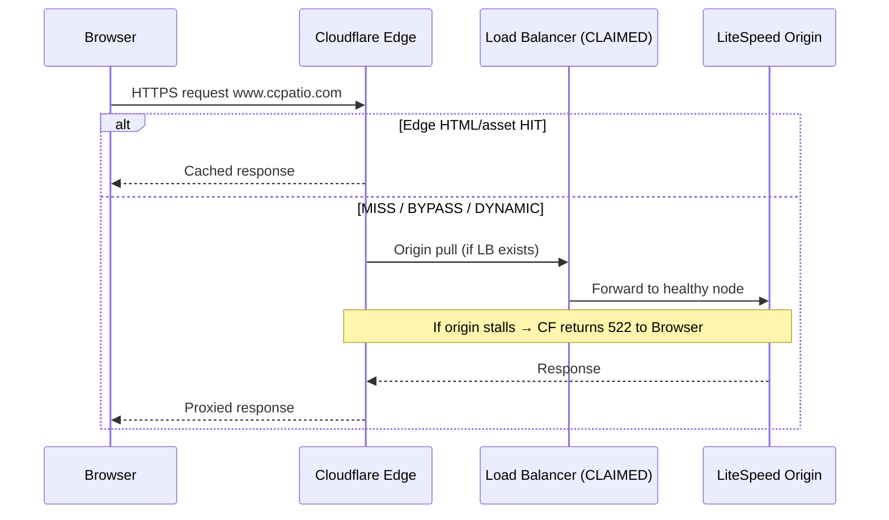
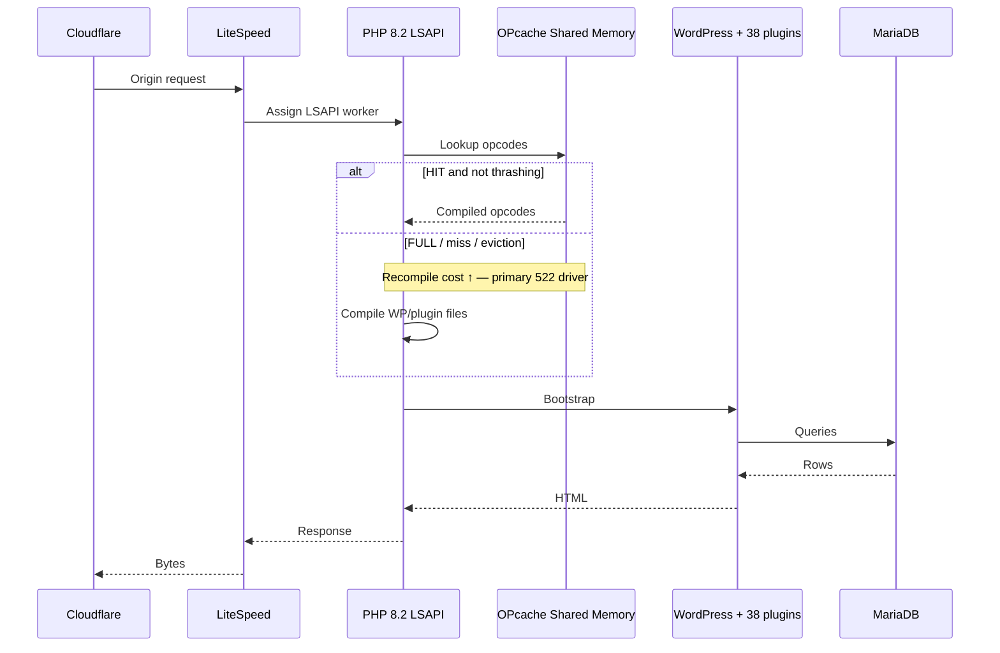
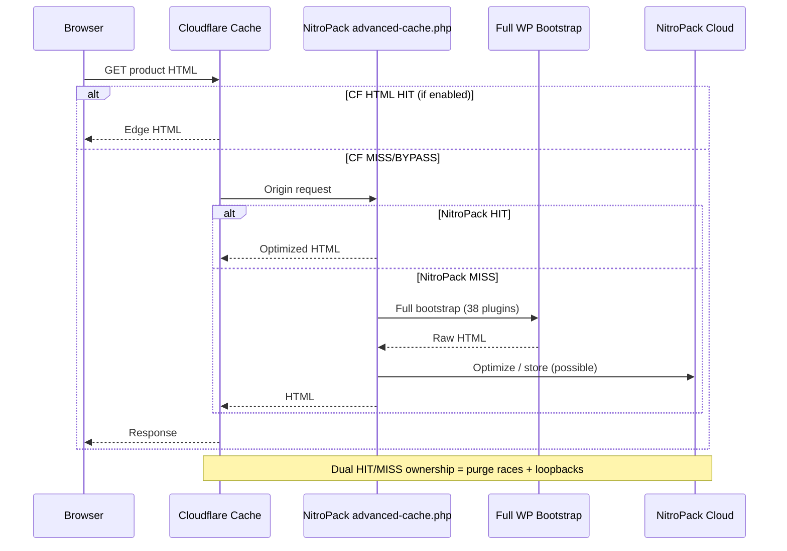
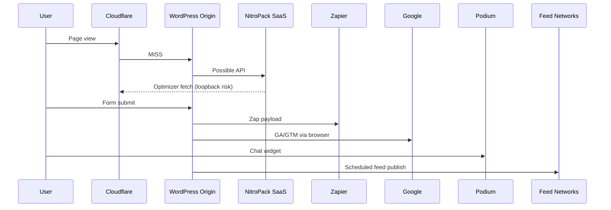
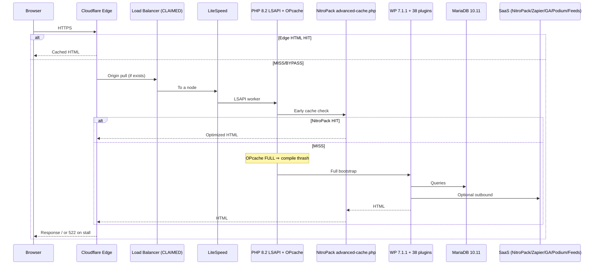

# MASTER — CC Patio Architecture SME Corpus

**Purpose:** Unified master training document for the enterprise LLM Gem.
**Source directory:** `research/system_architecture_SMEs/`
**Composition:** Full verbatim concatenation of all 13 SME Markdown files in numerical order (00–12).
**Evidence baseline:** WordPress Site Health Info dump `2026-09-18T12:45:48Z`
**Site:** https://www.ccpatio.com

> Do not summarize this corpus. Domain transitions are marked by horizontal rules and H1 titles. Preserve verified-vs-claimed discipline from the Index standing rules.

## Master Table of Contents

1. [00 — Index / SME Intelligence Repository](#00--index--sme-intelligence-repository)
2. [01 — Edge Ingress SME](#01--edge-ingress-sme)
3. [02 — Server Runtime SME](#02--server-runtime-sme)
4. [03 — Caching Layers Conflict SME](#03--caching-layers-conflict-sme)
5. [04 — WordPress Core CMS SME](#04--wordpress-core-cms-sme)
6. [05 — E-Commerce Engine (WooCommerce Ecosystem) SME](#05--e-commerce-engine-woocommerce-ecosystem-sme)
7. [06 — Page Builders & Front-End Composition SME](#06--page-builders--front-end-composition-sme)
8. [07 — Ops, Security & Access Control SME](#07--ops-security--access-control-sme)
9. [08 — Third-Party APIs & Integrations SME](#08--third-party-apis--integrations-sme)
10. [09 — Data & Media Storage SME](#09--data--media-storage-sme)
11. [10 — Content, Forms & Chat SME](#10--content-forms--chat-sme)
12. [11 — SEO, Analytics & Accessibility SME](#11--seo-analytics--accessibility-sme)
13. [12 — System Sequence & Failure Modes SME (Cross-Cutting)](#12--system-sequence--failure-modes-sme-cross-cutting)

---

# 00 — Index / SME Intelligence Repository

*Source file: `research/system_architecture_SMEs/00_INDEX_SME_REPOSITORY.md`*

# CC Patio Production Stack — SME Intelligence Repository

**Site:** https://www.ccpatio.com  
**Origin path (single-host Site Health view):** `/home/ccpatpvlive/public_html`  
**Evidence capture:** WordPress Site Health → Info dump, `2026-09-18T12:45:48Z`  
**Agency:** PrimeView  
**Prepared for:** Single Source of Truth training corpus for advanced LLM SMEs  
**Companion artifacts:**
- `docs/Vividworks/Primeview/CC_Patio_WordPress_Architectural_Stability_Audit.html`
- `docs/Vividworks/Primeview/CC_Patio_PrimeView_Infrastructure_Clarification_Request.html`

---

## Purpose of this repository

These Markdown files are **not** casual documentation. They are **authoritative training / system-prompt corpora**. Any LLM loaded with this directory must become the **ultimate Subject Matter Expert** on the live CC Patio e-commerce infrastructure: every confirmed component version, every unverified agency claim, every interdependency, and every known stability failure mode (especially Cloudflare HTTP 522 origin timeouts under OPcache saturation and dual-cache conflict).

### Global standing rules for any consuming LLM

1. **Prefer verified Site Health telemetry over agency verbal claims.**
2. **Never treat “claimed load balancer / multi-server” as fact** until origin count, health checks, and session affinity are evidenced.
3. **Treat NitroPack + Cloudflare as a double-caching conflict until a single HTML cache owner is contractually chosen.**
4. **Treat PHP 8.2.33 as past End-of-Life** (EOL November 2025; dump dated September 2026).
5. **Capacity estimates must distinguish edge-cached concurrent browsers from origin PHP concurrency.**
6. **Do not recommend feature work** (VividWorks embeds, new Elementor templates, large imports) until the stability gate in the audit is met.
7. When uncertain, **ask for Cloudflare / LiteSpeed / NitroPack dashboards**, not more WordPress Site Health dumps alone.

---

## Canonical request sequence (shared by all SME files)

```text
Browser
  → Cloudflare Edge (DNS/proxy/WAF/optional HTML cache)     [CONFIRMED IN USE]
  → Load balancer → N origin servers                        [CLAIMED — UNVERIFIED]
  → LiteSpeed (origin web server)
  → PHP 8.2.33 LSAPI + OPcache (FULL / 56.6% hit / strings 100%)
  → WordPress 7.1.1 bootstrap
       ├ advanced-cache.php (NitroPack drop-in) + WP_CACHE=true
       ├ Astra 4.13.11 + Astra Pro 4.13.9
       ├ Elementor 4.2.4 + Elementor Pro 4.2.3 + Spectra Legacy 2.20.3
       ├ WooCommerce 11.1.0 + commerce plugin cluster
       ├ 38 active plugins total + 7 Code Snippets (IDs 8–14)
  → MariaDB 10.11.19 (~518 MB, max_connections 151)
  → Outbound SaaS (NitroPack cloud, Zapier, Podium, Google, WebToffee, Rank Math, accessiBe, SMTP)
```

**522 insertion point:** Cloudflare waits on origin (LiteSpeed/PHP/DB). If origin workers stall (OPcache thrash, plugin boot, purge storm, DB contention), Cloudflare returns **HTTP 522 Connection Timed Out**.

---

## File map

| File | SME domain |
|------|------------|
| [01_EDGE_INGRESS.md](01_EDGE_INGRESS.md) | Browser, DNS, Cloudflare, claimed load balancer |
| [02_SERVER_RUNTIME.md](02_SERVER_RUNTIME.md) | Linux el9, LiteSpeed, PHP LSAPI, OPcache, host path |
| [03_CACHING_LAYERS_CONFLICT.md](03_CACHING_LAYERS_CONFLICT.md) | NitroPack, advanced-cache.php, Cloudflare cache conflict |
| [04_WORDPRESS_CORE_CMS.md](04_WORDPRESS_CORE_CMS.md) | WordPress 7.1.1, constants, theme shell, bootstrap |
| [05_ECOMMERCE_ENGINE_WOOCOMMERCE.md](05_ECOMMERCE_ENGINE_WOOCOMMERCE.md) | WooCommerce + commerce plugin ecosystem |
| [06_PAGE_BUILDERS_FRONTEND.md](06_PAGE_BUILDERS_FRONTEND.md) | Elementor, Spectra, Astra, Code Snippets |
| [07_OPS_SECURITY_ACCESS.md](07_OPS_SECURITY_ACCESS.md) | Wordfence, login hardening, ops utilities, BLC |
| [08_THIRD_PARTY_APIS_INTEGRATIONS.md](08_THIRD_PARTY_APIS_INTEGRATIONS.md) | Outbound SaaS and integration surfaces |
| [09_DATA_MEDIA_STORAGE.md](09_DATA_MEDIA_STORAGE.md) | MariaDB, uploads 43.69 GB, Imagick |
| [10_CONTENT_FORMS_CHAT.md](10_CONTENT_FORMS_CHAT.md) | ACF, Gravity Forms, Zapier, Podium, PDF/QR |
| [11_SEO_ANALYTICS_ACCESSIBILITY.md](11_SEO_ANALYTICS_ACCESSIBILITY.md) | Rank Math, Schema plugin, Site Kit, accessiBe |
| [12_SYSTEM_SEQUENCE_AND_FAILURE_MODES.md](12_SYSTEM_SEQUENCE_AND_FAILURE_MODES.md) | Cross-cutting sequence, 522 taxonomy, capacity model |

---

## Aggregate inventory snapshot (verified)

| Metric | Value |
|--------|------:|
| WordPress | 7.1.1 |
| Active plugins | 38 |
| Code Snippets (global) | 7 |
| PHP | 8.2.33 EOL |
| OPcache | FULL |
| Database | MariaDB 10.11.19 / 518.11 MB |
| Uploads | 43.69 GB |
| Total disk | 47.42 GB |
| Plugins on disk | 593.34 MB |
| Themes on disk | 43.60 MB |
| WP core on disk | 2.60 GB |
| `WP_DEBUG` | true (production) |
| Drop-ins | `advanced-cache.php` |

---

## Stability gate (must remain true across all SME reasoning)

1. OPcache not full; hit rate ≥ 90%  
2. Active plugins ≤ 28 after decommissions  
3. Single HTML cache owner: Cloudflare **XOR** NitroPack  
4. Broken Link Checker deactivated  
5. `WP_DEBUG=false` in production  
6. 72 hours with zero Cloudflare 522s  
7. Load-balancer claim either **evidenced** or **withdrawn**

---

## Classification

**Confidential — CC Patio internal architecture intelligence.**  
Intended consumers: internal architects, DevSecOps, and LLM agents acting as stack SMEs. Not a public marketing document.

---

# 01 — Edge Ingress SME

*Source file: `research/system_architecture_SMEs/01_EDGE_INGRESS.md`*

# 01 — Edge Ingress SME

**Domain:** Client browsers · DNS · Cloudflare edge (CDN/WAF/proxy) · Claimed load balancer  
**Site:** https://www.ccpatio.com  
**Evidence baseline:** WordPress Site Health Info dump `2026-09-18T12:45:48Z`  
**Classification:** Verified edge presence + unverified multi-origin claim  

---

## Component Identity & Versioning

| Component | Identity | Version / status | Evidence class |
|-----------|----------|------------------|----------------|
| Customer browsers | Desktop / mobile / tablet user agents | Assumed modern evergreen browsers; no RUM export in dump | Assumed |
| Public hostname | `www.ccpatio.com` | HTTPS enabled (`https_status: true`) | Verified |
| Apex hostname | `ccpatio.com` | Search Console property listed as `https://ccpatio.com/` while Site Kit `reference_url` is `https://www.ccpatio.com` | Verified discrepancy |
| DNS / reverse proxy / WAF / CDN | **Cloudflare** | Product version N/A (SaaS); zone config **not exported** | Confirmed in operational use; config unknown |
| TLS to client | Cloudflare-terminated HTTPS | Site Health `https_status: true` | Verified at app layer |
| Edge HTML / asset optimization features | Cloudflare APO, Cache Rules, Page Rules, Polish, Mirage, Auto Minify, Argo, Workers, Transform Rules, Load Balancing | **Unknown** — not present in Site Health | Unknown |
| Multi-origin load balancer | Agency verbal claim: “multiple servers behind a load balancer” | Product unknown (Cloudflare LB vs host ADC vs HAProxy/F5/etc.) | **Claimed — unverified** |
| Origin identity visible to WP | Single account path `/home/ccpatpvlive/public_html` | One Site Health vantage point | Verified single-origin *view* |

### EOL / support notes (edge-relevant)

- Cloudflare as a SaaS edge is continuously versioned; **no EOL**, but **misconfiguration has no patch cycle** — only operational correction.
- Browser clients are outside CC Patio control; edge must tolerate modern TLS 1.2/1.3 and HTTP/2/HTTP/3.
- Any **origin PHP 8.2 EOL** does not EOL Cloudflare; it does increase probability that origin stalls produce **edge-visible 522**.

---

## LLM SME Directive

```text
YOU ARE THE SUBJECT MATTER EXPERT FOR THE EDGE INGRESS LAYER OF www.ccpatio.com.

You own: DNS resolution, Cloudflare proxy/WAF/CDN behavior, TLS termination at the edge,
optional Cloudflare HTML/asset caching, and the UNVERIFIED claim of a multi-server load
balancer between Cloudflare and LiteSpeed origins.

MANDATORY BEHAVIORS:
1. Always separate VERIFIED (Site Health / operational confirmation that Cloudflare proxies
   the site) from CLAIMED (multi-server load balancer) from UNKNOWN (APO, Cache Rules,
   Workers, exact SSL mode, origin pool).
2. When diagnosing HTTP 522, model Cloudflare as a TIMEOUT OBSERVER waiting on origin —
   not as the root cause by default. 522 means origin failed to accept/complete the
   connection within Cloudflare’s origin wait window.
3. Never recommend “raise Cloudflare timeouts” as a primary fix for OPcache-full /
   plugin-bloated origins. That hides stalls; it does not remove them.
4. Force a SINGLE HTML CACHE OWNER decision: Cloudflare XOR NitroPack. Dual HTML caching
   is a first-class failure mode for this build.
5. If agency asserts a load balancer, demand: product name, origin count/IPs, health-check
   URL, session affinity, shared session store, shared uploads strategy. Until provided,
   reason as if there is ONE evidenced origin path (ccpatpvlive) plus a contested claim.
6. Canonical host conflict: www vs apex. Treat inconsistent Search Console vs Site Kit
   reference URLs as an SEO/cache-key risk until proven redirected cleanly.
7. Do not approve VividWorks embeds, large catalog imports, or cache-plugin cutovers
   without edge analytics (14–30 day 5xx) and explicit cache-owner sign-off.

WHEN ASKED ABOUT CAPACITY AT THE EDGE:
- Edge-cached anonymous HIT traffic can appear to support hundreds–thousands of concurrent
  browsers.
- That number is NOT origin capacity. Always dual-quote edge vs origin.
```

---

## Architectural Role

The edge ingress layer is the **first controllable hop** between the public Internet and CC Patio’s commerce experience. Its jobs in this environment:

1. **Resolve and advertise** `ccpatio.com` / `www.ccpatio.com` to clients.
2. **Terminate client TLS** and present a valid certificate for the public hostname(s).
3. **Absorb and filter** volumetric abuse / bots via Cloudflare WAF / bot features (config unknown).
4. **Optionally cache** HTML and static assets at PoPs worldwide (whether HTML is actually cached here is **unknown** and must be treated as contested because NitroPack also claims HTML acceleration).
5. **Proxy dynamic misses** to origin (LiteSpeed on the hosting account; possibly through a claimed load balancer).
6. **Emit 522/524** when origin is unreachable or too slow — this is the customer-visible failure mode already reported operationally.

In the CC Patio architecture, the edge is **not** the system of record for products, prices, or BOMs. It is a **reliability and latency multiplier** that can either shield a fragile origin or amplify origin defects through purge storms, cache bypass chaos, and health-check mistakes.

---

## Deep Technical Mechanics

### 1. Browser → DNS → Cloudflare anycast

1. User navigates to `https://www.ccpatio.com/...`.
2. DNS resolves to Cloudflare anycast IPs **if** the record is orange-cloud (proxied). Grey-cloud records bypass Cloudflare and hit origin IPs directly — **unknown** for this zone.
3. Client completes TLS with Cloudflare. Cipher/HTTP version negotiated at edge.
4. Cloudflare applies (in approximate order, product-dependent):
   - Transform / Configuration / Redirect rules
   - WAF managed rules / custom rules / rate limits / Bot Fight
   - Cache determination (Cache Rules / Page Rules / APO)
   - Worker scripts (if any)
   - Origin pull (if cache MISS / BYPASS / DYNAMIC)

### 2. Cloudflare origin pull semantics (enterprise mental model)

When Cloudflare must contact origin:

- Opens connection to **Origin Address** configured for the hostname (hostname or IP).
- Uses Cloudflare→Origin SSL mode:
  - **Flexible:** CF↔client HTTPS, CF↔origin HTTP (dangerous, can cause redirect loops).
  - **Full:** HTTPS to origin without strict cert validation.
  - **Full (strict):** HTTPS to origin with valid cert — preferred.
- Waits up to the **origin connection / response timeout** (defaults commonly ~100s for many plan tiers; Enterprise can customize — **unknown here**).
- If origin never accepts TCP or never returns timely first bytes → **522**.
- If origin accepts but response headers/body stall too long → often **524** (timeout occurred).
- If origin actively refuses → **521**; SSL issues → **525/526**.

**CC Patio implication:** Ops reports of intermittent **522** align with origin PHP/LiteSpeed stalls (OPcache FULL, 38-plugin boot, NitroPack loopbacks, BLC crawl, purge storms) — **not** with “Cloudflare being down.”

### 3. Cache key and personalization (WooCommerce-critical)

Enterprise WooCommerce behind Cloudflare typically must **bypass HTML cache** when cookies indicate:

- `woocommerce_items_in_cart`
- `wp_woocommerce_session_*`
- `wordpress_logged_in_*`
- admin / preview cookies
- some wishlist/favorites cookies (Favorites plugin present)

If Cloudflare “Cache Everything” is enabled without correct Bypass Cookie rules, symptoms include:

- Users seeing others’ carts
- Stale prices / catalog mode banners
- Logged-in admin chrome leaking to anonymous users

**Unknown for CC Patio:** exact Cache Rules. SME must assume risk until rules are exported.

### 4. Cloudflare APO (Automatic Platform Optimization) for WordPress

APO, if enabled, maintains a specialized WordPress HTML edge cache and coordinates with a WordPress plugin for purges. Combining APO with NitroPack is a known **double HTML optimization / purge conflict**. Site Health does **not** confirm APO. SME stance: **treat APO as unknown and ask**.

### 5. Claimed load balancer mechanics (hypothetical until evidenced)

If a true multi-origin LB exists between Cloudflare and LiteSpeed nodes:

```text
Cloudflare → LB VIP → {Origin A, Origin B, Origin C, ...}
```

Critical LB behaviors that change failure analysis:

| Concern | Why it matters for CC Patio |
|---------|-----------------------------|
| Health check URL | If health check hits `wp-admin`, Hide Login 404, or a heavy Elementor PDP, healthy nodes may be marked down → 522 spikes |
| Session affinity | Without sticky sessions or shared Redis sessions, Woo cart/login breaks across nodes |
| Config drift | OPcache FULL on one node only → “random” 522s |
| Local uploads | 43.69 GB local media: without shared FS/object storage, nodes serve missing images |
| NitroPack drop-in drift | Different `advanced-cache.php` / plugin versions per node → inconsistent HTML |

Site Health only proves a **single filesystem path** on one account. That is compatible with:

- Single server (most conservative interpretation), OR
- LB to multiple servers where Site Health was run on one node only.

### 6. www vs apex mechanics

Observed:

- Site Kit `reference_url`: `https://www.ccpatio.com`
- Search Console property in dump: `https://ccpatio.com/`

If apex and www are both live content hosts without a single 301 canonical, consequences include:

- Split SEO equity
- Duplicate cache keys at edge and NitroPack
- Cookie scope issues (`Domain=.ccpatio.com` vs host-only)
- Analytics fragmentation

---

## Interdependencies & Communication Flow

### Upstream

- End users / bots / uptime monitors / NitroPack optimizer bots / feed fetchers / Zapier callbacks (callbacks usually hit WP URLs through this same edge).

### Downstream

- **Claimed:** Load balancer pool  
- **Verified next hop class:** LiteSpeed origin (`httpd_software: LiteSpeed`) under PHP LSAPI  
- Indirect downstream: entire WP/Woo/Elementor/NitroPack stack and MariaDB

### Sequence (edge-centric)



### Touches these SME domains

- Caching conflict (`03_CACHING_LAYERS_CONFLICT.md`) — HTML ownership  
- Server runtime (`02_SERVER_RUNTIME.md`) — origin of 522  
- WooCommerce (`05_...`) — cookie bypass requirements  
- Security (`07_...`) — WAF vs Wordfence overlap; Hide Login vs health checks  
- SEO (`11_...`) — apex/www canonical  

---

## Current Known State vs. Critical Vulnerabilities

### Known state (edge)

- HTTPS is on.
- Cloudflare is in the operational path (agency + Site Kit context).
- Public intermittent **522** behavior has been reported in the stability program.
- Edge feature matrix (APO, Cache Everything, Workers, LB product) is **not** in Site Health.
- Canonical host signals are **inconsistent** (www vs apex).

### Critical vulnerabilities / failure modes

1. **522 as customer-visible outage class** driven by origin saturation, misread as “CDN problem.”
2. **Dual HTML acceleration** with NitroPack without proven single owner.
3. **Unverified multi-origin LB** creating false confidence in capacity.
4. **Possible health-check mismatch** if LB/uptime probes hit hidden login or dynamic PHP.
5. **Woo cookie cache poisoning risk** if Cache Everything lacks bypasses.
6. **Apex/www split** poisoning cache keys and SEO.
7. **Bot challenges** potentially retry-amplifying NitroPack optimizer / monitor traffic onto origin (unknown WAF config).

### Edge-specific capacity framing

| Traffic class | Edge can absorb? | Origin still hit? |
|---------------|------------------|-------------------|
| Static assets with long TTL | Yes | Rarely |
| Anonymous HTML HIT | Yes (if HTML cached at CF or NitroPack CDN) | No |
| HTML MISS / BYPASS | No | Yes — full PHP stack |
| Cart / checkout / logged-in | Should bypass | Yes |
| Purge storm cold start | No | Yes — worst case |

---

## Verified vs. Claimed Discrepancies

| Statement | Class | SME handling |
|-----------|-------|--------------|
| Cloudflare proxies www.ccpatio.com | **Verified (operational)** | Treat as fact; still need rule export |
| Exact Cloudflare plan, SSL mode, Cache Rules, APO, Workers | **Unknown** | Block remediation assumptions until exported |
| Multiple servers behind a load balancer | **Claimed (agency call)** | Contested; demand evidence |
| Site Health path proves only one server exists | **False inference** | Proves one *instrumented* origin view, not global topology |
| Raising CF timeout will fix 522s permanently | **False** | May reduce symptom frequency; does not fix OPcache/plugin root causes |
| Edge alone can make Elementor+Woo “fast” under full OPcache | **False** | Edge helps HIT ratio only |

### Evidence still required from PrimeView / access grants

1. Cloudflare zone Admin (or Analytics + DNS + Cache Rules + WAF export).  
2. 14- and 30-day 5xx breakdown (522/524 by path).  
3. Written LB diagram with origin IPs and health checks — or written withdrawal of the claim.  
4. Confirmation of single HTML cache owner going forward.

---

## SME decision checklist (edge)

- [ ] Orange-cloud status documented for apex + www  
- [ ] SSL mode = Full (strict) preferred and verified  
- [ ] HTML cache owner chosen: CF XOR NitroPack  
- [ ] Woo/session cookie bypasses verified if CF HTML cache on  
- [ ] 522 rate trending to zero for 72h  
- [ ] LB claim evidenced or removed from architecture diagrams  
- [ ] www↔apex single canonical redirect proven  

---

## Cross-references

- Runtime root causes of 522 → `02_SERVER_RUNTIME.md`  
- NitroPack mechanics → `03_CACHING_LAYERS_CONFLICT.md`  
- Full failure taxonomy → `12_SYSTEM_SEQUENCE_AND_FAILURE_MODES.md`

---

# 02 — Server Runtime SME

*Source file: `research/system_architecture_SMEs/02_SERVER_RUNTIME.md`*

# 02 — Server Runtime SME

**Domain:** Linux el9 · LiteSpeed · PHP 8.2.33 LSAPI · OPcache · host account `ccpatpvlive`  
**Site:** https://www.ccpatio.com  
**Evidence baseline:** WordPress Site Health Info dump `2026-09-18T12:45:48Z`  
**Classification:** Highest-confidence root-cause layer for Cloudflare HTTP 522  

---

## Component Identity & Versioning

| Component | Exact identity | Version / value | EOL / support |
|-----------|----------------|-----------------|---------------|
| OS kernel | Linux x86_64 | `5.14.0-687.39.1.el9_8.x86_64` | RHEL/Alma/Rocky 9 family — supported era; exact distro flavor not named beyond el9 |
| Web server | **LiteSpeed** | Reported as `httpd_software: LiteSpeed` (edition/version string not in dump) | Vendor-supported; edition (OSS OpenLiteSpeed vs Enterprise) **unknown** |
| PHP | **PHP** | **8.2.33** 64-bit | **EOL since November 2025** — dump is Sep 2026 ⇒ **past security support** |
| PHP SAPI | **LiteSpeed LSAPI** (`php_sapi: litespeed`) | N/A | Not php-fpm / not Apache mod_php |
| OPcache | Zend OPcache | Enabled; **opcode_cache_full: true**; hit rate **56.64%**; interned strings **100%** of 8 MB (24 bytes free); memory usage reported `134217648 of 134217728` | Mis-sized for this codebase |
| memory_limit | PHP | **1G** | Allocation looks large; does not prevent worker exhaustion |
| max_execution_time | PHP | **300** seconds | Masks slow jobs; Cloudflare still 522s earlier |
| max_input_time | PHP | **60** seconds | Tight for heavy admin POSTs / Elementor saves |
| max_input_variables | PHP | **1000** | Can truncate large Elementor/Woo admin forms |
| upload_max_filesize | PHP | **20m** | Low vs furniture CAD/PDF workflows |
| post_max_size | PHP | **40m** | |
| curl | system | 7.76.1 OpenSSL/3.5.5 | |
| Host path | account home | `/home/ccpatpvlive/public_html` | Single Site Health vantage |
| WP memory | WordPress | `WP_MEMORY_LIMIT=512M`, `WP_MAX_MEMORY_LIMIT=1G` | Admin ceiling interaction with Elementor |

### Related runtime-adjacent imaging stack

| Component | Version |
|-----------|---------|
| ImageMagick | 6.9.13-52 (Beta) Q16 x86_64 |
| Imagick PHP ext | 3.8.1 |
| GD | bundled 2.1.0-compatible |
| Ghostscript | 9.54.0 |

---

## LLM SME Directive

```text
YOU ARE THE SUBJECT MATTER EXPERT FOR THE ORIGIN SERVER RUNTIME OF www.ccpatio.com.

You own: Linux el9 hosting realities, LiteSpeed request admission, PHP 8.2.33 under LSAPI,
OPcache sizing/behavior, and how runtime saturation becomes Cloudflare HTTP 522.

MANDATORY BEHAVIORS:
1. Treat OPcache FULL + interned_strings 100% + 56.64% hit rate as the PRIMARY evidenced
   runtime defect correlating to intermittent origin timeouts.
2. Treat PHP 8.2.33 as PAST EOL. Any “stay on 8.2” recommendation requires an explicit
   security-risk acceptance by the business — never imply it is fine because “it runs.”
3. Never confuse PHP memory_limit=1G with capacity. Capacity is (LSAPI max children) ×
   (healthy request latency). Unknown max children ⇒ refuse hard RPS guarantees.
4. Model LSAPI (not php-fpm). Advice about php-fpm pools is wrong unless PrimeView proves
   a non-LSAPI topology (contradicted by Site Health).
5. When a load balancer is claimed, remember OPcache is PER NODE. Remediation must roll
   across the fleet; one-node Site Health green does not mean fleet green.
6. Reject “increase max_execution_time” as a 522 fix. Cloudflare will still abandon the
   wait; long PHP jobs belong in CLI/cron queues.
7. Before approving code that adds plugins, heavy admin AJAX, or image reprocessing,
   evaluate OPcache pressure and LSAPI concurrency impact.

RUNTIME SME OUTPUT STYLE:
- Prefer numeric thresholds (hit rate ≥90%, opcode_cache_full=false).
- Demand ini exports when recommending OPcache resize.
- Separate “process memory” from “shared OPcache slab” from “interned strings slab.”
```

---

## Architectural Role

This layer converts an accepted HTTP connection on the origin into executed WordPress/PHP work and bytes returned upstream (to a claimed LB and/or Cloudflare).

It is the **compute heart** of the storefront. Every cache MISS, cart request, admin save, NitroPack loopback, Broken Link Checker crawl, and WooCommerce query ultimately burns:

1. A LiteSpeed worker / connection slot  
2. An LSAPI PHP process  
3. OPcache lookups (or recompiles when cold/full)  
4. CPU + RAM + often MariaDB time  

If this layer stalls, **the edge has nothing to do but wait — then 522.**

---

## Deep Technical Mechanics

### 1. LiteSpeed admission control

LiteSpeed receives HTTPS (or HTTP from Flexible SSL — unknown) from Cloudflare or LB.

For dynamic `.php` / WordPress front controller (`index.php`):

- Maps request to virtual host document root `/home/ccpatpvlive/public_html`
- Hands execution to **LSAPI** external application pool
- Enforces per-vhost connection and process limits (**values unknown — must export**)

Unlike php-fpm’s explicit pool stanzas in a file you always see, LSAPI limits often live in:

- LiteSpeed Admin Console / WebAdmin  
- CyberPanel / cPanel LiteSpeed plugin UI  
- `.htaccess` / rewrite — not for process counts  

**SME requirement:** obtain External App max connections, backlog, and idle timeouts.

### 2. PHP 8.2.33 under LSAPI

Each dynamic request roughly:

1. Acquire LSAPI worker  
2. Bootstrap PHP with loaded extensions (Imagick, mysqli/mysqlnd, etc.)  
3. Consult OPcache for compiled opcodes of WP core + plugins + theme  
4. Execute WordPress load path (`wp-load.php` → plugins → theme → query → template)  
5. Return response through LiteSpeed  

With **38 active plugins**, Elementor, Spectra, WooCommerce, and NitroPack, the **bootstrap graph is large**. Cold or thrashing OPcache multiplies CPU per request.

### 3. OPcache internals (enterprise view) — THE critical defect

Observed:

| Metric | Observed | Interpretation |
|--------|----------|----------------|
| opcode cache memory | 134217648 / 134217728 (~128 MB almost full) | Slab exhausted |
| opcode_cache_full | **true** | New scripts force eviction / recompile behavior under pressure |
| hit rate | **56.64%** | Unhealthy (healthy WP stacks often >>90% when warmed) |
| interned_strings_buffer | **100% of 8 MB** used (24 bytes free) | String interning slab exhausted — severe |

**Mechanics:**

- OPcache stores compiled opcodes in shared memory.
- Interned strings store immutable string literals shared across requests.
- When full, PHP spends CPU **recompiling** and **evicting**, raising TTFB.
- LiteSpeed workers stay busy longer ⇒ queueing ⇒ Cloudflare origin wait exceeded ⇒ **522**.

**Remediation direction (runtime SME owned):**

- Raise `opcache.memory_consumption` (commonly 256–512MB+ for heavy WP)  
- Raise `opcache.interned_strings_buffer` (commonly 16–32MB+)  
- Raise `opcache.max_accelerated_files` to fit WP+plugin file counts  
- Tune `opcache.revalidate_freq` / `validate_timestamps` for prod  
- Confirm whether JIT is on (PHP 8.x) — JIT can add memory pressure; state unknown  

**Acceptance:** Site Health shows `opcode_cache_full: false`, hit rate ≥ 90%, interned strings not pinned at 100%.

### 4. Why memory_limit=1G does not save you

`memory_limit` caps **per-request** PHP memory. OPcache is **shared**. A server can have:

- Comfortable per-request memory, AND  
- Saturated shared OPcache, AND  
- Too few LSAPI children  

⇒ still 522 under modest concurrency.

### 5. EOL mechanics for PHP 8.2.33

After November 2025, php.net ends security fixes for 8.2. Remaining on 8.2.33 in September 2026 means:

- New CVEs in core/extensions may go unpatched upstream  
- Hosting vendors may force upgrades abruptly  
- Plugin vendors increasingly test 8.3/8.4 first  

**SME stance:** schedule staging validation on **8.3 (or 8.4)** after stability gate; do not big-bang production during 522 firefighting.

### 6. Interaction with claimed multi-server topology

If N LiteSpeed nodes exist:

- Each has its **own** OPcache slab  
- Site Health on node A can show FULL while node B differs  
- Rolling ini changes need fleet orchestration  
- Without shared sessions, Woo sticky sessions become mandatory at LB  

### 7. Imaging runtime cost

ImageMagick/Imagick available with large resource limits reported in Site Health. On-the-fly image ops (Elementor, NitroPack, thumbnail regen) can spike CPU and memory independently of page HTML generation — relevant to 43.69 GB media library.

---

## Interdependencies & Communication Flow

### Upstream

- Cloudflare origin pull and/or claimed load balancer health-checked traffic  
- NitroPack optimizer loopbacks (if enabled)  
- Cron / Action Scheduler CLI or web cron hitting `wp-cron.php`  

### Downstream

- WordPress core bootstrap (`04_WORDPRESS_CORE_CMS.md`)  
- `advanced-cache.php` early load (`03_CACHING_LAYERS_CONFLICT.md`)  
- mysqli to MariaDB 10.11.19 (`09_DATA_MEDIA_STORAGE.md`)  
- Outbound curl to SaaS (`08_THIRD_PARTY_APIS_INTEGRATIONS.md`)  

### Sequence (runtime-centric)



---

## Current Known State vs. Critical Vulnerabilities

### Known state

- LiteSpeed + PHP 8.2.33 LSAPI confirmed  
- OPcache **FULL**, interned strings **100%**, hit rate **56.64%**  
- PHP `memory_limit` 1G; execution time 300s  
- Production path `/home/ccpatpvlive/public_html`  
- Imaging stack present and powerful  

### Critical vulnerabilities

1. **OPcache saturation** — evidenced, acute, 522-correlated.  
2. **PHP EOL** — security and support risk.  
3. **Unknown LSAPI concurrency ceiling** — capacity unquantified.  
4. **Long max_execution_time** — false safety vs edge timeouts.  
5. **Heavy dynamic stack** on each MISS (38 plugins + dual builders).  
6. **Fleet drift risk** if LB claim true but ini not centralized.  
7. **Imagick CPU contention** during media operations on 43.69 GB library.  

### Working capacity model (runtime view)

Until LSAPI limits are known, use conservative bands for **one origin node**:

| Condition | Concurrent dynamic PHP requests (order of magnitude) |
|-----------|------------------------------------------------------|
| OPcache healthy, cache HIT mostly at edge | Origin concurrency mostly idle |
| Current OPcache FULL + 38 plugins | **~10–25** before severe latency |
| Purge storm / cold compile | **~5–15** (522-prone) |

Multiply by N **only after** LB + identical node health proven.

---

## Verified vs. Claimed Discrepancies

| Statement | Class |
|-----------|-------|
| LiteSpeed is the web server | **Verified** |
| PHP is 8.2.33 via litespeed SAPI | **Verified** |
| OPcache full / poor hit rate / interned strings exhausted | **Verified** |
| Exact `opcache.*` ini values | **Unknown** (effects verified; knobs not dumped) |
| LSAPI max children / plan vCPU-RAM | **Unknown** |
| OpenLiteSpeed vs Enterprise LiteSpeed | **Unknown** |
| Multiple runtime servers behind LB | **Claimed** |
| php-fpm is in path | **Contradicted** by `php_sapi: litespeed` |

---

## Remediation ownership (runtime)

| Priority | Action | Acceptance |
|----------|--------|------------|
| P0 | Resize OPcache memory + interned strings; verify not full | hit rate ≥90%, full=false |
| P0 | Export LSAPI limits; raise workers if queueing proven | Origin p95 TTFB improvement; 522↓ |
| P1 | PHP 8.3/8.4 staging matrix | Staging green before prod |
| P2 | Align Imagick jobs to off-peak | CPU steal ↓ during catalog hours |

---

## Cross-references

- Edge 522 semantics → `01_EDGE_INGRESS.md`  
- NitroPack loopbacks onto this runtime → `03_CACHING_LAYERS_CONFLICT.md`  
- Failure taxonomy → `12_SYSTEM_SEQUENCE_AND_FAILURE_MODES.md`

---

# 03 — Caching Layers Conflict SME

*Source file: `research/system_architecture_SMEs/03_CACHING_LAYERS_CONFLICT.md`*

# 03 — Caching Layers Conflict SME

**Domain:** NitroPack 1.20.1 · `advanced-cache.php` · `WP_CACHE=true` · Cloudflare HTML/asset cache contention · absent Redis/LSCWP evidence  
**Site:** https://www.ccpatio.com  
**Evidence baseline:** Site Health dump `2026-09-18T12:45:48Z`  
**Classification:** Architectural conflict zone — primary amplifier of intermittent 522s  

---

## Component Identity & Versioning

| Component | Identity | Version / state | Evidence |
|-----------|----------|-----------------|----------|
| NitroPack WordPress plugin | NitroPack Inc. | **1.20.1** | Active plugin list |
| WordPress page-cache drop-in | `wp-content/advanced-cache.php` | Present (`wp-dropins: advanced-cache.php: true`) | Verified |
| WP cache flag | `WP_CACHE` | **true** | Verified constants |
| Cloudflare edge cache / APO / Cache Rules | Cloudflare SaaS | Config **not exported** | Confirmed CF in path; cache mode unknown |
| LiteSpeed Cache (LSCWP) | Not listed in active plugins | — | **Not reported** |
| Redis object cache drop-in | `object-cache.php` | Not listed among drop-ins | **Not reported** |
| Memcached | — | — | **Not reported** |
| Server-level LSCache | LiteSpeed feature | Unknown | Unknown |

### EOL / support

- NitroPack 1.20.1 is a commercial SaaS-coupled plugin; support depends on subscription — **account ownership unknown**.  
- Dual-caching is not an “EOL” issue; it is a **design defect** relative to stability goals.

---

## LLM SME Directive

```text
YOU ARE THE SUBJECT MATTER EXPERT FOR CACHING AND PERFORMANCE ACCELERATION ON www.ccpatio.com.

You own the conflict between NitroPack (plugin + advanced-cache.php + possible NitroPack CDN)
and Cloudflare (proxy + possible HTML cache/APO), and the ABSENCE of evidenced object cache.

MANDATORY BEHAVIORS:
1. ALWAYS force a binary policy: Cloudflare XOR NitroPack as HTML cache owner — never both.
2. Explain 522 spikes as often coinciding with PURGE STORMS + COLD PHP boots on an OPcache-full
   runtime — not as mysterious CDN failures.
3. Model NitroPack early bootstrap via advanced-cache.php BEFORE most of WordPress loads.
4. Demand NitroPack exclusion lists for cart, checkout, my-account, wp-admin, REST, Gravity Forms
   confirmations.
5. Demand Cloudflare Cache Rules export before declaring “CF is only DNS/WAF.”
6. Do not invent Redis/LSCWP. Site Health shows only advanced-cache.php. If agency claims Redis,
   require proof (drop-in + php-redis + connectivity).
7. When load balancer is claimed, require identical NitroPack/drop-in versions on every node and
   clarify whether NitroPack CDN sits beside or behind Cloudflare.

FORBIDDEN SHORTCUTS:
- “Just clear all caches” without naming which systems and in which order.
- Enabling APO on top of NitroPack “for more speed.”
- Treating page cache as a substitute for fixing OPcache FULL.
```

---

## Architectural Role

Caching layers exist to **prevent** LiteSpeed/PHP/MariaDB from executing full WordPress bootstraps on every anonymous page view.

In a healthy enterprise WooCommerce design, typically:

1. **Edge CDN** caches static assets aggressively.  
2. **One** HTML page-cache owner caches anonymous product/category/content HTML.  
3. **Object cache** (Redis) stores options/transients/sessions fragments.  
4. **OPcache** caches compiled PHP (runtime, not HTML).

On CC Patio, evidenced reality is skewed:

- HTML acceleration attempted via **NitroPack** (plugin + drop-in).  
- **Cloudflare** also sits in front and **may** cache HTML (unknown).  
- **Object cache drop-in not evidenced.**  
- **OPcache is broken-full** — so even cache generators are expensive.

Thus caching is both **necessary** and **currently hazardous**.

---

## Deep Technical Mechanics

### 1. WordPress `WP_CACHE` + `advanced-cache.php` bootstrap

When `WP_CACHE` is true, WordPress loads `wp-content/advanced-cache.php` extremely early (during `wp-settings.php` flow) **before** most plugins initialize.

NitroPack’s drop-in typically:

- Attempts to serve a **pre-optimized HTML** document for anonymous cacheable GETs  
- May short-circuit the rest of WordPress on HIT  
- On MISS, allows full bootstrap, then stores optimized output (sometimes after DOM rewrite)

This means NitroPack is not “just another plugin in the list” — it is a **drop-in-level interceptor**.

### 2. NitroPack SaaS mechanics (enterprise model)

NitroPack commonly combines:

| Function | Mechanism | Risk on this build |
|----------|-----------|--------------------|
| HTML caching | Store optimized HTML | Conflict if CF also caches HTML |
| DOM optimization | Deferred JS, critical CSS, minify, lazy images | Can break Elementor/Spectra/jQuery timing |
| Image optimization | Re-encode/resize via service | CPU + storage interaction with 43.69 GB library |
| Remote optimizer | NitroPack bots fetch pages | **Origin loopbacks** under CF → extra PHP load |
| CDN | Serve assets/HTML from NitroPack network | Dual CDN with Cloudflare = ownership confusion |
| Automatic purge | On WP publish / product update | **Purge storms** across large catalogs |

**Loopback failure mode (critical):**  
Optimizer requests arrive via Cloudflare → origin PHP (OPcache FULL) → slow → more 522s → retries → amplification.

### 3. Cloudflare caching mechanics (contested)

Possible modes (unknown which apply):

1. **DNS/WAF only** — CF proxies, does not cache HTML (safest alongside NitroPack).  
2. **Standard caching** — caches static; HTML dynamic.  
3. **Cache Everything / custom Cache Rules** — caches HTML; requires cookie bypasses.  
4. **APO for WordPress** — specialized WP HTML edge cache + purge plugin coordination.

Any of 3–4 **plus NitroPack** = double HTML owners.

### 4. Purge storm dynamics with WooCommerce + Elementor

Catalog edits, stock changes, Elementor template saves, Rank Math meta updates, and WebToffee feed regenerations can invalidate large URL sets.

Sequence:

1. Purge signal clears NitroPack and/or CF HTML  
2. Burst of real users + bots hit MISS  
3. Each MISS fully boots 38 plugins on OPcache-full PHP  
4. LSAPI saturates  
5. Cloudflare emits **522** for a subset of requests  
6. Ops perceives “intermittent CDN failure”

### 5. What is *not* evidenced (important negatives)

- No `object-cache.php` drop-in listed  
- No LiteSpeed Cache plugin in active list  
- No Memcached/Redis proof  

So transient-heavy plugins (BLC, Activity Log, Woo sessions) lean on **MariaDB options/autoload** more than a memory object cache — worsening DB pressure during storms.

### 6. Correct enterprise end-states (choose one)

**Option A — Cloudflare-owned HTML**

- Disable NitroPack HTML cache / remove drop-in after migration plan  
- Use CF Cache Rules + correct Woo bypasses (or APO alone)  
- Keep CF for assets + WAF  

**Option B — NitroPack-owned HTML**

- Configure CF to **bypass HTML cache** (proxy/WAF/assets only)  
- Harden NitroPack exclusions + purge scope  
- Disable APO if present  

**Option C — Neither HTML cache (temporary incident mode)**

- Accept higher origin load only while repairing OPcache — short-term only  

There is **no Option D: both**.

---

## Interdependencies & Communication Flow

### Upstream

- Browser requests via Cloudflare (`01_EDGE_INGRESS.md`)  
- Possibly LB distributing to nodes with local drop-ins (`claimed`)

### Downstream

- LiteSpeed/PHP runtime (`02_SERVER_RUNTIME.md`) executes MISSes  
- WordPress/Woo/Elementor generate HTML (`04`/`05`/`06`)  
- MariaDB supplies dynamic fragments (`09`)  
- NitroPack cloud APIs (`08`)

### Sequence (caching-centric)



---

## Current Known State vs. Critical Vulnerabilities

### Known state

- NitroPack 1.20.1 active  
- `advanced-cache.php` present; `WP_CACHE=true`  
- Cloudflare in front  
- No evidenced Redis/LSCWP  
- Runtime OPcache FULL makes every MISS expensive  

### Critical vulnerabilities

1. **Double HTML cache ownership** (confirmed NitroPack + possible CF HTML).  
2. **Purge storms → cold boots → 522**.  
3. **Optimizer loopbacks** onto saturated LSAPI.  
4. **DOM optimizations** conflicting with Elementor/Spectra/variation JS.  
5. **Missing object cache** increasing DB load.  
6. **Node drift** of drop-in if multi-server claim true.  
7. **False confidence** that “caching is on” while HIT path is unstable.

### Decommission / decision gate

| Action | Urgency |
|--------|---------|
| Choose CF XOR NitroPack | **Critical** |
| Export NitroPack exclusions + purge policy | Critical |
| Export CF Cache Rules / APO status | Critical |
| Confirm no APO+NitroPack combo | Critical |
| Evaluate Redis object cache *after* HTML owner chosen | Medium |

---

## Verified vs. Claimed Discrepancies

| Statement | Class |
|-----------|-------|
| NitroPack plugin + advanced-cache drop-in active | **Verified** |
| Cloudflare may cache HTML | **Unknown / contested** |
| LiteSpeed Cache / Redis active | **Not evidenced** |
| “We are fully cached / fine” | **Agency narrative risk** — contradicted by 522s + OPcache FULL |
| Multi-CDN (CF + NitroPack CDN) architecture documented | **Not evidenced** |

---

## SME runbook: safe cache clear order (incident)

1. Stop nonessential crawlers (BLC).  
2. Confirm OPcache not actively thrashing (or resize first if possible).  
3. Purge **one** HTML owner only (the chosen owner).  
4. Warm critical URLs deliberately (home, top categories, top PDPs).  
5. Watch CF 522 rate + origin TTFB for 30–60 minutes.  
6. Only then purge the other layer’s **asset** cache if needed.

Never simultaneous “purge everything everywhere” during peak traffic on this build.

---

## Cross-references

- Edge rules → `01_EDGE_INGRESS.md`  
- OPcache → `02_SERVER_RUNTIME.md`  
- Woo cookies → `05_ECOMMERCE_ENGINE_WOOCOMMERCE.md`  
- Failure modes → `12_SYSTEM_SEQUENCE_AND_FAILURE_MODES.md`

---

# 04 — WordPress Core CMS SME

*Source file: `research/system_architecture_SMEs/04_WORDPRESS_CORE_CMS.md`*

# 04 — WordPress Core CMS SME

**Domain:** WordPress 7.1.1 as system of record portal · constants · theme shell · bootstrap · multisite-off production  
**Site:** https://www.ccpatio.com  
**Evidence baseline:** Site Health dump `2026-09-18T12:45:48Z`  

---

## Component Identity & Versioning

| Component | Exact identity | Version / value | Notes |
|-----------|----------------|-----------------|-------|
| CMS | WordPress | **7.1.1** | Core portal |
| Language | `en_US` | site + user | |
| Timezone | `+00:00` UTC | | |
| Multisite | `false` | Single site | |
| Permalinks | `/%category%/%postname%/` | Pretty permalinks on | |
| User registration | `0` (disabled) | | |
| `blog_public` | `1` | Indexable | |
| Environment type (WP detection) | `production` | | |
| `WP_ENVIRONMENT_TYPE` constant | **undefined** | Soft env signaling | |
| `WP_HOME` / `WP_SITEURL` | **undefined** | DB-driven URLs | |
| `WP_DEBUG` | **true** | Production anti-pattern | |
| `WP_DEBUG_DISPLAY` | false | | |
| `WP_DEBUG_LOG` | `/home/ccpatpvlive/logs/ccp-wp-errors.log` | | |
| `WP_CACHE` | true | Triggers drop-in | |
| `WP_MEMORY_LIMIT` | 512M | | |
| `WP_MAX_MEMORY_LIMIT` | 1G | | |
| `DB_CHARSET` | utf8 | Not utf8mb4 explicitly in constants dump | |
| `EMPTY_TRASH_DAYS` | 30 | | |
| Active theme | Astra | 4.13.11 (latest noted 4.13.12) | Parent: none |
| Theme Pro companion | Astra Pro | 4.13.9 | Plugin-classified in active list |
| Auto-updates (theme) | Disabled | | |
| Filesystem writability | wordpress, wp-content, uploads, plugins, themes, mu-plugins writable | fonts dir missing | |
| Dotorg communication | true | Can reach WP.org | |
| User count | 9 | | |

### Inactive default/other themes (present on disk)

Hello Elementor 3.5.1; Twenty Twenty-Five 1.5; Twenty Twenty-One 2.9; Twenty Twenty-Three 1.7; Twenty Twenty-Two 2.2 — all auto-updates disabled.

### EOL / support

- WordPress 7.1.1 should be tracked against wordpress.org security releases continuously.  
- Theme Astra 4.13.11 is one patch behind 4.13.12 per dump note.  
- Core itself is not EOL; **PHP underneath is EOL**, which is the sharper runtime risk.

---

## LLM SME Directive

```text
YOU ARE THE SUBJECT MATTER EXPERT FOR WORDPRESS CORE AS THE SYSTEM PORTAL FOR www.ccpatio.com.

You own bootstrap order, constants, permalinks, theme shell (Astra), production hardening
flags, and how core becomes a bus for 38 plugins.

MANDATORY BEHAVIORS:
1. Model WordPress as the integration bus — not as a lightweight brochure CMS.
2. Treat WP_DEBUG=true in production as an active reliability defect (I/O + potential info leak
   via logs), not a minor nit.
3. Treat undefined WP_HOME/WP_SITEURL as fragility for CDN URL rewriting and migrations.
4. Remember advanced-cache.php executes early when WP_CACHE is true — core is not “first.”
5. When recommending plugin removals, ensure Code Snippets storefront behaviors are preserved
   via governed replacements.
6. Never assume mu-plugins exist beyond writability; dump does not inventory mu-plugin code.
7. Astra is the theme shell; Elementor/Spectra often override templates — see page-builder SME.

CORE SME FORBIDDEN CLAIMS:
- “WordPress is fine; only hosting is broken” while 38 plugins and DEBUG=true remain.
- That Site Health alone proves multi-server identity of core files.
```

---

## Architectural Role

WordPress is the **primary customer and admin portal**:

- Serves storefront routes (via WooCommerce templates + builders)  
- Hosts admin for merchandising, SEO, forms, security  
- Loads every active plugin service container on relevant requests  
- Owns authentication cookies, nonces, cron hooks, options API, REST API  

CC Patio’s broader enterprise systems (Katana MDM, VividWorks, etc. documented elsewhere in the repo) are **not** evidenced inside this Site Health dump as runtime WP plugins. This SME file covers **the public web portal stack only**.

---

## Deep Technical Mechanics

### 1. Front-controller flow

1. LiteSpeed routes pretty permalinks to `index.php`.  
2. `wp-blog-header.php` → `wp-load.php` → `wp-settings.php`.  
3. If `WP_CACHE`: load `advanced-cache.php` (NitroPack) — possible early return.  
4. Load `wp-config.php` constants (DB, salts, debug).  
5. Load core, then must-use plugins, then network (N/A), then active plugins.  
6. Load theme functions (`Astra` + Astra Pro hooks).  
7. Parse request → WP_Query → template hierarchy — often overridden by Elementor locations.  

### 2. Permalink structure implications

Structure `/%category%/%postname%/` means:

- Product and post URLs embed category segments  
- Premmerce Permalink Manager (commerce SME) may further rewrite Woo URLs  
- Redirection plugin manages legacy path migrations  
- Cache keys proliferate with category changes  

### 3. Production constants hygiene

| Constant | Current | Desired for stability |
|----------|---------|------------------------|
| `WP_DEBUG` | true | false (incident-only true) |
| `WP_DEBUG_LOG` | always-on path | sampled / rotated / flag-gated |
| `WP_ENVIRONMENT_TYPE` | undefined | `production` |
| `WP_HOME` / `WP_SITEURL` | undefined | hardcoded https www canonical |
| `WP_CACHE` | true | true only with single cache owner |

### 4. Astra theme shell mechanics

Astra provides:

- Lightweight theme framework with WooCommerce support flags  
- Hooks consumed by Astra Pro  
- Compatibility with Elementor and Spectra  
- Feature flags in Site Health include Woo gallery zoom/lightbox/slider, Rank Math breadcrumbs, AMP-related flags  

**Conflict surface:** Astra Theme Builder / headers vs Elementor Theme Builder vs Spectra — dual/triple header-footer ownership possible.

### 5. Autoload and options pressure

WordPress options autoload is a classic bottleneck under many plugins. Not directly measured in dump, but with Activity Log, BLC, NitroPack, Elementor CSS prints, Rank Math, etc., SME must assume **autoload bloat risk** and validate via DB queries when access exists.

### 6. Cron model

Unknown whether system cron hits `wp-cron.php` or relies on visit-triggered WP-Cron. Under caching, visit-triggered cron becomes unreliable; scheduled tasks may bunch — dangerous with BLC + feeds.

---

## Interdependencies & Communication Flow

### Upstream

- LiteSpeed/PHP (`02`) after edge (`01`) and possible cache HIT short-circuit (`03`)

### Downstream

- All plugin domains (`05`–`11`)  
- MariaDB (`09`)  
- Outbound HTTP (`08`)

### Plugin load reality

Every cache MISS pays for initialization of **38 active plugins** + theme + snippets. Core is the scheduler of that cost.

---

## Current Known State vs. Critical Vulnerabilities

### Known state

- WP 7.1.1 production single-site  
- Astra + Astra Pro active  
- DEBUG logging enabled  
- Cache drop-in enabled  
- Writable filesystem across major trees  
- 9 users  

### Critical vulnerabilities

1. **`WP_DEBUG=true` in production** — log I/O under load.  
2. Soft URL env constants — migration/CDN fragility.  
3. Core used as bus for **excessive active plugin surface**.  
4. Theme one patch behind; Pro/theme version skew possible.  
5. Inactive themes still on disk — attack/surface hygiene minor issue.  
6. No evidenced governance of snippet-to-code promotion.

---

## Verified vs. Claimed Discrepancies

| Statement | Class |
|-----------|-------|
| WordPress 7.1.1 production at path above | **Verified** |
| Identical core on multiple LB nodes | **Claimed only if LB true — unverified** |
| Staging mirrors production constants/plugins | **Unknown** (ops says staging fragile) |
| Enterprise object cache accompanying core | **Not evidenced** |

---

## Core hardening punch list

1. Set `WP_DEBUG=false`; gate logs.  
2. Define `WP_ENVIRONMENT_TYPE`, `WP_HOME`, `WP_SITEURL`.  
3. Patch Astra to 4.13.12 after staging check.  
4. Reduce active plugins per Ops/Security + Commerce SMEs.  
5. Move critical snippets toward version-controlled mu-plugin.  
6. Confirm real system cron.

---

## Cross-references

- Caching early bootstrap → `03_CACHING_LAYERS_CONFLICT.md`  
- Builders overriding templates → `06_PAGE_BUILDERS_FRONTEND.md`  
- Security plugins on same bus → `07_OPS_SECURITY_ACCESS.md`

---

# 05 — E-Commerce Engine (WooCommerce Ecosystem) SME

*Source file: `research/system_architecture_SMEs/05_ECOMMERCE_ENGINE_WOOCOMMERCE.md`*

# 05 — E-Commerce Engine (WooCommerce Ecosystem) SME

**Domain:** WooCommerce 11.1.0 and all commerce-adjacent active plugins  
**Site:** https://www.ccpatio.com  
**Evidence baseline:** Site Health dump `2026-09-18T12:45:48Z`  

---

## Component Identity & Versioning

| Component | Vendor | Version | Auto-updates (dump) | Role |
|-----------|--------|---------|---------------------|------|
| **WooCommerce** | Automattic | **11.1.0** | Enabled | Core commerce engine |
| Variation Swatches for WooCommerce | CartFlows | 1.0.14 | Enabled | Attribute UX swatches |
| Premmerce Permalink Manager for WooCommerce | Premmerce | 2.3.13 | Disabled | Woo URL structure control |
| YITH WooCommerce Catalog Mode | YITH | 2.58.0 | Disabled | Hide prices/cart behaviors (catalog mode) |
| Filter Everything — WordPress & WooCommerce Filters | Andrii Stepasiuk | 1.9.6 | Disabled | Layered navigation / filters |
| Favorites | Hook & Filter | 2.3.8 | Disabled | Wishlist/favorites |
| **CC Patio Rug Catalog** | **PrimeView** | **2.0.0** | Disabled | Custom catalog feature |
| WebToffee WooCommerce Product Feeds | WebToffee | 2.4.2 | Disabled | Google/Pinterest/TikTok feeds |

### Closely coupled non-commerce plugins that still shape commerce UX

| Component | Why commerce-relevant |
|-----------|----------------------|
| Elementor Pro | Product template builder |
| Code Snippets 8–14 | Related products, add-ons, finishes, variation price dropdowns, breadcrumbs |
| NitroPack | HTML cache of PDPs/PLPs |
| Rank Math | Product SEO schema |
| Gravity Forms | Lead/quote flows under catalog-mode constraints |

### EOL / support

- WooCommerce 11.1.0 is modern relative to the dump date; keep aligned with Automattic security releases (auto-updates enabled — mixed blessing on unstable infra).  
- Custom **CC Patio Rug Catalog 2.0.0** has **unknown support SLA** — treat as agency-owned critical path code.

---

## LLM SME Directive

```text
YOU ARE THE SUBJECT MATTER EXPERT FOR THE WOOCOMMERCE COMMERCE ENGINE ON www.ccpatio.com.

You own cart/session semantics, product/variation rendering cost, catalog-mode implications,
feed generation load, permalink interactions, and how commerce cookies interact with
Cloudflare/NitroPack caches.

MANDATORY BEHAVIORS:
1. Distinguish CATALOG MODE (YITH) browsing from full checkout commerce — do not assume
   standard cart conversion paths without verifying YITH configuration.
2. Always map cache bypass cookies for Woo sessions when advising edge/HTML cache.
3. Treat variation PDPs + swatches + Elementor templates as HIGH COST dynamic endpoints —
   primary origin stress pages.
4. Treat WebToffee feed generation as BACKGROUND LOAD that can coincide with 522 windows.
5. Treat Premmerce permalinks + WP permalink structure + Redirection as a URL triad — never
   change one without the others.
6. Flag PrimeView CC Patio Rug Catalog as custom code requiring source review before
   performance claims.
7. Under claimed load balancers, require sticky sessions or shared session storage for Woo.

COMMERCE SME FORBIDDEN:
- Recommending Cache Everything on CF without Woo cookie bypasses.
- Large feed regenerations or catalog imports during stability incidents.
```

---

## Architectural Role

WooCommerce is the **primary business application** running on the WordPress portal. It owns:

- Product, product variation, taxonomies (categories/tags/attributes)  
- Cart and session persistence  
- Pricing display (subject to YITH catalog mode)  
- Order objects (if checkout enabled — confirm against catalog mode)  
- REST API and Store API endpoints used by builders/integrations  
- Hooks consumed by snippets, swatches, filters, feeds  

For CC Patio furniture retail, PDPs are media-heavy and option-heavy (finishes, fabrics — reflected in Code Snippets names), making commerce endpoints the **hottest dynamic paths**.

---

## Deep Technical Mechanics

### 1. WooCommerce request classes

| Class | Examples | Cacheability |
|-------|----------|--------------|
| Anonymous PLP/PDP | Category archives, product pages | Cacheable if no personalization |
| Sessioned browse | Cart fragment, favorites | Bypass HTML cache |
| Account | my-account | Bypass |
| Checkout | checkout | Bypass |
| Admin / AJAX | `admin-ajax.php`, Store API | Bypass; CPU heavy |
| Feeds | WebToffee cron | Origin CLI/web heavy |

### 2. Session and cookie mechanics

WooCommerce sets cookies such as:

- `wp_woocommerce_session_*`  
- `woocommerce_items_in_cart`  
- `woocommerce_cart_hash`  

**Edge/NitroPack must vary or bypass** on these. Failure modes: cross-user cart bleed, stale fragments, mysterious “empty cart” while HTML shows items.

Under **claimed multi-server LB** without shared `wp_options`/Redis sessions or sticky affinity, sessions break intermittently — can be misdiagnosed as “Woo bugs.”

### 3. YITH Catalog Mode

Catalog mode plugins typically:

- Hide add-to-cart / prices for guests or all users  
- Replace with inquiry CTAs (often Gravity Forms / Podium)  
- Still load much of WooCommerce stack  

SME must not assume high checkout RPS; load may be **browse + lead-gen** dominant. Still expensive.

### 4. Variations + swatches + snippets

Stack for a complex PDP:

1. Woo variation engine  
2. CartFlows Variation Swatches UI  
3. Code Snippet “Finishes Options”  
4. Code Snippet “WooCommerce Variation with Price (Dropdown)”  
5. Code Snippet “Disable Dropdown (One Option Available)”  
6. Elementor product template  
7. Rank Math / Schema JSON-LD  
8. NitroPack DOM rewrites on cached copy  

This is a **latency onion**. Each layer adds JS/CSS and PHP filters.

### 5. Premmerce Permalink Manager

Alters Woo URL patterns beyond core `/%category%/%postname%/`. Implications:

- Cache key cardinality ↑  
- Redirection rules must cover legacy  
- NitroPack/CF purge patterns must include custom structures  
- Incorrect changes → mass 404 → BLC crawl amplification  

### 6. Filter Everything

Faceted filters often trigger expensive product queries and AJAX. Risk:

- Uncached filter combinations  
- High DB temporary table usage  
- Bot enumeration of filter URLs  

### 7. WebToffee product feeds

Feed generation walks large catalogs, writes files, may remote-ping marketplaces. Schedule overlap with peak traffic is a classic 522 contributor.

### 8. Favorites plugin

Adds per-user or cookie personalization — another HTML cache bypass class.

### 9. CC Patio Rug Catalog (PrimeView custom)

Unknown internals. SME protocol:

1. Locate plugin code under `wp-content/plugins/`  
2. Inventory hooks on `woocommerce_*`  
3. Check for heavy queries, remote HTTP, admin-ajax polling  
4. Determine if it registers its own CPTs affecting permalinks/cache  

Until reviewed, treat as **potential wild card load**.

---

## Interdependencies & Communication Flow

```text
Cloudflare/NitroPack cookies decision
    ↓
Woo session / catalog mode
    ↓
Elementor product template + snippets + swatches
    ↓
MariaDB posts/postmeta/options/woocommerce tables
    ↓
Outbound: WebToffee feeds, possibly Zapier via forms, Podium chat
```

### Upstream

Edge + cache layers decide whether PHP runs at all.

### Downstream

MariaDB commerce schema; builders for presentation; forms/chat for non-cart conversion.

---

## Current Known State vs. Critical Vulnerabilities

### Known state

- Woo 11.1.0 active with rich plugin cluster  
- Catalog mode present ⇒ conversion path may be inquiry-centric  
- Custom Rug Catalog plugin active  
- Feeds plugin active  
- Auto-updates enabled on Woo core (and some adjacent) while infra unstable  

### Critical vulnerabilities

1. **Dynamic PDP cost** on OPcache-full origin.  
2. **Cache personalization bugs** if dual HTML cache misconfigured.  
3. **Feed/cron contention**.  
4. **Permalink complexity** (core + Premmerce + Redirection).  
5. **Custom plugin opacity** (Rug Catalog).  
6. **LB session affinity unknown**.  
7. **Auto-updates** of Woo during instability windows.

### Commerce endpoints to load-test after remediation

- Top 20 PDPs (variation-heavy)  
- Top category PLPs with filters applied  
- Favorites add/remove  
- Cart fragment AJAX (if cart enabled)  
- `/?wc-ajax=` critical calls  

Target: staging survives **50 concurrent PDP** loads without 5xx (from audit gate).

---

## Verified vs. Claimed Discrepancies

| Statement | Class |
|-----------|-------|
| WooCommerce 11.1.0 + listed commerce plugins active | **Verified** |
| Full checkout enabled vs catalog-only | **Unknown** (YITH present) |
| Shared sessions across claimed LB nodes | **Unknown / claimed topology** |
| Rug Catalog performance characteristics | **Unknown** |

---

## Commerce-specific remediation notes

- Freeze Woo auto-updates until 522 gate passes (policy decision).  
- Schedule WebToffee off-peak.  
- Export YITH catalog mode settings into SoT.  
- Code-review Rug Catalog.  
- Align Premmerce + Redirection + CF purge allowlists.

---

## Cross-references

- Caching cookies → `03_CACHING_LAYERS_CONFLICT.md`  
- Snippets/builders → `06_PAGE_BUILDERS_FRONTEND.md`  
- Forms lead-gen → `10_CONTENT_FORMS_CHAT.md`  
- Capacity model → `12_SYSTEM_SEQUENCE_AND_FAILURE_MODES.md`

---

# 06 — Page Builders & Front-End Composition SME

*Source file: `research/system_architecture_SMEs/06_PAGE_BUILDERS_FRONTEND.md`*

# 06 — Page Builders & Front-End Composition SME

**Domain:** Elementor · Elementor Pro · Spectra Legacy · Astra/Astra Pro shell · Code Snippets storefront logic  
**Site:** https://www.ccpatio.com  
**Evidence baseline:** Site Health dump `2026-09-18T12:45:48Z`  

---

## Component Identity & Versioning

| Component | Vendor | Version | Auto-updates | Notes |
|-----------|--------|---------|--------------|-------|
| **Elementor** | Elementor.com | **4.2.4** | Disabled | Page builder core |
| **Elementor Pro** | Elementor.com | **4.2.3** | Disabled | Theme Builder, Woo widgets, forms/popups potential |
| **Spectra Legacy** | Brainstorm Force | **2.20.3** | Disabled | Block/builder stack overlapping Astra ecosystem |
| Astra (theme) | Brainstorm Force | 4.13.11 | Disabled | Theme shell (see core SME) |
| Astra Pro | Brainstorm Force | 4.13.9 | Disabled | Theme companion plugin |
| Code Snippets | Code Snippets Pro | 3.10.2 | Disabled | 7 global snippets |

### Code Snippets inventory (global)

| ID | Name | Modified (dump) | Likely commerce impact |
|----|------|-----------------|------------------------|
| 8 | Related Products (Main Category) | 2026-05-05 | PLP/PDP related loop |
| 9 | Add-ons (Product) | 2026-06-11 | PDP add-on offers |
| 10 | Primary Category Breadcrumbs | 2026-05-07 | Nav/SEO breadcrumbs |
| 11 | Finishes Options | 2026-05-29 | Finish attribute UX |
| 12 | Disable Dropdown (One Option Available) | 2026-05-07 | Variation UI simplification |
| 13 | WooCommerce Variation with Price (Dropdown) | 2026-05-29 | Variation pricing display |
| 14 | Main Category Link (Product) | 2026-05-22 | Product taxonomy linking |

### Inactive theme note

Hello Elementor 3.5.1 is installed inactive — leftover from Elementor-centric workflows.

### EOL / support

- Elementor 4.2.x line should be tracked for security releases; auto-updates disabled ⇒ intentional pin or neglect.  
- **Spectra Legacy** naming implies maintenance/compatibility risk vs current Spectra — dual-builder debt.  
- Snippets have **no version control evidenced** in dump — governance risk.

---

## LLM SME Directive

```text
YOU ARE THE SUBJECT MATTER EXPERT FOR FRONT-END COMPOSITION ON www.ccpatio.com.

You own Elementor + Elementor Pro, Spectra Legacy, Astra integration surfaces, and the seven
global Code Snippets that implement storefront business rules in PHP.

MANDATORY BEHAVIORS:
1. Treat Elementor Pro + Spectra Legacy as an ARCHITECTURAL OVERLAP — recommend consolidating
   to one builder (prefer Elementor given Pro license evidence) after block audit.
2. Never delete Code Snippets 8–14 without exporting and re-homing behavior — they are
   production business logic, not “toys.”
3. Model PDP render cost as: Woo variation engine + snippets + swatches + Elementor document
   + Spectra assets (if present on page) + SEO schema + NitroPack DOM rewrite.
4. When advising NitroPack/CF optimizations, call out Elementor JS dependency breakage risks
   (deferred JS, combine, remove unused CSS).
5. Distinguish theme-level Astra headers/footers from Elementor Theme Builder locations —
   dual headers are a defect.
6. Under performance incidents, forbid net-new Elementor template complexity and Spectra work
   until stability gate passes.

BUILDER SME FORBIDDEN:
- “Builders don’t affect server stability” — false on cache MISS.
- Replacing snippets with more plugins without measuring boot cost.
```

---

## Architectural Role

This layer turns WooCommerce data objects into the **visual and interactive storefront**.

- **Elementor** stores structured documents (post meta JSON) and renders widgets server-side + client-side.  
- **Elementor Pro** supplies Theme Builder conditions (header/footer/single product/archive).  
- **Spectra Legacy** supplies additional block/builder assets — potentially loading even when pages are Elementor-driven.  
- **Astra** provides base markup/Woo hooks when not fully overridden.  
- **Code Snippets** inject PHP callbacks into Woo/theme hooks for CC Patio-specific merchandising rules (finishes, related products, etc.).

This is where **brand UX lives** — and where **CPU/RAM on MISS** is often spent.

---

## Deep Technical Mechanics

### 1. Elementor render pipeline

1. Request resolves to a product/page/CPT.  
2. Elementor checks if post is built with Elementor (`_elementor_edit_mode`, document JSON).  
3. Widget tree rendered; assets enqueued (CSS files printed to uploads/elementor/css, JS widgets).  
4. Pro Theme Builder may wrap content with header/footer documents.  
5. Output HTML passes through NitroPack optimizer (possibly).  

**Cost drivers:** large widget trees, nested containers, background images from 43.69 GB media, Woo widgets querying variations, motion effects.

### 2. Elementor Pro vs Spectra Legacy overlap

Both can:

- Provide design systems / sections  
- Enqueue frontend CSS/JS globally or conditionally  
- Offer header/footer or landing composition  

**Dual stack symptoms:**

- Double CSS frameworks  
- Competing button/typography systems  
- Admin confusion (“where do I edit this?”)  
- Larger OPcache file working set (more PHP files touched)  

**Remediation pattern:**

1. Inventory pages by builder meta.  
2. Freeze Spectra for new work.  
3. Migrate critical Spectra-only templates.  
4. Deactivate Spectra Legacy.  
5. Re-measure TTFB + asset weight.

### 3. Astra + Elementor coexistence

Astra detects Elementor and disables some theme features; Pro modules may still add Woo enhancements. Misconfiguration yields:

- Duplicate breadcrumbs (snippet 10 + Rank Math + Astra + Elementor)  
- Duplicate product tabs  
- Multiple related-products sections (snippet 8 vs Elementor widget vs Woo default)

### 4. Code Snippets as unsafely powerful mu-code

Code Snippets Pro runs selected PHP in `global` scope — equivalent to placing code in `functions.php` without deploy review.

Risks:

- Fatal errors take down storefront  
- Unbounded queries on `woocommerce_after_single_product`  
- No PR review / no CI  

**Governed end-state:** export snippets to a private git-tracked mu-plugin (`ccpatio-storefront-rules.php`) owned by PrimeView under change control.

### 5. Interaction with NitroPack DOM rewriting

NitroPack may:

- Delay Elementor frontend JS  
- Inline critical CSS incompletely for widget-heavy pages  
- Lazy-load images breaking swatches/galleries  
- Break sticky headers / variation form updates  

SME must validate **variation selection + price update + add-to-cart/inquiry CTA** after any optimization change.

### 6. Asset disk footprint

Plugins directory total **593.34 MB**; builders are major contributors. Elementor also writes generated CSS under uploads — contributing to **43.69 GB** media growth pattern (not solely photos).

---

## Interdependencies & Communication Flow

```text
WP template hierarchy
  → Elementor document? yes/no
  → Spectra assets enqueued?
  → Astra wrappers
  → Code Snippets hooks on Woo
  → Variation Swatches UI
  → Rank Math / Schema JSON-LD
  → NitroPack optimize
```

### Upstream

Core bootstrap + Woo data.

### Downstream

Browser DOM/JS; cached HTML store; CWV metrics (unknown numerically here).

---

## Current Known State vs. Critical Vulnerabilities

### Known state

- Elementor + Pro active  
- Spectra Legacy active simultaneously  
- Seven global commerce-affecting snippets  
- Astra/Astra Pro active  
- Builder auto-updates disabled (pinned)

### Critical vulnerabilities

1. **Dual builder architecture** (Elementor + Spectra Legacy).  
2. **Snippet business logic outside VCS**.  
3. **High MISS cost** for Elementor PDPs under OPcache FULL.  
4. **Optimization breakage risk** with NitroPack.  
5. **Possible duplicate UX modules** (breadcrumbs/related/finishes).  
6. **Stability gate forbids new builder work** until 522s cleared.

---

## Verified vs. Claimed Discrepancies

| Statement | Class |
|-----------|-------|
| Elementor 4.2.4 + Pro 4.2.3 + Spectra Legacy 2.20.3 active | **Verified** |
| “We only use Elementor” | **Contradicted** if claimed — Spectra is active |
| Snippets are documented runbooks | **Not evidenced** |
| Builder CSS offloaded to object storage | **Not evidenced** — local uploads likely |

---

## Builder consolidation punch list

| Step | Action | Acceptance |
|------|--------|------------|
| 1 | Export all snippets 8–14 to repo | Diffable PHP in git |
| 2 | Page inventory: Elementor vs Spectra vs classic | Spreadsheet SoT |
| 3 | Stop new Spectra usage | Policy |
| 4 | Migrate or delete Spectra dependencies | Spectra inactive |
| 5 | Resolve duplicate related/breadcrumb modules | Single implementation |
| 6 | Re-test variation UX with chosen cache owner | No JS regressions |

---

## Cross-references

- Woo variation stack → `05_ECOMMERCE_ENGINE_WOOCOMMERCE.md`  
- NitroPack DOM → `03_CACHING_LAYERS_CONFLICT.md`  
- Theme constants → `04_WORDPRESS_CORE_CMS.md`

---

# 07 — Ops, Security & Access Control SME

*Source file: `research/system_architecture_SMEs/07_OPS_SECURITY_ACCESS.md`*

# 07 — Ops, Security & Access Control SME

**Domain:** Security plugins · login hardening · operational utilities · high-overhead crawlers · header injection overlap  
**Site:** https://www.ccpatio.com  
**Evidence baseline:** Site Health dump `2026-09-18T12:45:48Z`  

---

## Component Identity & Versioning

### Security / access cluster

| Component | Vendor | Version | Auto-updates | Function |
|-----------|--------|---------|--------------|----------|
| Wordfence Security | Wordfence | 9.0.1 | Disabled | WAF (plugin-level), malware scan, login security |
| Limit Login Attempts Reloaded | LLA Reloaded | 3.3.9 | Disabled | Brute-force throttling |
| WPS Hide Login | WPServeur et al. | 1.9.19 | Disabled | Obfuscate `wp-login.php` path |
| Temporary Login Without Password | StoreApps | 1.9.9 | Disabled | Time-boxed magic login links |

### Ops / utility cluster (stability-relevant)

| Component | Vendor | Version | Auto-updates | Function |
|-----------|--------|---------|--------------|----------|
| Broken Link Checker | WPMU DEV | 2.4.14.1 | Disabled | Continuous link crawl → DB writes |
| WP Activity Log | Melapress | 5.6.6 | Disabled | Audit logging of admin/user events |
| Better Search Replace | WP Engine | 1.4.11 | Disabled | Destructive DB search-replace |
| WordPress Importer | wordpressdotorg | 0.9.6 | Disabled | Content import tool |
| Yoast Duplicate Post | Yoast team | 4.7 | Disabled | Copy posts/pages/products |
| Redirection | John Godley | 5.10.0 | Disabled | 301/302 rule engine |
| Header Footer Code Manager | DraftPress | 1.1.46 | Disabled | Head/body script injection |
| WP Headers And Footers | WPBrigade | 3.1.5 | Enabled | Head/footer code injection |
| EMCP Tools (Premium) | Mian Shahzad Raza | 3.16.1 | Disabled | Opaque ops tooling |
| Dynamic QR Code | SOSidee | 1.0.1 | Disabled | QR generation |
| PDF Embedder | PDF Embedder | 5.0.2 | Disabled | PDF viewing |
| WP Mail SMTP | WP Mail SMTP | 4.9.0 | Disabled | Mail transport (Lite) |

### Overlaps to treat as defects

1. **Wordfence + Limit Login + Hide Login + Temporary Login** — stacked auth controls.  
2. **HFCM + WP Headers And Footers** — dual script injection planes.  
3. **Broken Link Checker on 47 GB media / large URL space** — known origin aggressor.

---

## LLM SME Directive

```text
YOU ARE THE SUBJECT MATTER EXPERT FOR OPERATIONS, SECURITY, AND ACCESS CONTROL PLUGINS
ON www.ccpatio.com.

You own login surfaces, plugin-level WAF vs Cloudflare WAF overlap, audit logging cost,
dangerous admin tools left active in production, and crawler utilities that create load.

MANDATORY BEHAVIORS:
1. Recommend immediate deactivation of Broken Link Checker in production during 522 incidents.
2. Treat Temporary Login Without Password as elevated standing risk unless actively needed —
   demand inventory of active temporary users.
3. Treat Better Search Replace + WordPress Importer as “break glass only” — must not remain
   active day-to-day in production.
4. Consolidate header injection to ONE plugin.
5. Prefer Wordfence as primary WP-side security; disable redundant Limit Login if Wordfence
   lockouts cover the need; keep Hide Login only if monitors/health checks are updated.
6. Coordinate with Edge SME: Cloudflare WAF + Wordfence WAF double-inspection can add latency;
   still usually secondary to OPcache issues — but document both.
7. Never advise security through obscurity alone (Hide Login) without rate limits + CF rules.

SECOPS SME FORBIDDEN:
- Leaving BLC running “because SEO.”
- Using Temporary Login as standing vendor access without expiry audit.
```

---

## Architectural Role

This layer does **not** sell furniture; it attempts to:

- Reduce account takeover risk  
- Provide audit trails  
- Manage redirects after IA changes  
- Inject marketing/analytics tags  
- Perform maintenance transformations  

On an unstable origin, several of these plugins become **load generators** or **change-risk amplifiers**.

---

## Deep Technical Mechanics

### 1. Wordfence mechanics

Wordfence typically:

- Intercepts requests via `auto_prepend` or WP hooks (mode dependent — unknown here)  
- Maintains IP blocklists / rate rules  
- Runs filesystem malware scans (CPU/disk intensive)  
- May connect to Wordfence threat intelligence servers  

**Conflict:** scans scheduled during traffic peaks amplify LSAPI contention.

### 2. Limit Login Attempts Reloaded

Tracks failed logins in DB options/transients; locks out IPs. Overlaps Wordfence login security. Duplicate counters and lockout UX confusion possible.

### 3. WPS Hide Login

Renames login path. Side effects:

- Uptime monitors hitting `/wp-login.php` get 404 — may still execute WP bootstrap depending on implementation  
- LB health checks aimed at default login break  
- Vendor bookmarks break ⇒ pressure to install Temporary Login  

### 4. Temporary Login Without Password

Creates tokenized admin access without password. Powerful for agency support; dangerous if:

- Tokens don’t expire  
- Capabilities over-granted  
- Tokens shared in chat logs  

### 5. Broken Link Checker — CRITICAL LOAD MECHANICS

BLC crawls site links, writes status to custom tables, rechecks on schedules.

On CC Patio scale drivers:

- Large Woo catalog URL space  
- Premmerce/custom permalinks  
- 43.69 GB media URLs  
- Possible filter URL combinations  

**Failure mode:** continuous DB writes + HTTP fetches (internal/external) steal CPU from storefront → 522 correlation. **P0 deactivate.**

### 6. WP Activity Log

Records admin events to DB. Useful for forensics; cost scales with noisy plugins/editors (Elementor saves). Must retention-cap.

### 7. Better Search Replace / Importer

These tools can:

- Corrupt serialized PHP data if misused  
- Duplicate content  
- Lock tables  

They belong offline or on staging clones — **not always-on production**.

### 8. Dual header managers

HFCM and WP Headers And Footers both inject into `wp_head` / `wp_footer`. Risks:

- Double GTM snippets  
- Double pixel fires  
- Ordering races with NitroPack / Elementor  

Consolidate to one.

### 9. Redirection plugin

Essential for SEO migrations; can grow to thousands of rules evaluated on 404 paths. Keep rule sets lean; export backups before mass Premmerce changes.

### 10. EMCP Tools Premium

Opaque third-party “tools” plugin — unknown hooks. Treat as **unauthorized complexity** until purpose documented by PrimeView.

---

## Interdependencies & Communication Flow

```text
Request
  → Cloudflare WAF (edge, unknown rules)
  → LiteSpeed
  → Wordfence (possible early intercept)
  → WP bootstrap
  → Hide Login / Limit Login on auth routes
  → Activity Log writers on admin actions
  → BLC cron independently crawling
```

### Upstream

Edge WAF/bots; agency human admins; temporary tokens.

### Downstream

MariaDB log tables; outbound Wordfence/email alerts; SMTP via WP Mail SMTP.

---

## Current Known State vs. Critical Vulnerabilities

### Known state

- Four access-control plugins active  
- BLC active in production  
- Dual header injectors  
- Dangerous DB tools active  
- Temporary Login present  
- Activity Log present  
- `WP_DEBUG` log path active (core SME) — additional forensic I/O  

### Critical vulnerabilities

1. **BLC production crawl** — P0 stability defect.  
2. **Standing Temporary Login risk**.  
3. **Always-on destructive tools** (BSR, Importer).  
4. **Auth plugin pile-up**.  
5. **Dual header injection**.  
6. **EMCP unknown surface**.  
7. **Hide Login vs health checks / LB probes**.  
8. **Wordfence scan scheduling unknown**.

### Immediate decommission list (ops/security owned)

| Plugin | Urgency |
|--------|---------|
| Broken Link Checker | Critical |
| Better Search Replace | High (deactivate until needed) |
| WordPress Importer | High |
| Temporary Login (if unused) | High |
| One of HFCM / WP Headers And Footers | Medium |
| EMCP Tools (unless justified) | Medium |
| Limit Login (if Wordfence covers) | Medium |

---

## Verified vs. Claimed Discrepancies

| Statement | Class |
|-----------|-------|
| Listed security/ops plugins active at versions above | **Verified** |
| Cloudflare WAF ruleset contents | **Unknown** |
| “Security is fully handled by Wordfence alone” | **Contradicted** by stacked plugins |
| BLC “harmless background SEO” | **Operationally false** on this scale |

---

## SecOps hardening sequence

1. Deactivate BLC; clear its crons.  
2. Inventory Temporary Login users; revoke.  
3. Deactivate BSR + Importer.  
4. Choose Wordfence as primary; simplify login stack.  
5. Merge header scripts to one plugin; remove duplicate pixels.  
6. Document EMCP purpose or remove.  
7. Align CF WAF + uptime paths with Hide Login slug.  
8. Schedule Wordfence scans off-peak only.

---

## Cross-references

- Edge WAF → `01_EDGE_INGRESS.md`  
- DB write pressure → `09_DATA_MEDIA_STORAGE.md`  
- SMTP outbound → `08_THIRD_PARTY_APIS_INTEGRATIONS.md`  
- Stability gate → `00_INDEX_SME_REPOSITORY.md`

---

# 08 — Third-Party APIs & Integrations SME

*Source file: `research/system_architecture_SMEs/08_THIRD_PARTY_APIS_INTEGRATIONS.md`*

# 08 — Third-Party APIs & Integrations SME

**Domain:** Outbound SaaS · inbound webhooks · feed networks · chat · analytics auth · mail transport  
**Site:** https://www.ccpatio.com  
**Evidence baseline:** Site Health dump `2026-09-18T12:45:48Z`  

---

## Component Identity & Versioning

| Integration surface | Via component | Version | Direction | Confidence |
|---------------------|---------------|---------|-----------|------------|
| NitroPack Cloud optimization/CDN | NitroPack plugin | 1.20.1 | Outbound + inbound optimizer bots | High (plugin active) |
| Zapier automation | Gravity Forms Zapier Add-On | 4.5.1 | Outbound form events; possible inbound | High plugin; flows unknown |
| Podium messaging | Podium plugin | 2.0.9 | Bidirectional chat/SMS style | High plugin; account unknown |
| Google Analytics 4 | Site Kit / gtag | Site Kit 1.187.0; measurement ID present | Outbound JS + API | Partial — Site Kit **not connected** in dump |
| Google Search Console | Site Kit / Rank Math | SC property `https://ccpatio.com/` | Outbound | Partial auth |
| accessiBe overlay | accessiBe plugin | 2.13 | Outbound script + SaaS | High |
| Product feed networks (Google Shopping, Pinterest, TikTok, etc.) | WebToffee feeds | 2.4.2 | Outbound file/API | High plugin; schedules unknown |
| Rank Math external services | Rank Math SEO | 1.0.278 | Outbound | Medium |
| Wordfence intelligence / central | Wordfence | 9.0.1 | Outbound | Medium |
| Transactional email | WP Mail SMTP Lite 4.9.0 | Lite | Outbound SMTP/API | Provider **unknown** |
| Elementor cloud bits (if any) | Elementor | 4.2.x | Possible | Unknown |
| WooCommerce.com / payment gateways | WooCommerce | 11.1.0 | Unknown gateways not listed as plugins in dump excerpt | Unknown |

### Explicit non-integrations (not evidenced in this dump)

- Katana MRP connectors as WP plugins  
- VividWorks configurator runtime (may be future/planned; not in active plugin list)  
- Hub MDM middleware  

Those belong to other repo docs; **do not invent them as live WP integrations** from this dump.

---

## LLM SME Directive

```text
YOU ARE THE SUBJECT MATTER EXPERT FOR THIRD-PARTY API AND SAAS INTEGRATION SURFACES
TOUCHING www.ccpatio.com.

You own outbound HTTP from PHP/JS, inbound webhooks/bots, feed publishing, chat widgets,
analytics auth state, and mail delivery — and how these amplify origin load.

MANDATORY BEHAVIORS:
1. Treat every outbound call during page generation as latency risk on OPcache-full origins.
2. Treat inbound optimizer/feed/uptime bots as first-class traffic — they can trigger 522s.
3. Never assume Site Kit is healthy: dump shows not-connected / scopes missing even with GA IDs.
4. Demand WP Mail SMTP transport provider identity (SendGrid/Mailgun/Google/etc.).
5. Separate browser-side SaaS (accessiBe, GA) from origin-side SaaS (NitroPack API, Zapier).
6. When load balancer claimed, ensure webhooks are sticky-safe or server-agnostic.

INTEGRATIONS SME FORBIDDEN:
- Adding new Zapier zaps or feed channels during stability incidents.
- Claiming “Google is connected” without Site Kit auth green.
```

---

## Architectural Role

Integrations extend WordPress into marketing, accessibility, automation, and performance SaaS. They are **force multipliers** — and **failure multipliers** when:

- Synchronous PHP waits on remote APIs during page render  
- Inbound bots crawl expensive PDPs  
- Feed jobs lock tables / saturate CPU  
- Chat widgets block main thread (CWV) — client side  

---

## Deep Technical Mechanics

### 1. NitroPack Cloud

- Plugin registers site with NitroPack SaaS  
- May push/pull optimized assets  
- Optimizer bots fetch pages through public edge  
- Purge APIs triggered on content change  

See caching SME for conflict detail; here emphasize **API/bot traffic class**.

### 2. Gravity Forms → Zapier

On form submit:

1. GF stores entry in MariaDB  
2. Zapier add-on sends payload to Zapier REST  
3. Zapier routes to CRM/Sheets/email/etc.  

Failure modes: Zapier downtime → queues/retries; spam form floods → outbound rate spikes; large file uploads (PDF Embedder adjacent) → heavy posts.

### 3. Podium

Typically injects chat widget JS and may sync leads. Inbound customer messages do not hit PHP; widget load affects frontend performance. Webhooks to WP (if any) unknown.

### 4. Site Kit / GA4 / Search Console

Dump highlights:

- `site_status: not-connected`  
- Many scopes unauthenticated (⭕)  
- Yet `analytics_4_measurement_id` present and `analytics_4_use_snippet: yes`  

**Interpretation:** tags may still fire via snippet while Site Kit admin integration is broken — split-brain analytics governance. Apex SC property vs www reference URL remains unresolved.

### 5. accessiBe

Loads third-party accessibility overlay scripts. Adds client weight; privacy/consent considerations (`consent_mode: disabled` in Site Kit dump). Not an origin CPU primary, but compliance-sensitive.

### 6. WebToffee feeds

Generates merchant feeds — file I/O under uploads or plugin dirs; scheduled regenerations; remote fetch by Google/Pinterest/TikTok. Overlap with peak traffic = origin stress.

### 7. WP Mail SMTP Lite

Without provider identity, password resets, GF notifications, and Woo emails (if enabled) may:

- Go through congested local mail()  
- Or a third-party API  

Lite license limits features — deliverability unknown (`email_reports_deliverability: not-available` in Site Kit section for its own reports).

### 8. Rank Math services

May call remote APIs for suggestions/connectivity; primarily local SEO generation, but external account linking possible.

### 9. Wordfence central communications

License/threat intel updates — usually modest, but scans + remote blocklists matter.

---

## Interdependencies & Communication Flow



---

## Current Known State vs. Critical Vulnerabilities

### Known state

- Multiple SaaS plugins active  
- Site Kit auth unhealthy  
- NitroPack cloud coupled  
- Zapier bridge present  
- Feeds present  
- SMTP configured as plugin but provider opaque  
- Consent mode disabled in Site Kit snapshot  

### Critical vulnerabilities

1. **NitroPack bot loopbacks** under 522 conditions.  
2. **Feed cron overlap** with storefront peaks.  
3. **Analytics governance split-brain**.  
4. **Unknown mail provider** — business continuity risk.  
5. **Zapier spam amplification**.  
6. **Webhook targeting wrong node** if LB without shared state.  
7. **New integration sprawl** before stability gate.

---

## Verified vs. Claimed Discrepancies

| Statement | Class |
|-----------|-------|
| Plugins for NitroPack, Zapier, Podium, Site Kit, accessiBe, WebToffee, WP Mail SMTP active | **Verified** |
| Site Kit fully connected | **Contradicted** by dump |
| Exact Zapier zaps / Podium account / SMTP provider | **Unknown** |
| VividWorks live on this WP stack today | **Not evidenced** in plugin list |

---

## Integration freeze policy (recommended)

Until 522 gate clears:

- No new Zapier zaps  
- No new feed channels  
- No new chat/pixel plugins  
- NitroPack settings changes only under change control with CF owner decision  
- Fix or remove Site Kit  

---

## Cross-references

- NitroPack conflict → `03_CACHING_LAYERS_CONFLICT.md`  
- Forms → `10_CONTENT_FORMS_CHAT.md`  
- SEO/analytics → `11_SEO_ANALYTICS_ACCESSIBILITY.md`  
- Edge bots → `01_EDGE_INGRESS.md`

---

# 09 — Data & Media Storage SME

*Source file: `research/system_architecture_SMEs/09_DATA_MEDIA_STORAGE.md`*

# 09 — Data & Media Storage SME

**Domain:** MariaDB 10.11.19 · local uploads 43.69 GB · Imagick/ImageMagick · filesystem writability · claimed multi-node storage implications  
**Site:** https://www.ccpatio.com  
**Evidence baseline:** Site Health dump `2026-09-18T12:45:48Z`  

---

## Component Identity & Versioning

### Database

| Item | Value |
|------|-------|
| Engine | **MariaDB** |
| Server version | **10.11.19-MariaDB** |
| PHP client | mysqlnd 8.2.33 |
| Extension | mysqli |
| Database size | **518.11 MB** (543277056 bytes) |
| max_allowed_packet | 268435456 (256 MB) |
| max_connections | **151** |
| `DB_CHARSET` (WP constant) | `utf8` |
| `DB_COLLATE` | undefined |

### Media / filesystem

| Item | Value |
|------|-------|
| Uploads path | `/home/ccpatpvlive/public_html/wp-content/uploads` |
| Uploads size | **43.69 GB** (46912910634 bytes) |
| WordPress core size | 2.60 GB |
| Plugins size | 593.34 MB |
| Themes size | 43.60 MB |
| Total size | **47.42 GB** |
| Fonts path | `uploads/fonts` — **directory not found** |
| FS writability | wordpress, wp-content, uploads, plugins, themes, mu-plugins **writable** |

### Image processing

| Item | Value |
|------|-------|
| Editor | `WP_Image_Editor_Imagick` |
| ImageMagick | 6.9.13-52 (Beta) Q16 x86_64 |
| Imagick ext | 3.8.1 |
| GD | bundled 2.1.0-compatible (GIF/JPEG/PNG/WebP/BMP/AVIF/XPM) |
| Ghostscript | 9.54.0 |
| upload_max_filesize | 20 MB |
| post_max_size | 40 MB |
| max_effective_size | 20 MB |
| max_file_uploads | 20 |
| HEIC transforms | heic/heif → jpeg |

### EOL / support

- MariaDB 10.11 is an LTS line (verify host vendor support calendar).  
- ImageMagick 6.9 “Beta” label in dump is unusual for prod — note as hygiene flag.  
- Local 43.69 GB media is not “EOL”; it is an **architecture smell** under claimed multi-server topologies.

---

## LLM SME Directive

```text
YOU ARE THE SUBJECT MATTER EXPERT FOR DATA PERSISTENCE AND MEDIA STORAGE ON www.ccpatio.com.

You own MariaDB behavior under Woo/Elementor/plugin write load, the 43.69 GB local uploads
tree, image processing costs, and storage implications of the UNVERIFIED load balancer claim.

MANDATORY BEHAVIORS:
1. Never equate “DB is only 518 MB” with “DB is healthy.” Connection concurrency, locks,
   autoload options, and BLC tables can hurt despite modest size.
2. Treat local uploads as incompatible with naive multi-origin LB unless shared FS or
   object storage (S3/R2/Spaces) is evidenced.
3. Treat thumbnail regeneration / NitroPack image ops / Elementor image sizes as CPU storms.
4. Flag upload_max_filesize=20MB as workflow constraint for furniture CAD/PDF — not a 522 root
   cause, but an ops friction point.
5. Demand slow query log evidence before blaming MariaDB as primary 522 driver — PHP OPcache
   is the stronger evidenced culprit — but DB can be secondary under BLC/feeds.
6. Recommend object storage offload as P2 after HTML cache owner + OPcache P0s.

DATA SME FORBIDDEN:
- Shrugging at 43.69 GB local media when agency claims multiple servers.
- Assuming Redis is present (it is not evidenced).
```

---

## Architectural Role

MariaDB is the **system of record** for:

- WordPress posts/products/pages  
- Product meta, Elementor JSON, options/transients  
- WooCommerce orders/sessions/tables (as applicable)  
- Gravity Forms entries  
- Activity Log / BLC / Redirection tables  

Uploads are the **binary system of record** for product photography, PDFs, Elementor CSS, optimized derivatives, feed artifacts, etc.

Without shared storage, horizontal scale claims collapse into **split-brain media**.

---

## Deep Technical Mechanics

### 1. MariaDB 10.11 under WordPress

Typical hotspots:

| Pattern | Source plugins | Symptom |
|---------|----------------|---------|
| Autoloaded options bloat | Many plugins | Every request pays large options query |
| postmeta explosion | Elementor, ACF, Woo variations | Slow PDPs |
| Transient churn | NitroPack, scanners, APIs | Write amplification |
| Crawl tables | Broken Link Checker | Continuous writes |
| Action Scheduler | Woo / GF / others | Table growth + cron bursts |
| Connection spikes | Burst MISSes | Hit `max_connections` 151 |

`max_allowed_packet=256MB` is generous — good for large Elementor revisions — but large packets during peak can spike memory.

### 2. Why 518 MB can still hurt

Size ≠ QPS capacity. A small DB with:

- Missing indexes on custom plugin tables  
- Full table scans from filters  
- Lock contention on `wp_options`  

…will stall PHP workers → Cloudflare 522.

### 3. Local uploads growth anatomy (43.69 GB)

Contributors typically include:

- Original product images (high-res)  
- Multiple resized derivatives (WP image sizes + theme + Woo + Elementor)  
- NitroPack/optimized copies if stored locally  
- PDFs (PDF Embedder)  
- WebToffee feed files  
- Elementor generated CSS under uploads  
- Unused media after product deletions  

`upload_max_filesize=20MB` limits new uploads but **does not shrink historical bloat**.

### 4. Imagick resource profile

Site Health reports extremely high Imagick resource limits (AREA/MAP/MEMORY figures are enormous). That means a single malicious or accidental giant image operation **can** consume large RAM/CPU — governance needed for regeneration jobs.

### 5. Claimed LB × local disk

If multiple origins each have local `uploads/`:

| Strategy | Result |
|----------|--------|
| No sharing | Missing images depending on node; editors confused |
| Rsync cron | Race conditions, delayed media |
| NFS/shared mount | Correct direction if performant |
| Object storage + CDN | Best enterprise pattern |

**SME rule:** until shared media is proven, treat multi-server claim as **incomplete architecture**.

### 6. Charset note

`DB_CHARSET=utf8` in WP historically means **utf8mb3** on MySQL/MariaDB — emoji/supplementary character risks. Not today’s outage driver; note for cleanliness toward utf8mb4.

### 7. Backup / filesystem writability

Fully writable trees simplify ops and enlarge ransomware/malware blast radius. Pair with Wordfence + host snapshots (unknown).

---

## Interdependencies & Communication Flow

```text
PHP mysqli
  → MariaDB 10.11 (posts, meta, options, woo, gf, logs)
LiteSpeed static/media
  → /wp-content/uploads (43.69 GB)
Imagick
  → CPU/RAM on derivative generation
Cloudflare / NitroPack
  → Cache media URLs; purge on replace
```

### Upstream writers

Elementor saves, Woo admin, GF entries, BLC, Activity Log, feed generators, editors.

### Downstream readers

Storefront PDPs, feeds, chat widgets loading images, Google bots.

---

## Current Known State vs. Critical Vulnerabilities

### Known state

- MariaDB 10.11.19, 518 MB, 151 max connections  
- Uploads 43.69 GB local  
- Imagick primary editor  
- 20 MB upload cap  
- Fonts directory missing  
- No evidenced object-cache tier to absorb repeated option reads  

### Critical vulnerabilities

1. **Local media vs claimed multi-node** — architectural contradiction risk.  
2. **BLC + Activity Log write pressure** on modest DB.  
3. **postmeta/options bloat potential** (unmeasured but likely).  
4. **Image CPU storms** on large library.  
5. **No evidenced offload/CDN origin shield for media** beyond CF/NitroPack unknowns.  
6. **Connection ceiling 151** under purge-storm PHP fan-out.

### Capacity interaction

Even with edge caching, **admin bulk image regen** or **feed rebuild** can monopolize DB/CPU and induce storefront 522s — schedule isolation required.

---

## Verified vs. Claimed Discrepancies

| Statement | Class |
|-----------|-------|
| DB and uploads sizes/paths above | **Verified** |
| MariaDB co-located on same VM as LiteSpeed | **Unknown** (often true on shared hosts) |
| Shared storage across LB nodes | **Not evidenced** |
| Object storage already in use | **Not evidenced** |
| “DB is fine because <1GB” | **Unsafe inference** |

---

## Data/media remediation roadmap

| Pri | Action | Acceptance |
|-----|--------|------------|
| P0 | Deactivate BLC; monitor DB write IOPS | Write rate ↓ |
| P1 | Autoload options audit; transient cleanup | Options query shrink |
| P1 | Prove media sharing strategy if LB real | No node-local image 404s |
| P2 | Offload cold media to object storage + CF |
| P2 | Lifecycle unused derivatives | Uploads MoM flat/down |
| P3 | Move to utf8mb4 with planned maintenance | Charset modernized |

---

## Cross-references

- BLC → `07_OPS_SECURITY_ACCESS.md`  
- LB claim → `01_EDGE_INGRESS.md`  
- PDP media weight → `06_PAGE_BUILDERS_FRONTEND.md`  
- Failure modes → `12_SYSTEM_SEQUENCE_AND_FAILURE_MODES.md`

---

# 10 — Content, Forms & Chat SME

*Source file: `research/system_architecture_SMEs/10_CONTENT_FORMS_CHAT.md`*

# 10 — Content, Forms & Chat SME

**Domain:** ACF · Gravity Forms · Zapier bridge · Podium · PDF Embedder · Dynamic QR  
**Site:** https://www.ccpatio.com  
**Evidence baseline:** Site Health dump `2026-09-18T12:45:48Z`  

---

## Component Identity & Versioning

| Component | Vendor | Version | Auto-updates | Role |
|-----------|--------|---------|--------------|------|
| Advanced Custom Fields (Free) | WP Engine | **6.8.10** | (org updates) | Custom fields — **5 UI field groups** |
| Gravity Forms | Gravity Forms | **3.1.2** | **Enabled** | Forms / lead capture |
| Gravity Forms Zapier Add-On | Gravity Forms | 4.5.1 | Disabled | Automation egress |
| Podium | Podium | 2.0.9 | Enabled | Messaging / chat |
| PDF Embedder | PDF Embedder | 5.0.2 | Disabled | Inline PDF viewing |
| Dynamic QR Code | SOSidee.com srl | 1.0.1 | Disabled | QR code generation |

### ACF detail from Site Health `acf` section

| Item | Value |
|------|-------|
| Plugin type | Free |
| UI field groups | 5 |
| PHP/JSON field groups | 0 / 0 |
| REST field groups | 0 |
| Post types enabled | true |
| UI post types / taxonomies | 0 |
| JSON save/load paths | 1 / 1 |
| Shortcode enabled | false |
| AI enabled | false |

### EOL / support

- ACF Free vs Pro: Free limits some field types; 5 field groups suggests selective structured content.  
- Gravity Forms auto-updates enabled — good for security, risky mid-incident.  
- Podium auto-updates enabled.

---

## LLM SME Directive

```text
YOU ARE THE SUBJECT MATTER EXPERT FOR CONTENT MODELING, FORMS, AND CHAT CONVERSION SURFACES
ON www.ccpatio.com.

You own ACF field group mechanics, Gravity Forms entry write paths, Zapier egress, Podium
chat, and document embedding — especially under YITH catalog-mode commerce where forms/chat
may BE the conversion path.

MANDATORY BEHAVIORS:
1. Assume catalog-mode retail may route “buy intent” into GF/Podium rather than checkout —
   still treat those endpoints as production-critical.
2. Model GF submits as synchronous DB writes + optional Zapier HTTP — protect against spam
   floods during campaigns.
3. Keep PDF Embedder + large PDFs in mind for bandwidth and Imagick/Ghostscript interactions.
4. Do not store secrets in ACF UI; note JSON save paths exist — encourage versioned ACF JSON
   in repo for portability.
5. Coordinate cache exclusions: form confirmation pages, query-string thank-you URLs must
   bypass NitroPack/CF HTML cache.
6. Freeze new form→Zap complexity until 522 gate clears.

FORMS SME FORBIDDEN:
- Caching POST endpoints.
- Ignoring Zapier retry storms after origin outages.
```

---

## Architectural Role

This layer captures **intent and structured content** when the storefront is not a pure self-serve checkout funnel:

- ACF extends product/page schemas beyond Woo attributes  
- Gravity Forms collects quotes, contact, trade applications, configuration requests  
- Zapier fans those entries into CRM/ops tools  
- Podium provides real-time conversational sales  
- PDF Embedder surfaces catalogs/tear sheets  
- QR codes bridge physical showroom ↔ digital PDPs  

Under instability, **lost form entries / chat failures** are revenue defects equal to storefront 522s.

---

## Deep Technical Mechanics

### 1. ACF Free field groups

ACF attaches meta to posts/products. Render cost:

- Extra `get_post_meta` / ACF API calls on PDPs  
- Admin edit complexity  

With Elementor, ACF values often appear inside dynamic tags — coupling builder + meta.

JSON save/load paths = 1 each ⇒ some versioning intent exists; SME should confirm repo sync.

### 2. Gravity Forms lifecycle

1. Render form (shortcode/block/Elementor widget)  
2. Client validation + honeypot/captcha (unknown config)  
3. POST to WP  
4. Create entry rows + maybe files to uploads  
5. Notifications via WP Mail SMTP  
6. Zapier add-on fires  

**Cache note:** GET pages containing forms can be HTML-cached if GET; confirm forms still submit to uncached admin-ajax or REST endpoints correctly after NitroPack DOM changes.

### 3. Zapier add-on mechanics

Outbound HTTPS on submission. If origin is slow, users may double-submit; Zapier may receive duplicates — CRM hygiene issue.

After 522 incidents, Zapier task histories may show failures needing replay.

### 4. Podium widget

Mostly front-end JS + SaaS. Risks:

- Main-thread weight  
- Privacy/consent  
- Marketing attribution clashes with Site Kit  

Inbound message webhooks to WP are product-dependent — verify if used.

### 5. PDF Embedder + Ghostscript/ImageMagick

PDF viewing may use JS viewers and/or server-side previews. Large brochure PDFs in uploads contribute to **43.69 GB** and bandwidth spikes when uncached.

### 6. Dynamic QR Code

Generates QR images linking to URLs. Low origin risk unless bulk-generating; ensure target URLs use canonical www host.

---

## Interdependencies & Communication Flow

```text
User intent
  → Elementor/Astra page with GF or Podium
  → (optional) ACF-driven content
  → GF POST → MariaDB entries
  → WP Mail SMTP notification
  → Zapier → external CRM
Parallel: Podium SaaS chat
Parallel: PDF assets from uploads
```

### Upstream

Page builders, catalog mode CTAs, marketing campaigns.

### Downstream

MariaDB, SMTP provider, Zapier, Podium cloud, uploads.

---

## Current Known State vs. Critical Vulnerabilities

### Known state

- ACF Free with 5 field groups  
- GF 3.1.2 + Zapier add-on  
- Podium active  
- PDF + QR utilities active  

### Critical vulnerabilities

1. **Conversion path dependency** on forms/chat during catalog mode.  
2. **Spam/doublesubmit** under slow origin.  
3. **Zapier failure recovery** not documented.  
4. **Cached thank-you / form pages** risk.  
5. **Large PDF bandwidth**.  
6. **ACF+Elementor meta cost** on PDPs.  
7. Auto-updates on GF/Podium mid-incident.

---

## Verified vs. Claimed Discrepancies

| Statement | Class |
|-----------|-------|
| Components/versions above active | **Verified** |
| Exact form IDs, Zapier zaps, Podium account mapping | **Unknown** |
| Forms replace checkout as primary conversion | **Inferred risk** from YITH presence — confirm |
| ACF field group definitions exported to git | **Unknown** |

---

## Forms/chat stability checklist

- [ ] Form confirmation URLs excluded from HTML cache  
- [ ] Spam protection enabled (CAPTCHA/Turnstile)  
- [ ] Zapier failure runbook exists  
- [ ] SMTP provider proven delivering  
- [ ] Podium widget deferred / non-blocking  
- [ ] PDF sizes budgeted / CDN cached  
- [ ] ACF JSON in version control  

---

## Cross-references

- Catalog mode → `05_ECOMMERCE_ENGINE_WOOCOMMERCE.md`  
- Zapier/SMTP → `08_THIRD_PARTY_APIS_INTEGRATIONS.md`  
- Uploads/PDFs → `09_DATA_MEDIA_STORAGE.md`  
- Builder embedding → `06_PAGE_BUILDERS_FRONTEND.md`

---

# 11 — SEO, Analytics & Accessibility SME

*Source file: `research/system_architecture_SMEs/11_SEO_ANALYTICS_ACCESSIBILITY.md`*

# 11 — SEO, Analytics & Accessibility SME

**Domain:** Rank Math · Schema & Structured Data plugin · Google Site Kit · accessiBe · related theme SEO hooks  
**Site:** https://www.ccpatio.com  
**Evidence baseline:** Site Health dump `2026-09-18T12:45:48Z`  

---

## Component Identity & Versioning

| Component | Vendor | Version | Auto-updates | Role |
|-----------|--------|---------|--------------|------|
| Rank Math SEO | Rank Math | **1.0.278** | Enabled | Primary SEO suite |
| Schema & Structured Data for WP & AMP | Magazine3 | **1.66** | Disabled | **Second** JSON-LD/schema emitter |
| Site Kit by Google | Google | **1.187.0** | Enabled | GA4/SC/PSI wiring — **not connected** in dump |
| Web Accessibility by accessiBe | accessiBe | **2.13** | Disabled | Accessibility overlay SaaS |

### Site Kit snapshot (critical excerpts)

| Item | Dump value |
|------|------------|
| reference_url | `https://www.ccpatio.com` |
| site_status | **not-connected** |
| user_status | **not authenticated** |
| search_console_property | `https://ccpatio.com/` |
| analytics_4_measurement_id | present (masked G-…) |
| analytics_4_use_snippet | yes |
| consent_mode | disabled |
| conversion_tracking | disabled |
| Many OAuth scopes | ⭕ not granted |

### Theme adjacency

Astra feature flags include `rank-math-breadcrumbs` support.

### EOL / support

- Rank Math actively maintained; auto-updates on.  
- Dual schema plugins are a **logic defect**, not an EOL issue.  
- accessiBe is subscription SaaS — legal/compliance posture is business-owned.

---

## LLM SME Directive

```text
YOU ARE THE SUBJECT MATTER EXPERT FOR SEO, ANALYTICS, SCHEMA, AND ACCESSIBILITY INTEGRATIONS
ON www.ccpatio.com.

You own Rank Math configuration surfaces, DUPLICATE schema risk with Magazine3 plugin,
Site Kit auth split-brain, apex vs www property mismatch, and accessiBe overlay implications.

MANDATORY BEHAVIORS:
1. Insist on ONE schema emitter — prefer Rank Math; deactivate Schema & Structured Data plugin
   after validation.
2. Never declare analytics “healthy” while Site Kit shows not-connected — even if gtag fires.
3. Treat apex SC property vs www reference_url as a canonicalization defect until proven 301.
4. When advising NitroPack/CF, require re-validation of JSON-LD and canonical tags post-optimize.
5. Coordinate breadcrumbs: Rank Math + Astra + Code Snippet “Primary Category Breadcrumbs”
   may triple.
6. Accessibility overlay does not replace semantic HTML fixes in Elementor templates.

SEO SME FORBIDDEN:
- Adding more SEO plugins.
- Ignoring duplicate JSON-LD as “harmless.”
```

---

## Architectural Role

This layer influences:

- Organic discovery (titles, sitemaps, schema, canonicals)  
- Measurement (GA4, Search Console)  
- Compliance UX (accessibility overlay)  

It runs on **every public HTML response** (extra PHP filters + frontend scripts), contributing to MISS cost and DOM weight.

---

## Deep Technical Mechanics

### 1. Rank Math

Typically injects:

- Meta titles/descriptions  
- Open Graph / Twitter cards  
- JSON-LD graph  
- Sitemaps  
- Breadcrumb APIs  
- Redirect features (overlap possible with Redirection plugin)

On Woo products, schema types include Product/Offer — sensitive to catalog mode (price hidden) and variation availability.

### 2. Dual schema conflict (Rank Math + Magazine3)

Two plugins emitting JSON-LD ⇒

- Duplicate `Product` / `Organization` / `BreadcrumbList` graphs  
- Google Rich Results warnings  
- Extra PHP on_boot filters  
- Confusing admin ownership  

**Remediation:** keep Rank Math; disable Magazine3; inspect view-source for single graph; Rich Results test.

### 3. Site Kit split-brain

Tags may fire via `analytics_4_use_snippet: yes` while OAuth connection is broken. Outcomes:

- Admins cannot trust Site Kit dashboards  
- Measurement ID ownership unclear  
- SC property on apex while site referenced as www  

### 4. Canonical host analytics/SEO coupling

If both apex and www answer 200:

- Duplicate indexing  
- Split GA hostnames  
- Rank Math canonical tags must force one host — verify they do  

### 5. accessiBe overlay

Injects third-party JS to modify UI for accessibility claims. Considerations:

- Performance (third-party script)  
- Legal debates around overlay adequacy  
- Interaction with Elementor markup and NitroPack delayed JS  

Not a 522 root cause; still part of frontend integrity testing.

### 6. Breadcrumb multiplicity

Possible simultaneous breadcrumb sources:

1. Rank Math  
2. Astra Rank Math integration  
3. Code Snippet 10 “Primary Category Breadcrumbs”  
4. Elementor breadcrumb widget  

Duplicate visible breadcrumbs harm UX/SEO clarity.

---

## Interdependencies & Communication Flow

```text
HTML response assembly
  → Rank Math meta/schema
  → Magazine3 schema (conflict)
  → accessiBe script
  → GA snippet (Site Kit)
  → NitroPack may rewrite DOM/scripts
  → Cloudflare may cache HTML containing schema
```

Purge/cache correctness matters: stale Product schema after price/finish changes misleads Google Merchant / organic results.

---

## Current Known State vs. Critical Vulnerabilities

### Known state

- Rank Math + second schema plugin both active  
- Site Kit installed but not connected  
- GA measurement ID present  
- SC on apex; reference www  
- accessiBe active  
- Consent mode disabled  

### Critical vulnerabilities

1. **Duplicate JSON-LD emitters**.  
2. **Analytics auth/governance failure**.  
3. **www vs apex property mismatch**.  
4. **Possible triple breadcrumbs**.  
5. **Cached stale Product schema** under dual HTML cache.  
6. **Consent mode off** while multiple trackers present.  
7. SEO plugin auto-updates during instability.

---

## Verified vs. Claimed Discrepancies

| Statement | Class |
|-----------|-------|
| Plugin versions and Site Kit disconnected state | **Verified** |
| “SEO fully covered by Rank Math alone” | **Contradicted** — Magazine3 also active |
| GA data pipeline fully trusted | **Unsafe** given Site Kit status |
| Canonical host locked | **Contested** |

---

## SEO/analytics remediation punch list

| Pri | Action | Acceptance |
|-----|--------|------------|
| P1 | Disable Schema & Structured Data plugin | Single JSON-LD in view-source |
| P1 | Fix or remove Site Kit; align SC property to canonical host | Auth green OR plugin gone |
| P1 | Force www↔apex single 301 | One host only |
| P2 | Deduplicate breadcrumbs | One trail |
| P2 | Re-test Rich Results on top PDPs after cache owner chosen | Valid Product schema |
| P3 | Consent strategy vs accessiBe/GA | Policy documented |

---

## Cross-references

- Edge canonical → `01_EDGE_INGRESS.md`  
- Snippet breadcrumbs → `06_PAGE_BUILDERS_FRONTEND.md`  
- Integrations auth → `08_THIRD_PARTY_APIS_INTEGRATIONS.md`  
- Catalog mode pricing schema → `05_ECOMMERCE_ENGINE_WOOCOMMERCE.md`

---

# 12 — System Sequence & Failure Modes SME (Cross-Cutting)

*Source file: `research/system_architecture_SMEs/12_SYSTEM_SEQUENCE_AND_FAILURE_MODES.md`*

# 12 — System Sequence & Failure Modes SME (Cross-Cutting)

**Domain:** End-to-end request lifecycle · Cloudflare 522 taxonomy · capacity model · stability gate · multi-server claim effects · 38-plugin cost model  
**Site:** https://www.ccpatio.com  
**Evidence baseline:** Site Health dump `2026-09-18T12:45:48Z` + agency verbal LB claim  
**Role of this file:** Capstone corpus — bind all SME domains into one failure-aware system model  

---

## Component Identity & Versioning

This file does not introduce new software. It indexes the **composed system**:

| Layer | Primary identities | Version anchors |
|-------|--------------------|-----------------|
| Edge | Cloudflare (+ claimed LB) | Config unknown / LB unverified |
| Runtime | LiteSpeed + PHP LSAPI + OPcache | PHP **8.2.33 EOL**; OPcache **FULL** |
| Cache | NitroPack + `advanced-cache.php` + possible CF HTML | NitroPack **1.20.1** |
| CMS | WordPress | **7.1.1** |
| Commerce | WooCommerce ecosystem | Woo **11.1.0** |
| Builders | Elementor + Spectra + snippets | Elementor **4.2.4** / Pro **4.2.3** / Spectra **2.20.3** |
| Data | MariaDB + uploads | MariaDB **10.11.19**; uploads **43.69 GB** |
| Active plugins | Combined surface | **38** |

---

## LLM SME Directive

```text
YOU ARE THE PRINCIPAL CROSS-CUTTING SYSTEMS SME FOR www.ccpatio.com.

You synthesize Edge, Runtime, Caching, CMS, Commerce, Builders, SecOps, Integrations, Data,
Forms, and SEO SMEs into one operational truth.

MANDATORY BEHAVIORS:
1. Always narrate failures with the hop that DETECTS them vs the hop that CAUSES them.
   Example: Cloudflare DETECTS 522; OPcache-full PHP + purge storm CAUSES origin stall.
2. Never give a single “max visitors” number without splitting EDGE HIT vs ORIGIN DYNAMIC.
3. Treat the multi-server load balancer as CLAIMED until evidenced; adjust capacity math
   only after N, health checks, affinity, and shared media are proven.
4. Enforce stability gate before feature work (VividWorks, new Elementor, large imports).
5. When recommending changes, specify cache-owner impacts and OPcache impacts explicitly.
6. Prefer smallest access set that unlocks truth: Cloudflare + Hosting/LiteSpeed + NitroPack
   logins collapse most questionnaires.

CROSS-CUTTING FORBIDDEN:
- Blaming Cloudflare as root cause by default.
- Approving dual HTML cache “temporarily.”
- Treating Site Health as a complete architecture diagram.
```

---

## Architectural Role

This capstone defines **how the organism behaves as a whole**: latency budgets, saturation cliffs, and the political/technical remediation order for PrimeView handback.

---

## Deep Technical Mechanics

### 1. Canonical sequence diagram (authoritative)



### 2. HTTP 522 taxonomy for THIS build

| Detector | Typical cause on CC Patio | Evidence strength |
|----------|---------------------------|-------------------|
| CF 522 | LSAPI workers busy; OPcache recompile; plugin boot | **High** (OPcache FULL verified) |
| CF 522 | NitroPack optimizer loopback amplification | Medium (mechanically plausible) |
| CF 522 | Purge storm cold start | Medium |
| CF 522 | BLC crawl + storefront peak | Medium-high (plugin active) |
| CF 522 | One LB node unhealthy / bad health check | Unknown until LB evidenced |
| CF 522 | MariaDB connection exhaustion (151) | Secondary possible |
| CF 524 | Origin accepted but stalled streaming | Related family |
| CF 5xx other | SSL/origin down classes | Distinguish carefully |

**Rule:** Fix cause class before widening CF timeouts.

### 3. Thirty-eight plugin cost model

On every full bootstrap MISS, PHP must load and register hooks across domains:

- Commerce cluster (~8)  
- Builders/theme pro (~4+)  
- Security/ops (~10+)  
- SEO/analytics (~4)  
- Forms/chat (~4)  
- Cache (NitroPack)  
- Remainder utilities  

Rough mental model:

```text
TTFB_MISS ≈ T_OPcache + T_plugin_boot + T_DB + T_render(Elementor/Woo) + T_outbound
```

When `T_OPcache` explodes due to FULL slab, all other terms start from a worse baseline.

### 4. Double-caching failure mechanics

```text
Content change → NitroPack purge ± CF purge
             → simultaneous MISS wave
             → N browsers + bots × full PHP boot
             → OPcache thrash
             → queueing
             → CF 522 subset
```

### 5. Capacity model (order-of-magnitude)

**Per evidenced origin node, current state:**

| Class | Concurrent estimate | Notes |
|-------|---------------------|-------|
| Edge HTML HIT browsers | 200–1000+ | Not origin capacity |
| Origin dynamic healthy target (after remediation) | tens+ | Needs measurement |
| Origin dynamic **current** (OPcache FULL + 38 plugins) | **~10–25** | Soft ceiling |
| Origin during purge/BLC/cold | **~5–15** | 522-prone |
| Claimed N-node multiplier | ×N | **Only if** LB+shared media+identical ops proven |

### 6. Verified vs claimed topology modes

**Mode A — Single origin (conservative default)**  
Cloudflare → LiteSpeed `ccpatpvlive` → PHP → DB/uploads local.

**Mode B — Multi origin (agency claim)**  
Cloudflare → LB → {nodes} → each with PHP/OPcache; media strategy mandatory.

SME must **label which mode** any recommendation assumes.

---

## Interdependencies & Communication Flow

All domain files feed this capstone:

| Hop | SME file |
|-----|----------|
| 1–2 Edge | `01_EDGE_INGRESS.md` |
| 3–4 Runtime | `02_SERVER_RUNTIME.md` |
| Early cache | `03_CACHING_LAYERS_CONFLICT.md` |
| WP bus | `04_WORDPRESS_CORE_CMS.md` |
| Commerce | `05_ECOMMERCE_ENGINE_WOOCOMMERCE.md` |
| Render | `06_PAGE_BUILDERS_FRONTEND.md` |
| Sec/ops load | `07_OPS_SECURITY_ACCESS.md` |
| SaaS | `08_THIRD_PARTY_APIS_INTEGRATIONS.md` |
| DB/media | `09_DATA_MEDIA_STORAGE.md` |
| Forms/chat | `10_CONTENT_FORMS_CHAT.md` |
| SEO/a11y | `11_SEO_ANALYTICS_ACCESSIBILITY.md` |

---

## Current Known State vs. Critical Vulnerabilities

### Composite known state

- Production Woo/Elementor storefront behind Cloudflare  
- NitroPack drop-in active  
- OPcache saturated  
- PHP 8.2 EOL  
- 38 plugins including dual builders + BLC  
- 43.69 GB local media  
- DEBUG true  
- LB multi-server **claimed**  

### Composite critical vulnerabilities (ranked)

1. OPcache FULL / interned strings exhausted  
2. Dual HTML cache ownership (NitroPack + possible CF)  
3. Plugin/bootstrap bloat (dual builders, BLC, stacked security)  
4. Unverified LB + local media contradiction risk  
5. PHP EOL  
6. Production DEBUG  
7. Analytics/schema governance defects (secondary to availability)

---

## Verified vs. Claimed Discrepancies (system-wide)

| Claim / belief | Standing |
|----------------|----------|
| Site Health describes full multi-server truth | **False** — single vantage |
| Cloudflare is root cause of 522 | **Usually false** — detector |
| NitroPack + Cloudflare both fine as HTML caches | **False** for this stability program |
| Multiple servers behind LB | **Claimed** |
| Object cache present | **Not evidenced** |
| Edge visitor count = server capacity | **False** |

---

## Stability gate (binding)

No net-new feature development until:

1. OPcache not full; hit rate ≥ 90%  
2. Active plugins ≤ 28 after decommissions  
3. Single HTML cache owner signed (CF **XOR** NitroPack)  
4. BLC deactivated  
5. `WP_DEBUG=false` in production  
6. 72h zero CF 522  
7. LB claim evidenced **or** removed from diagrams  

### Minimum access to self-verify

1. Cloudflare zone  
2. Hosting/LiteSpeed panel  
3. NitroPack dashboard  
4. WordPress admin  

---

## PrimeView remediation order (system SME)

1. **Measure:** CF 5xx, LSAPI limits, OPcache ini, NitroPack+CF cache settings, LB proof.  
2. **Stop bleeding:** Deactivate BLC; freeze new plugins; freeze builder sprawl.  
3. **Choose cache owner** and implement.  
4. **Resize OPcache** fleet-wide.  
5. **Remove dual builder / dual schema / dual headers / dangerous tools.**  
6. **Hardening constants** (DEBUG/env/URLs).  
7. **PHP 8.3+ staging**.  
8. **Media strategy** if multi-node.  
9. **Only then** resume feature roadmaps (VividWorks, etc.).

---

## Prompt fragment for downstream LLM agents

```text
Using /research/system_architecture_SMEs/ as authoritative SoT for www.ccpatio.com,
answer with hop-aware reasoning. Cite verified vs claimed. Refuse dual HTML caching.
Treat PHP 8.2 as EOL and OPcache FULL as primary evidenced origin defect behind CF 522.
```

---

## Cross-references

Return to `00_INDEX_SME_REPOSITORY.md` for navigation and global standing rules.
