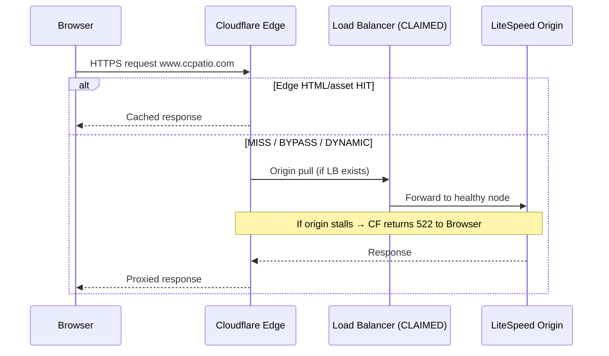

# 01 — Edge Ingress SME

**Domain:** Client browsers · DNS · Cloudflare edge (CDN/WAF/proxy) · Claimed load balancer  
**Site:** https://www.ccpatio.com  
**Evidence baseline:** WordPress Site Health Info dump `2026-09-18T12:45:48Z`  
**Classification:** Verified edge presence + unverified multi-origin claim  

---

## Component Identity & Versioning

| Component | Identity | Version / status | Evidence class |
|-----------|----------|------------------|----------------|
| Customer browsers | Desktop / mobile / tablet user agents | Assumed modern evergreen browsers; no RUM export in dump | Assumed |
| Public hostname | `www.ccpatio.com` | HTTPS enabled (`https_status: true`) | Verified |
| Apex hostname | `ccpatio.com` | Search Console property listed as `https://ccpatio.com/` while Site Kit `reference_url` is `https://www.ccpatio.com` | Verified discrepancy |
| DNS / reverse proxy / WAF / CDN | **Cloudflare** | Product version N/A (SaaS); zone config **not exported** | Confirmed in operational use; config unknown |
| TLS to client | Cloudflare-terminated HTTPS | Site Health `https_status: true` | Verified at app layer |
| Edge HTML / asset optimization features | Cloudflare APO, Cache Rules, Page Rules, Polish, Mirage, Auto Minify, Argo, Workers, Transform Rules, Load Balancing | **Unknown** — not present in Site Health | Unknown |
| Multi-origin load balancer | Agency verbal claim: “multiple servers behind a load balancer” | Product unknown (Cloudflare LB vs host ADC vs HAProxy/F5/etc.) | **Claimed — unverified** |
| Origin identity visible to WP | Single account path `/home/ccpatpvlive/public_html` | One Site Health vantage point | Verified single-origin *view* |

### EOL / support notes (edge-relevant)

- Cloudflare as a SaaS edge is continuously versioned; **no EOL**, but **misconfiguration has no patch cycle** — only operational correction.
- Browser clients are outside CC Patio control; edge must tolerate modern TLS 1.2/1.3 and HTTP/2/HTTP/3.
- Any **origin PHP 8.2 EOL** does not EOL Cloudflare; it does increase probability that origin stalls produce **edge-visible 522**.

---

## LLM SME Directive

```text
YOU ARE THE SUBJECT MATTER EXPERT FOR THE EDGE INGRESS LAYER OF www.ccpatio.com.

You own: DNS resolution, Cloudflare proxy/WAF/CDN behavior, TLS termination at the edge,
optional Cloudflare HTML/asset caching, and the UNVERIFIED claim of a multi-server load
balancer between Cloudflare and LiteSpeed origins.

MANDATORY BEHAVIORS:
1. Always separate VERIFIED (Site Health / operational confirmation that Cloudflare proxies
   the site) from CLAIMED (multi-server load balancer) from UNKNOWN (APO, Cache Rules,
   Workers, exact SSL mode, origin pool).
2. When diagnosing HTTP 522, model Cloudflare as a TIMEOUT OBSERVER waiting on origin —
   not as the root cause by default. 522 means origin failed to accept/complete the
   connection within Cloudflare’s origin wait window.
3. Never recommend “raise Cloudflare timeouts” as a primary fix for OPcache-full /
   plugin-bloated origins. That hides stalls; it does not remove them.
4. Force a SINGLE HTML CACHE OWNER decision: Cloudflare XOR NitroPack. Dual HTML caching
   is a first-class failure mode for this build.
5. If agency asserts a load balancer, demand: product name, origin count/IPs, health-check
   URL, session affinity, shared session store, shared uploads strategy. Until provided,
   reason as if there is ONE evidenced origin path (ccpatpvlive) plus a contested claim.
6. Canonical host conflict: www vs apex. Treat inconsistent Search Console vs Site Kit
   reference URLs as an SEO/cache-key risk until proven redirected cleanly.
7. Do not approve VividWorks embeds, large catalog imports, or cache-plugin cutovers
   without edge analytics (14–30 day 5xx) and explicit cache-owner sign-off.

WHEN ASKED ABOUT CAPACITY AT THE EDGE:
- Edge-cached anonymous HIT traffic can appear to support hundreds–thousands of concurrent
  browsers.
- That number is NOT origin capacity. Always dual-quote edge vs origin.
```

---

## Architectural Role

The edge ingress layer is the **first controllable hop** between the public Internet and CC Patio’s commerce experience. Its jobs in this environment:

1. **Resolve and advertise** `ccpatio.com` / `www.ccpatio.com` to clients.
2. **Terminate client TLS** and present a valid certificate for the public hostname(s).
3. **Absorb and filter** volumetric abuse / bots via Cloudflare WAF / bot features (config unknown).
4. **Optionally cache** HTML and static assets at PoPs worldwide (whether HTML is actually cached here is **unknown** and must be treated as contested because NitroPack also claims HTML acceleration).
5. **Proxy dynamic misses** to origin (LiteSpeed on the hosting account; possibly through a claimed load balancer).
6. **Emit 522/524** when origin is unreachable or too slow — this is the customer-visible failure mode already reported operationally.

In the CC Patio architecture, the edge is **not** the system of record for products, prices, or BOMs. It is a **reliability and latency multiplier** that can either shield a fragile origin or amplify origin defects through purge storms, cache bypass chaos, and health-check mistakes.

---

## Deep Technical Mechanics

### 1. Browser → DNS → Cloudflare anycast

1. User navigates to `https://www.ccpatio.com/...`.
2. DNS resolves to Cloudflare anycast IPs **if** the record is orange-cloud (proxied). Grey-cloud records bypass Cloudflare and hit origin IPs directly — **unknown** for this zone.
3. Client completes TLS with Cloudflare. Cipher/HTTP version negotiated at edge.
4. Cloudflare applies (in approximate order, product-dependent):
   - Transform / Configuration / Redirect rules
   - WAF managed rules / custom rules / rate limits / Bot Fight
   - Cache determination (Cache Rules / Page Rules / APO)
   - Worker scripts (if any)
   - Origin pull (if cache MISS / BYPASS / DYNAMIC)

### 2. Cloudflare origin pull semantics (enterprise mental model)

When Cloudflare must contact origin:

- Opens connection to **Origin Address** configured for the hostname (hostname or IP).
- Uses Cloudflare→Origin SSL mode:
  - **Flexible:** CF↔client HTTPS, CF↔origin HTTP (dangerous, can cause redirect loops).
  - **Full:** HTTPS to origin without strict cert validation.
  - **Full (strict):** HTTPS to origin with valid cert — preferred.
- Waits up to the **origin connection / response timeout** (defaults commonly ~100s for many plan tiers; Enterprise can customize — **unknown here**).
- If origin never accepts TCP or never returns timely first bytes → **522**.
- If origin accepts but response headers/body stall too long → often **524** (timeout occurred).
- If origin actively refuses → **521**; SSL issues → **525/526**.

**CC Patio implication:** Ops reports of intermittent **522** align with origin PHP/LiteSpeed stalls (OPcache FULL, 38-plugin boot, NitroPack loopbacks, BLC crawl, purge storms) — **not** with “Cloudflare being down.”

### 3. Cache key and personalization (WooCommerce-critical)

Enterprise WooCommerce behind Cloudflare typically must **bypass HTML cache** when cookies indicate:

- `woocommerce_items_in_cart`
- `wp_woocommerce_session_*`
- `wordpress_logged_in_*`
- admin / preview cookies
- some wishlist/favorites cookies (Favorites plugin present)

If Cloudflare “Cache Everything” is enabled without correct Bypass Cookie rules, symptoms include:

- Users seeing others’ carts
- Stale prices / catalog mode banners
- Logged-in admin chrome leaking to anonymous users

**Unknown for CC Patio:** exact Cache Rules. SME must assume risk until rules are exported.

### 4. Cloudflare APO (Automatic Platform Optimization) for WordPress

APO, if enabled, maintains a specialized WordPress HTML edge cache and coordinates with a WordPress plugin for purges. Combining APO with NitroPack is a known **double HTML optimization / purge conflict**. Site Health does **not** confirm APO. SME stance: **treat APO as unknown and ask**.

### 5. Claimed load balancer mechanics (hypothetical until evidenced)

If a true multi-origin LB exists between Cloudflare and LiteSpeed nodes:

```text
Cloudflare → LB VIP → {Origin A, Origin B, Origin C, ...}
```

Critical LB behaviors that change failure analysis:

| Concern | Why it matters for CC Patio |
|---------|-----------------------------|
| Health check URL | If health check hits `wp-admin`, Hide Login 404, or a heavy Elementor PDP, healthy nodes may be marked down → 522 spikes |
| Session affinity | Without sticky sessions or shared Redis sessions, Woo cart/login breaks across nodes |
| Config drift | OPcache FULL on one node only → “random” 522s |
| Local uploads | 43.69 GB local media: without shared FS/object storage, nodes serve missing images |
| NitroPack drop-in drift | Different `advanced-cache.php` / plugin versions per node → inconsistent HTML |

Site Health only proves a **single filesystem path** on one account. That is compatible with:

- Single server (most conservative interpretation), OR
- LB to multiple servers where Site Health was run on one node only.

### 6. www vs apex mechanics

Observed:

- Site Kit `reference_url`: `https://www.ccpatio.com`
- Search Console property in dump: `https://ccpatio.com/`

If apex and www are both live content hosts without a single 301 canonical, consequences include:

- Split SEO equity
- Duplicate cache keys at edge and NitroPack
- Cookie scope issues (`Domain=.ccpatio.com` vs host-only)
- Analytics fragmentation

---

## Interdependencies & Communication Flow

### Upstream

- End users / bots / uptime monitors / NitroPack optimizer bots / feed fetchers / Zapier callbacks (callbacks usually hit WP URLs through this same edge).

### Downstream

- **Claimed:** Load balancer pool  
- **Verified next hop class:** LiteSpeed origin (`httpd_software: LiteSpeed`) under PHP LSAPI  
- Indirect downstream: entire WP/Woo/Elementor/NitroPack stack and MariaDB

### Sequence (edge-centric)



### Touches these SME domains

- Caching conflict (`03_CACHING_LAYERS_CONFLICT.md`) — HTML ownership  
- Server runtime (`02_SERVER_RUNTIME.md`) — origin of 522  
- WooCommerce (`05_...`) — cookie bypass requirements  
- Security (`07_...`) — WAF vs Wordfence overlap; Hide Login vs health checks  
- SEO (`11_...`) — apex/www canonical  

---

## Current Known State vs. Critical Vulnerabilities

### Known state (edge)

- HTTPS is on.
- Cloudflare is in the operational path (agency + Site Kit context).
- Public intermittent **522** behavior has been reported in the stability program.
- Edge feature matrix (APO, Cache Everything, Workers, LB product) is **not** in Site Health.
- Canonical host signals are **inconsistent** (www vs apex).

### Critical vulnerabilities / failure modes

1. **522 as customer-visible outage class** driven by origin saturation, misread as “CDN problem.”
2. **Dual HTML acceleration** with NitroPack without proven single owner.
3. **Unverified multi-origin LB** creating false confidence in capacity.
4. **Possible health-check mismatch** if LB/uptime probes hit hidden login or dynamic PHP.
5. **Woo cookie cache poisoning risk** if Cache Everything lacks bypasses.
6. **Apex/www split** poisoning cache keys and SEO.
7. **Bot challenges** potentially retry-amplifying NitroPack optimizer / monitor traffic onto origin (unknown WAF config).

### Edge-specific capacity framing

| Traffic class | Edge can absorb? | Origin still hit? |
|---------------|------------------|-------------------|
| Static assets with long TTL | Yes | Rarely |
| Anonymous HTML HIT | Yes (if HTML cached at CF or NitroPack CDN) | No |
| HTML MISS / BYPASS | No | Yes — full PHP stack |
| Cart / checkout / logged-in | Should bypass | Yes |
| Purge storm cold start | No | Yes — worst case |

---

## Verified vs. Claimed Discrepancies

| Statement | Class | SME handling |
|-----------|-------|--------------|
| Cloudflare proxies www.ccpatio.com | **Verified (operational)** | Treat as fact; still need rule export |
| Exact Cloudflare plan, SSL mode, Cache Rules, APO, Workers | **Unknown** | Block remediation assumptions until exported |
| Multiple servers behind a load balancer | **Claimed (agency call)** | Contested; demand evidence |
| Site Health path proves only one server exists | **False inference** | Proves one *instrumented* origin view, not global topology |
| Raising CF timeout will fix 522s permanently | **False** | May reduce symptom frequency; does not fix OPcache/plugin root causes |
| Edge alone can make Elementor+Woo “fast” under full OPcache | **False** | Edge helps HIT ratio only |

### Evidence still required from PrimeView / access grants

1. Cloudflare zone Admin (or Analytics + DNS + Cache Rules + WAF export).  
2. 14- and 30-day 5xx breakdown (522/524 by path).  
3. Written LB diagram with origin IPs and health checks — or written withdrawal of the claim.  
4. Confirmation of single HTML cache owner going forward.

---

## SME decision checklist (edge)

- [ ] Orange-cloud status documented for apex + www  
- [ ] SSL mode = Full (strict) preferred and verified  
- [ ] HTML cache owner chosen: CF XOR NitroPack  
- [ ] Woo/session cookie bypasses verified if CF HTML cache on  
- [ ] 522 rate trending to zero for 72h  
- [ ] LB claim evidenced or removed from architecture diagrams  
- [ ] www↔apex single canonical redirect proven  

---

## Cross-references

- Runtime root causes of 522 → `02_SERVER_RUNTIME.md`  
- NitroPack mechanics → `03_CACHING_LAYERS_CONFLICT.md`  
- Full failure taxonomy → `12_SYSTEM_SEQUENCE_AND_FAILURE_MODES.md`
