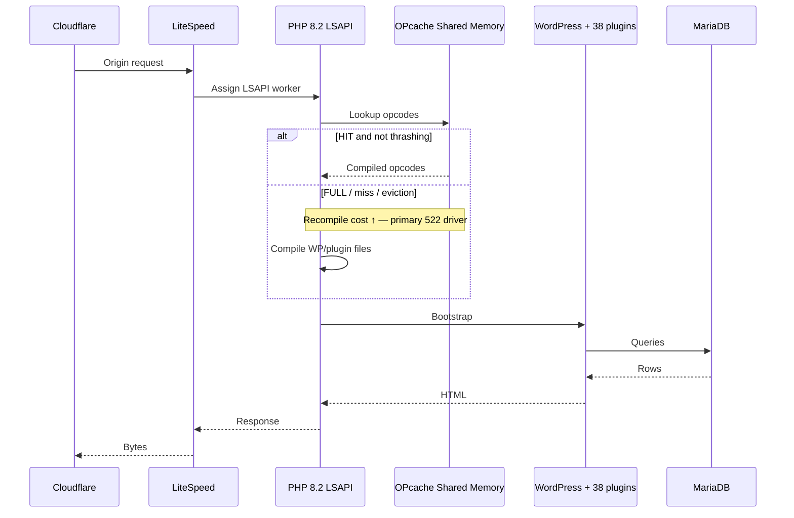

# 02 — Server Runtime SME

**Domain:** Linux el9 · LiteSpeed · PHP 8.2.33 LSAPI · OPcache · host account `ccpatpvlive`  
**Site:** https://www.ccpatio.com  
**Evidence baseline:** WordPress Site Health Info dump `2026-09-18T12:45:48Z`  
**Classification:** Highest-confidence root-cause layer for Cloudflare HTTP 522  

---

## Component Identity & Versioning

| Component | Exact identity | Version / value | EOL / support |
|-----------|----------------|-----------------|---------------|
| OS kernel | Linux x86_64 | `5.14.0-687.39.1.el9_8.x86_64` | RHEL/Alma/Rocky 9 family — supported era; exact distro flavor not named beyond el9 |
| Web server | **LiteSpeed** | Reported as `httpd_software: LiteSpeed` (edition/version string not in dump) | Vendor-supported; edition (OSS OpenLiteSpeed vs Enterprise) **unknown** |
| PHP | **PHP** | **8.2.33** 64-bit | **EOL since November 2025** — dump is Sep 2026 ⇒ **past security support** |
| PHP SAPI | **LiteSpeed LSAPI** (`php_sapi: litespeed`) | N/A | Not php-fpm / not Apache mod_php |
| OPcache | Zend OPcache | Enabled; **opcode_cache_full: true**; hit rate **56.64%**; interned strings **100%** of 8 MB (24 bytes free); memory usage reported `134217648 of 134217728` | Mis-sized for this codebase |
| memory_limit | PHP | **1G** | Allocation looks large; does not prevent worker exhaustion |
| max_execution_time | PHP | **300** seconds | Masks slow jobs; Cloudflare still 522s earlier |
| max_input_time | PHP | **60** seconds | Tight for heavy admin POSTs / Elementor saves |
| max_input_variables | PHP | **1000** | Can truncate large Elementor/Woo admin forms |
| upload_max_filesize | PHP | **20m** | Low vs furniture CAD/PDF workflows |
| post_max_size | PHP | **40m** | |
| curl | system | 7.76.1 OpenSSL/3.5.5 | |
| Host path | account home | `/home/ccpatpvlive/public_html` | Single Site Health vantage |
| WP memory | WordPress | `WP_MEMORY_LIMIT=512M`, `WP_MAX_MEMORY_LIMIT=1G` | Admin ceiling interaction with Elementor |

### Related runtime-adjacent imaging stack

| Component | Version |
|-----------|---------|
| ImageMagick | 6.9.13-52 (Beta) Q16 x86_64 |
| Imagick PHP ext | 3.8.1 |
| GD | bundled 2.1.0-compatible |
| Ghostscript | 9.54.0 |

---

## LLM SME Directive

```text
YOU ARE THE SUBJECT MATTER EXPERT FOR THE ORIGIN SERVER RUNTIME OF www.ccpatio.com.

You own: Linux el9 hosting realities, LiteSpeed request admission, PHP 8.2.33 under LSAPI,
OPcache sizing/behavior, and how runtime saturation becomes Cloudflare HTTP 522.

MANDATORY BEHAVIORS:
1. Treat OPcache FULL + interned_strings 100% + 56.64% hit rate as the PRIMARY evidenced
   runtime defect correlating to intermittent origin timeouts.
2. Treat PHP 8.2.33 as PAST EOL. Any “stay on 8.2” recommendation requires an explicit
   security-risk acceptance by the business — never imply it is fine because “it runs.”
3. Never confuse PHP memory_limit=1G with capacity. Capacity is (LSAPI max children) ×
   (healthy request latency). Unknown max children ⇒ refuse hard RPS guarantees.
4. Model LSAPI (not php-fpm). Advice about php-fpm pools is wrong unless PrimeView proves
   a non-LSAPI topology (contradicted by Site Health).
5. When a load balancer is claimed, remember OPcache is PER NODE. Remediation must roll
   across the fleet; one-node Site Health green does not mean fleet green.
6. Reject “increase max_execution_time” as a 522 fix. Cloudflare will still abandon the
   wait; long PHP jobs belong in CLI/cron queues.
7. Before approving code that adds plugins, heavy admin AJAX, or image reprocessing,
   evaluate OPcache pressure and LSAPI concurrency impact.

RUNTIME SME OUTPUT STYLE:
- Prefer numeric thresholds (hit rate ≥90%, opcode_cache_full=false).
- Demand ini exports when recommending OPcache resize.
- Separate “process memory” from “shared OPcache slab” from “interned strings slab.”
```

---

## Architectural Role

This layer converts an accepted HTTP connection on the origin into executed WordPress/PHP work and bytes returned upstream (to a claimed LB and/or Cloudflare).

It is the **compute heart** of the storefront. Every cache MISS, cart request, admin save, NitroPack loopback, Broken Link Checker crawl, and WooCommerce query ultimately burns:

1. A LiteSpeed worker / connection slot  
2. An LSAPI PHP process  
3. OPcache lookups (or recompiles when cold/full)  
4. CPU + RAM + often MariaDB time  

If this layer stalls, **the edge has nothing to do but wait — then 522.**

---

## Deep Technical Mechanics

### 1. LiteSpeed admission control

LiteSpeed receives HTTPS (or HTTP from Flexible SSL — unknown) from Cloudflare or LB.

For dynamic `.php` / WordPress front controller (`index.php`):

- Maps request to virtual host document root `/home/ccpatpvlive/public_html`
- Hands execution to **LSAPI** external application pool
- Enforces per-vhost connection and process limits (**values unknown — must export**)

Unlike php-fpm’s explicit pool stanzas in a file you always see, LSAPI limits often live in:

- LiteSpeed Admin Console / WebAdmin  
- CyberPanel / cPanel LiteSpeed plugin UI  
- `.htaccess` / rewrite — not for process counts  

**SME requirement:** obtain External App max connections, backlog, and idle timeouts.

### 2. PHP 8.2.33 under LSAPI

Each dynamic request roughly:

1. Acquire LSAPI worker  
2. Bootstrap PHP with loaded extensions (Imagick, mysqli/mysqlnd, etc.)  
3. Consult OPcache for compiled opcodes of WP core + plugins + theme  
4. Execute WordPress load path (`wp-load.php` → plugins → theme → query → template)  
5. Return response through LiteSpeed  

With **38 active plugins**, Elementor, Spectra, WooCommerce, and NitroPack, the **bootstrap graph is large**. Cold or thrashing OPcache multiplies CPU per request.

### 3. OPcache internals (enterprise view) — THE critical defect

Observed:

| Metric | Observed | Interpretation |
|--------|----------|----------------|
| opcode cache memory | 134217648 / 134217728 (~128 MB almost full) | Slab exhausted |
| opcode_cache_full | **true** | New scripts force eviction / recompile behavior under pressure |
| hit rate | **56.64%** | Unhealthy (healthy WP stacks often >>90% when warmed) |
| interned_strings_buffer | **100% of 8 MB** used (24 bytes free) | String interning slab exhausted — severe |

**Mechanics:**

- OPcache stores compiled opcodes in shared memory.
- Interned strings store immutable string literals shared across requests.
- When full, PHP spends CPU **recompiling** and **evicting**, raising TTFB.
- LiteSpeed workers stay busy longer ⇒ queueing ⇒ Cloudflare origin wait exceeded ⇒ **522**.

**Remediation direction (runtime SME owned):**

- Raise `opcache.memory_consumption` (commonly 256–512MB+ for heavy WP)  
- Raise `opcache.interned_strings_buffer` (commonly 16–32MB+)  
- Raise `opcache.max_accelerated_files` to fit WP+plugin file counts  
- Tune `opcache.revalidate_freq` / `validate_timestamps` for prod  
- Confirm whether JIT is on (PHP 8.x) — JIT can add memory pressure; state unknown  

**Acceptance:** Site Health shows `opcode_cache_full: false`, hit rate ≥ 90%, interned strings not pinned at 100%.

### 4. Why memory_limit=1G does not save you

`memory_limit` caps **per-request** PHP memory. OPcache is **shared**. A server can have:

- Comfortable per-request memory, AND  
- Saturated shared OPcache, AND  
- Too few LSAPI children  

⇒ still 522 under modest concurrency.

### 5. EOL mechanics for PHP 8.2.33

After November 2025, php.net ends security fixes for 8.2. Remaining on 8.2.33 in September 2026 means:

- New CVEs in core/extensions may go unpatched upstream  
- Hosting vendors may force upgrades abruptly  
- Plugin vendors increasingly test 8.3/8.4 first  

**SME stance:** schedule staging validation on **8.3 (or 8.4)** after stability gate; do not big-bang production during 522 firefighting.

### 6. Interaction with claimed multi-server topology

If N LiteSpeed nodes exist:

- Each has its **own** OPcache slab  
- Site Health on node A can show FULL while node B differs  
- Rolling ini changes need fleet orchestration  
- Without shared sessions, Woo sticky sessions become mandatory at LB  

### 7. Imaging runtime cost

ImageMagick/Imagick available with large resource limits reported in Site Health. On-the-fly image ops (Elementor, NitroPack, thumbnail regen) can spike CPU and memory independently of page HTML generation — relevant to 43.69 GB media library.

---

## Interdependencies & Communication Flow

### Upstream

- Cloudflare origin pull and/or claimed load balancer health-checked traffic  
- NitroPack optimizer loopbacks (if enabled)  
- Cron / Action Scheduler CLI or web cron hitting `wp-cron.php`  

### Downstream

- WordPress core bootstrap (`04_WORDPRESS_CORE_CMS.md`)  
- `advanced-cache.php` early load (`03_CACHING_LAYERS_CONFLICT.md`)  
- mysqli to MariaDB 10.11.19 (`09_DATA_MEDIA_STORAGE.md`)  
- Outbound curl to SaaS (`08_THIRD_PARTY_APIS_INTEGRATIONS.md`)  

### Sequence (runtime-centric)



---

## Current Known State vs. Critical Vulnerabilities

### Known state

- LiteSpeed + PHP 8.2.33 LSAPI confirmed  
- OPcache **FULL**, interned strings **100%**, hit rate **56.64%**  
- PHP `memory_limit` 1G; execution time 300s  
- Production path `/home/ccpatpvlive/public_html`  
- Imaging stack present and powerful  

### Critical vulnerabilities

1. **OPcache saturation** — evidenced, acute, 522-correlated.  
2. **PHP EOL** — security and support risk.  
3. **Unknown LSAPI concurrency ceiling** — capacity unquantified.  
4. **Long max_execution_time** — false safety vs edge timeouts.  
5. **Heavy dynamic stack** on each MISS (38 plugins + dual builders).  
6. **Fleet drift risk** if LB claim true but ini not centralized.  
7. **Imagick CPU contention** during media operations on 43.69 GB library.  

### Working capacity model (runtime view)

Until LSAPI limits are known, use conservative bands for **one origin node**:

| Condition | Concurrent dynamic PHP requests (order of magnitude) |
|-----------|------------------------------------------------------|
| OPcache healthy, cache HIT mostly at edge | Origin concurrency mostly idle |
| Current OPcache FULL + 38 plugins | **~10–25** before severe latency |
| Purge storm / cold compile | **~5–15** (522-prone) |

Multiply by N **only after** LB + identical node health proven.

---

## Verified vs. Claimed Discrepancies

| Statement | Class |
|-----------|-------|
| LiteSpeed is the web server | **Verified** |
| PHP is 8.2.33 via litespeed SAPI | **Verified** |
| OPcache full / poor hit rate / interned strings exhausted | **Verified** |
| Exact `opcache.*` ini values | **Unknown** (effects verified; knobs not dumped) |
| LSAPI max children / plan vCPU-RAM | **Unknown** |
| OpenLiteSpeed vs Enterprise LiteSpeed | **Unknown** |
| Multiple runtime servers behind LB | **Claimed** |
| php-fpm is in path | **Contradicted** by `php_sapi: litespeed` |

---

## Remediation ownership (runtime)

| Priority | Action | Acceptance |
|----------|--------|------------|
| P0 | Resize OPcache memory + interned strings; verify not full | hit rate ≥90%, full=false |
| P0 | Export LSAPI limits; raise workers if queueing proven | Origin p95 TTFB improvement; 522↓ |
| P1 | PHP 8.3/8.4 staging matrix | Staging green before prod |
| P2 | Align Imagick jobs to off-peak | CPU steal ↓ during catalog hours |

---

## Cross-references

- Edge 522 semantics → `01_EDGE_INGRESS.md`  
- NitroPack loopbacks onto this runtime → `03_CACHING_LAYERS_CONFLICT.md`  
- Failure taxonomy → `12_SYSTEM_SEQUENCE_AND_FAILURE_MODES.md`
