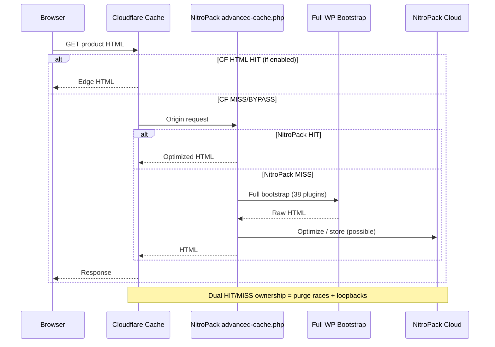

# 03 — Caching Layers Conflict SME

**Domain:** NitroPack 1.20.1 · `advanced-cache.php` · `WP_CACHE=true` · Cloudflare HTML/asset cache contention · absent Redis/LSCWP evidence  
**Site:** https://www.ccpatio.com  
**Evidence baseline:** Site Health dump `2026-09-18T12:45:48Z`  
**Classification:** Architectural conflict zone — primary amplifier of intermittent 522s  

---

## Component Identity & Versioning

| Component | Identity | Version / state | Evidence |
|-----------|----------|-----------------|----------|
| NitroPack WordPress plugin | NitroPack Inc. | **1.20.1** | Active plugin list |
| WordPress page-cache drop-in | `wp-content/advanced-cache.php` | Present (`wp-dropins: advanced-cache.php: true`) | Verified |
| WP cache flag | `WP_CACHE` | **true** | Verified constants |
| Cloudflare edge cache / APO / Cache Rules | Cloudflare SaaS | Config **not exported** | Confirmed CF in path; cache mode unknown |
| LiteSpeed Cache (LSCWP) | Not listed in active plugins | — | **Not reported** |
| Redis object cache drop-in | `object-cache.php` | Not listed among drop-ins | **Not reported** |
| Memcached | — | — | **Not reported** |
| Server-level LSCache | LiteSpeed feature | Unknown | Unknown |

### EOL / support

- NitroPack 1.20.1 is a commercial SaaS-coupled plugin; support depends on subscription — **account ownership unknown**.  
- Dual-caching is not an “EOL” issue; it is a **design defect** relative to stability goals.

---

## LLM SME Directive

```text
YOU ARE THE SUBJECT MATTER EXPERT FOR CACHING AND PERFORMANCE ACCELERATION ON www.ccpatio.com.

You own the conflict between NitroPack (plugin + advanced-cache.php + possible NitroPack CDN)
and Cloudflare (proxy + possible HTML cache/APO), and the ABSENCE of evidenced object cache.

MANDATORY BEHAVIORS:
1. ALWAYS force a binary policy: Cloudflare XOR NitroPack as HTML cache owner — never both.
2. Explain 522 spikes as often coinciding with PURGE STORMS + COLD PHP boots on an OPcache-full
   runtime — not as mysterious CDN failures.
3. Model NitroPack early bootstrap via advanced-cache.php BEFORE most of WordPress loads.
4. Demand NitroPack exclusion lists for cart, checkout, my-account, wp-admin, REST, Gravity Forms
   confirmations.
5. Demand Cloudflare Cache Rules export before declaring “CF is only DNS/WAF.”
6. Do not invent Redis/LSCWP. Site Health shows only advanced-cache.php. If agency claims Redis,
   require proof (drop-in + php-redis + connectivity).
7. When load balancer is claimed, require identical NitroPack/drop-in versions on every node and
   clarify whether NitroPack CDN sits beside or behind Cloudflare.

FORBIDDEN SHORTCUTS:
- “Just clear all caches” without naming which systems and in which order.
- Enabling APO on top of NitroPack “for more speed.”
- Treating page cache as a substitute for fixing OPcache FULL.
```

---

## Architectural Role

Caching layers exist to **prevent** LiteSpeed/PHP/MariaDB from executing full WordPress bootstraps on every anonymous page view.

In a healthy enterprise WooCommerce design, typically:

1. **Edge CDN** caches static assets aggressively.  
2. **One** HTML page-cache owner caches anonymous product/category/content HTML.  
3. **Object cache** (Redis) stores options/transients/sessions fragments.  
4. **OPcache** caches compiled PHP (runtime, not HTML).

On CC Patio, evidenced reality is skewed:

- HTML acceleration attempted via **NitroPack** (plugin + drop-in).  
- **Cloudflare** also sits in front and **may** cache HTML (unknown).  
- **Object cache drop-in not evidenced.**  
- **OPcache is broken-full** — so even cache generators are expensive.

Thus caching is both **necessary** and **currently hazardous**.

---

## Deep Technical Mechanics

### 1. WordPress `WP_CACHE` + `advanced-cache.php` bootstrap

When `WP_CACHE` is true, WordPress loads `wp-content/advanced-cache.php` extremely early (during `wp-settings.php` flow) **before** most plugins initialize.

NitroPack’s drop-in typically:

- Attempts to serve a **pre-optimized HTML** document for anonymous cacheable GETs  
- May short-circuit the rest of WordPress on HIT  
- On MISS, allows full bootstrap, then stores optimized output (sometimes after DOM rewrite)

This means NitroPack is not “just another plugin in the list” — it is a **drop-in-level interceptor**.

### 2. NitroPack SaaS mechanics (enterprise model)

NitroPack commonly combines:

| Function | Mechanism | Risk on this build |
|----------|-----------|--------------------|
| HTML caching | Store optimized HTML | Conflict if CF also caches HTML |
| DOM optimization | Deferred JS, critical CSS, minify, lazy images | Can break Elementor/Spectra/jQuery timing |
| Image optimization | Re-encode/resize via service | CPU + storage interaction with 43.69 GB library |
| Remote optimizer | NitroPack bots fetch pages | **Origin loopbacks** under CF → extra PHP load |
| CDN | Serve assets/HTML from NitroPack network | Dual CDN with Cloudflare = ownership confusion |
| Automatic purge | On WP publish / product update | **Purge storms** across large catalogs |

**Loopback failure mode (critical):**  
Optimizer requests arrive via Cloudflare → origin PHP (OPcache FULL) → slow → more 522s → retries → amplification.

### 3. Cloudflare caching mechanics (contested)

Possible modes (unknown which apply):

1. **DNS/WAF only** — CF proxies, does not cache HTML (safest alongside NitroPack).  
2. **Standard caching** — caches static; HTML dynamic.  
3. **Cache Everything / custom Cache Rules** — caches HTML; requires cookie bypasses.  
4. **APO for WordPress** — specialized WP HTML edge cache + purge plugin coordination.

Any of 3–4 **plus NitroPack** = double HTML owners.

### 4. Purge storm dynamics with WooCommerce + Elementor

Catalog edits, stock changes, Elementor template saves, Rank Math meta updates, and WebToffee feed regenerations can invalidate large URL sets.

Sequence:

1. Purge signal clears NitroPack and/or CF HTML  
2. Burst of real users + bots hit MISS  
3. Each MISS fully boots 38 plugins on OPcache-full PHP  
4. LSAPI saturates  
5. Cloudflare emits **522** for a subset of requests  
6. Ops perceives “intermittent CDN failure”

### 5. What is *not* evidenced (important negatives)

- No `object-cache.php` drop-in listed  
- No LiteSpeed Cache plugin in active list  
- No Memcached/Redis proof  

So transient-heavy plugins (BLC, Activity Log, Woo sessions) lean on **MariaDB options/autoload** more than a memory object cache — worsening DB pressure during storms.

### 6. Correct enterprise end-states (choose one)

**Option A — Cloudflare-owned HTML**

- Disable NitroPack HTML cache / remove drop-in after migration plan  
- Use CF Cache Rules + correct Woo bypasses (or APO alone)  
- Keep CF for assets + WAF  

**Option B — NitroPack-owned HTML**

- Configure CF to **bypass HTML cache** (proxy/WAF/assets only)  
- Harden NitroPack exclusions + purge scope  
- Disable APO if present  

**Option C — Neither HTML cache (temporary incident mode)**

- Accept higher origin load only while repairing OPcache — short-term only  

There is **no Option D: both**.

---

## Interdependencies & Communication Flow

### Upstream

- Browser requests via Cloudflare (`01_EDGE_INGRESS.md`)  
- Possibly LB distributing to nodes with local drop-ins (`claimed`)

### Downstream

- LiteSpeed/PHP runtime (`02_SERVER_RUNTIME.md`) executes MISSes  
- WordPress/Woo/Elementor generate HTML (`04`/`05`/`06`)  
- MariaDB supplies dynamic fragments (`09`)  
- NitroPack cloud APIs (`08`)

### Sequence (caching-centric)



---

## Current Known State vs. Critical Vulnerabilities

### Known state

- NitroPack 1.20.1 active  
- `advanced-cache.php` present; `WP_CACHE=true`  
- Cloudflare in front  
- No evidenced Redis/LSCWP  
- Runtime OPcache FULL makes every MISS expensive  

### Critical vulnerabilities

1. **Double HTML cache ownership** (confirmed NitroPack + possible CF HTML).  
2. **Purge storms → cold boots → 522**.  
3. **Optimizer loopbacks** onto saturated LSAPI.  
4. **DOM optimizations** conflicting with Elementor/Spectra/variation JS.  
5. **Missing object cache** increasing DB load.  
6. **Node drift** of drop-in if multi-server claim true.  
7. **False confidence** that “caching is on” while HIT path is unstable.

### Decommission / decision gate

| Action | Urgency |
|--------|---------|
| Choose CF XOR NitroPack | **Critical** |
| Export NitroPack exclusions + purge policy | Critical |
| Export CF Cache Rules / APO status | Critical |
| Confirm no APO+NitroPack combo | Critical |
| Evaluate Redis object cache *after* HTML owner chosen | Medium |

---

## Verified vs. Claimed Discrepancies

| Statement | Class |
|-----------|-------|
| NitroPack plugin + advanced-cache drop-in active | **Verified** |
| Cloudflare may cache HTML | **Unknown / contested** |
| LiteSpeed Cache / Redis active | **Not evidenced** |
| “We are fully cached / fine” | **Agency narrative risk** — contradicted by 522s + OPcache FULL |
| Multi-CDN (CF + NitroPack CDN) architecture documented | **Not evidenced** |

---

## SME runbook: safe cache clear order (incident)

1. Stop nonessential crawlers (BLC).  
2. Confirm OPcache not actively thrashing (or resize first if possible).  
3. Purge **one** HTML owner only (the chosen owner).  
4. Warm critical URLs deliberately (home, top categories, top PDPs).  
5. Watch CF 522 rate + origin TTFB for 30–60 minutes.  
6. Only then purge the other layer’s **asset** cache if needed.

Never simultaneous “purge everything everywhere” during peak traffic on this build.

---

## Cross-references

- Edge rules → `01_EDGE_INGRESS.md`  
- OPcache → `02_SERVER_RUNTIME.md`  
- Woo cookies → `05_ECOMMERCE_ENGINE_WOOCOMMERCE.md`  
- Failure modes → `12_SYSTEM_SEQUENCE_AND_FAILURE_MODES.md`
