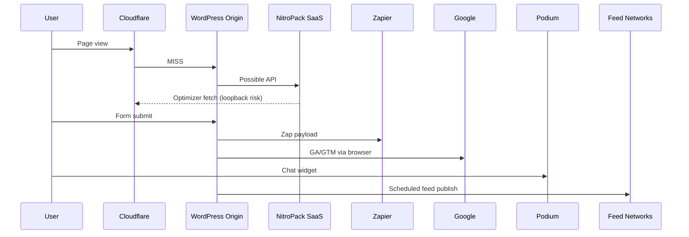

# 08 — Third-Party APIs & Integrations SME

**Domain:** Outbound SaaS · inbound webhooks · feed networks · chat · analytics auth · mail transport  
**Site:** https://www.ccpatio.com  
**Evidence baseline:** Site Health dump `2026-09-18T12:45:48Z`  

---

## Component Identity & Versioning

| Integration surface | Via component | Version | Direction | Confidence |
|---------------------|---------------|---------|-----------|------------|
| NitroPack Cloud optimization/CDN | NitroPack plugin | 1.20.1 | Outbound + inbound optimizer bots | High (plugin active) |
| Zapier automation | Gravity Forms Zapier Add-On | 4.5.1 | Outbound form events; possible inbound | High plugin; flows unknown |
| Podium messaging | Podium plugin | 2.0.9 | Bidirectional chat/SMS style | High plugin; account unknown |
| Google Analytics 4 | Site Kit / gtag | Site Kit 1.187.0; measurement ID present | Outbound JS + API | Partial — Site Kit **not connected** in dump |
| Google Search Console | Site Kit / Rank Math | SC property `https://ccpatio.com/` | Outbound | Partial auth |
| accessiBe overlay | accessiBe plugin | 2.13 | Outbound script + SaaS | High |
| Product feed networks (Google Shopping, Pinterest, TikTok, etc.) | WebToffee feeds | 2.4.2 | Outbound file/API | High plugin; schedules unknown |
| Rank Math external services | Rank Math SEO | 1.0.278 | Outbound | Medium |
| Wordfence intelligence / central | Wordfence | 9.0.1 | Outbound | Medium |
| Transactional email | WP Mail SMTP Lite 4.9.0 | Lite | Outbound SMTP/API | Provider **unknown** |
| Elementor cloud bits (if any) | Elementor | 4.2.x | Possible | Unknown |
| WooCommerce.com / payment gateways | WooCommerce | 11.1.0 | Unknown gateways not listed as plugins in dump excerpt | Unknown |

### Explicit non-integrations (not evidenced in this dump)

- Katana MRP connectors as WP plugins  
- VividWorks configurator runtime (may be future/planned; not in active plugin list)  
- Hub MDM middleware  

Those belong to other repo docs; **do not invent them as live WP integrations** from this dump.

---

## LLM SME Directive

```text
YOU ARE THE SUBJECT MATTER EXPERT FOR THIRD-PARTY API AND SAAS INTEGRATION SURFACES
TOUCHING www.ccpatio.com.

You own outbound HTTP from PHP/JS, inbound webhooks/bots, feed publishing, chat widgets,
analytics auth state, and mail delivery — and how these amplify origin load.

MANDATORY BEHAVIORS:
1. Treat every outbound call during page generation as latency risk on OPcache-full origins.
2. Treat inbound optimizer/feed/uptime bots as first-class traffic — they can trigger 522s.
3. Never assume Site Kit is healthy: dump shows not-connected / scopes missing even with GA IDs.
4. Demand WP Mail SMTP transport provider identity (SendGrid/Mailgun/Google/etc.).
5. Separate browser-side SaaS (accessiBe, GA) from origin-side SaaS (NitroPack API, Zapier).
6. When load balancer claimed, ensure webhooks are sticky-safe or server-agnostic.

INTEGRATIONS SME FORBIDDEN:
- Adding new Zapier zaps or feed channels during stability incidents.
- Claiming “Google is connected” without Site Kit auth green.
```

---

## Architectural Role

Integrations extend WordPress into marketing, accessibility, automation, and performance SaaS. They are **force multipliers** — and **failure multipliers** when:

- Synchronous PHP waits on remote APIs during page render  
- Inbound bots crawl expensive PDPs  
- Feed jobs lock tables / saturate CPU  
- Chat widgets block main thread (CWV) — client side  

---

## Deep Technical Mechanics

### 1. NitroPack Cloud

- Plugin registers site with NitroPack SaaS  
- May push/pull optimized assets  
- Optimizer bots fetch pages through public edge  
- Purge APIs triggered on content change  

See caching SME for conflict detail; here emphasize **API/bot traffic class**.

### 2. Gravity Forms → Zapier

On form submit:

1. GF stores entry in MariaDB  
2. Zapier add-on sends payload to Zapier REST  
3. Zapier routes to CRM/Sheets/email/etc.  

Failure modes: Zapier downtime → queues/retries; spam form floods → outbound rate spikes; large file uploads (PDF Embedder adjacent) → heavy posts.

### 3. Podium

Typically injects chat widget JS and may sync leads. Inbound customer messages do not hit PHP; widget load affects frontend performance. Webhooks to WP (if any) unknown.

### 4. Site Kit / GA4 / Search Console

Dump highlights:

- `site_status: not-connected`  
- Many scopes unauthenticated (⭕)  
- Yet `analytics_4_measurement_id` present and `analytics_4_use_snippet: yes`  

**Interpretation:** tags may still fire via snippet while Site Kit admin integration is broken — split-brain analytics governance. Apex SC property vs www reference URL remains unresolved.

### 5. accessiBe

Loads third-party accessibility overlay scripts. Adds client weight; privacy/consent considerations (`consent_mode: disabled` in Site Kit dump). Not an origin CPU primary, but compliance-sensitive.

### 6. WebToffee feeds

Generates merchant feeds — file I/O under uploads or plugin dirs; scheduled regenerations; remote fetch by Google/Pinterest/TikTok. Overlap with peak traffic = origin stress.

### 7. WP Mail SMTP Lite

Without provider identity, password resets, GF notifications, and Woo emails (if enabled) may:

- Go through congested local mail()  
- Or a third-party API  

Lite license limits features — deliverability unknown (`email_reports_deliverability: not-available` in Site Kit section for its own reports).

### 8. Rank Math services

May call remote APIs for suggestions/connectivity; primarily local SEO generation, but external account linking possible.

### 9. Wordfence central communications

License/threat intel updates — usually modest, but scans + remote blocklists matter.

---

## Interdependencies & Communication Flow



---

## Current Known State vs. Critical Vulnerabilities

### Known state

- Multiple SaaS plugins active  
- Site Kit auth unhealthy  
- NitroPack cloud coupled  
- Zapier bridge present  
- Feeds present  
- SMTP configured as plugin but provider opaque  
- Consent mode disabled in Site Kit snapshot  

### Critical vulnerabilities

1. **NitroPack bot loopbacks** under 522 conditions.  
2. **Feed cron overlap** with storefront peaks.  
3. **Analytics governance split-brain**.  
4. **Unknown mail provider** — business continuity risk.  
5. **Zapier spam amplification**.  
6. **Webhook targeting wrong node** if LB without shared state.  
7. **New integration sprawl** before stability gate.

---

## Verified vs. Claimed Discrepancies

| Statement | Class |
|-----------|-------|
| Plugins for NitroPack, Zapier, Podium, Site Kit, accessiBe, WebToffee, WP Mail SMTP active | **Verified** |
| Site Kit fully connected | **Contradicted** by dump |
| Exact Zapier zaps / Podium account / SMTP provider | **Unknown** |
| VividWorks live on this WP stack today | **Not evidenced** in plugin list |

---

## Integration freeze policy (recommended)

Until 522 gate clears:

- No new Zapier zaps  
- No new feed channels  
- No new chat/pixel plugins  
- NitroPack settings changes only under change control with CF owner decision  
- Fix or remove Site Kit  

---

## Cross-references

- NitroPack conflict → `03_CACHING_LAYERS_CONFLICT.md`  
- Forms → `10_CONTENT_FORMS_CHAT.md`  
- SEO/analytics → `11_SEO_ANALYTICS_ACCESSIBILITY.md`  
- Edge bots → `01_EDGE_INGRESS.md`
