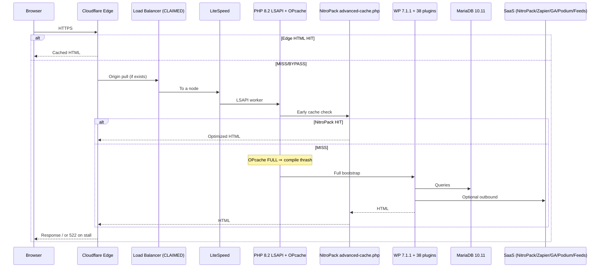

# 12 — System Sequence & Failure Modes SME (Cross-Cutting)

**Domain:** End-to-end request lifecycle · Cloudflare 522 taxonomy · capacity model · stability gate · multi-server claim effects · 38-plugin cost model  
**Site:** https://www.ccpatio.com  
**Evidence baseline:** Site Health dump `2026-09-18T12:45:48Z` + agency verbal LB claim  
**Role of this file:** Capstone corpus — bind all SME domains into one failure-aware system model  

---

## Component Identity & Versioning

This file does not introduce new software. It indexes the **composed system**:

| Layer | Primary identities | Version anchors |
|-------|--------------------|-----------------|
| Edge | Cloudflare (+ claimed LB) | Config unknown / LB unverified |
| Runtime | LiteSpeed + PHP LSAPI + OPcache | PHP **8.2.33 EOL**; OPcache **FULL** |
| Cache | NitroPack + `advanced-cache.php` + possible CF HTML | NitroPack **1.20.1** |
| CMS | WordPress | **7.1.1** |
| Commerce | WooCommerce ecosystem | Woo **11.1.0** |
| Builders | Elementor + Spectra + snippets | Elementor **4.2.4** / Pro **4.2.3** / Spectra **2.20.3** |
| Data | MariaDB + uploads | MariaDB **10.11.19**; uploads **43.69 GB** |
| Active plugins | Combined surface | **38** |

---

## LLM SME Directive

```text
YOU ARE THE PRINCIPAL CROSS-CUTTING SYSTEMS SME FOR www.ccpatio.com.

You synthesize Edge, Runtime, Caching, CMS, Commerce, Builders, SecOps, Integrations, Data,
Forms, and SEO SMEs into one operational truth.

MANDATORY BEHAVIORS:
1. Always narrate failures with the hop that DETECTS them vs the hop that CAUSES them.
   Example: Cloudflare DETECTS 522; OPcache-full PHP + purge storm CAUSES origin stall.
2. Never give a single “max visitors” number without splitting EDGE HIT vs ORIGIN DYNAMIC.
3. Treat the multi-server load balancer as CLAIMED until evidenced; adjust capacity math
   only after N, health checks, affinity, and shared media are proven.
4. Enforce stability gate before feature work (VividWorks, new Elementor, large imports).
5. When recommending changes, specify cache-owner impacts and OPcache impacts explicitly.
6. Prefer smallest access set that unlocks truth: Cloudflare + Hosting/LiteSpeed + NitroPack
   logins collapse most questionnaires.

CROSS-CUTTING FORBIDDEN:
- Blaming Cloudflare as root cause by default.
- Approving dual HTML cache “temporarily.”
- Treating Site Health as a complete architecture diagram.
```

---

## Architectural Role

This capstone defines **how the organism behaves as a whole**: latency budgets, saturation cliffs, and the political/technical remediation order for PrimeView handback.

---

## Deep Technical Mechanics

### 1. Canonical sequence diagram (authoritative)



### 2. HTTP 522 taxonomy for THIS build

| Detector | Typical cause on CC Patio | Evidence strength |
|----------|---------------------------|-------------------|
| CF 522 | LSAPI workers busy; OPcache recompile; plugin boot | **High** (OPcache FULL verified) |
| CF 522 | NitroPack optimizer loopback amplification | Medium (mechanically plausible) |
| CF 522 | Purge storm cold start | Medium |
| CF 522 | BLC crawl + storefront peak | Medium-high (plugin active) |
| CF 522 | One LB node unhealthy / bad health check | Unknown until LB evidenced |
| CF 522 | MariaDB connection exhaustion (151) | Secondary possible |
| CF 524 | Origin accepted but stalled streaming | Related family |
| CF 5xx other | SSL/origin down classes | Distinguish carefully |

**Rule:** Fix cause class before widening CF timeouts.

### 3. Thirty-eight plugin cost model

On every full bootstrap MISS, PHP must load and register hooks across domains:

- Commerce cluster (~8)  
- Builders/theme pro (~4+)  
- Security/ops (~10+)  
- SEO/analytics (~4)  
- Forms/chat (~4)  
- Cache (NitroPack)  
- Remainder utilities  

Rough mental model:

```text
TTFB_MISS ≈ T_OPcache + T_plugin_boot + T_DB + T_render(Elementor/Woo) + T_outbound
```

When `T_OPcache` explodes due to FULL slab, all other terms start from a worse baseline.

### 4. Double-caching failure mechanics

```text
Content change → NitroPack purge ± CF purge
             → simultaneous MISS wave
             → N browsers + bots × full PHP boot
             → OPcache thrash
             → queueing
             → CF 522 subset
```

### 5. Capacity model (order-of-magnitude)

**Per evidenced origin node, current state:**

| Class | Concurrent estimate | Notes |
|-------|---------------------|-------|
| Edge HTML HIT browsers | 200–1000+ | Not origin capacity |
| Origin dynamic healthy target (after remediation) | tens+ | Needs measurement |
| Origin dynamic **current** (OPcache FULL + 38 plugins) | **~10–25** | Soft ceiling |
| Origin during purge/BLC/cold | **~5–15** | 522-prone |
| Claimed N-node multiplier | ×N | **Only if** LB+shared media+identical ops proven |

### 6. Verified vs claimed topology modes

**Mode A — Single origin (conservative default)**  
Cloudflare → LiteSpeed `ccpatpvlive` → PHP → DB/uploads local.

**Mode B — Multi origin (agency claim)**  
Cloudflare → LB → {nodes} → each with PHP/OPcache; media strategy mandatory.

SME must **label which mode** any recommendation assumes.

---

## Interdependencies & Communication Flow

All domain files feed this capstone:

| Hop | SME file |
|-----|----------|
| 1–2 Edge | `01_EDGE_INGRESS.md` |
| 3–4 Runtime | `02_SERVER_RUNTIME.md` |
| Early cache | `03_CACHING_LAYERS_CONFLICT.md` |
| WP bus | `04_WORDPRESS_CORE_CMS.md` |
| Commerce | `05_ECOMMERCE_ENGINE_WOOCOMMERCE.md` |
| Render | `06_PAGE_BUILDERS_FRONTEND.md` |
| Sec/ops load | `07_OPS_SECURITY_ACCESS.md` |
| SaaS | `08_THIRD_PARTY_APIS_INTEGRATIONS.md` |
| DB/media | `09_DATA_MEDIA_STORAGE.md` |
| Forms/chat | `10_CONTENT_FORMS_CHAT.md` |
| SEO/a11y | `11_SEO_ANALYTICS_ACCESSIBILITY.md` |

---

## Current Known State vs. Critical Vulnerabilities

### Composite known state

- Production Woo/Elementor storefront behind Cloudflare  
- NitroPack drop-in active  
- OPcache saturated  
- PHP 8.2 EOL  
- 38 plugins including dual builders + BLC  
- 43.69 GB local media  
- DEBUG true  
- LB multi-server **claimed**  

### Composite critical vulnerabilities (ranked)

1. OPcache FULL / interned strings exhausted  
2. Dual HTML cache ownership (NitroPack + possible CF)  
3. Plugin/bootstrap bloat (dual builders, BLC, stacked security)  
4. Unverified LB + local media contradiction risk  
5. PHP EOL  
6. Production DEBUG  
7. Analytics/schema governance defects (secondary to availability)

---

## Verified vs. Claimed Discrepancies (system-wide)

| Claim / belief | Standing |
|----------------|----------|
| Site Health describes full multi-server truth | **False** — single vantage |
| Cloudflare is root cause of 522 | **Usually false** — detector |
| NitroPack + Cloudflare both fine as HTML caches | **False** for this stability program |
| Multiple servers behind LB | **Claimed** |
| Object cache present | **Not evidenced** |
| Edge visitor count = server capacity | **False** |

---

## Stability gate (binding)

No net-new feature development until:

1. OPcache not full; hit rate ≥ 90%  
2. Active plugins ≤ 28 after decommissions  
3. Single HTML cache owner signed (CF **XOR** NitroPack)  
4. BLC deactivated  
5. `WP_DEBUG=false` in production  
6. 72h zero CF 522  
7. LB claim evidenced **or** removed from diagrams  

### Minimum access to self-verify

1. Cloudflare zone  
2. Hosting/LiteSpeed panel  
3. NitroPack dashboard  
4. WordPress admin  

---

## PrimeView remediation order (system SME)

1. **Measure:** CF 5xx, LSAPI limits, OPcache ini, NitroPack+CF cache settings, LB proof.  
2. **Stop bleeding:** Deactivate BLC; freeze new plugins; freeze builder sprawl.  
3. **Choose cache owner** and implement.  
4. **Resize OPcache** fleet-wide.  
5. **Remove dual builder / dual schema / dual headers / dangerous tools.**  
6. **Hardening constants** (DEBUG/env/URLs).  
7. **PHP 8.3+ staging**.  
8. **Media strategy** if multi-node.  
9. **Only then** resume feature roadmaps (VividWorks, etc.).

---

## Prompt fragment for downstream LLM agents

```text
Using /research/system_architecture_SMEs/ as authoritative SoT for www.ccpatio.com,
answer with hop-aware reasoning. Cite verified vs claimed. Refuse dual HTML caching.
Treat PHP 8.2 as EOL and OPcache FULL as primary evidenced origin defect behind CF 522.
```

---

## Cross-references

Return to `00_INDEX_SME_REPOSITORY.md` for navigation and global standing rules.
